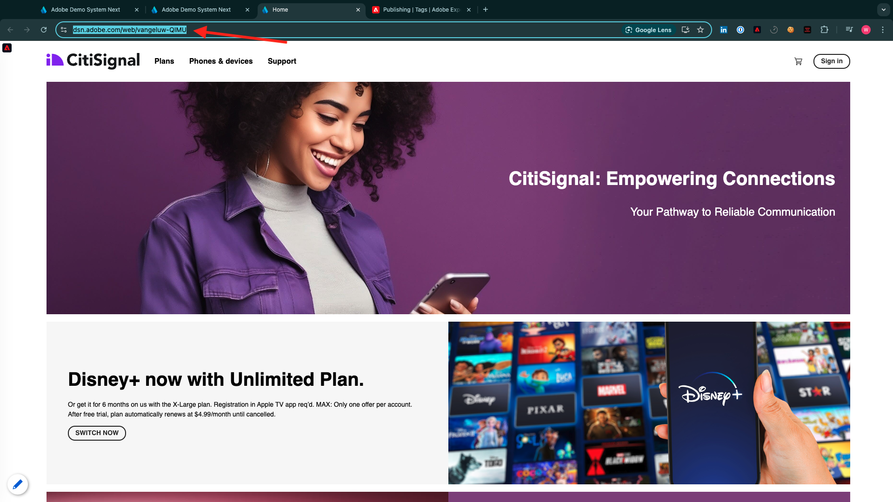

# 2.4.7 End-to-end scenario

## Start Azure Event Hub trigger

To show the payload send by Adobe Experience Platform Real-time CDP to our Azure Event Hub upon audience qualification, we need to start our simple Azure Event Hub trigger function. This function will simple "dump" the payload to the console in Visual Studio Code. But remember this function can be extended in any way to interface with all sorts of environments using dedicated API's and protocols.

### Launch Visual Studio Code and start project

Make sure to have your Visual Studio Code project opened and running

To start/stop/restart your Azure function in Visual Studio Code, refer to the previous exercise.

Your Visual Studio Code's **Terminal** should mention something similar to this:

```code
[2024-11-20T20:07:12.316Z] Debugger listening on ws://127.0.0.1:9229/86c8e251-8e2f-4c65-a063-cda77edbf2ca
[2024-11-20T20:07:12.318Z] For help, see: https://nodejs.org/en/docs/inspector
[2024-11-20T20:07:12.343Z] Worker process started and initialized.
[2024-11-20T20:07:12.359Z] Debugger attached.

Functions:

        vangeluw-aep-event-hub-trigger: eventHubTrigger

For detailed output, run func with --verbose flag.
[2024-11-20T20:07:18.150Z] Host lock lease acquired by instance ID '000000000000000000000000000C19D8'.
```

## Load your Citi Signal website

Go to [https://dsn.adobe.com](https://dsn.adobe.com). After logging in with your Adobe ID, you'll see this. Click the 3 dots **...** on your website project and then click **Run** to open it.


You'll then see your demo website open up. Select the URL and copy it to your clipboard.



Open a new incognito browser window.


Paste the URL of your demo website, which you copied in the previous step. You'll then be asked to login using your Adobe ID.


Select your account type and complete the login process.


You'll then see your website loaded in an incognito browser window. For every exercise, you'll need to use a fresh, incognito browser window to load your demo website URL.


## Qualify for your audience

Navigate to the **Plans** page. This action will qualify you for the `--aepUserLdap-- - Interest in Plans` audience. 


To verify, open the Profile Viewer panel. You should now be a member of the `--aepUserLdap-- - Interest in Plans`. If your audience memberships are not yet updated in your Profile Viewer panel, click the reload button.  


Switch back to Visual Studio Code and look at your **TERMINAL** tab, you should see a list of audiences for your specific **ECID**. This activation payload is delivered to your event hub as soon as you qualify for the `--aepUserLdap-- - Interest in Plans` audience. 

When you take a closer look a the audience payload, you can see that `--aepUserLdap-- - Interest in Plans` is in status **realized**. 

An audience status of **realized** means that your profile is part of the audience, while the **exited** status means that our profile has been removed from the audience.


Next Step: [Summary and benefits](./summary.md)

[Go Back to Module 2.4](./segment-activation-microsoft-azure-eventhub.md)

[Go Back to All Modules](./../../../overview.md)
