# 2.5.4 Forward events to GCP Pub/Sub

>[!NOTE]
>
>For this exercise, you need access to a Google Cloud Platform environment. If you don't have access to GCP yet, create a new account using your personal email address. 

## Create your Google Cloud Pub/Sub topic

Go to [https://console.cloud.google.com/](https://console.cloud.google.com/). In the search bar, enter `pub/sub`. Click the search result **Pub/Sub - Global real-time messaging**.

You'll then see this. Click **CREATE TOPIC**.

You'll then see this. For your Topic ID, use `--aepUserLdap---event-forwarding`. Click **Create**.

Your topic is now created. Click the topic's **Subscription ID**.

You'll then see this. Copy the **Topic name** to your clipboard and store it, as you'll need it in the next exercises.

Let's go to Adobe Experience Platform Data Collection Event Forwarding now, to update your Event Forwarding property to start forwarding events to Pub/Sub.

## Update your Event Forwarding property: Secrets

**Secrets** in Event Forwarding properties are used to store credentials that will be used to authenticate against external API's. In this example, you need to configure a secret to store your Google Cloud Platform OAuth token, which will be used to authenticate when using Pub/Sub to stream data towards GCP.

Go to [https://experience.adobe.com/#/data-collection/](https://experience.adobe.com/#/data-collection/) and go to **Secrets**. Click **Create New Secret**.

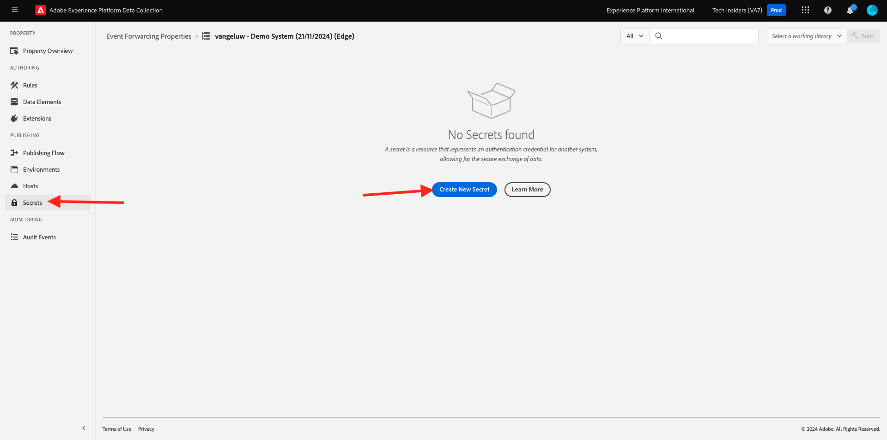

You'll then see this. Follow these instructions:

- Name: use `--aepUserLdap---gcp-secret`
- Target Environment: select **Development**
- Type: **Google OAuth 2**
- Check the checkbox for **Pub/Sub**

Click **Create Secret**.

After clicking **Create Secret**, you'll see a popup to set up the authentication between your Event Forwarding property's secret and Google. Click **Create & Authorize secret `--aepUserLdap---gcp-secret` with Google**.

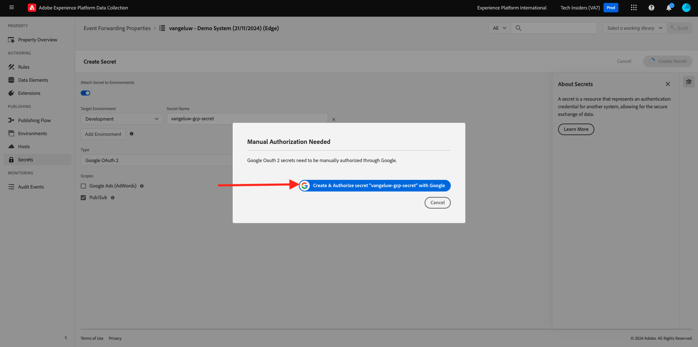

Click to select your Google account.

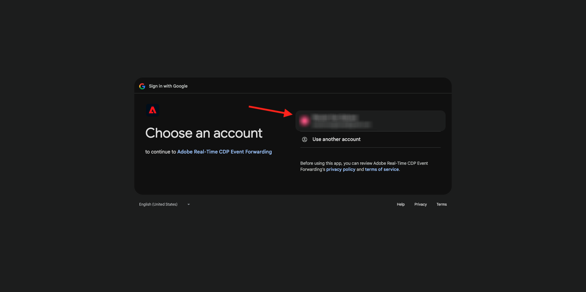

Click **Continue**.

>[!NOTE]
>
>Your popup message may vary. Please authorize/allow the requested access in order to continue with the exercise.

After successful authentication, you'll see this.

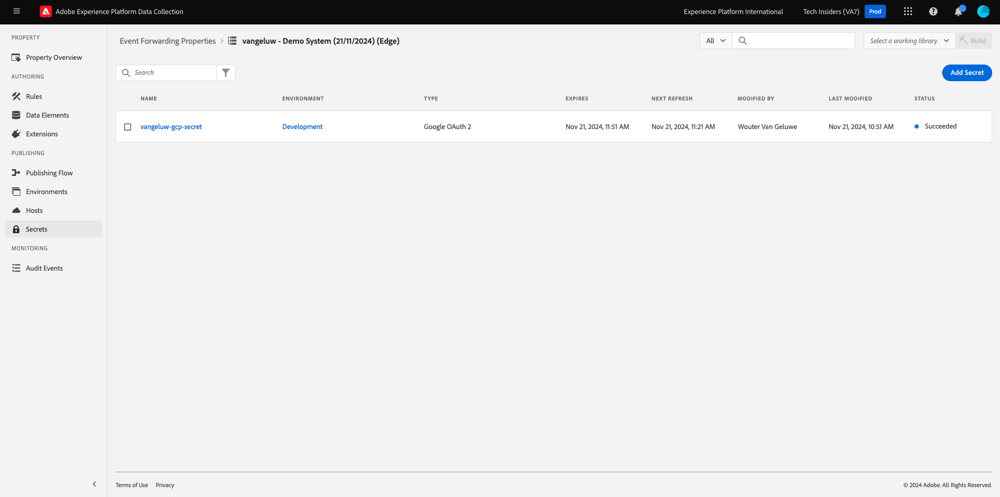

Your secret is now successfully configured and can be used in a data element.

## Update your Event Forwarding property: Data Element

In order to use your secret in your Event Forwarding property, you need to create a data element which will store the value of the secret.

Go to [https://experience.adobe.com/#/data-collection/](https://experience.adobe.com/#/data-collection/) and go to **Event Forwarding**. Search your Event Forwarding property and click it to open it.

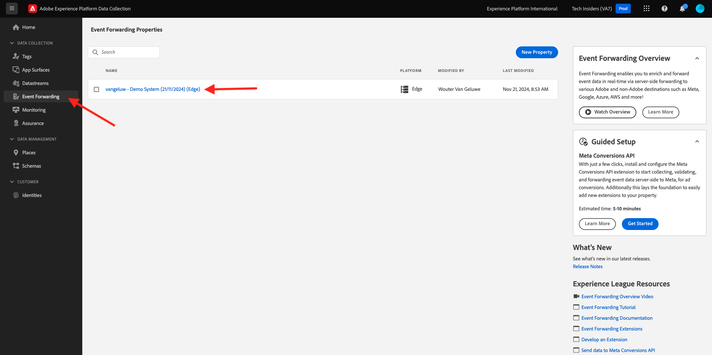

In the left menu, go to **Data Elements**. Click **Add Data Element**.

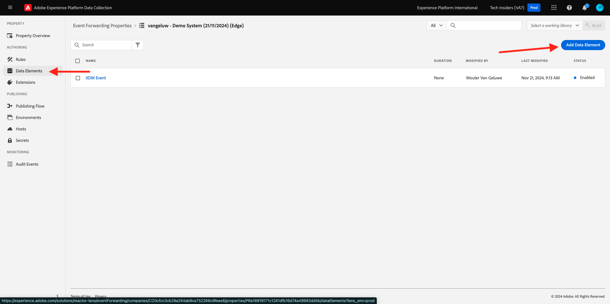

Configure your data element like this:

- Name: **GCP Secret**
- Extension: **Core**
- Data Element Type: **Secret**
- Development Secret: select the secret you created, which is named `--aepUserLdap---gcp-secret`

Click **Save**

## Update your Event Forwarding property: Extension

With your Secret and Data Element configured, you can now set up the extension for Google Cloud Platform in your Event Forwarding property.

Go to [https://experience.adobe.com/#/data-collection/](https://experience.adobe.com/#/data-collection/), go to **Event Forwarding** and open your Event Forwarding property.

Next, go to **Extensions**, to **Catalog**. Click the **Google Cloud Platform** extension and click **Install**.

You'll then see this. Click the Data Element icon.

Select the data element you created in the previous exercise, which is named **GCP Secret**. Click **Select**.

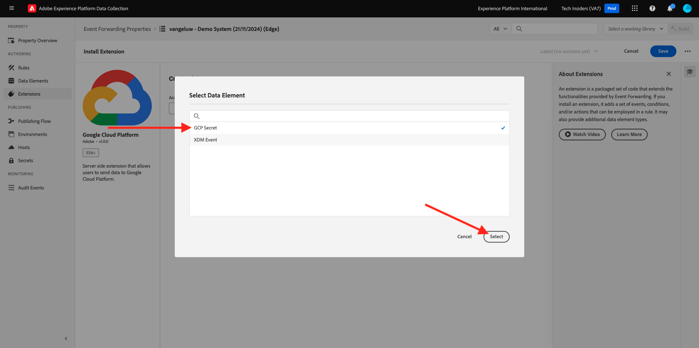

You'll then see this. Click **Save**.

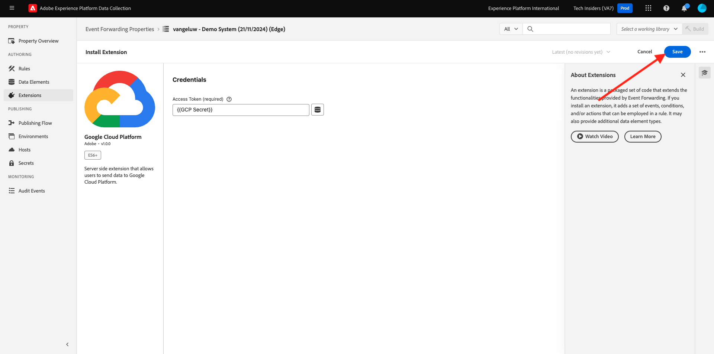

## Update your Event Forwarding property: Update a Rule

Now that your Google Cloud Platform extension is configured, you can define a rule to start forwarding event data to your Pub/Sub topic. To do that, you'll need to update your **All Pages** rule that you created in one of the previous exercises.

In the left menu, go to **Rules**. In the previous exercise, you created the rule **All Pages**. Click that rule to open it.

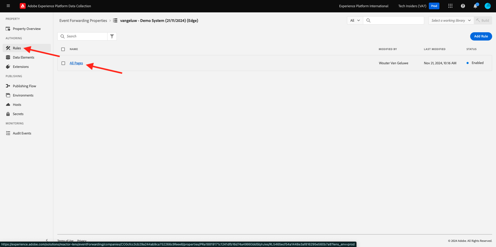

You'll then this. Click the **+** icon under **Actions** to add a new action. 

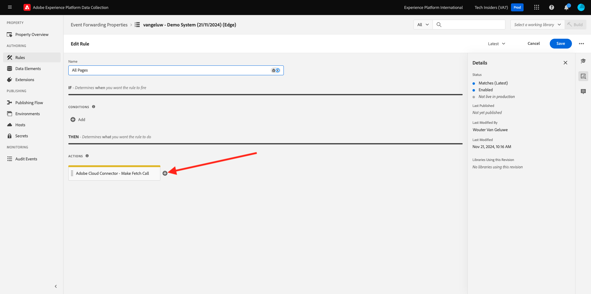

You'll then see this. Make the following selection:

- Select the **Extension**: **Google Cloud Platform**.
- Select the **Action Type**: **Send Data to Cloud Pub/Sub**.

That should give you this **Name**: **Google Cloud Platform - Send Data to Cloud Pub/Sub**. You should now see this:

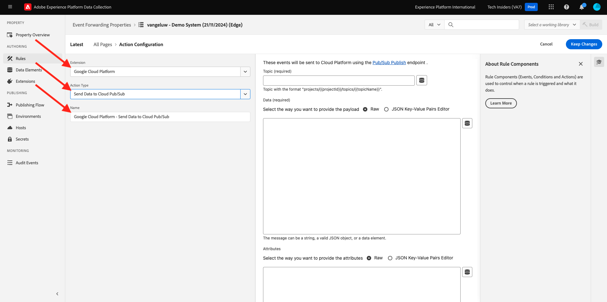

You now need to configure the Pub/Sub topic that you created earlier. 

You can find the **Topic name** here, copy it.

Paste the **Topic name** in your Rule configuration. Next, click the Data Element icon next to the **Data (required)** field.

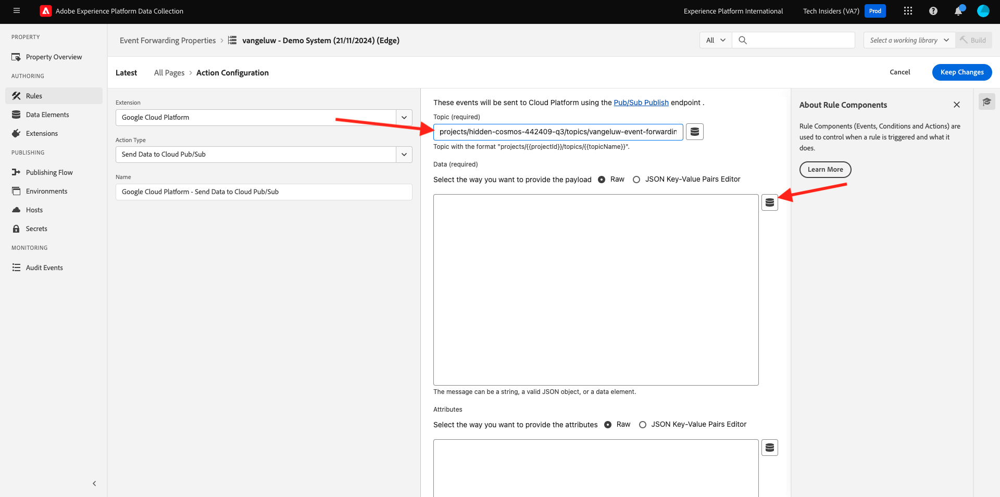

Select **XDM Event** and click **Select**.

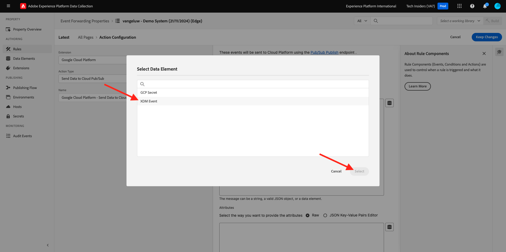

You'll then see this. Click **Keep Changes**.

Click **Save**.

You'll then see this.

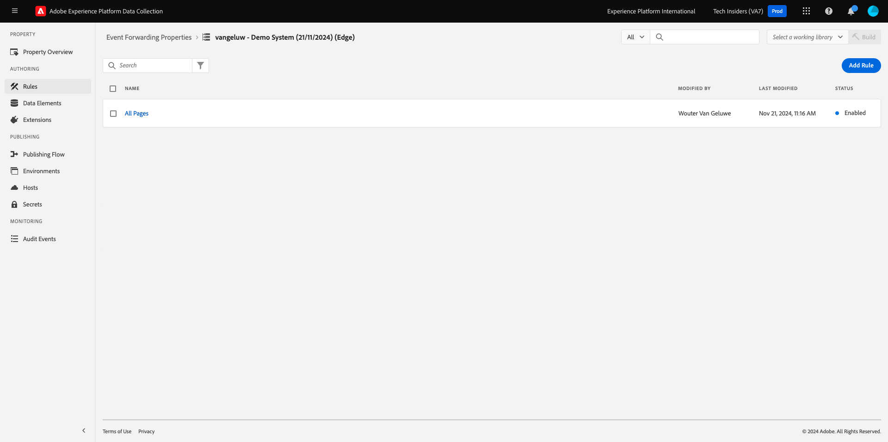

## Publish your changes

Your configuration is now finished. Go to **Publishing Flow** to publish your changes. Open your Development library **Main** by clicking **Edit** as indicated.

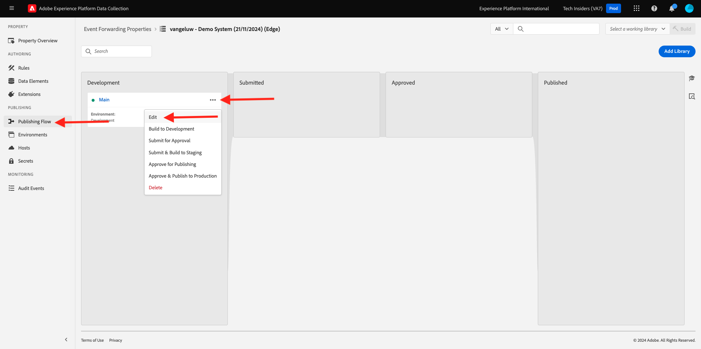

Click the **Add All Changed Resources** button, after which you'll see your Rule and Data Element appear in this library. Next, click **Save & Build for Development**. Your changes are now being deployed.

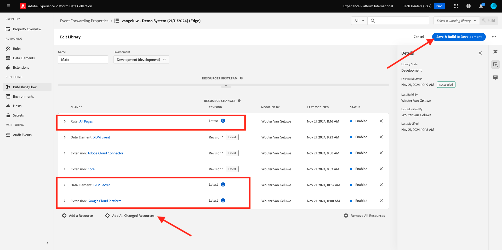

After a couple of minutes, you'll see that the deployment is done and ready to be tested.

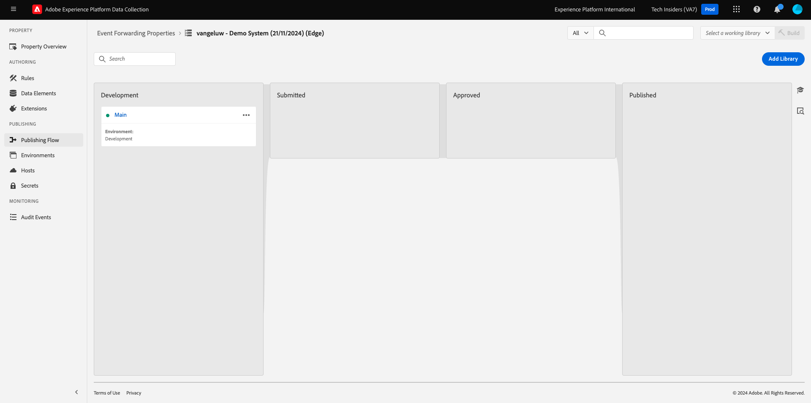

## Test your configuration

Go to [https://dsn.adobe.com](https://dsn.adobe.com). After logging in with your Adobe ID, you'll see this. Click the 3 dots **...** on your website project and then click **Run** to open it.

You'll then see your demo website open up. Select the URL and copy it to your clipboard.

Open a new incognito browser window.

Paste the URL of your demo website, which you copied in the previous step. You'll then be asked to login using your Adobe ID.

Select your account type and complete the login process.

You'll then see your website loaded in an incognito browser window. For every exercise, you'll need to use a fresh, incognito browser window to load your demo website URL.

Switch your view to your Google Cloud Pub/Sub and go to **MESSAGES**. Click **PULL** and after a couple of seconds you'll see some messages in the list. Click a message to visualize its content.

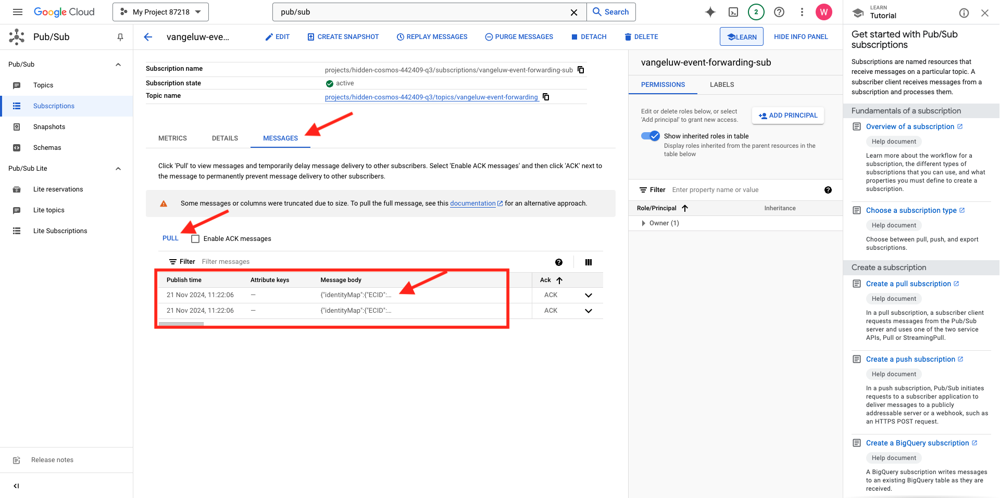

You can now see the XDM payload of your event in Google Pub/Sub. You've now successfully sent data that was collected by Adobe Experience Platform Data Collection, in real-time, to a Google Cloud Pub/Sub endpoint. From there, that data can be used by any Google Cloud Platform application, such as BigQuery for storage and reporting or for Machine Learning use cases.

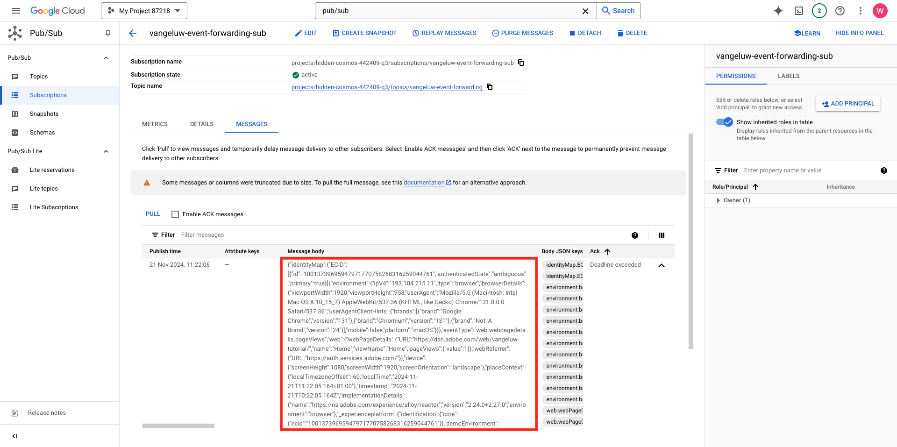

Next Step: [2.5.5 Forward events to AWS Kinesis & AWS S3](./ex5.md)

[Go Back to Module 2.5](./aep-data-collection-ssf.md)

[Go Back to All Modules](./../../../overview.md)

