# PostBuster

>[!IMPORTANT]
>
>The below instructions are only intended for Adobe employees.

## Install PostBuster

Go to [https://adobe.service-now.com/esc?id=adb_esc_kb_article&sysparm_article=KB0020542](https://adobe.service-now.com/esc?id=adb_esc_kb_article&sysparm_article=KB0020542). 

Click to download the latest release of **PostBuster**.


Download the correct version for your OS.

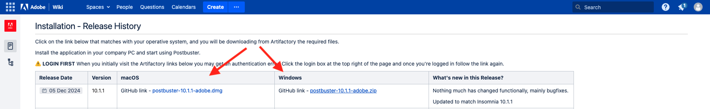

Once the download has completed and has been installed, open PostBuster. You should then see this. Click **Import**.


Download [postbuster.json.zip](./assets/postman/postbuster.json.zip) and extract it on your desktop.

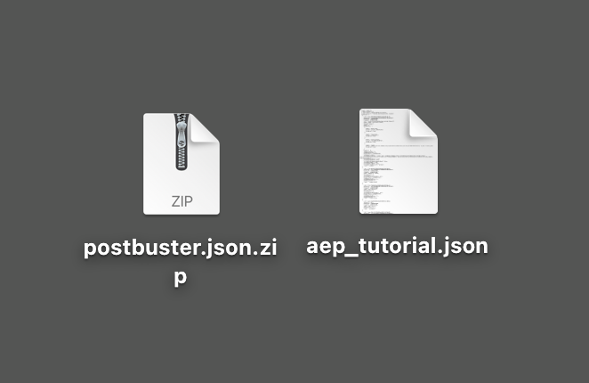

Click **Choose a File**.

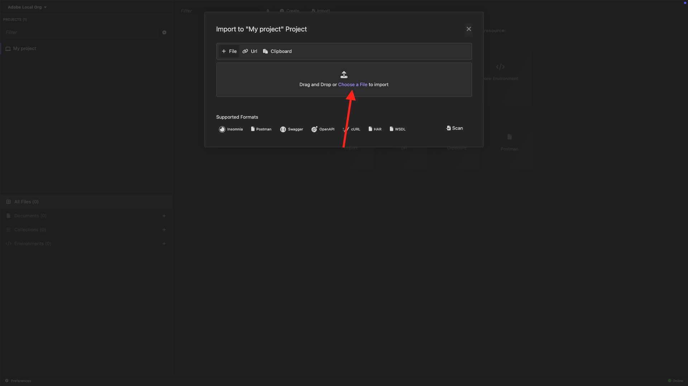

Select the file **postbuster.json**. Click **Open**.

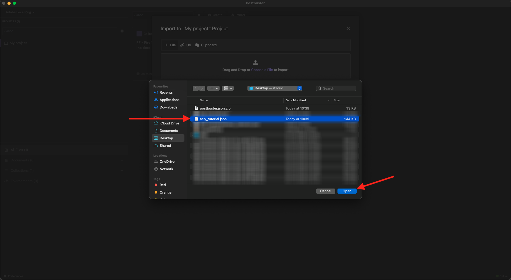

You should then see this. Click **Scan**.

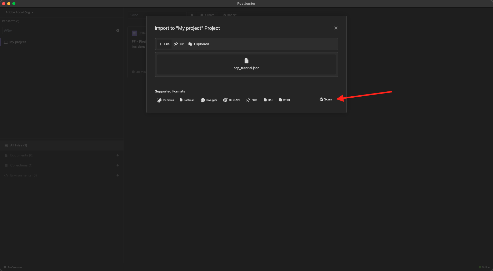

Click **Import**.

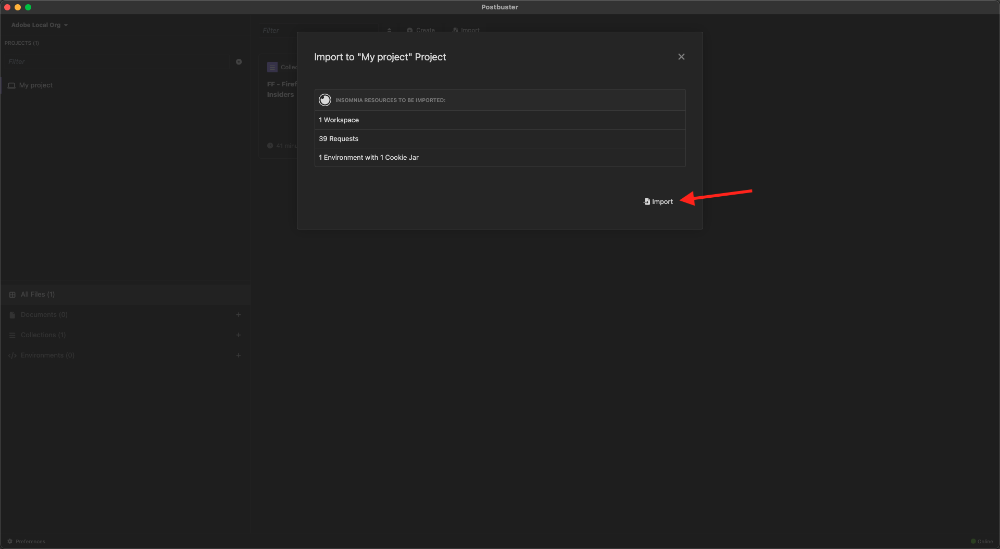

You should then see this. Click to open the imported collection.

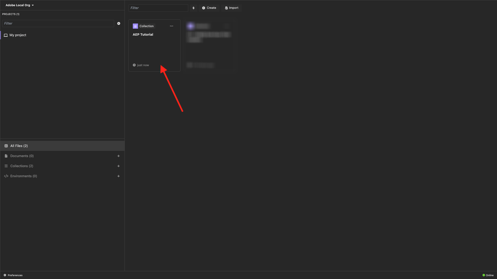

Now you see your collection. You still need to configure an environment to hold some environment variables.

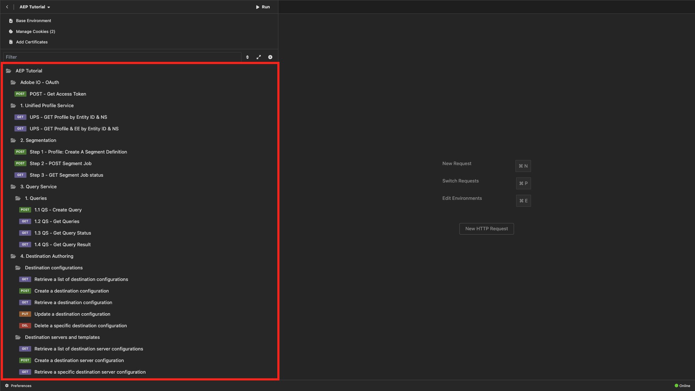

Click **Base Environment** and then click the **edit** icon.

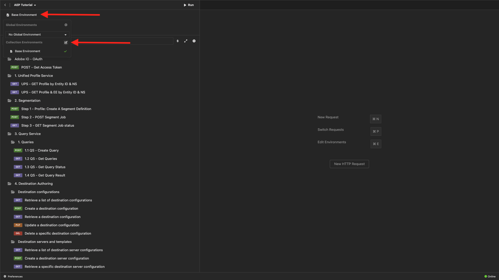

You should then see this.

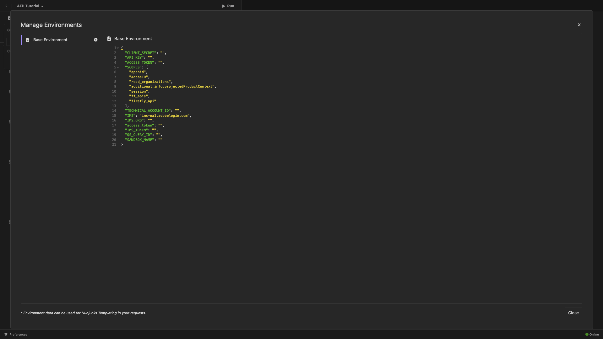

Copy the below environment placeholder and paste it in the **Base Environment**.

```json
{
	"CLIENT_SECRET": "",
	"API_KEY": "",
	"ACCESS_TOKEN": "",
	"SCOPES": [
		"openid",
		"AdobeID",
		"ff_apis",
		"firefly_api"
	],
	"TECHNICAL_ACCOUNT_ID": "",
	"IMS": "ims-na1.adobelogin.com",
	"IMS_ORG": "",
	"access_token": "",
	"IMS_TOKEN": "",
	"AZURE_STORAGE_URL": "",
	"AZURE_STORAGE_CONTAINER": "",
	"AZURE_STORAGE_SAS_READ": "",
	"AZURE_STORAGE_SAS_WRITE": ""
}
```

You should then have this.

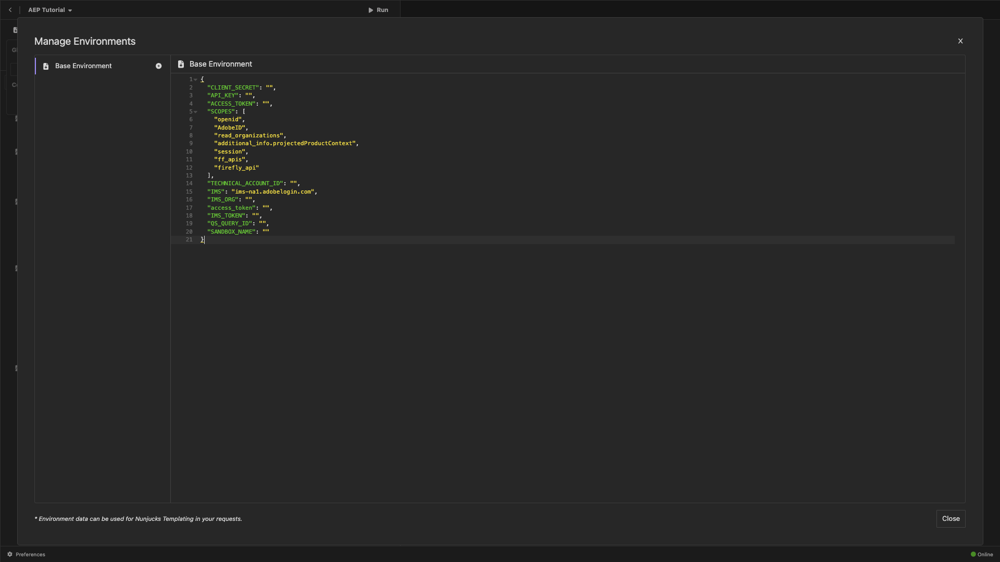

After going through the **Firefly Services** module, your environment should look like this. You don't need to do this now, this will be addressed at a later stage.

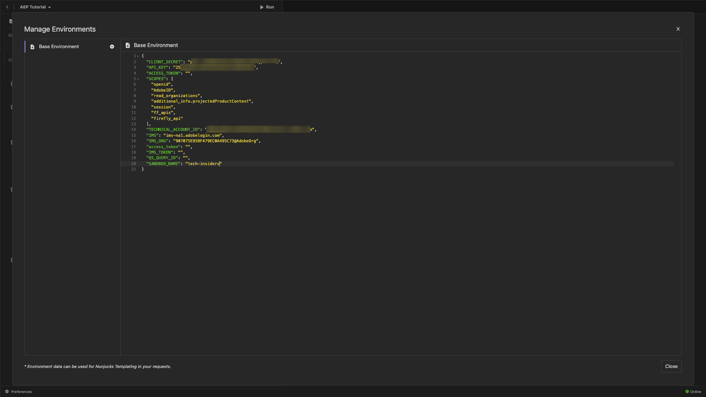

>[!NOTE]
>
>{width="50px" align="left"}
>
>If you have questions, want to share general feedback of have suggestions on future content, please contact Tech Insiders directly, by sending an email to **techinsiders@adobe.com**.

[Go Back to All Modules](./overview.md)
