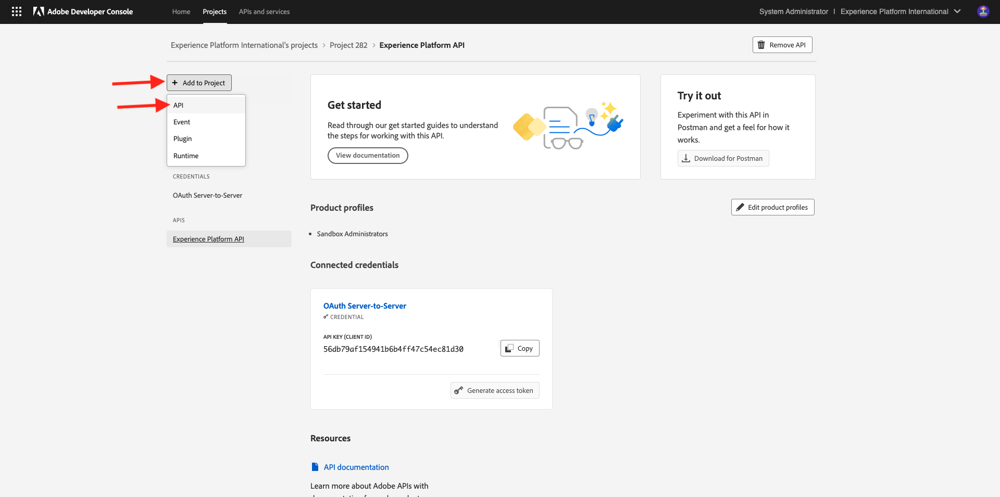
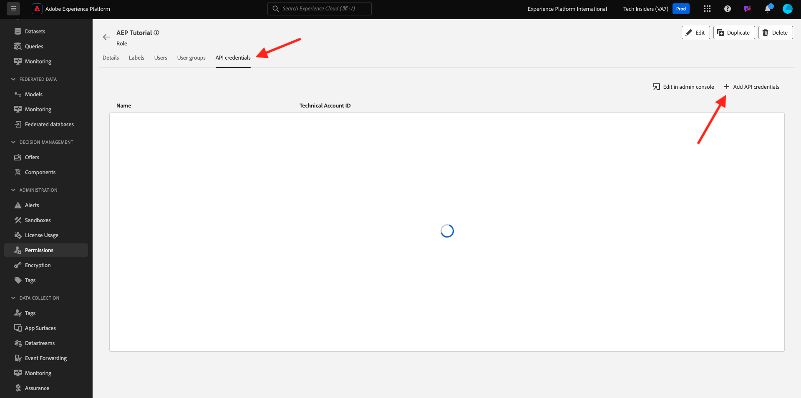
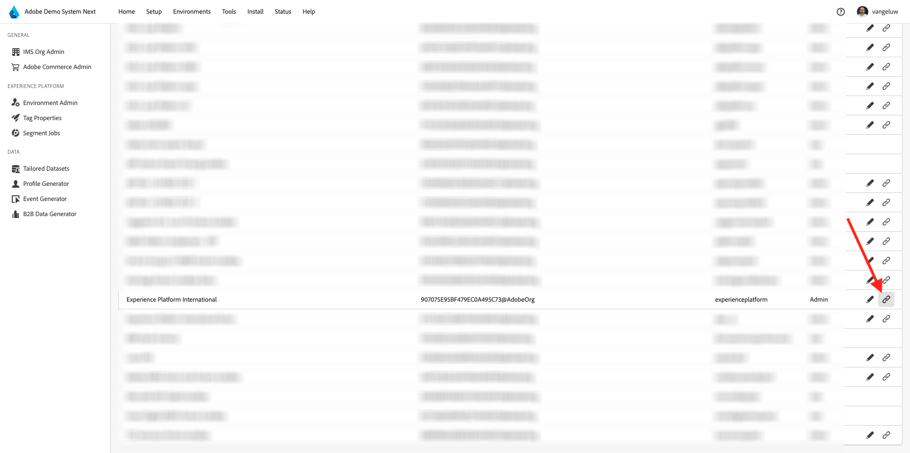
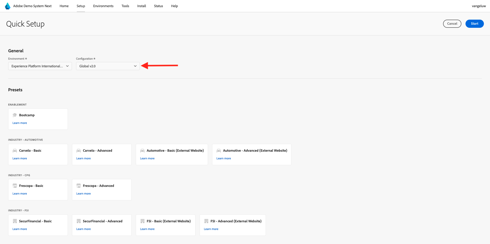
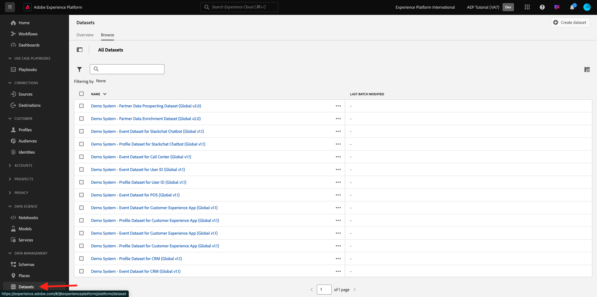

# Set up your Adobe Experience Platform instance

>[!IMPORTANT]
>
>This page is intended for System Administrator roles only. You need System Administrator access rights for your specific instance to be able to follow the below steps. If you're not a System Administrator in your Adobe Experience Cloud org, please contact your System Administrator and ask their approval and help before proceeding with any of the below steps.

## Overview

In order to take all of these tutorials in a hands-on way, the following Adobe Experience Cloud applications need to be provisioned in your IMS Org:

- Adobe Real-time CDP
- Adobe Experience Platform Data Collection
- Adobe Journey Optimizer
- Customer Journey Analytics
- Data Distiller
- Federated Audience Composition

If a specific application service isn't provisioned for your IMS Org, then you won't be able to take that specific exercise in hands-on way.

## Create a sandbox

To go through the tutorial in your own Adobe Experience Platform instance, it's advisable to first set up a new development sandbox. To create a new sandbox, go to [https://experience.adobe.com/platform](https://experience.adobe.com/platform), go to Sandboxes and then go to **Browse**. Click **Create sandbox**.

Create your sandbox like this:

- Type: **Development**
- Name: **aep-tutorial** 
- Title: **Adobe Experience Platform Tutorial**

Click **Create**.

Your sandbox will now be created. After a couple of minutes you'll see this.

## Setup Permissions

Go to **Permissions**, then go to **Roles**.

Click to open the specific **Role** that will be used by the learners who will go through this tutorial. Click **Create role**.

Give your role a name like **Adobe Experience Platform Tutorial**, click **Confirm**.

In the **Sandboxes** dropdown menu, select the sandbox that you just created and ensure to remove any other sandbox (also remove **Prod**).

Add the various resources and set permissions. Please ensure not to add any permissions for **Sandbox Administration**.

Add more resources as indicated and set permissions.

Add more resources as indicated and set permissions. Click **Save**. Then, click **Close**.

## Set up Adobe I/O

Go to 
[https://developer.adobe.com/console/integrations](https://developer.adobe.com/console/integrations). Ensure you're in the correct instance. Click **Create new project**.

Click **Add to Project** and then click **API**.

Click **Adobe Experience Platform** and then enable **Experience Platform API**. Click **Next**.

For the **Credential name**, use **DSN AEP Tutorial**. Click **Next**.

Select one of the available product profiles. This product profile doesn't determine permissions for this Adobe I/O project - this will be done in a next step. Click **Save configured API**.

Click **Add to Project** and then click **API** again.

Click **Adobe Experience Platform** and then enable **Experience Platform Launch API**. Click **Next**.

Click **Next**.

Select a product profile that makes it possible to create and manage data collection properties. Click **Save configured API**.

You'll then see this. Click the current **Project XXX** name.

Click **Edit Project**.

Enter a new **Project Title**, such as **DSN Adobe Experience Platform Tutorial**. Click **Save**.

Your Adobe I/O project is now ready.

## Link Adobe I/O project to Role

Go to **Permissions**, to **Roles** and then click the new role you created earlier.

Go to **API credentials**. Click **+ Add API credentials**.

You'll then see the Adobe I/O credential that you created in the previous step. Select it and click **Save**.

Your Adobe I/O Project is now set up with the required permissions to access Adobe Experience Platform API's.

>[!IMPORTANT]
>
>You need to wait a minimum of 10 minutes before you continue the next steps in Demo System Next.

## Setup your environment in Demo System Next

Go to [https://dsn.adobe.com/tools/org-admin](https://dsn.adobe.com/tools/org-admin). Click **+ Add Org**.

 

Fill in the required fields:

- IMS Org ID
- Name
- Tenant ID (don't include any **underscore**)
- Region

Your System Administrator should be able to help you with the values for these fields.

Click **Save**.

 

Your environment will now be part of the list. Find it in the list and click the **link** icon.

You now need to enter the values that you created as part of your Adobe I/O Project's credentials. You can find **Client ID**, **Client Secret** and **Scopes** here:

 

**Technical Account ID**:

Copy and paste those here, click **Save**.

Your DSN environment is now set up correctly.

## Setup your access to the DSN environment

Go to [https://dsn.adobe.com/tools/environment-admin](https://dsn.adobe.com/tools/environment-admin). Select the IMS Org that you just created, select your user and then click **+ Assign** under **Sandboxes**.

Enter the **Sandbox Name** that you defined in the first step above. It should look like this:

- Name: **aep-tutorial** 

Click **Confirm**.

Your sandbox is now available for the user you selected.

## DSN Quick Setup

Go to [https://dsn.adobe.com/quick-setup](https://dsn.adobe.com/quick-setup). Open the **Environment** dropdown menu and select your IMS Org/Sandbox.

For **Configuration**, select **Global v2.0**.

Scroll down to **Industry - Telco** and select **Citi Signal - Advanced**.

Scroll up and click **Start**.

Enter a **Title** and click **Start**.

>[!NOTE]
>
>You may get errors in case no Default Merge Policy has been created in the sandbox. If that is the case, either wait a bit more for the merge policy to be created automatically, or manually go into Adobe Experience Platform, to Profiles > Merge Policies and create a new default merge policy.

You'll then see the progress of the ongoing installation, which will take a couple of minutes.

Once everything is successfully completed, your Adobe Experience Platform instance is successfully configured and ready for learners to take the tutorial.

>[!NOTE]
>
>The Data Import step isn't used by the tutorial, so if that step fails, don't worry and please continue.

Go to [https://experience.adobe.com/platform](https://experience.adobe.com/platform), to **Datasets**. You should now see a similar list of datasets, which were all created by the DSN Quick Setup. 

>[!NOTE]
>
>Thank you for investing your time in learning all there is to know about Adobe Experience Platform and its applications. If you have questions, want to share general feedback of have suggestions on future content, please contact Tech Insiders directly, by sending an email to **techinsiders@adobe.com**.

{width="50px" align="left"}

>[!NOTE]
>
>If you have questions, want to share general feedback of have suggestions on future content, please contact Tech Insiders directly, by sending an email to **techinsiders@adobe.com**.

[Go Back to All Modules](./overview.md)
