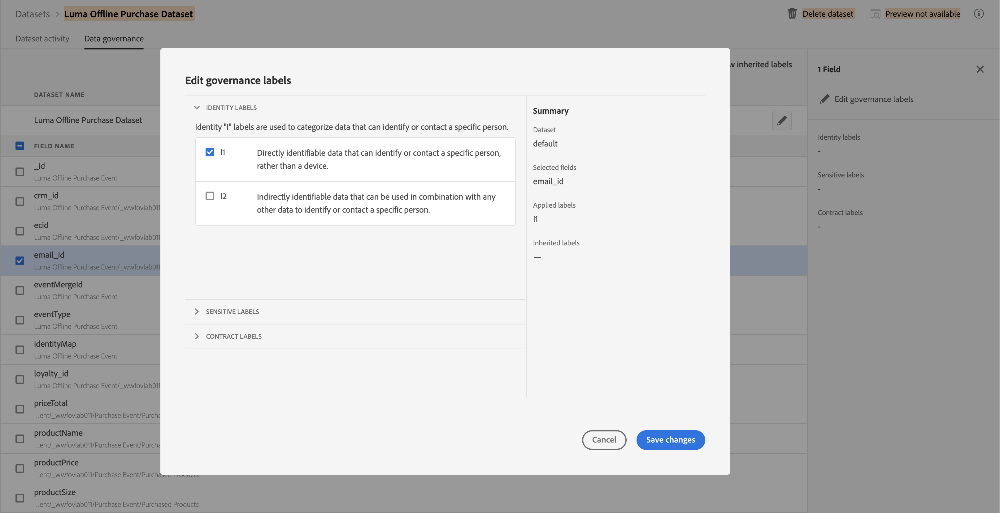

# Apply the data governance framework

In this lesson you will apply the data governance framework to the data you've ingested into your sandbox. 

Adobe Experience Platform Data Governance allows you to manage customer data and ensure compliance with regulations, restrictions, and policies applicable to data use. It plays a key role within Experience Platform at various levels, including cataloging, data lineage, data usage labeling, data usage policies, and controlling usage of data for marketing actions.

First, watch these short videos about data governance:
>[!VIDEO](https://video.tv.adobe.com/v/36653?quality=12&learn=on)

>[!VIDEO](https://video.tv.adobe.com/v/29708?quality=12&learn=on)

>[!NOTE]
>
>At the time of writing (Summer 2020), this lesson applies mostly to customers of the Real-time Customer Data Platform application service. I encourage you to complete the lesson regardless of whether you license Real-time CDP, as the data governance framework will likely support additional use cases in the future.

## Permissions required

In the [Configure Permissions](configure-permissions.md) lesson, you setup all the access controls you need to complete this lesson, specifically:

* Permission item Sandbox Management > View Sandboxes
* Permission item Sandboxes > `Luma Tutorial`
* User-role access to the `Luma Tutorial Platform` product profile

### Apply data governance labels

1. Go to Data Management and select Datasets option
1. Select **Luma Offline Purchase Dataset**
1. Select **Data Governance** tab for the dataset
1. Find and select **email_id** field in the list
1. Click **Edit Governance labels** pencil icon in right 
1. Select I1 as address field contains email address and it is directly identifiable data that can identify or contact a specific person, rather than a device.



1. Click Save changes


Repeat similar steps for other Schemas as well and identify appropriate fields and appropriate labels.

```
Note For SME : In this video you will be also explain what other labels are and when to use which label. You may ask learners to add more DULE label as they think would be right for the Schema. 

```

Use content from Mathieu's demo

## Additional Resources

* [Data Governance documentation](https://docs.adobe.com/content/help/en/experience-platform/data-governance/home.html)
* [Dataset Service API reference](https://www.adobe.io/apis/experienceplatform/home/api-reference.html#!acpdr/swagger-specs/dataset-service.yaml)
* [Governance Policy Service API reference](https://www.adobe.io/apis/experienceplatform/home/api-reference.html#!acpdr/swagger-specs/dule-policy-service.yaml)

Now let's move on to [query service](run-queries.md).