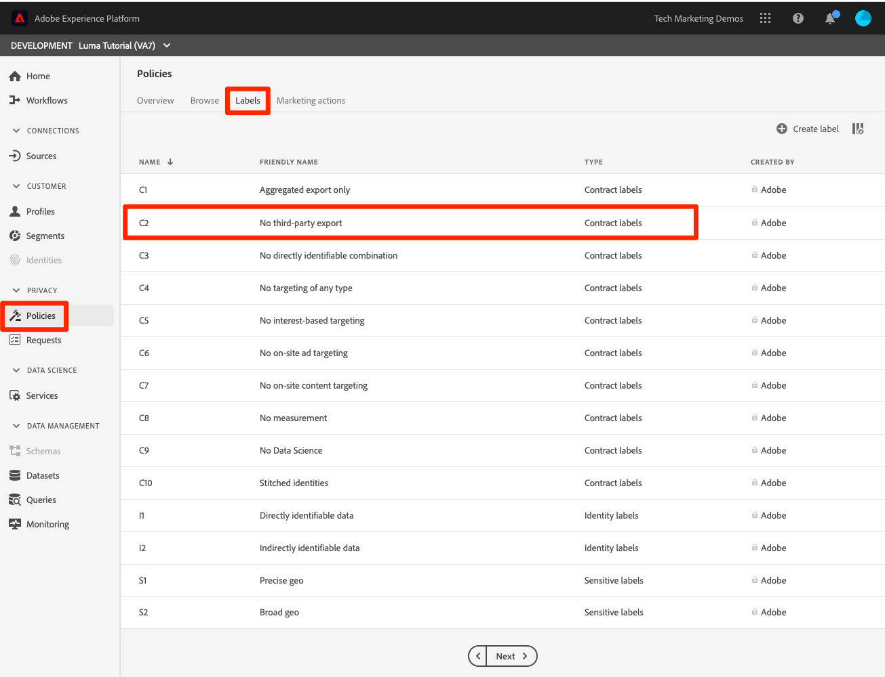
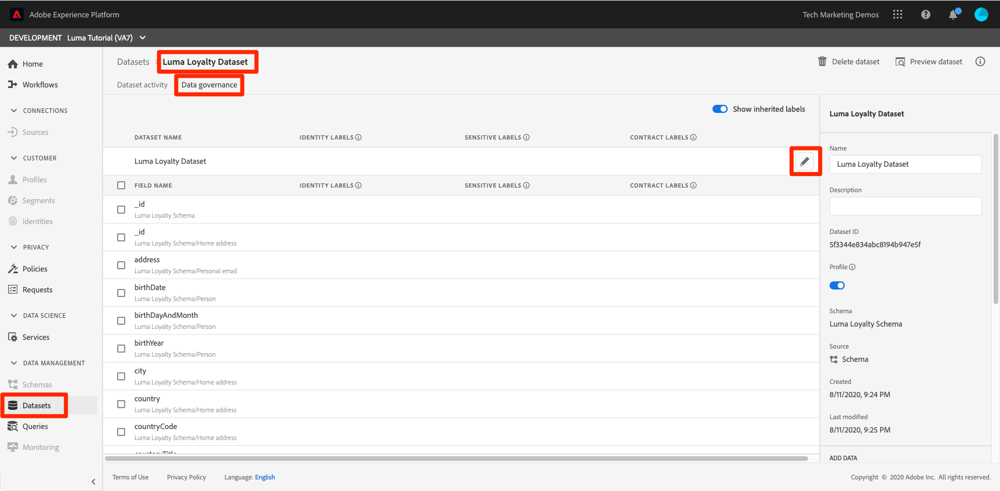
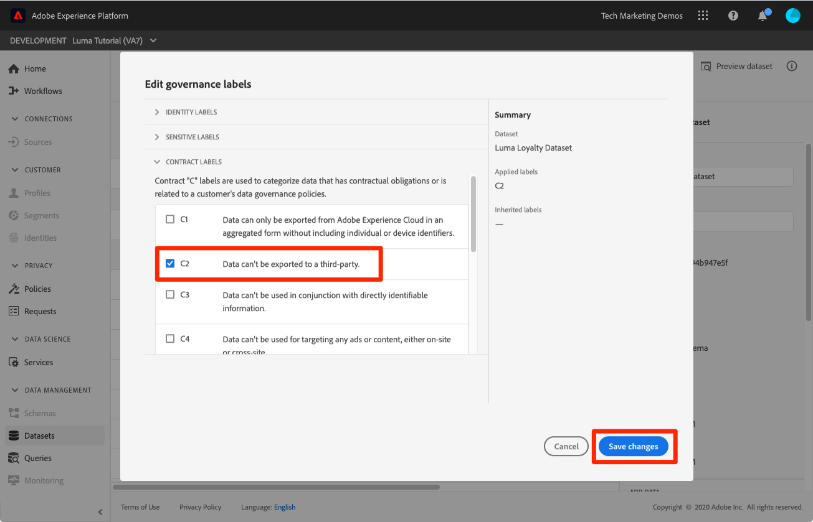
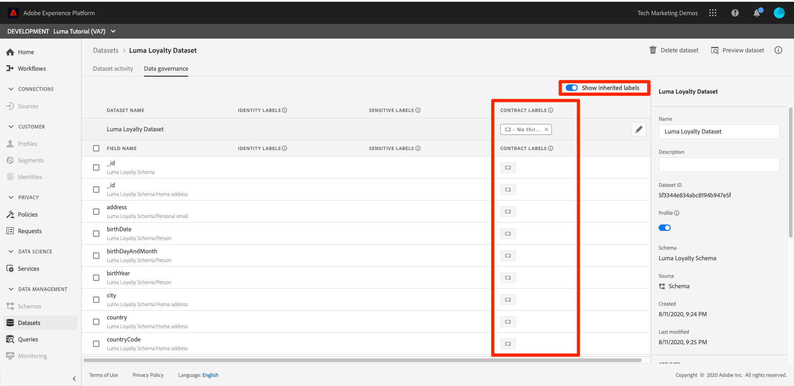
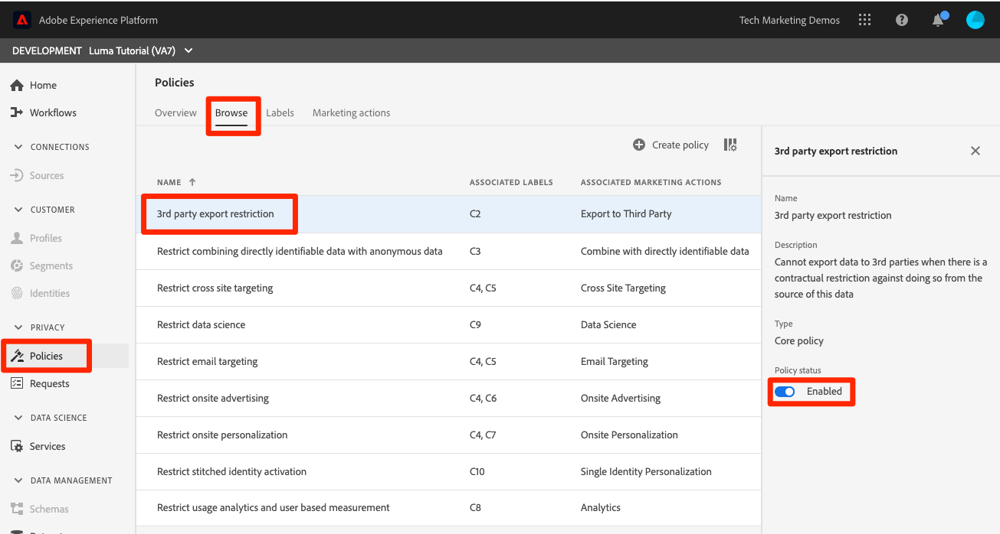

# Apply the data governance framework

In this lesson you will apply the data governance framework to the data you've ingested into your sandbox. 

Adobe Experience Platform Data Governance allows you to manage customer data and ensure compliance with regulations, restrictions, and policies applicable to data use. It plays a key role within Experience Platform at various levels, including cataloging, data lineage, data usage labeling, data usage policies, and controlling usage of data for marketing actions.

Before you begin the exercises, watch these short videos about data governance:
>[!VIDEO](https://video.tv.adobe.com/v/36653?quality=12&learn=on)

>[!VIDEO](https://video.tv.adobe.com/v/29708?quality=12&learn=on)

>[!NOTE]
>
>At the time of writing (Summer 2020), this lesson applies mostly to customers of the Real-time Customer Data Platform application service. I encourage you to complete the lesson regardless of whether you license Real-time CDP, as the data governance framework will likely support additional use cases in the future.

## Permissions required

In the [Configure Permissions](configure-permissions.md) lesson, you set up all the access controls you need to complete this lesson, specifically:

* Permission items **[!UICONTROL Data Management]** > **[!UICONTROL View Datasets]** and **[!UICONTROL Manage Datasets]**
* Permission item **[!UICONTROL Sandboxes]** > `Luma Tutorial`
* User-role access to the `Luma Tutorial Platform` product profile

## Business Scenario

Luma makes a promise to members of their Loyalty program, that Loyalty data will not be shared with any third parties. We will implement this scenario in the rest of the lesson.

## Apply data governance labels

The first step in the data governance process, is to apply governance labels to your data. Before we do that, let's take a quick look at what labels are available:

1. In the Platform UI, click **[!UICONTROL Policies]** in the left navigation
1. Click the **[!UICONTROL Labels]** tab to see all of the labels in the account.

Note that there are a large number of out-of-the-box labels, plus you can create your own via the [!UICONTROL Create label] button
There are three main types: [!UICONTROL Contract labels], [!UICONTROL Identity labels], and [!UICONTROL Sensitive labels] that correspond to common reasons data might be restricted. Finally, note how each of the labels has a [!UICONTROL Friendly Name] and a short [!UICONTROL Name] which is just an abbreviation of the type and a number. Finally, note that the [!DNL C1] label is for "No third-party export" which is what we need for our Loyalty policy.

Now it's time to label the data whose usage we want to restrict:

1. In the Platform UI, click **[!UICONTROL Datasets]** in the left navigation
1. Open the `Luma Loyalty Dataset`
1. Click on the **[!UICONTROL Data Governance]** tab
1. You can either apply labels to individual fields or apply them to the entire dataset. We will apply the label to the entire dataset. Click the pencil icon.
    
1. In the modal, select the C2 label and click the 
1. Click the **[!UICONTROL Save changes]** button
    
1. Returning to the main [!UICONTROL Data Governance] screen, with the **[!UICONTROL Show inherited labels]** toggle on, you can see how the label has been applied to all of the fields in the dataset.
    

<!--adding extra, unnecessary fields from mixins makes it harder to see which fields really need labels-->
<!--Are there any best practices for applying governance labels-->

## Create data governance policies

Now that our data is labeled, we can create a policy.

1. In the Platform UI, click **[!UICONTROL Policies]** in the left navigation
1. On the Browse tab, note that there is already an out-of-the-box policy called "3rd party export restriction" that associates the C2 label with the marketing action [!UICONTROL Export to Third Party]&mdash;exactly what we need!
1. Click on the policy and then enable it via the **[!UICONTROL Policy status]** toggle
    

You can also create your own policies by clicking the **[!UICONTROL Create policy]** button. This opens a wizard which allows you can combine multiple labels and marketing action restrictions.

1. Click on the **[!UICONTROL Data Governance]** tab
1. You can either apply labels to individual fields or apply them to the entire dataset. We will apply the label to the entire dataset. Click the pencil icon.
1. In the modal, select the C2 label and click the 
1. Click the **[!UICONTROL Save changes]** button
    
1. Returning to the main [!UICONTROL Data Governance] screen, with the **[!UICONTROL Show inherited labels]** toggle on, you can see how the label has been applied to all of the fields in the dataset.
    

## Enforce governance policies

Enforcement of governance policies is obviously a key component to the framework. Enforcement happens downstream when data is activated and sent out of Platform. Therefore, it's out of the scope of this tutorial. But just so you're not left hanging, you can learn more about how the third step in data governance from this video, which I've queued up to the relevant portion:

>[!VIDEO](https://video.tv.adobe.com/v/33631/?t=151&quality=12&learn=on)

## Additional Resources

* [Data Governance documentation](https://docs.adobe.com/content/help/en/experience-platform/data-governance/home.html)
* [Dataset Service API reference](https://www.adobe.io/apis/experienceplatform/home/api-reference.html#!acpdr/swagger-specs/dataset-service.yaml)
* [Governance Policy Service API reference](https://www.adobe.io/apis/experienceplatform/home/api-reference.html#!acpdr/swagger-specs/dule-policy-service.yaml)

Now let's move on to [query service](run-queries.md).