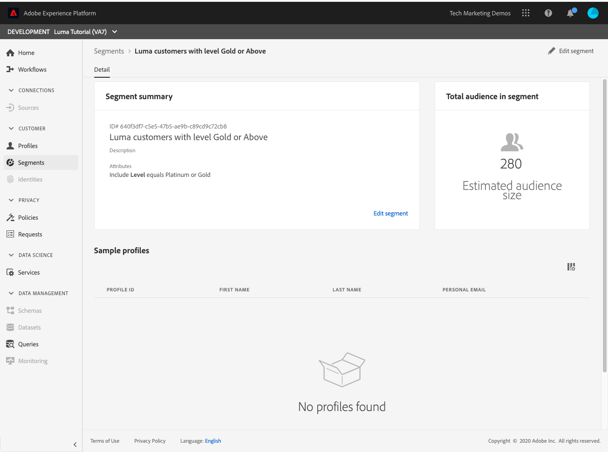

# Build segments

<!-- 30 min-->
In this lesson, we will build some segments based on the profile data we ingested in the previous lessons.

Once you have Real-time Customer Profiles, you can create segments of individuals who share similar traits and might respond similarly to marketing strategies. The building blocks of these segments are the XDM fields which you created earlier.

**Data Architects** will need to create segments outside of this tutorial and support their colleagues with this task.

Before you begin the exercises, watch this short video to learn more about creating segments:
>[!VIDEO](https://video.tv.adobe.com/v/27254?quality=12&learn=on)

## Permissions required

In the [Configure Permissions](configure-permissions.md) lesson, you set up all the access controls you need to complete this lesson, specifically:

* Permission items **[!UICONTROL Profile Management]** > **[!UICONTROL Manage Segments]**, **[!UICONTROL View Segments]** and **[!UICONTROL Export Audience Segment]**
* Permission items **[!UICONTROL Profile Management]** > **[!UICONTROL View Profiles]** and **[!UICONTROL Manage Profiles]** 
* Permission item **[!UICONTROL Sandboxes]** > `Luma Tutorial`
* User-role access to the `Luma Tutorial Platform` product profile
* Developer-role access to the `Luma Tutorial Platform` product profile (for API)

## Build a basic segment

Let's create a simple segment for loyalty program customers with a Gold or Platinum Status

1. In the Platform UI, click **[!UICONTROL Segments]** in the left navigation
1. Click the **[!UICONTROL Create segment]** button 
1. On the left of the schema builder are three tabs for Attributes (Record data), Events (Time-series data), and Audiences
1. If you click the gear icon, you will note that the segment builder defaults to only showing you fields with data and that you can also choose different merge policies for your segments
1. In Attributes tab, navigate to the **XDM Individual Profile > YOUR_TENANT_ID > Loyalty** folder (you could also search for "loyalty")
1. Drag and drop , `Level` from the attribute fields menu to the segment builder canvas 
1. Select `Level` equals `Gold` or `Platinum`
1. As the **[!UICONTROL Name]**, enter `Luma customers with level Gold or Above`
1. Click the **[!UICONTROL Save]**
   
1. In a few minutes, you should see an estimate of existing customers qualifying for this segment
   

<!--## Build a sequential segment-->

## Build a dynamic segment

In this exercise, we will create a segment for customers who have bought the same product twice within 30 days. Dynamic segments allow you to scale your segmentation by using fields as variables.

1. Click **[!UICONTROL Segments]** in the left navigation
1. Click the **[!UICONTROL Create segment]** button 
1. Click on the **[!UICONTROL Events]** tab
1. Filter the list to `purchases`
1. Drag the **[!UICONTROL Purchases]** event type onto the canvas _two separate times_
1. Click the clock icon in between the two **[!UICONTROL Purchases]** events and choose "within 30 days"
1. Confirm that your segment definition at this point reads **"Include audience who have at least 1 Purchases event then within 30 days have at least 1 Purchases event"**
   
1. Now change the event filter to `sku`
1. Drag the SKU field to the second purchase event
   
1. Now clear the event filter
1. You should see in the **[!UICONTROL Browse Variables]** section, there are folders for the two purchase events. Click to explore **[!UICONTROL Purchases 1]**   
   
1. Drill down into the **[!UICONTROL Product list items]** folder, select the **[!UICONTROL SKU]** field and drag it to the right of the **[!UICONTROL equals]** operand. When you are hovering over the area, drop it in the  "Add to compare operands" section
1. Name your segment `Bought same product within 30 days`
1. Confirm your audience definition is **"Include audience who have at least 1 Purchases event then within 30 days have at least 1 Purchases event where ((SKU equals Purchases1 SKU))"**
1. Click the **[!UICONTROL Save]** button

   

## Build a multi-entity segment

Remember how we created the relationship between the `Luma Offline Purchase Events Schema` and the `Luma Product Catalog Schema` in earlier lessons? We did that so we could leverage the relationship in our schema using multi-entity segmentation.

With the advanced multi-entity segmentation feature, you can create segments using multiple XDM classes thereby extending your schemas. As a result, the segment builder can access additional fields as if they were native to the profile data store

You will create the next segment by leveraging the relationship you built between your `Luma Product Catalog Schema` and your `Luma Offline Purchase Event Schema`.

1. Click **[!UICONTROL Segments]** in the left navigation
1. Click the **[!UICONTROL Create segment]** button 
1. Click on the **[!UICONTROL Events]** tab
1. Filter the list to `purchases`
1. Drag the **[!UICONTROL Purchases]** event type onto the canvas
1. Click the clock dropdown above the event and choose **[!UICONTROL in last 30 days]**
1. Filter the **[!UICONTROL Events]** list to `category` and then drag the **[!UICONTROL Product Category]** field onto **[!UICONTROL Purchases]**
1. Change the operator to **[!UICONTROL starts with]** and enter `men` into the text box
1. As the **[!UICONTROL Name]**, enter `Purchased a Men's product in the last 30 days`
1. Confirm the audience definition `(Include audience who have at least 1 Purchases event where ((Product Category starts with men)) ) and occurs in last 30 day(s)`
1. Click the **[!UICONTROL Save]** button

   

## Batch and Streaming segmentation

Click on **[!UICONTROL Segments]** in the left navigation and let's take a moment to review our three segments:

* Note that two of our segments are batch segments and one is a streaming segment. 
* Platform will default to streaming segmentation, whenever possible, qualifying the customer for a segment as soon as they meet the criteria. When segment definitions are too complex for streaming, they will automatically convert to batch. In this case, the two segments defaulted to batch because the look-back window of the purchase events was greater than seven days. For a complete and current list of streaming limitations, see [the documentation](https://experienceleague.adobe.com/docs/experience-platform/segmentation/ui/streaming-segmentation.html).
* The batch jobs run on a daily schedule, which can be toggled off.
  

## Additional Resources

* [Segmentation Service documentation](https://experienceleague.adobe.com/docs/experience-platform/segmentation/home.html)
* [Segmentation Service API reference](https://www.adobe.io/apis/experienceplatform/home/api-reference.html#!acpdr/swagger-specs/segmentation.yaml)

There is more to segmentation, especially with activating segments. Those topics will be addressed in another tutorial.

You've made it through all of the exercises! Please proceed to the [conclusion](conclusion.md).