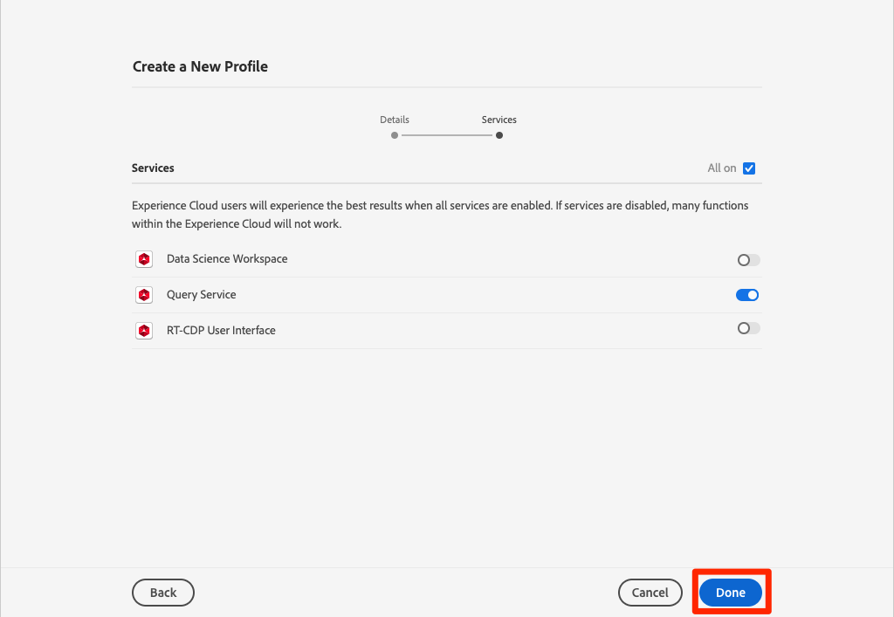
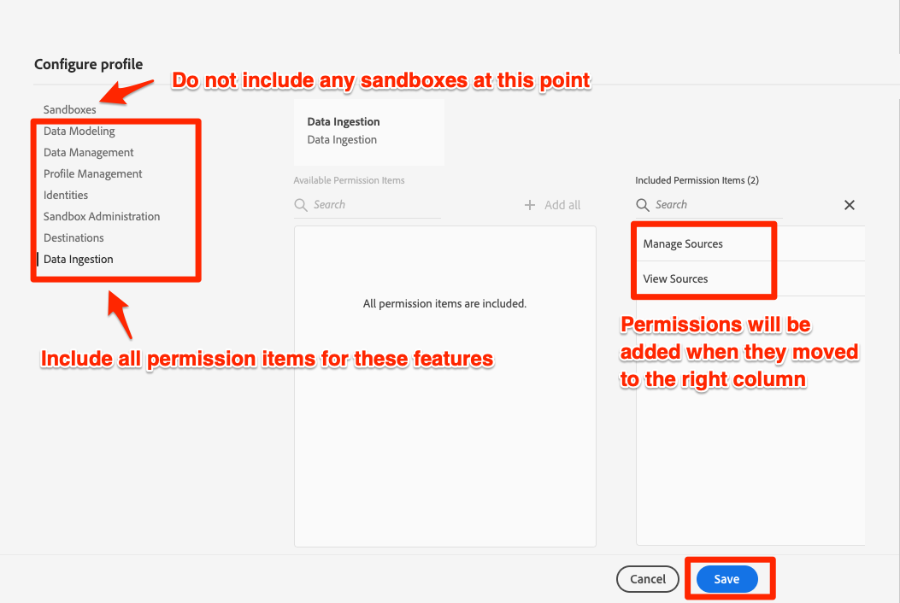
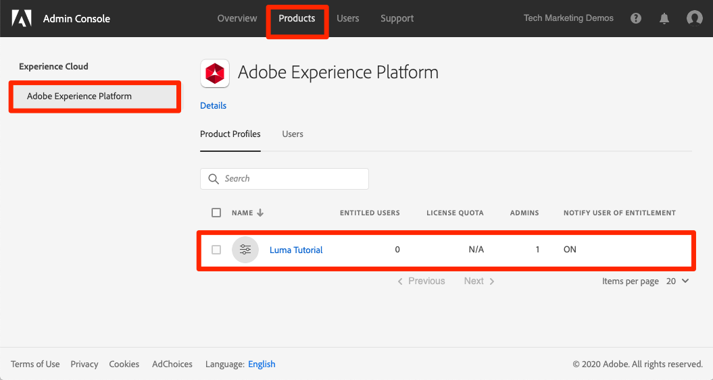

# Configure Permissions

In this lesson, you will configure Adobe Experience Platform user permissions using [!DNL Adobe's Admin Console]. 

Access control is a key privacy capability in Experience Platform and we recommend limiting permissions to what individual roles need to perform their job functions. 

Data Architects and Data Engineers are the power users of Adobe Experience Platform and you will need almost all permissions both in order to complete this tutorial, and later in your day-to-day work. Data Architects are also likely be involved in the administration of *other Platform users* at your company such as marketers, analysts, and data scientists. As you complete this lesson, think about how these [!DNL Adobe Admin Console] features will be useful to manage users at your company.

>[!IMPORTANT]
>
>A System Administrator of Adobe Experience Cloud products will need to complete some of the steps in this lesson, which we have called out in the section headings.  If you are not System Administrator, please reach out to one at your company and have them complete these tasks.
<!--is this the only lesson in which a System Admin needs to be involved?-->
<!--when to add Launch-->
<!--who needs to do Adobe IO-->

## About the Admin Console

The [!DNL Admin Console] is the interface used to administer user access to all Adobe Experience Cloud products. Some key [!DNL Admin Console] concepts to be aware of:

* A **product profile** is a combination of permissions, roles, and sandbox environments, tied to a specific Adobe application. Multiple product profiles can be created for a single Adobe product. For example, a "Marketer" profile could limit permissions to what a typical marketer would need to complete key tasks in the production instance of Platform. In this lesson, we will create a "Luma Tutorial" product profile with all the permissions a Data Architect and Data Engineer would need to complete this tutorial in a specific developer sandbox environment. If you are a System Administrator at your company, you should start thinking about how to use product profiles in Platform to accommodate your requirements.
* An **integration** is a connection to a Project in the Adobe IO Console. Adobe IO is Adobe's developer portal and its Console is the heart of authentication and configuration of Adobe APIs. You will do more with integrations in the Adobe IO and Postman lesson

Also, here is a quick summary of the roles that exist for Platform, as well as any Adobe Experience Cloud application:

* **System Administrators** can create product profiles, add permissions and integrations to a product profile
* **Admins** of a product profile  can add users, additional admins, and developers to the product profile as well as toggle services on and off.
* **Users** of a product profile can complete tasks in Platform's user interface according to the permissions in the product profile. Users can also be assigned to User Groups, to streamline management.
* **Developers** of a product profile can complete the tasks using Platform's API according to the permissions in the product profile

## Create a product profile (requires a system administrator)

1. Log into the [Adobe Admin Console](https://adminconsole.adobe.com)
1. Click **[!UICONTROL Products]** on the top navigation
1. Click **[!UICONTROL Adobe Experience Platform]** on the left navigation
1. You probably already have several profiles in your Experience Platform instance. Click the **[!UICONTROL New Profile]** button to add another
    
1. Name the profile `Luma Tutorial` and click the **[!UICONTROL Next]** button
    
1. Now we'll add Platform services to the profile. You may see different options on this screen, depending on your Platform license. The only service required for this tutorial is **[!UICONTROL Query Service]**. Enable Query Service and click the **[!UICONTROL Done]** button.
    
    <!--Update to add one arbitrary sandbox, which is required to expose the menu options-->
1. Include all of the permissions for all of the Platform features, except for **[!UICONTROL Sandboxes]** by clicking on a feature in the left rail and then moving the **[!UICONTROL Permission Items]** to the right column with the **[!UICONTROL Add all]** button
    

    <!--1. At this point in the tutorial we will not add additional Platform permissions. Instead, we will add permissions individually as we proceed with the lessons so that you understand when they are required. So, on the **[!UICONTROL Configure profile]** screen, hit the **[!UICONTROL Cancel]** button.
    -->

1. The new profile should appear in the list of Platform product profiles:
    

## Add a product profile admin (requires a system administrator)

Since there are currently no admins in the product profile a system administrator will need to assign you as the first one. Once you are an admin, you will be able to add additional admins:

1. In the Admin the `Luma Tutorial` profile, click the **[!UICONTROL Admin]** tab and then click the **[!UICONTROL Add Admin]** button
    
1. Complete the steps to add the admin taking this tutorial (possibly yourself) to the profile

## Add yourself as a product profile user

At this point, if `Luma Tutorial` was your _only_ Experience Platform product profile, you still would not be able to log into the Experience Platform user interface. To do that you need to be a _user_ in the product profile. Fortunately, since you are an _admin_ of a product profile, you can add yourself as a _user_!  

*If you aren't already logged into the [!DNL Adobe Admin Console] as a system administrator*:

1. Log into the [!DNL Adobe Admin Console](https://adminconsole.adobe.com)
1. Click **[!UICONTROL Products]** on the top navigation
1. Click **[!UICONTROL Adobe Experience Platform]** on the left navigation
1. Click on the `Luma Tutorial` profile in the list

    

Now add yourself as a user:

1. Click the **[!UICONTROL Add User]** button
    
1. Complete the steps to add yourself as a user to the product profile

## Add yourself as a developer

In order to use the Platform API, you will need add yourself as a developer:

1. Go to the **[!UICONTROL Developers]** tab:
1. Click the **[!UICONTROL Add Developer]** button
    
1. Complete the steps to add yourself as a developer to the product profile

Now you have almost all of the user roles and permissions required to complete the tutorial! There will be just one more tweak that you will need to make in the [!DNL Adobe Admin Console] after you add your sandbox in the next lesson. 

>[!NOTE]
>
>We will mention the specific set of permissions used for each lesson at the top of the page in the pre-requisites section.

## Additional Resources

* [Adobe Admin Console documentation](https://helpx.adobe.com/enterprise/using/admin-console.html)
* [Access Control documentation](https://docs.adobe.com/content/help/en/experience-platform/access-control/home.html)
* [Access Control API](https://www.adobe.io/apis/experienceplatform/home/api-reference.html#!acpdr/swagger-specs/access-control.yaml)