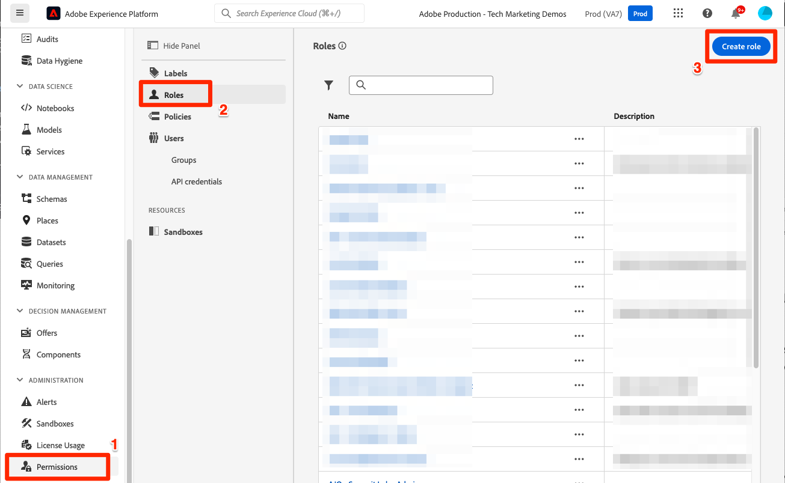
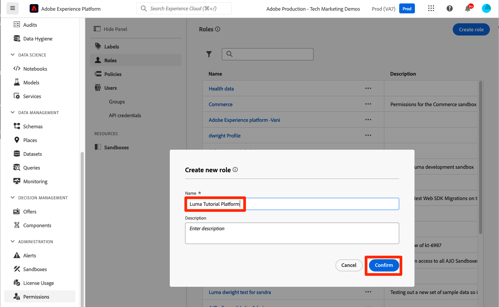
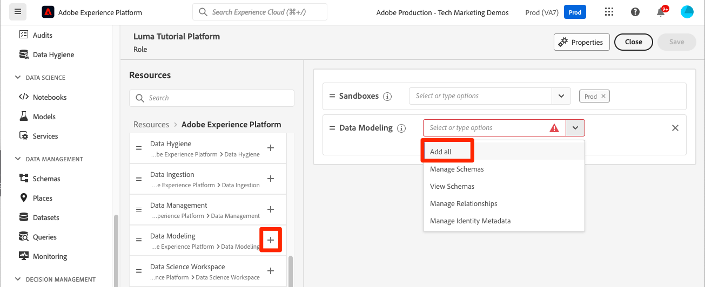
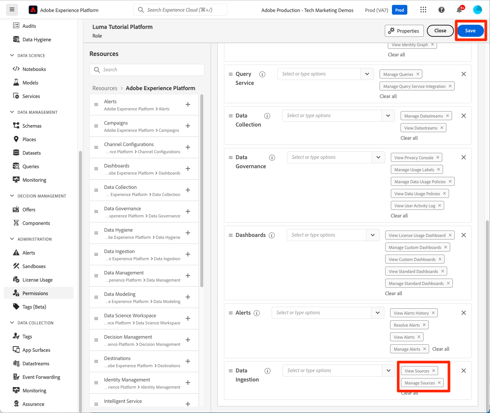
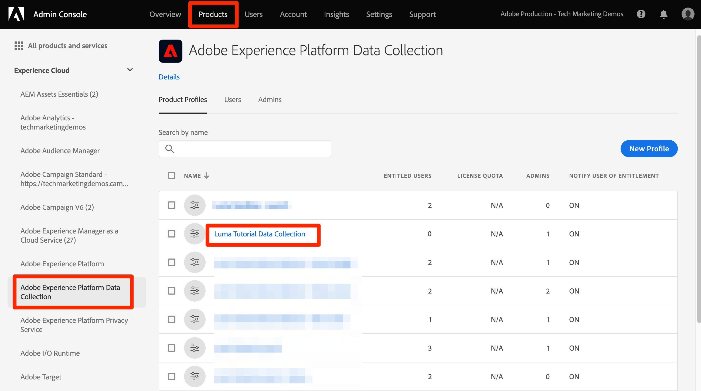

# Configure permissions

<!--30min-->

In this lesson, you will configure Adobe Experience Platform user permissions using [!DNL Adobe's Admin Console] and the [!UICONTROL Permissions] screen in the Platform interface. 

Access control is a key privacy capability in Experience Platform and we recommend limiting permissions to the minimum required for people to perform their job functions. See the [Access Control documentation](https://experienceleague.adobe.com/docs/experience-platform/access-control/home.html) for more information.

Data Architects and Data Engineers are  power users of Adobe Experience Platform and you will need many permissions in order to complete this tutorial and later in your day-to-day work. Data Architects are likely be involved in the administration of *other Platform users* at their company such as marketers, analysts, and data scientists. As you complete this lesson, think about how you might use these features to manage other users at your company.

**Data Architects** often configure permissions for other users outside of this tutorial.

>[!IMPORTANT]
>
>A System Administrator of Adobe Experience Cloud products must complete some of the steps in this lesson, which is called out in the section headings. If you are not System Administrator, please reach out to one at your company and ask them complete these tasks. There is also a task they need to complete during the [Set up Developer Console and Postman](set-up-developer-console-and-postman.md) lesson.

## About the Admin Console

The [!DNL Admin Console] is the interface used to administer user access to all Adobe Experience Cloud products. For access to Platform, a user or must be added in the Admin Console and then all of their granular permission items are managed in the Permissions screen of Adobe Experience Platform.

Here is a quick summary of the roles that exist for Platform:

* **Users** of a product profile can complete tasks in Platform's user interface according to the permissions assigned in the product profile.
* **Developers** can create API credentials and projects in the Adobe Developer Console, in order to begin using Experience Platform API
* **Product Admins** can add users and developers to the Adobe Experience Platform product in the Adobe Admin Console, as well as manage granular user access in the Permissions screen of the Platform interface.
* **System Administrators** can add product admins and administer essentially any permissions for all Adobe Experience Cloud products.

## Add a User and Developer to the `AEP-Default-All-Users` product profile (requires a system administrator or product admin)

In this exercise, you or a System Administrator or Product Admin will add you as a User and Developer in the Adobe Experience Platform product of the Adobe Admin Console.

>[!NOTE]
>
>If you are a System Administrator assisting a colleague taking this tutorial, consider adding your colleague as a *Product Administrator* for Adobe Experience Platform. As a Product Administrator, they would be able to complete these steps on their own and administrate other Experience Platform users in the future.

To add the tutorial participant as a [!UICONTROL User] and [!UICONTROL Developer]:

1. Log into the [Adobe Admin Console](https://adminconsole.adobe.com)
1. Select **[!UICONTROL Products]** on the top navigation
1. Select **Adobe Experience Platform**
    
1. You may have several profiles in your Experience Platform instance already. Select the `AEP-Default-All-Users` profile
    

1. Go to the **[!UICONTROL Users]** tab
1. Select the **[!UICONTROL Add User]** button
    
1. Complete the workflow to add the tutorial participant as a user to the product profile

1. Go to the **[!UICONTROL Developers]** tab
1. Select the **[!UICONTROL Add Developer]** button
    
1. Complete the workflow to add the tutorial participant as a developer to the product profile

## Add a Role in Adobe Experience Platform (requires a system administrator or product admin)

Granular permissions to Experience Platform are managed in the Permissions screen of the Platform interface. Only System and Product Admins have access to this screen, so if you do not have Admin privileges, you will need assistance from someone who does.

Permissions are managed in Roles. Create a Role for the tutorial:

1. Log into [Adobe Experience Platform](https://platform.adobe.com)
1. Select **[!UICONTROL Permissions]** in the left navigation which will take you to the [!UICONTROL Roles] screen
1. Select **[!UICONTROL Create role]**

    
1. Name the role `Luma Tutorial Platform` (add the tutorial participant's name to the end, if multiple people from your company are taking this tutorial) and select **[!UICONTROL Confirm]**

    

1. Add all of the permission items for the following resources using  **[!UICONTROL +]** and **[!UICONTROL Add all]**:

    1. Data Modeling
    1. Data Management
    1. Profile Management
    1. Identity Management
    1. Sandbox Administration
    1. Query Service
    1. Data Collection
    1. Data Governance
    1. Dashboards
    1. Alerts

        

1. Under Data Ingestion, add the Manage Sources and View Sources permission items.

1. After adding all of the permission items, be sure to select the Save button
    

You will make a few small updates to this role after the [Create a sandbox](create-a-sandbox.md) and [Set up Developer Console and Postman](set-up-developer-console-and-postman.md) lessons.

## Create a Data Collection product profile (requires a system administrator or product admin)

In this exercise, you or a System Administrator at your company will create a product profile for Data Collection (formerly known as Adobe Experience Platform Launch) and add you as a product profile admin.

>[!NOTE]
>
>If you are a System Administrator assisting a colleague with this tutorial, consider adding them as a *Product Administrator* for Data Collection. As a Product Administrator, they will be able to complete these steps on their own and administrate other users of Data Collection in the future.

To create the product profile:

1. In the [!DNL Adobe Admin Console] go to the Adobe Experience Platform Data Collection product
1. Add a new profile named `Luma Tutorial Data Collection` (add the tutorial participant's name to the end, if multiple people from your company are taking this tutorial)
1. Turn off the **[!UICONTROL Properties]** > **[!UICONTROL Auto-include]** setting
1. Don't assign any properties or permissions at this point
1. Add the tutorial participant as an admin of this profile

After completing these steps, you should see that the `Luma Tutorial Data Collection` profile is set up with one admin.

## Configure the Data Collection product profile

Now that you are an admin of the `Luma Tutorial Data Collection` product profile you can configure the permissions and roles you will need to complete the tutorial.

### Add permissions

Now you will add the individual permission items to the profile:

1. In the [Adobe Admin Console](https://adminconsole.adobe.com), go to **[!UICONTROL Products]** > **[!UICONTROL Data Collection]**
1. Open the `Luma Tutorial Data Collection` profile
1. Go to the **[!UICONTROL Permissions]** tab
1. Open **[!UICONTROL Platforms]**
1. Make sure that all of the available platforms are selected (you may see different options based on your license)
1. **[!UICONTROL Save]** any changes
    
1. Open **[!UICONTROL Properties]**
1. Make sure the **[!UICONTROL Auto-Include]** toggle is Off so that you don't have access to any properties (we will add one later)
1. **[!UICONTROL Save]** any changes
    
1. Open **[!UICONTROL Property Rights]**
1. Select **[!UICONTROL Add all]** to add all of the property permissions
1. **[!UICONTROL Save]**
    
1. Open **[!UICONTROL Company Rights]** 
1. Add **[!UICONTROL Manage Properties]**
1. Select **[!UICONTROL Save]**
    

### Add yourself as a user

Now add yourself as a user to the Data Collection profile:

1. Go to the **[!UICONTROL Users]** tab
1. Select the **[!UICONTROL Add User]** button
    
1. Complete the workflow to add yourself as a user to the product profile

You do not need to add yourself as a Developer for Data Collection.

Now you have almost all the permissions required to complete the tutorial! There will be just two more tweaks that you will make inside the [!DNL Adobe Admin Console], including one after you [create a sandbox](create-a-sandbox.md)!
