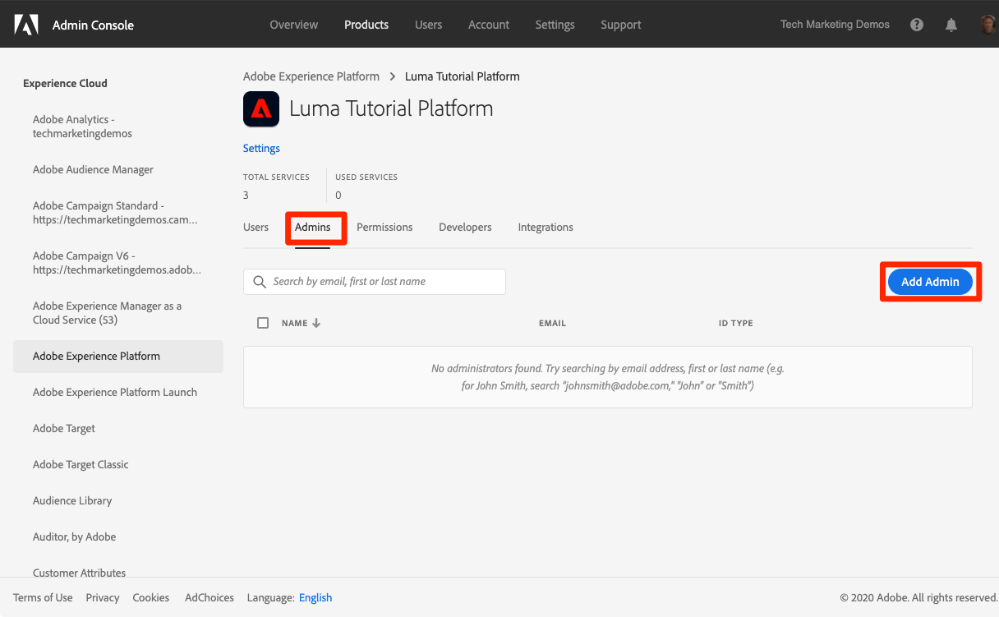
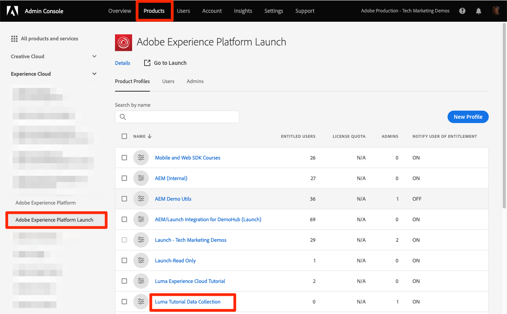

# Configure permissions

<!--30min-->

In this lesson, you will configure Adobe Experience Platform user permissions using [!DNL Adobe's Admin Console]. 

Access control is a key privacy capability in Experience Platform and we recommend limiting permissions to the minimum required for people to perform their job functions. See the [Access Control documentation](https://experienceleague.adobe.com/docs/experience-platform/access-control/home.html) for more information.

Data Architects and Data Engineers are  power users of Adobe Experience Platform and you will need many permissions in order to complete this tutorial and later in your day-to-day work. Data Architects are likely be involved in the administration of *other Platform users* at their company such as marketers, analysts, and data scientists. As you complete this lesson, think about how you might use these features to manage other users at your company.

**Data Architects** often configure permissions for other users outside of this tutorial.

>[!IMPORTANT]
>
>A System Administrator of Adobe Experience Cloud products must complete some of the steps in this lesson, which is called out in the section headings. If you are not System Administrator, please reach out to one at your company and ask them complete these tasks.

## About the Admin Console

The [!DNL Admin Console] is the interface used to administer user access to all Adobe Experience Cloud products. See [Adobe Admin Console documentation](https://helpx.adobe.com/enterprise/using/admin-console.html) for more detailed information. Here are some key [!DNL Admin Console] concepts:

* A **product profile** is a combination of permissions, roles, and sandbox environments tied to a specific Adobe product. Multiple product profiles can be created for a single Adobe product. For example, a "Marketer" profile could limit permissions to what a typical marketer would need to complete key tasks in the production Platform environment, while a "Data Architect" profile could be used to grant different permissions in multiple Platform environments. In this lesson, you will create a "Luma Tutorial" product profile with all the permissions a Data Architect and Data Engineer would need to complete this tutorial in a sandbox environment. 
* An **integration** is a connection to a *project* in the Adobe Developer Console. The Adobe Developer Console is the heart of authentication and configuration of Adobe APIs. You will configure an integration in the Developer Console and [!DNL Postman] lesson.

Here is a quick summary of the roles that exist for Platform:

* **Users** of a product profile can complete tasks in Platform's user interface according to the permissions assigned in the product profile.
* **Developers** of a product profile can complete tasks using Platform's API according to the permissions in the product profile.
* **Product Profile Admins** can edit *that specific profile's* permissions and add users, developers, and additional profile admins.
* **Product Admins** can administer *all product profiles* for Platform and add new product profiles.
* **System Administrators** can add product admins and administer essentially any permissions for all Adobe Experience Cloud products.

## Create an Experience Platform product profile (requires a system administrator or product admin)

In this exercise, you or a System Administrator at your company will create a product profile for Adobe Experience Platform and add you as an admin for that product profile.

>[!NOTE]
>
>If you are a System Administrator assisting a colleague taking this tutorial, consider adding your colleague as a *Product Administrator* for Adobe Experience Platform. As a Product Administrator, they would be able to complete these steps on their own and administrate other Experience Platform users in the future.

To create the product profile:

1. Log into the [Adobe Admin Console](https://adminconsole.adobe.com)
1. Select **[!UICONTROL Products]** on the top navigation
1. Select **[!UICONTROL Adobe Experience Platform]** on the left navigation (you may need to expand the **[!UICONTROL Experience Cloud]** section)
1. You may have several profiles in your Experience Platform instance already. Select the **[!UICONTROL New Profile]** button to add another
    
1. Name the profile `Luma Tutorial Platform` (add the tutorial participant's name to the end, if multiple people from your company are taking this tutorial) and select the **[!UICONTROL Next]** button
    
1. Depending on the details of your product license, you may or may not see this second **[!UICONTROL Services]** screen. We will not be using any of these services in this tutorial, so uncheck **[!UICONTROL Enable all services]** to *remove* all services and select **[!UICONTROL Save]**.
    

Now, add the tutorial participant as an admin of the newly created product profile. If *you* are the tutorial participant, skip ahead to [Configure Experience Platform product profile](#configure-experience-platform-product-profile):

1. Select the `Luma Tutorial Platform` product profile:
   
    

1. Select the **[!UICONTROL Admins]** tab and then select the **[!UICONTROL Add Admin]** button:

    

1. Complete the workflow to add the tutorial participant as an admin.

After completing these steps, you should see that the `Luma Tutorial Platform` profile is set up with one admin.

## Configure Experience Platform product profile

Now that you are an admin of the `Luma Tutorial Platform` product profile you can configure the permissions and roles you will need to complete the tutorial.
   
### Add permissions

Now you will add the individual permission items to the profile:

1. Open the `Luma Tutorial Platform` product profile
1. Select the **[!UICONTROL Permissions]** tab
1. Under **[!UICONTROL Sandboxes]**, add the **[!UICONTROL Prod]** sandbox to the profile. It is necessary to have access to the [!DNL Prod] sandbox in order to create additional sandboxes. Once we have added the tutorial sandbox in the next lesson, we will remove the [!DNL Prod] sandbox from the product profile.
1. Under [!UICONTROL Data Ingestion], add the [!UICONTROL Manage Sources] and [!UICONTROL View Sources] permission items.
1. Add all of the permission items for the categories highlighted in the screenshot below ([!UICONTROL Data Modeling], [!UICONTROL Data Management], [!UICONTROL Profile Management], [!UICONTROL Identity Management], [!UICONTROL Sandbox Administration], [!UICONTROL Query Service], [!UICONTROL Data Governance], [!UICONTROL Dashboards], and [!UICONTROL Alerts]), by opening a category and moving the items to the right column. 

1. After adding all of the permission items, be sure to select the **[!UICONTROL Save]** button

After saving, your screen should look like this:
![Interface showing the Prod [!UICONTROL Sandbox] included,  [!UICONTROL Manage Sources] and [!UICONTROL View Sources] permission items in the [!UICONTROL Data Ingestion] section and all permissions for [!UICONTROL Data Modeling], [!UICONTROL Data Management], [!UICONTROL Profile Management], [!UICONTROL Identity Management], [!UICONTROL Sandbox Administration], [!UICONTROL Query Service], [!UICONTROL Data Governance], [!UICONTROL Dashboards], and [!UICONTROL Alerts]](assets/adminconsole-platform-enablePermissions.png)

### Add yourself as a user

At this point, if `Luma Tutorial Platform` was your *only* Experience Platform product profile, you still would not be able to log into Experience Platform's user interface. To do that you need to be a *user* in the product profile. Fortunately, since you are an *admin* of a product profile, you can add yourself as a *user*!  

1. Go to the **[!UICONTROL Users]** tab
1. Select the **[!UICONTROL Add User]** button
    
1. Complete the workflow to add yourself as a user to the product profile

### Add yourself as a developer

In order to use the Platform API, add yourself as a developer:

1. Go to the **[!UICONTROL Developers]** tab
1. Select the **[!UICONTROL Add Developer]** button
    
1. Complete the workflow to add yourself as a developer to the product profile

## Create a Launch product profile (requires a system administrator or product admin)

In this exercise, you or a System Administrator at your company will create a product profile for Data Collection (formerly known as Adobe Experience Platform Launch) and add you as a product profile admin.

>[!NOTE]
>
>If you are a System Administrator assisting a colleague with this tutorial, consider adding them as a *Product Administrator* for Launch. As a Product Administrator, they will be able to complete these steps on their own and administrate other users of Launch in the future.

To create the product profile:

1. In the [!DNL Adobe Admin Console] go to the Adobe Experience Platform Launch product
1. Add a new profile named `Luma Tutorial Data Collection` (add the tutorial participant's name to the end, if multiple people from your company are taking this tutorial)
1. Turn off the **[!UICONTROL Properties]** > **[!UICONTROL Auto-include]** setting
1. Don't assign any properties or permissions at this point
1. Add the tutorial participant as an admin of this profile

After completing these steps, you should see that the `Luma Tutorial Data Collection` profile is set up with one admin.

## Configure the Launch product profile

Now that you are an admin of the `Luma Tutorial Data Collection` product profile you can configure the permissions and roles you will need to complete the tutorial.

### Add permissions

Now you will add the individual permission items to the profile:

1. In the [Adobe Admin Console](https://adminconsole.adobe.com), go to **[!UICONTROL Products]** > **[!UICONTROL Adobe Experience Platform Launch]**
1. Open the `Luma Tutorial Data Collection` profile
    
1. Go to the **[!UICONTROL Permissions]** tab
1. Open **[!UICONTROL Platforms]**
1. Make sure that all of the available platforms are selected (you may see different options based on your license)
1. **[!UICONTROL Save]** any changes
    
1. Open **[!UICONTROL Properties]**
1. Make sure the **[!UICONTROL Auto-Include]** toggle is Off so that you don't have access to any properties (we will add one later)
1. **[!UICONTROL Save]** any changes
    
1. Open **[!UICONTROL Property Rights]**
1. Select **[!UICONTROL Add all]** to add all of the property permissions
1. **[!UICONTROL Save]**
    
1. Open **[!UICONTROL Company Rights]** 
1. Add **[!UICONTROL Manage Properties]**
1. Select **[!UICONTROL Save]**
    

### Add yourself as a user

Now add yourself as a user to the Launch profile:

1. Go to the **[!UICONTROL Users]** tab
1. Select the **[!UICONTROL Add User]** button
    
1. Complete the workflow to add yourself as a user to the product profile

You do not need to add yourself as a Developer for Launch.

Now you have almost all the permissions required to complete the tutorial! There will be just two more tweaks that you will make inside the [!DNL Adobe Admin Console], including one after you [create a sandbox](create-a-sandbox.md)!
