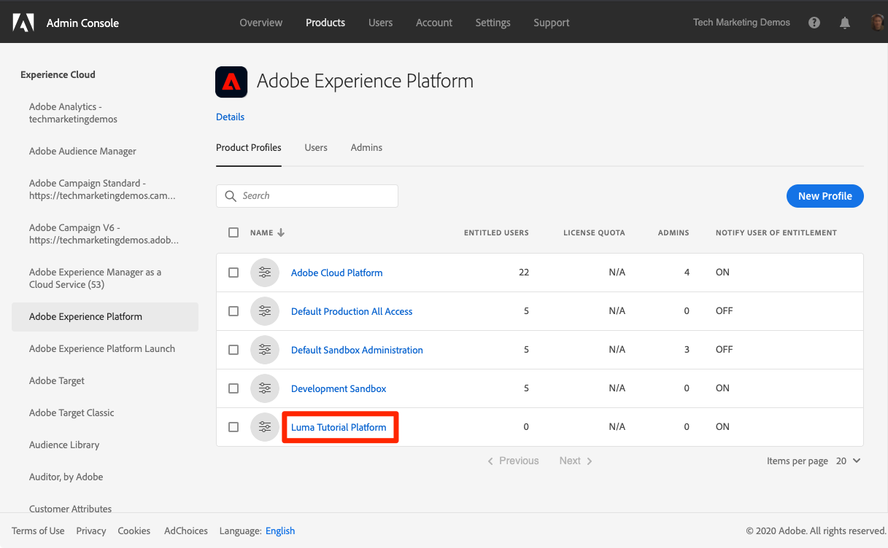
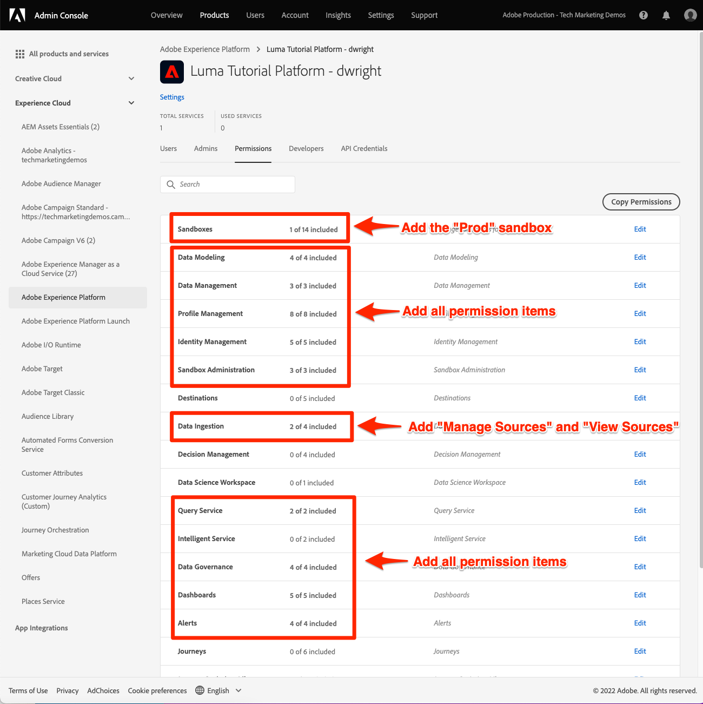

# Configure Permissions

In this lesson, you will configure Adobe Experience Platform user permissions using [!DNL Adobe's Admin Console]. 

Access control is a key privacy capability in Experience Platform and we recommend limiting permissions to the minimum required for people to perform their job functions. 

Data Architects and Data Engineers are the power users of Adobe Experience Platform and you will need almost all permissions in order to complete this tutorial, and later in your day-to-day work. Data Architects are also likely be involved in the administration of *other Platform users* at your company such as marketers, analysts, and data scientists. As you complete this lesson, think about how you will use these features to manage these other users at your company.

**Data Architects** will need to configure permissions outside of this tutorial.

>[!IMPORTANT]
>
>A System Administrator of Adobe Experience Cloud products will need to complete some of the steps in this lesson, which we have called out in the section headings.  If you are not System Administrator, please reach out to one at your company and have them complete these tasks.

## About the Admin Console

The [!DNL Admin Console] is the interface used to administer user access to all Adobe Experience Cloud products. Some key [!DNL Admin Console] concepts to be aware of:

* A **product profile** is a combination of permissions, roles, and sandbox environments tied to a specific Adobe product. Multiple product profiles can be created for a single Adobe product. For example, a "Marketer" profile could limit permissions to what a typical marketer would need to complete key tasks in the production instance, while a "Data Architect" profile could be used to grant different permissions in multiple environments. In this lesson, we will create a "Luma Tutorial" product profile with all the permissions a Data Architect and Data Engineer would need to complete this tutorial in a sandbox environment. 
* An **integration** is a connection to a _project_ in the Adobe Developer Console. The Adobe Developer Console is the heart of authentication and configuration of Adobe APIs. You will configure an integration in the Developer Console and [!DNL Postman] lesson.

Also, here is a quick summary of the roles that exist for Platform, as well as any Adobe Experience Cloud application:

* **Users** must be a member of a product profile can complete tasks in Platform's user interface according to the permissions in their product profile(s). Users can also be assigned to User Groups, to streamline management.
* **Developers** must also be a member of product profile can complete the tasks using Platform's API according to the permissions in the product profile.
* **Product Profile Admins** can edit *that specific profile's* permissions and services as well as add users, additional profile admins, and developers. Potentially a product profile admin can give themselves access to all capabilities of the product, with the exception of administering other product profiles.
* **Product Admins** can administer *all product profiles* for that Adobe product and add new product profiles.
* **System Administrators** can add product admins and administer essentially any permissions for all Adobe Experience Cloud products.

## Create an Experience Platform product profile (requires a system administrator or product admin)

In this exercise you or a System Administrator at your company will create a product profile for Adobe Experience Platform and add the tutorial participant as a product profile admin.

>[!NOTE]
>
>If you are a system administrator of Adobe products facilitating the enablement of a colleague with this tutorial, consider adding them as a *product administrator* for Adobe Experience Platform, in which case they would be able to complete these steps on their own and administrate other users of Experience Platform in the future.

To create the product profile:

1. Log into the [Adobe Admin Console](https://adminconsole.adobe.com)
1. Click **[!UICONTROL Products]** on the top navigation
1. Click **[!UICONTROL Adobe Experience Platform]** on the left navigation
1. You probably already have several profiles in your Experience Platform instance. Click the **[!UICONTROL New Profile]** button to add another
    
1. Name the profile `Luma Tutorial Platform` and click the **[!UICONTROL Next]** button
    
1. On the Services screen, click the "All on" checkbox to *remove* all services. The tutorial participant will reenable what is needed in a later exercise. 
    
1. At this point the profile is created. Permission items will be added in a later exercise, so on the **[!UICONTROL Configure profile]** screen, just hit the **[!UICONTROL Cancel]** button.
    

Now you need to add the tutorial participant as an admin of the newly created product profile:

1. Click on the `Luma Tutorial Platform` product profile:
   
    

1. Click on the **[!UICONTROL Admin]** tab and then click the **[!UICONTROL Add Admin]** button:

    

1. Complete the workflow to add the tutorial participant as an admin.

After completing these steps you should see that the `Luma Tutorial Platform` profile is set up with 1 admin.

## Configure Experience Platform product profile

Now that you are an admin of the `Luma Tutorial Platform` product profile you can configure the services, permission, and roles you will need to complete the tutorial.

### Add services

There are multiple services built on top of Adobe Experience Platform. Some of them are enabled via Platform's product profiles:

1. Log into the [!DNL Adobe Admin Console](https://adminconsole.adobe.com)
1. Click **[!UICONTROL Products]** on the top navigation
1. Click **[!UICONTROL Adobe Experience Platform]** on the left navigation
1. Click on the `Luma Tutorial Platform` profile in the list
    
1. Click the **[!UICONTROL Settings]** link
    
1. Click **[!UICONTROL Services]** on the left
1. Enable **[!UICONTROL Query Service]** (you may see other options here depending on your product license)
1. Click the **[!UICONTROL Save]** button
    
   
### Add permissions

Now you will add the individual permission items to the profile. From the product profile screen:

1. Click the **[!UICONTROL Permissions]** tab
1. Under **[!UICONTROL Sandboxes]**, add the **[!UICONTROL Prod]** sandbox to the profile. It is necessary to have access to the [!DNL Prod] sandbox in order to create other sandboxes. Once we have added the tutorial sandbox in the next lesson, we will remove the [!DNL Prod] sandbox from the product profile.
1. Add all of the permission items for the categories highlighted in the screenshot below, by opening a category and moving the items to the right column. **[!UICONTROL Destinations]** is a capability of Real-time Customer Data Platform and permissions are not needed for this tutorial
1. After adding all of the permission items, your screen should look like this:

    

### Add yourself as a user

At this point, if `Luma Tutorial Platform` was your _only_ Experience Platform product profile, you still would not be able to log into Experience Platform's user interface. To do that you need to be a _user_ in the product profile. Fortunately, since you are an _admin_ of a product profile, you can add yourself as a _user_!  

1. Go to the **[!UICONTROL Users]** tab
1. Click the **[!UICONTROL Add User]** button
    
1. Complete the workflow to add yourself as a user to the product profile

### Add yourself as a developer

In order to use the Platform API, you will need add yourself as a developer:

1. Go to the **[!UICONTROL Developers]** tab
1. Click the **[!UICONTROL Add Developer]** button
    
1. Complete the workflow to add yourself as a developer to the product profile

## Create a Launch product profile (requires a system administrator or product admin)

In this exercise you or a System Administrator at your company will create a product profile for Adobe Experience Platform Launch and add the tutorial participant as a product profile admin.

>[!NOTE]
>
>If you are a system administrator of Adobe products facilitating the enablement of a colleague with this tutorial, consider adding them as a *product administrator* for Launch, in which case they would be able to complete these steps on their own and administrate other users of Launch in the future.

To create the product profile:

1. In the [!DNL Adobe Admin Console] go to the Adobe Experience Platform Launch product
1. Add a new profile and name it `Luma Tutorial Launch`
1. Don't assign any properties or permissions at this point
1. Add the tutorial participant as an admin of this profile

After completing these steps you should see that the `Luma Tutorial Launch` profile is set up with 1 admin.

## Configure the Launch product profile

Now that you are an admin of the `Luma Tutorial Launch` product profile you can configure the permission, and roles you will need to complete the tutorial.

Now you have almost all of the user roles and permissions required to complete the tutorial! There will be just one more tweak that you will need to make in the [!DNL Adobe Admin Console] after you add your sandbox in the next lesson. 

### Add permissions

Now you will add the individual permission items to the profile. From the product profile screen:

1. In the [Adobe Admin Console](https://adminconsole.adobe.com), go to **[!UICONTROL Products]** > **[!UICONTROL Adobe Experience Platform Launch]**
1. Open the `Luma Tutorial Launch` profile
    
1. Click on the Permissions tab
1. Click to open the **[!UICONTROL Properties]** row
1. Click the **[!UICONTROL Auto-Include]** toggle so that it is in the Off state. This should remove any properties that might already be in the profile (we will add one later).
1. Click the **[!UICONTROL Save]** button
    
1. Click to open the **[!UICONTROL Property Rights]** row
1. Click **[!UICONTROL Add all]** to add all of the property rights
1. Click the **[!UICONTROL Save]** button
    
1. Click to open the **[!UICONTROL Company Rights]** row
1. Add **[!UICONTROL Manage Properties]**
1. Click the **[!UICONTROL Save]** button
    

### Add yourself as a user

Now just like you did earlier, add yourself as a user to the Launch profile

1. Go to the **[!UICONTROL Users]** tab
1. Click the **[!UICONTROL Add User]** button
    
1. Complete the workflow to add yourself as a user to the product profile

You will not need to add yourself as a Developer for Launch.

>[!NOTE]
>
>We will mention the specific set of permissions used for each lesson at the top of the page in the pre-requisites section.

## Additional Resources

* [Adobe Admin Console documentation](https://helpx.adobe.com/enterprise/using/admin-console.html)
* [Access Control documentation](https://docs.adobe.com/content/help/en/experience-platform/access-control/home.html)
* [Access Control API](https://www.adobe.io/apis/experienceplatform/home/api-reference.html#!acpdr/swagger-specs/access-control.yaml)

Great! You've learned quite a bit about the Adobe Admin Console as you added your permissions and are now ready to [create a sandbox](create-a-sandbox.md)!