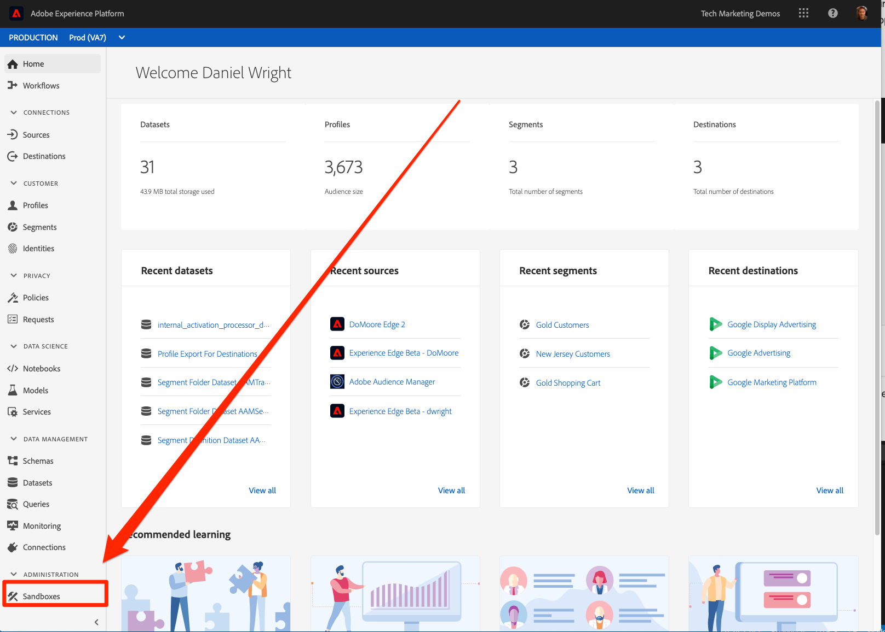
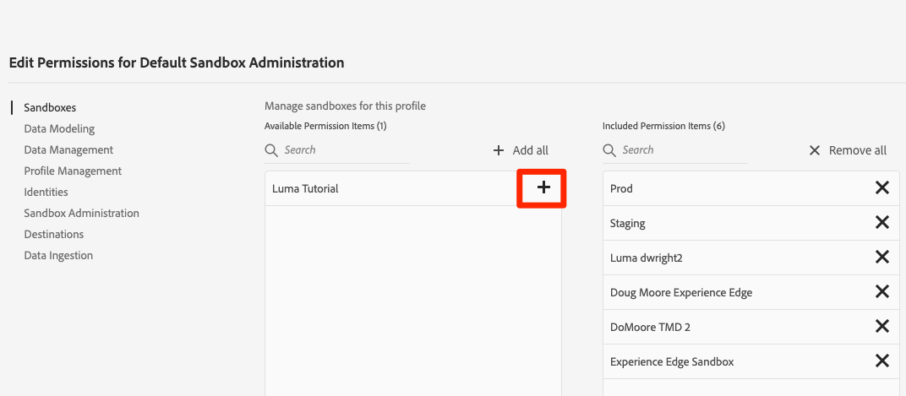
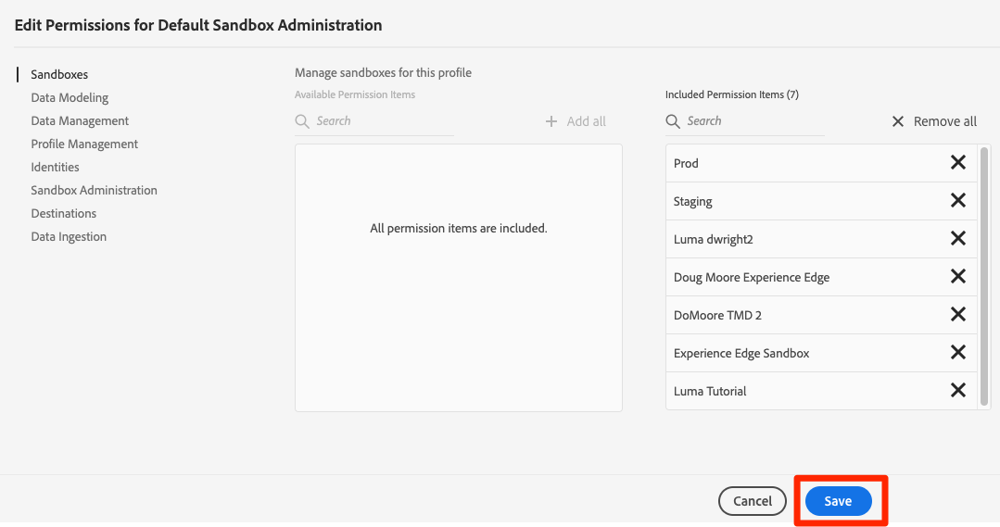

# Create a Sandbox

In this tutorial you will be uploading sample data into your Platform account. In order to segregate this sample data from your company's actual production data, we will use the Sandbox feature in Adobe Experience Platform.

Sandboxes provide isolated environments where you can try out functionality and then delete them when you are done.

## Pre-requisites

## Create a Sandbox

1. Click **[!UICONTROL Sandboxes]** in the left navigation
   
   

1. Click **[!UICONTROL Create sandbox]** on the top right
   

1. Give your sandbox a **[!UICONTROL Name]** and a **[!UICONTROL Title]**. The **[!UICONTROL Name]** must be all lowercase, alphanumeric characters and hyphens.
   

Before you can start using your sandbox

## Get Access to the Sandbox

Behind-the-scenes, the sandbox is being created. However, you will not see the new sandbox in the dropdown until you have been assigned access to it in the Admin Console.

To get access rights to the new sandbox you will need Administrative privileges or you will need the assistance of an administrator at your company. Here is what those the basic steps look like, although the configuration of Product Profiles and users might be different at your company.

### Select the Product Profile

1. Log into the [Admin Console](adminconsole.adobe.com)
1. Select **[!UICONTROL Products > Adobe Experience Platform]**
1. Click on the [!UICONTROL Product Profile] containing the users who need access to the Sandbox

    

1. Click on the **[!UICONTROL Permissions]**

1. On the [!UICONTROL Sandboxes] row, click **[!UICONTROL Edit]**

    

1. Click the **[!UICONTROL +]** icon to add the new sandbox to the right hand column

    

1. Click **[!UICONTROL Save]** to save the updated permissions  

    

1. You should now be able to see the new sandbox appear in the sandbox dropdown in the Platform interface:

   