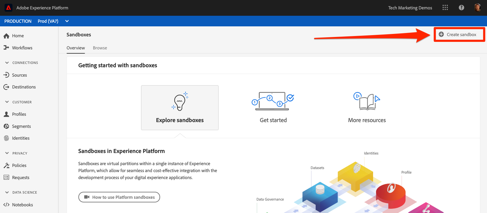
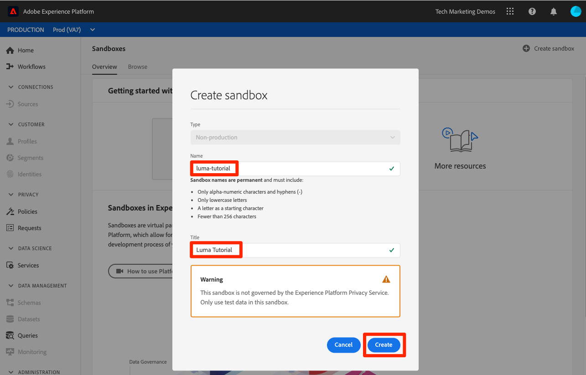
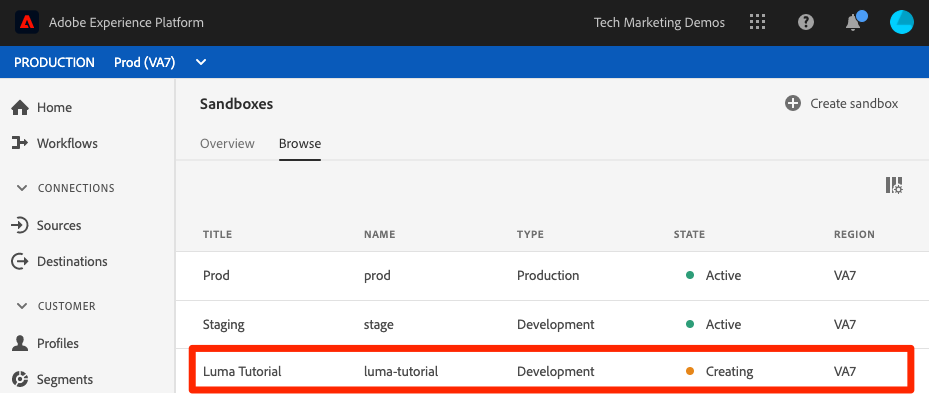
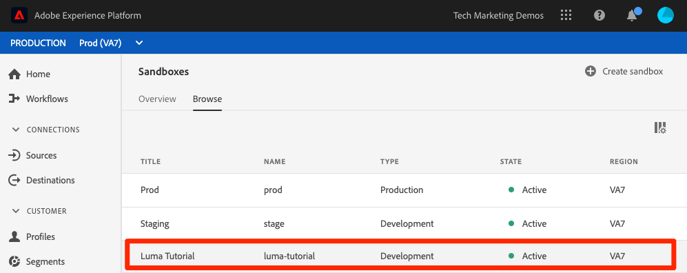
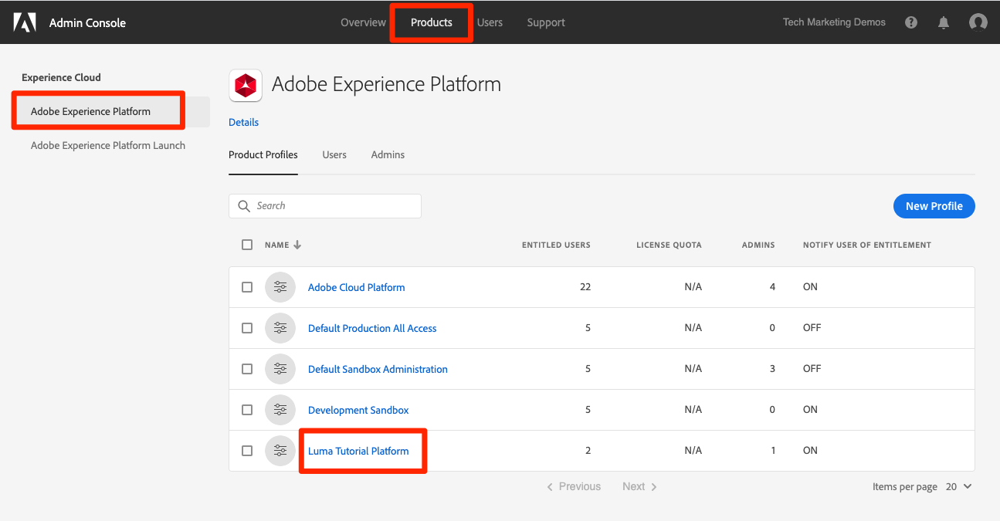
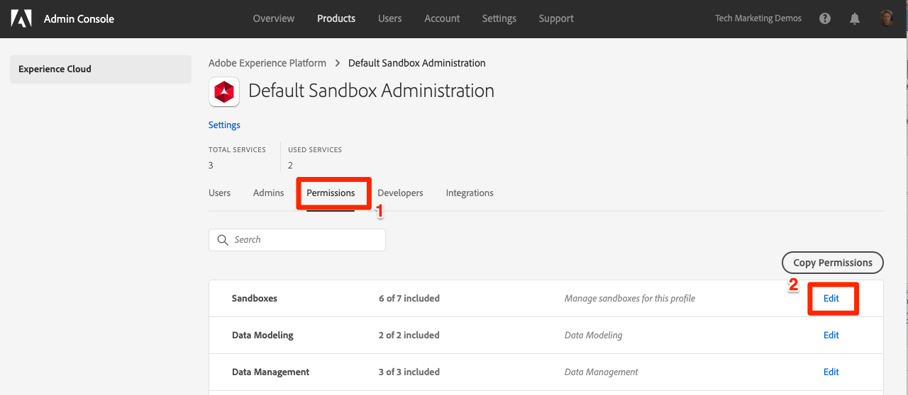
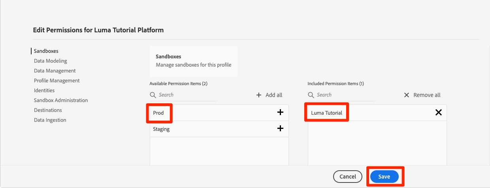
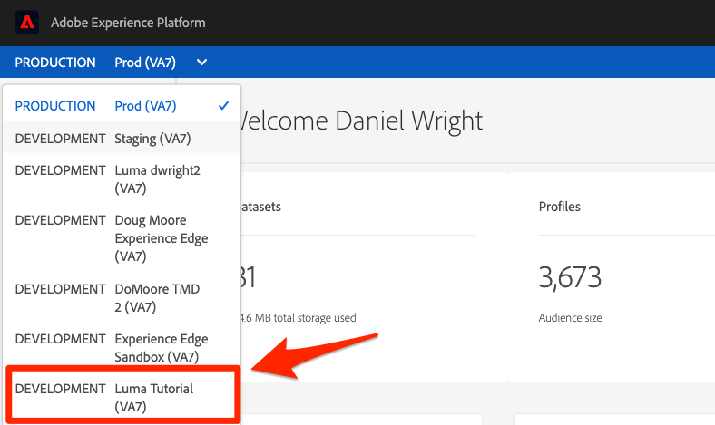

# Create a sandbox

In this lesson, you will create a development environment sandbox that you can use for the rest of the tutorial.

Sandboxes provide isolated environments where you can try out functionality without mixing resources and data with your Production environment.

**Data Architects** and **Data Engineers** will need to create sandboxes outside of this tutorial.

<!--include note on extent of sandbox support-->

First, watch this short video to learn more about sandboxes:
>[!VIDEO](https://video.tv.adobe.com/v/29838/?quality=12&learn=on)

## Permissions required

In the [Configure Permissions](configure-permissions.md) lesson, you setup all the access controls you need to complete this lesson, specifically:

* Permission item Sandbox Management > View Sandboxes
* Permission item Sandbox Management > Manage Sandboxes
* Permission item Sandboxes > (any sandbox)
* User-role access to the `Luma Tutorial Platform` product profile
* Admin-level access to the `Luma Tutorial Platform` product profile

## Create a Sandbox

Let's create a sandbox:

1. Log into the [Adobe Experience Platform](https://experience.adobe.com/platform) interface
1. Click **[!UICONTROL Sandboxes]** in the left navigation
1. Click **[!UICONTROL Create sandbox]** on the top right
   

1. Name your sandbox `luma-tutorial` 
1. Title your tutorial `Luma Tutorial`
1. Click the **[!UICONTROL Create]** button
   
   >[!NOTE]
   >
   >While you could use any arbitrary values for your sandbox name and title, sticking to the values suggested is recommended as we will refer to these labels throughout the tutorial

Sandboxes take approximately fifteen minutes to create and a "[!UICONTROL Creating]" status will display during this time:
   

When the sandbox is fully created it show as "[!UICONTROL Active]":
   

Wait until your sandbox is "[!UICONTROL Active]" before continuing to the next exercise.

## Add the new sandbox to the product profile

Once the sandbox is active, you need to include it in your product profile in order to use it. To add it to your product profile:

1. In a separate browser tab, log into the [Admin Console](https://adminconsole.adobe.com)
1. Go to **[!UICONTROL Products > Adobe Experience Platform]**
1. Open the `Luma Tutorial Platform` profile

    

1. Click on the **[!UICONTROL Permissions]** tab

1. On the [!UICONTROL Sandboxes] row, click **[!UICONTROL Edit]**

    

1. Click the **[!UICONTROL +]** icon to add the new sandbox to the right hand column
1. Remove the [!UICONTROL Prod] sandbox you assigned to the profile originally
1. Click **[!UICONTROL Save]** to save the updated permissions  

    

1. Go back to the browser tab with Experience Platform
1. Reload the page and you should now either be in the `Luma Tutorial` sandbox or it should appear in your sandbox dropdown
1. Switch to the `Luma Tutorial` sandbox if you aren't already in it

   

## Additional Resources

* [Sandboxes documentation](https://docs.adobe.com/content/help/en/experience-platform/sandbox/home.html)
* [Sandbox API reference](https://www.adobe.io/apis/experienceplatform/home/api-reference.html#!acpdr/swagger-specs/sandbox-api.yaml)

Great, you've created your sandbox and are ready to [Set up Developer Console and Postman](set-up-developer-console-and-postman.md)!