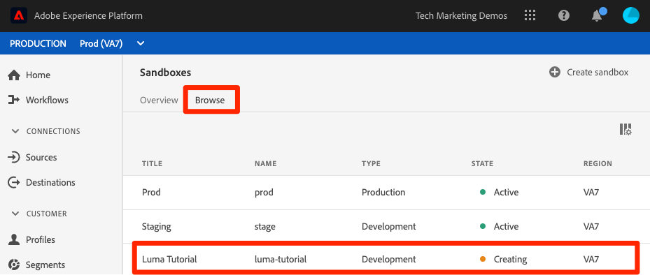

# Create a sandbox

<!--25min-->

In this lesson, you will create a development environment sandbox that you will use for the rest of the tutorial.

Sandboxes provide isolated environments where you can try out functionality without field groupg resources and data with your Production environment.

**Data Architects** and **Data Engineers** will need to create sandboxes outside of this tutorial.

Before you begin the exercises, watch this short video to learn more about sandboxes:
>[!VIDEO](https://video.tv.adobe.com/v/29838/?quality=12&learn=on)

## Permissions required

In the [Configure Permissions](configure-permissions.md) lesson, you set up all the access controls required to complete this lesson, specifically:

* Permission items **[!UICONTROL Sandbox Administration]** > **[!UICONTROL View Sandboxes]** and **[!UICONTROL Manage Sandboxes]**
* Permission item **[!UICONTROL Sandboxes]** > **[!UICONTROL Prod]**
* User-role access to the `Luma Tutorial Platform` product profile
* Admin-level access to the `Luma Tutorial Platform` product profile

## Create a Sandbox

Let's create a sandbox:

1. Log into the [Adobe Experience Platform](https://experience.adobe.com/platform) interface
1. Go to **[!UICONTROL Sandboxes]** in the left navigation
1. Select **[!UICONTROL Create sandbox]** on the top right
   

1. Name your sandbox `luma-tutorial` 
1. Title your tutorial `Luma Tutorial`
1. Select the **[!UICONTROL Create]** button
   
   >[!NOTE]
   >
   >While you could use any arbitrary values for your sandbox name and title, sticking to the values suggested is recommended as we will refer to these labels throughout the tutorial. If there are multiple people at your organization completing this tutorial, consider adding your name at the end of the sandbox title and name, for example luma-tutorial-ignatiusjreilly.

Sandboxes take approximately 30 seconds to create, during which time a "[!UICONTROL Creating]" status displays:
   

When the sandbox is fully created, it shows as "[!UICONTROL Active]":
   

Wait until your sandbox is "[!UICONTROL Active]" before continuing to the next exercise.

## Add the new sandbox to the product profile

Once the sandbox is active, you must include it in your product profile in order to use it. To add it to your product profile:

1. In a separate browser tab, log into the [Admin Console](https://adminconsole.adobe.com)
1. Go to **[!UICONTROL Products > Adobe Experience Platform]**
1. Open the `Luma Tutorial Platform` profile

    

1. Go to the **[!UICONTROL Permissions]** tab

1. On the [!UICONTROL Sandboxes] row, select **[!UICONTROL Edit]**

    

1. _Remove_ the **[!UICONTROL Prod]** sandbox you assigned to the profile originally
1. Select the **[!UICONTROL +]** icon to add the new `Luma Tutorial` sandbox to the right-hand column
1. Select **[!UICONTROL Save]** to save the updated permissions  

    

1. Go back to the browser tab with Experience Platform
1. Reload the page and you should now either be in the `Luma Tutorial` sandbox or it should appear in your sandbox dropdown
1. Switch to the `Luma Tutorial` sandbox if you aren't already in it

   

## Additional Resources

* [Sandboxes documentation](https://experienceleague.adobe.com/docs/experience-platform/sandbox/home.html)
* [Sandbox API reference](https://www.adobe.io/apis/experienceplatform/home/api-reference.html#!acpdr/swagger-specs/sandbox-api.yaml)

Great, you've created your sandbox and are ready to [Set up Developer Console and Postman](set-up-developer-console-and-postman.md)!
