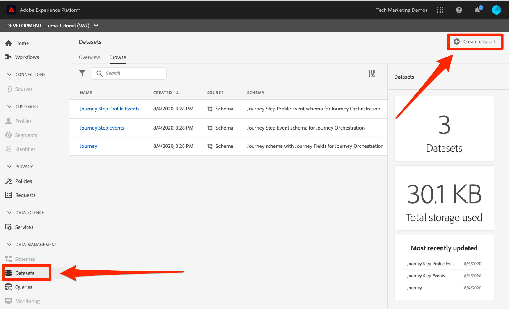
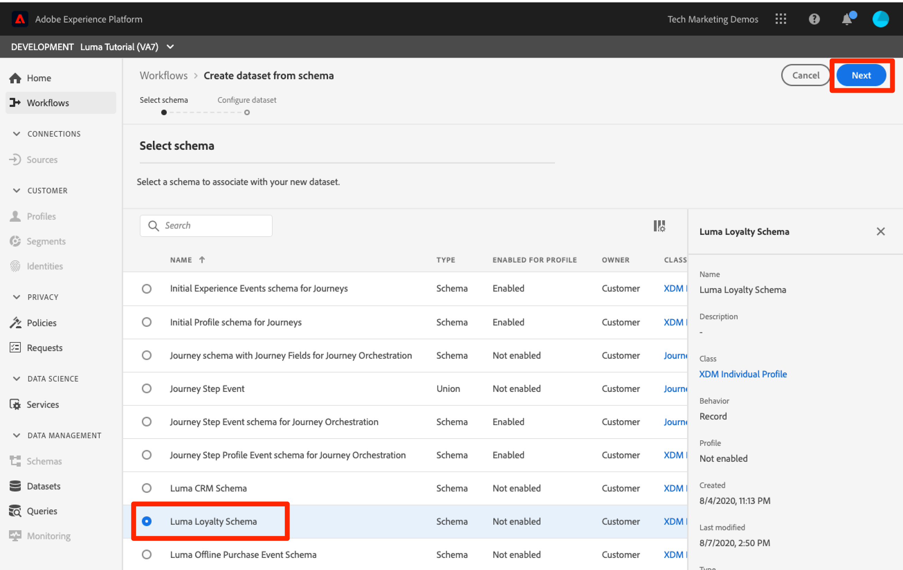
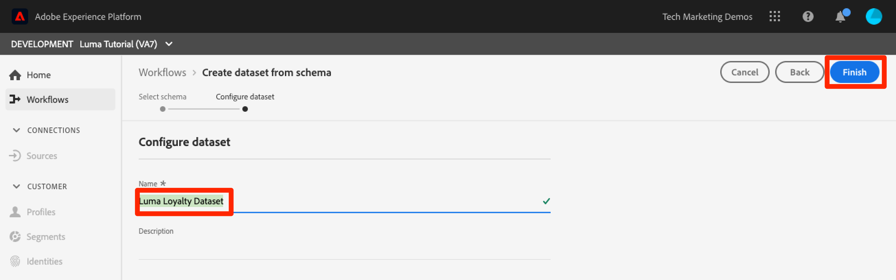
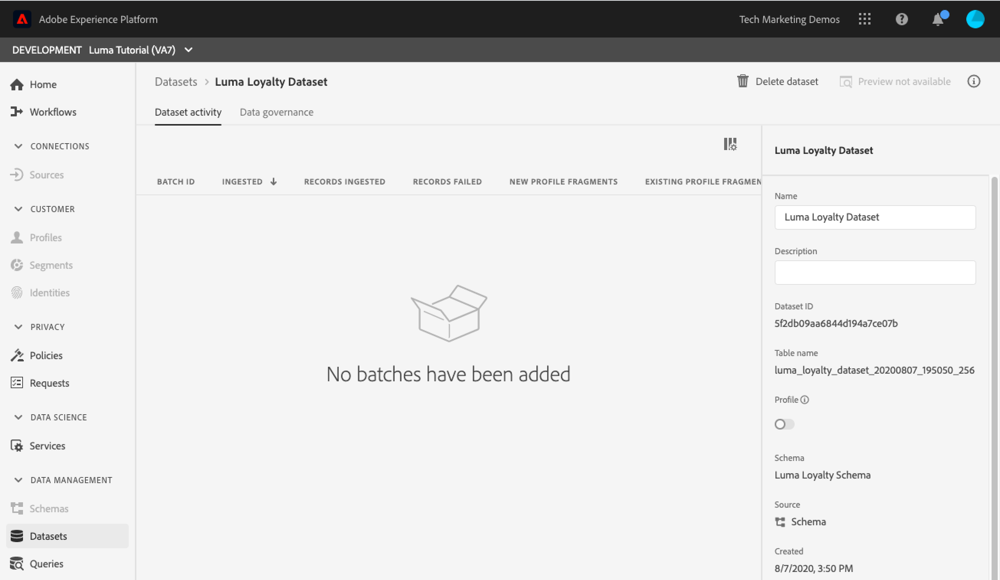
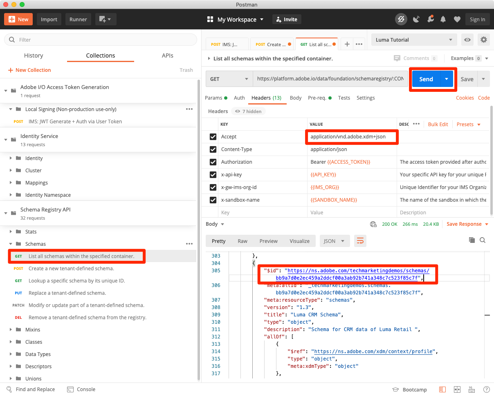
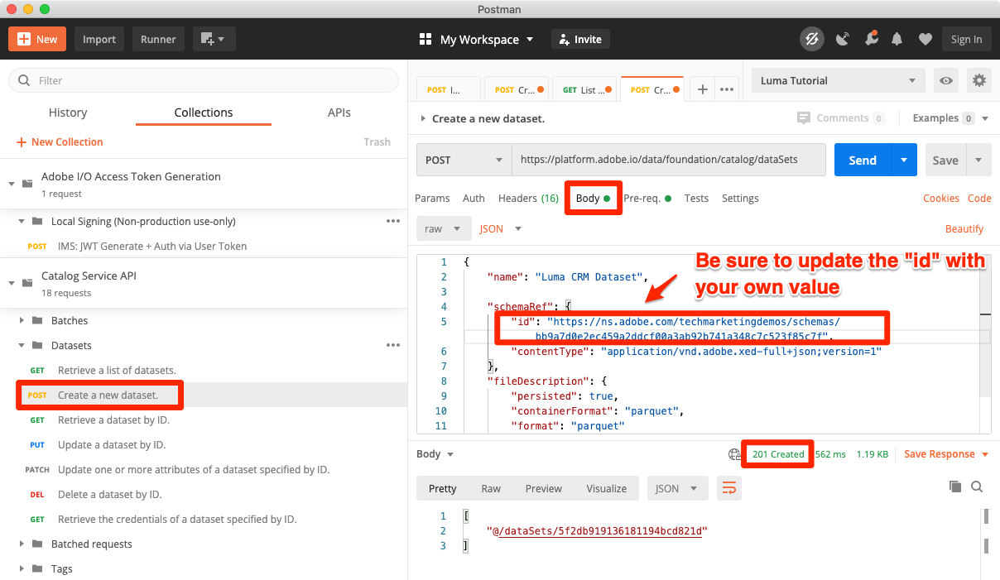
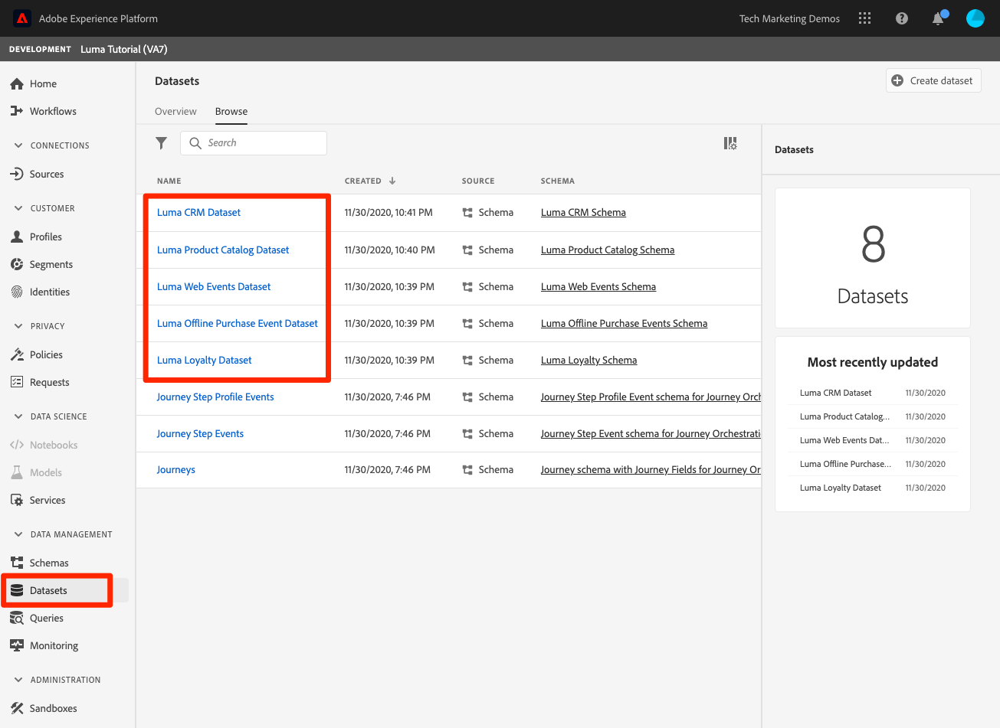

# Create Datasets

In this lesson, you will create datasets so that you can ingest data into them later on. You will be excited to know that this is the shortest lesson in the tutorial!

All data that is successfully ingested into Adobe Experience Platform is persisted within the Data Lake as datasets. A dataset is a storage and management construct for a collection of data, typically a table, that contains a schema (columns) and fields (rows). Datasets also contain metadata that describes various aspects of the data they store.

**Data Architects** will need to create datasets outside of this tutorial.

First, watch this short video to learn more about datasets:
>[!VIDEO](https://video.tv.adobe.com/v/27269?quality=12&learn=on)

## Permissions required

In the [Configure Permissions](configure-permissions.md) lesson, you setup all the access controls you need to complete this lesson, specifically:

* Permission items **[!UICONTROL Data Management]** > **[!UICONTROL View Datasets]** and **[!UICONTROL Manage Datasets]**
* Permission item **[!UICONTROL Sandboxes]** > `Luma Tutorial`
* User-role access to the `Luma Tutorial Platform` product profile
* Developer-role access to the `Luma Tutorial Platform` product profile (for API)

## Create datasets in the UI

In this exercise we will create datasets in the UI. Let's start with the loyalty system:

1. Click **[!UICONTROL Datasets]** in the Platform UI's left navigation
1. Click the **[!UICONTROL Create Dataset]** button on the top right
    

1. On the next screen, click **Create Dataset from schema** 
1. On the next screen, select your `Luma Loyalty Schema` and then click the **[!UICONTROL Next]** button
    

1. Name the dataset `Luma Loyalty Dataset` and then click the **[!UICONTROL Finish]** button
    
1. When the dataset has saved you will be taken to a screen like this:
    

That's it! See, I told you this was going to be quick. Follow same steps and create datasets:

1. `Luma Offline Purchase Event Dataset` for your `Luma Offline Purchase Event Schema`
1. `Luma Web Events Dataset` for your `Luma Web Events Schema`
1. `Luma Product Catalog Dataset` for your `Luma Web Events Schema`


## Create a dataset using API

Now you will create a Luma CRM Dataset using the API. I think you are catching on how these API exercises work. Basically, we do something in the UI and then do the exact same thing using the API with a [!DNL Postman] collection we've downloaded from the [Adobe Experience Platform Postman Samples
](https://github.com/adobe/experience-platform-postman-samples). 

>[!NOTE]
>
>If you want to just skip this exercise and create the `Luma CRM Dataset` in the UI that's fine, I won't tell anyone. :D Just name the dataset `Luma CRM Dataset` and use the `Luma CRM Schema`

### Get the id of the schema to be used in the dataset

First we need to get the `$id` of the `Luma CRM Schema`:

1. Open [!DNL Postman]
1. If you haven't made a call in the last 24 hours, your authorization tokens have probably expired. Open the call **[!DNL Adobe I/O Access Token Generation > Local Signing (Non-production use-only) > IMS: JWT Generate + Auth via User Token]** and click **Send** to request new JWT and Access Tokens, just like you did in the [!DNL Postman] lesson.
1. Open the call **[!DNL Schema Registry API > Schemas > List all schemas within the specified container.]**
1. Update the Accept Header to one of the allowed values, e.g. `application/vnd.adobe.xdm+json`
1. Click the **Send** button
1. You should get a 200 response
1. Look in the response for the `Luma CRM Schema` item and copy the `$id` value
  

### Create the dataset

Now you can create the dataset:

1. Download [Catalog Service API.postman_collection.json](https://raw.githubusercontent.com/adobe/experience-platform-postman-samples/master/apis/experience-platform/Catalog%20Service%20API.postman_collection.json) to your `Luma Tutorial Assets` folder (The Dataset Service API collection is for managing data usage labels on existing datasets)
1. Import the collection into [!DNL Postman]
1. Select the request **[!DNL Identity Service > Create a new identity namespace. > IMS: JWT Generate + Auth via User Token]**
1. Paste the following as the **Body** of the request, ***replacing the id value with your own***:

    ```json
    {
        "name": "Luma CRM Dataset",

        "schemaRef": {
            "id": "https://ns.adobe.com/wwfovlab011/schemas/82c25e828b29cd1a1b092c641ee4cfeb0202ee1a06ee1e10",
            "contentType": "application/vnd.adobe.xed-full+json;version=1"
        },
        "fileDescription": {
            "persisted": true,
            "containerFormat": "parquet",
            "format": "parquet"
        }
    }
    ```

1. Click the **Send** button
1. You should get a 201 Created response containing the id of your new dataset!
     
   
>[!TIP]
>
> Common issues making this call and likely fixes:
>
> * `400: There was a problem retrieving xdm schema`. Make sure you have replaced the id in the sample above with the id of your own `Luma CRM Schema`
> * No auth token: Run the **IMS: JWT Generate + Auth via User Token** call to generate new tokens
> * `401: Not Authorized to PUT/POST/PATCH/DELETE for this path : /global/schemas/`: Update the **CONTAINER_ID** environment variable from `global` to `tenant`
> * `403: PALM Access Denied. POST access is denied for this resource from access control`: Verify your user permissions in the Admin Console


You can go back to the **[!UICONTROL Datasets]** screen in the Platform user interface, you can verify the successful creation of all five datasets!
 


## Additional Resources

* [Datasets documentation](https://docs.adobe.com/content/help/en/experience-platform/catalog/datasets/overview.html)
* [Datasets API (part of Catalog Service) reference](https://www.adobe.io/apis/experienceplatform/home/api-reference.html#/Datasets)

Now that all of our schemas, identities, and datasets are in place, we can [enable them for Real-time Customer Profile](enable-profiles.md).