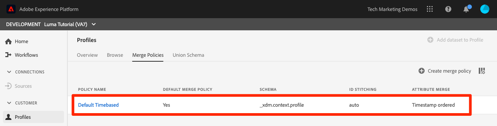
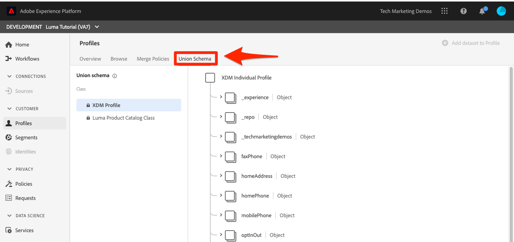
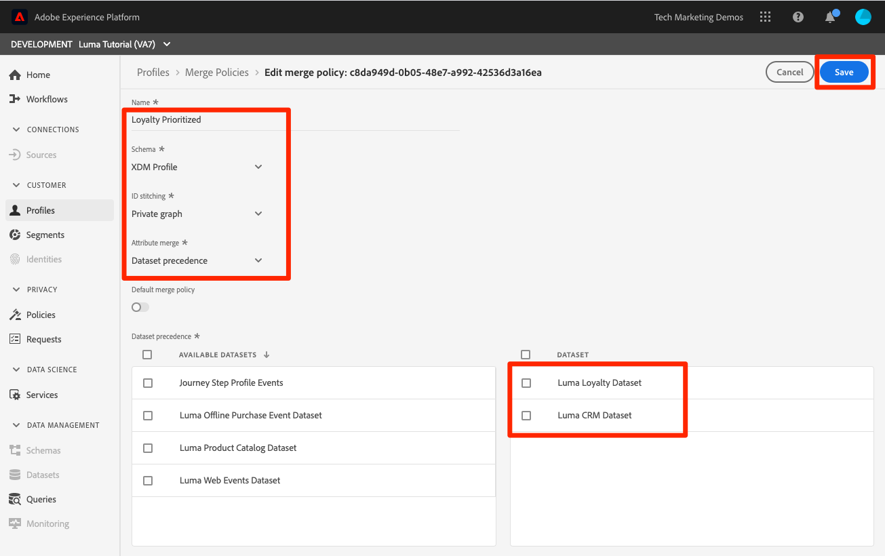
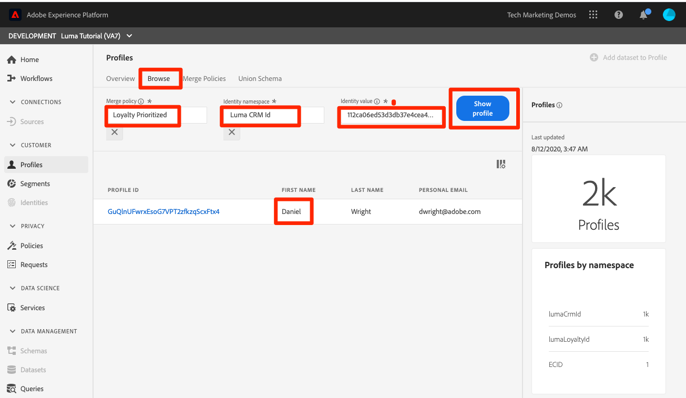
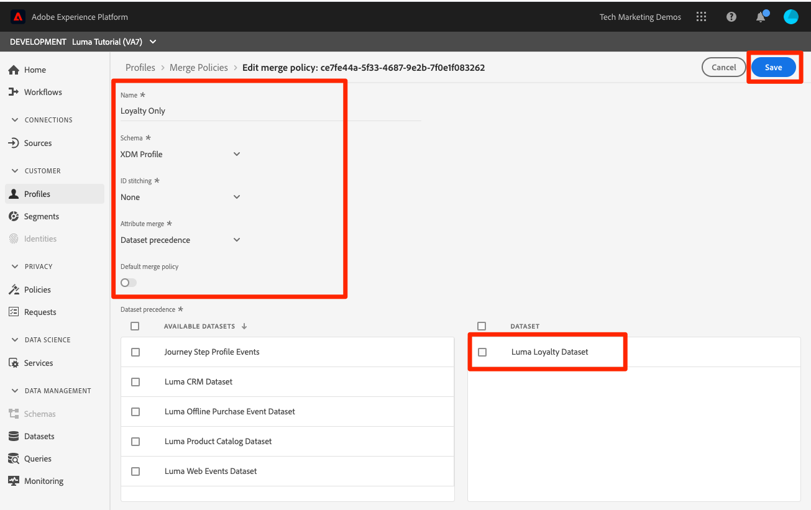
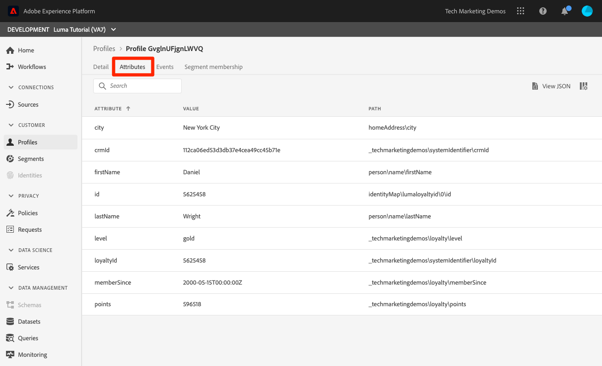
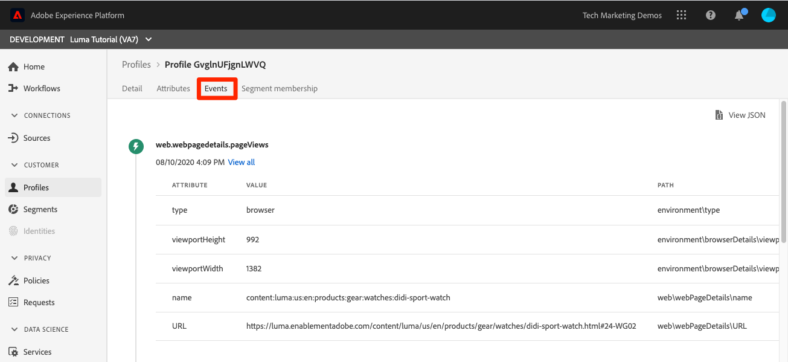
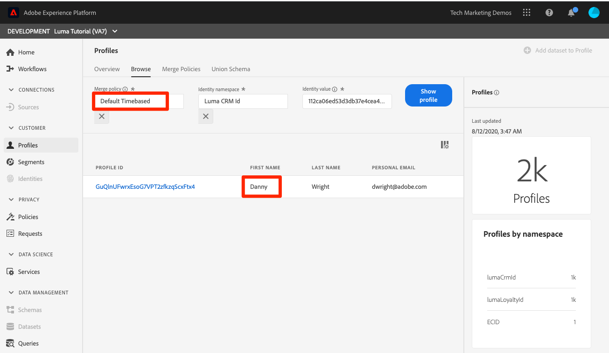

# Create merge policies

<!--20 min-->

In this lesson, you will create merge policies to prioritize how multiple data sources merge into profiles. 

Adobe Experience Platform enables you to bring data together from multiple sources and combine it to see a complete view of each individual customer. When bringing this data together, merge policies determine how data will be prioritized and what data will be combined to create that unified view.

We'll stick to the UI for this lesson, but API options also exist for creating merge policies.

**Data Architects** will need to create merge policies outside of this tutorial.

Before you begin the exercises, watch this short video to learn more about merge policies:
>[!VIDEO](https://video.tv.adobe.com/v/330433?quality=12&learn=on)

## Permissions required

In the [Configure Permissions](configure-permissions.md) lesson, you set up all the access controls you need to complete this lesson, specifically:

* Permission items **[!UICONTROL Profile Management]** > **[!UICONTROL View Merge Policies]** and **[!UICONTROL Manage Merge Policies]**
* Permission item **[!UICONTROL Profile Management]** > **[!UICONTROL View Profiles]** and **[!UICONTROL Manage Profiles]**
* Permission item **[!UICONTROL Sandboxes]** > `Luma Tutorial`
* User-role access to the `Luma Tutorial Platform` product profile

## About Merge policies and Union Schema

You may recall, in the lesson on batch ingestion, we uploaded two records with slightly different information for the same customer. In the [!DNL Loyalty] data, the customer's first name was `Daniel` and he lived in `New York City`, but in the CRM data the customer's first name was `Danny` and he lived in `Portland`. Customer data changes over time. Perhaps he moved from `Portland` to `New York City` or vice versa. Other things change too, such as phone numbers, email addresses, etc. Merge policies help you decide how to handle these types of conflicts when two data sources give different information for the same user.

So, why did `Danny` win out as the first name? Let's take a look:

1. In the Platform UI, click **[!UICONTROL Profiles]** in the left navigation
1. Click the **[!UICONTROL Merge Polices]** tab
1. Note that the default Merge Policy is timestamp ordered. Because you uploaded the CRM data after the Loyalty data, `Danny` won out as the first name in the profile:

When multiple schemas are enabled for profile, a [!UICONTROL Union Schema] is automatically created for all profile-enabled, record schema sharing the same base class. You can view the [!UICONTROL Union Schemas] by clicking the **[!UICONTROL Union Schema]** tab.

Note that there isn't a union schema for the ExperienceEvent class. While ExperienceEvent data still lands in profile, because it is time-series based, each event includes a timestamp and id and collisions are not a problem.

Now what if you don't like that default merge policy? What if Luma decides their CRM system should be the source of truth when there is a conflict? For that, we will create a merge policy.

## Create a merge policy in the UI

1. On the Merge Policies screen, click the **[!UICONTROL Create Merge Policy]** button on the upper-right
1. As the **[!UICONTROL Name]**, enter  `Loyalty Prioritized`
1. As the **[!UICONTROL Schema]**, select **[!UICONTROL XDM Profile]** (note that your custom class&mdash;since it is record data&mdash;is available for merge policies, too)
1. For **[!UICONTROL Id Stitching]**, select **[!UICONTROL Private Graph]**
1. For **[!UICONTROL Attribute Merge]**, select **[!UICONTROL Dataset precedence]**
1. Drag-and-drop `Luma Loyalty Dataset` and `Luma CRM Dataset` to the **[!UICONTROL Dataset]** panel.
1. Make sure `Luma Loyalty Dataset` is on top by drag and dropping it above the `Luma CRM Dataset`
1. Click the **[!UICONTROL Save]** button
<!--do i need to explain Private Graph? Is that GA?-->

## Validate the merge policy

Let's see if the merge policy is doing what we would expect:

1. Click the **[!UICONTROL Browse]** tab
1. Change the **[!UICONTROL Merge policy]** to your new `Loyalty Prioritized` policy
1. As the **[!UICONTROL Identity namespace]**, use your `Luma CRM Id`
1. As the **[!UICONTROL Identity value]** use `112ca06ed53d3db37e4cea49cc45b71e`
1. Click the **[!UICONTROL Show profile]** button
1. `Daniel` is back!

## Create a merge policy with limited datasets

When creating Merge policies using dataset precedence, only the datasets of the same base class that you include in the right are included in the profile. Let's set up another merge policy

1. On the Merge Policies screen, click the **[!UICONTROL Create Merge Policy]** button on the upper-right
1. As the **[!UICONTROL Name]**, enter  `Loyalty Only`
1. As the **[!UICONTROL Schema]**, select **[!UICONTROL XDM Profile]** 
1. For **[!UICONTROL Id Stitching]**, select **[!UICONTROL None]**
1. For **[!UICONTROL Attribute Merge]**, select **[!UICONTROL Dataset precedence]**
1. Drag-and-drop only the `Luma Loyalty Dataset` to **[!UICONTROL Selected Dataset]** panel.
1. Click the **[!UICONTROL Save]** button

## Validate the merge policy

Now let's look at what this merge policy does:

1. Click the **[!UICONTROL Browse]** tab
1. Change the **[!UICONTROL Merge policy]** to your new `Loyalty Only` policy
1. As the **[!UICONTROL Identity namespace]**, use your `Luma CRM Id`
1. As the **[!UICONTROL Identity value]** use `112ca06ed53d3db37e4cea49cc45b71e`
1. Click the **[!UICONTROL Show profile]** button
1. Confirm that no profiles are found:
    

CRM Id is an identity field in the `Luma Loyalty Dataset`, but only primary identities can be used to look up profiles. So, let's look up the profile using the primary identity, `Luma Loyalty Id`"

1. Change the **[!UICONTROL Identity Namespace]** to `Luma Loyalty Id`
1. As the **[!UICONTROL Identity value]** use `5625458`
1. Click the **[!UICONTROL Show profile]** button
1. Click the profile id to open the profile
1. Click on the **[!UICONTROL Attributes]** tab
1. Note that other profile details from the CRM dataset, such as the mobile phone number and email address are not available because we only
    
1. Click on the **[!UICONTROL Events]** tab
1. ExperienceEvent data is available despite not explicitly including it in the merge policy datasets:
    

## More about merge policies

In the profile search, change the merge policy used back to `Default Timebased` and click the **[!UICONTROL Show profile]** button. Danny is back!

What is going on here? Well, profile merging is not a one time thing. Real-time customer profiles are assembled on the fly, based on a number of factors, including which merge policy is used. You can create multiple merge policies to use in different contexts, depending on which view of the customer you want.

One use case for merge policies is if you need to replace existing data. For example, say Luma has a new product catalog coming online and they've created a new version of their catalog, `Luma Product Catalog Dataset v2` with updated SKUs and prices. They can use merge policies to hide this dataset before the cutover date. Afterwards, they can hide the old dataset and show the new one.

Merge policies also tie into data governance and segmentation, which you will see in the next few lessons.

## Additional Resources

* [Merge Policies documentation](https://experienceleague.adobe.com/docs/experience-platform/profile/ui/merge-policies.html)
* [Merge Policies API (part of Real-time Customer Profile API) reference](https://www.adobe.io/apis/experienceplatform/home/api-reference.html#/Merge_policies)

Now let's move on to the [data governance framework](apply-data-governance-framework.md).