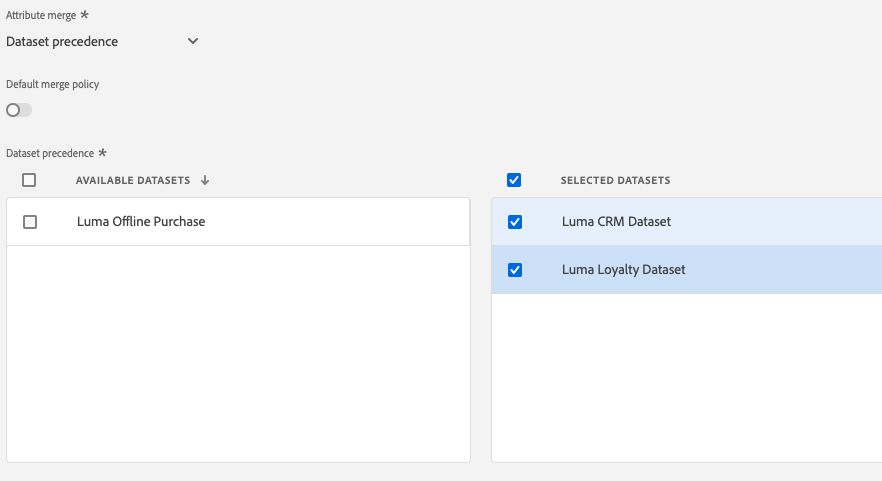

# Create Merge Policies

Adobe Experience Platform enables you to bring data together from multiple sources and combine it in order to see a complete view of each of your individual customers. When bringing this data together, merge policies are the rules that Platform uses to determine how data will be prioritized and what data will be combined to create that unified view.

In this lesson you will learn how to create Merge Policies.

<!--Should this be part of Profile lesson-->

<!-->[!VIDEO]()-->

## Permissions required

In the [Configure Permissions](configure-permissions.md) lesson, you setup all the access controls you need to complete this lesson, specifically:


* Permission item Profiles > Manage Profiles
* Permission item Sandboxes > `Luma Tutorial`
* User-role access to the `Luma Tutorial Platform` product profile
* Developer-role access to the `Luma Tutorial Platform` product profile (for API)


## Merge Policy using UI

1. Go to **Profiles** under **Customer** section
1. Select Merge Policies Tab
1. Click **Create Merge Policy** button on top right.
1. Enter Policy Name **Luma Dataset Precedence Merge Policy**
1. Select Schema as **XDM Profile**
1. Select Id Stitching as **Private Graph**
1. Select Attribute Merge as **Dataset precedence**
1.  .Drag and drop Luma Loyalty Dataset and Luma CRM Dataset to Selected Dataset panel.
1. Change Order of Luma CRM Dataset by drag and dropping to top in the list of selected dataset.



1. Save changes.

## Merge Policy using API

1. Open [!DNL Postman], Authenticate if you are not authenticated already.
1. In Platform collection , Go to Profile and select **Create Merge Policy**
1. Verify URL

   `https://platform.adobe.io/data/core/ups/config/mergePolicies`

1. Verify Body

   ```
      {
    "name": "Timestamp Merge Policy",
    "identityGraph" : {
        "type": "none"
    },
    "attributeMerge" : {
        "type":"timestampOrdered"
    },
    "schema": {
        "name":"_xdm.context.profile"
    },
    "default": true
    }
   ```


## Handling Opt-Out Requests

```
NOTE TO SME : We need to discuss and create exercise for this topic  
```

## Additional Resources

* [Merge Policies documentation](https://docs.adobe.com/help/en/experience-platform/profile/ui/merge-policies.html)
* [Merge Policies API (part of Real-time Customer Profile API) reference](https://www.adobe.io/apis/experienceplatform/home/api-reference.html#/Merge_policies)