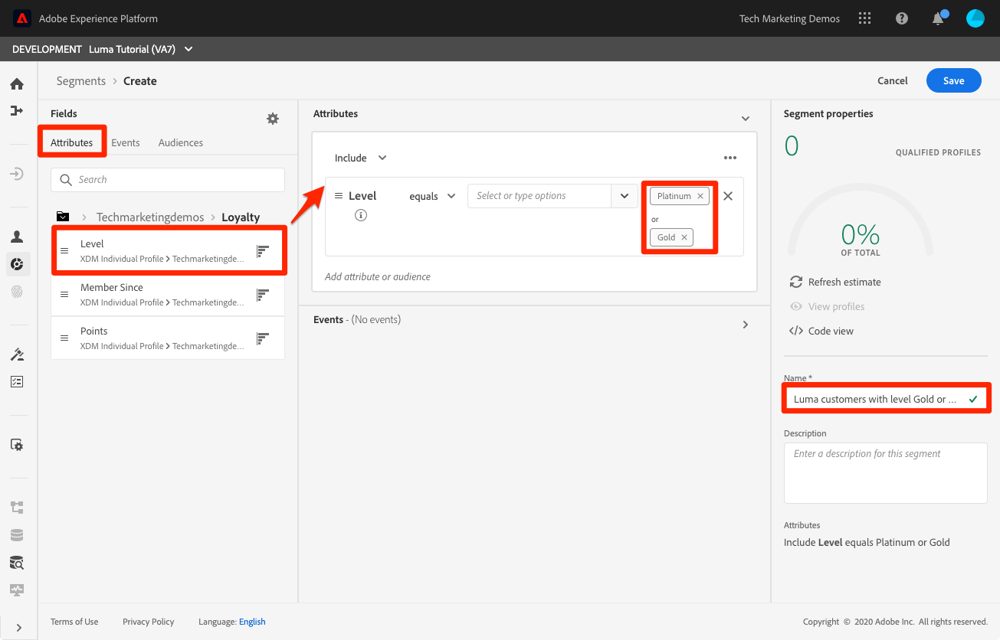
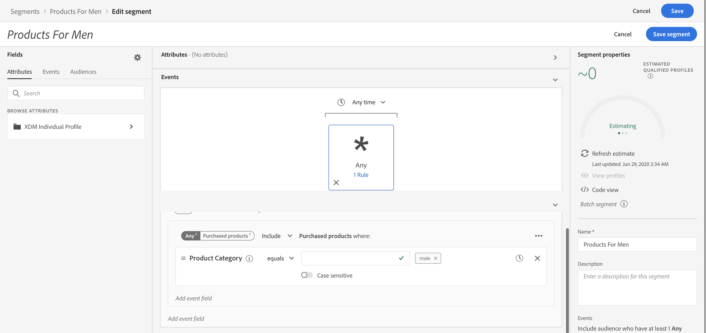

# Create segments

Once you have Real-time Customer Profiles, you can create segments and audiences to create groups of individuals who share similar traits and might respond similarly to marketing strategies.

While the terms segment and audience are often used interchangeable, in Experience Platform we sometimes make a subtle distinction between:

* **Segment definition**: The rule set used to describe key characteristics or behavior of a target audience. Once conceptualized, the rules outlined in a segment definition are used to determine qualifying audience members for a segment.
* **Audience**: The resulting set of profiles that meet the criteria of a segment definition.

**Data Architects** will need to create segments outside of this tutorial.

First, watch this short video to learn more about creating segments:
>[!VIDEO](https://video.tv.adobe.com/v/27254?quality=12&learn=on)

## Permissions required

In the [Configure Permissions](configure-permissions.md) lesson, you setup all the access controls you need to complete this lesson, specifically:

* Permission item Profiles > Manage Profiles
* Permission item Profiles > View Profiles
* Permission item Profiles > Export Audience Segment
* Permission item Sandboxes > `Luma Tutorial`
* User-role access to the `Luma Tutorial Platform` product profile
* Developer-role access to the `Luma Tutorial Platform` product profile (for API)

## Create a basic segment

1. Go to **Segments** under **customer** section in platform
1. In Attributes tab, Enter **loyalty** in search box
1. You should see **Loyalty** folder , click on the folder and you should see properties available in the loyalty folder
1. Drag and drop , **level** from attribute fields to canvas 
1. Select Level equals 'Gold' or 'Platinum'
1. Provide name of segment ' Luma : Gold or Above'
1. Provide description of segment ' Luma customers with level Gold or Above'
1. Click save to save this segment
   
1.  In a few minutes , you should see an estimate of existing customers show up.

## Create a dynamic segment

In this we will create a segment where customer has bought same product twice with in 30 days.

1. Create Segment 
1. Drag and Drop **Product Name**
1. Set **Product Name** as exists
1. Drag and Drop another  **Product Name** to right of existing field
1. We need to set it's value to same as product selected in the top. For this we will need to go to events to browse variables in left.
1. Select Product Name 1 > Product name 
1. Drag product name to set value in blue box 'operands'

## Create a multi-entity segment

With the advanced multi-entity segmentation feature, you can create segments using multiple XDM classes thereby adding extensions to person schemas. As a result, Segmentation Service can access additional fields during segment definition as if they were native to the profile data store

This segment is created by leveraging relationship between multiple XDM Schema - Product Catalog Schema and Offline Purchase Schema.


1. Go to **Segments** under customer.
1. Click on **Create Segment** in top right corner.
1. Provide Name **Products For Men**
1. Search for **Product category** under **Events**.
1. Drag and drop **Product Category** to center of page.
1. Enter **Men** in textbox after **Product Category** equals.
1. Save.



## Create a streaming segment

## Create and evaluate segments using API

In this lesson, we will create a new segment of all Luma customer whose loyalty level is Bronze.


1. Open [!DNL Postman]
1. In platform, Go to folder **6-Segmentation**
1. Select request **Create Segment**
1. Verify URL and body

### URL

```
https://platform-va7.adobe.io/data/core/ups/segment/definitions
```

### BODY 

```
{
    "name" : "Luma Bronze Customer",
    "description": "Segment dataset into all bronze customers",
    "expression" : {"type":"PQL", "format":"pql/text", "value":"_wwfovlab011.loyalty.level=\"bronze\""},
    "schema" : {"name": "_xdm.context.profile", "id": "luma_bronze_customers"} ,
    "ttlInDays" : 90
}

```

1. Send Request
1. If successful, you should get **Status : 200 OK**
1. Go to AEP UI , and verify you have new segment named **Luma Bronze Customer**


```
 NOTE TO SME : All the API body or URL referes to _wwfovlab011 tenant , it may change for learners so please educate them about this in video.
```

## Additional Resources

* [Segmentation Service documentation](https://docs.adobe.com/content/help/en/experience-platform/segmentation/home.html)
* [Segmentation Service API reference](https://www.adobe.io/apis/experienceplatform/home/api-reference.html#!acpdr/swagger-specs/segmentation.yaml)
