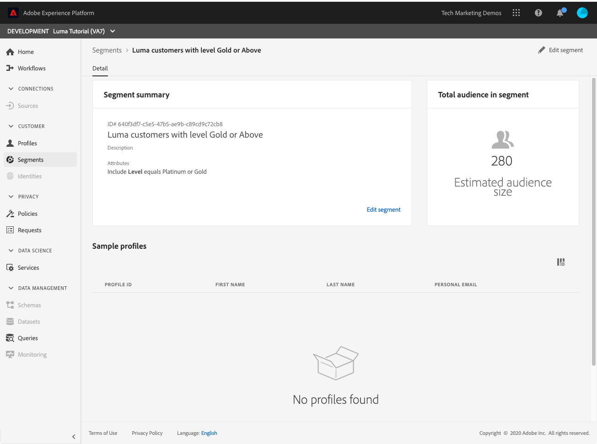

# Create segments

In this lesson, we will build some segments based on the profile data we have ingested in the previous lessons.

Once you have Real-time Customer Profiles, you can create segments and audiences to create groups of individuals who share similar traits and might respond similarly to marketing strategies. The building blocks of these segments are the XDM fields which you created earlier, enabled for profile, and ingested data.

**Data Architects** will need to create segments outside of this tutorial.

Before you begin the exercises, watch this short video to learn more about creating segments:
>[!VIDEO](https://video.tv.adobe.com/v/27254?quality=12&learn=on)

## Permissions required

In the [Configure Permissions](configure-permissions.md) lesson, you set up all the access controls you need to complete this lesson, specifically:

* Permission items **[!UICONTROL Profiles]** > **[!UICONTROL View Profiles]** and **[!UICONTROL Manage Profiles]** and **[!UICONTROL Export Audience Segment]**
* Permission item **[!UICONTROL Sandboxes]** > `Luma Tutorial`
* User-role access to the `Luma Tutorial Platform` product profile
* Developer-role access to the `Luma Tutorial Platform` product profile (for API)

## Create a basic segment

Let's create a simple segment for loyalty program customers with a Gold or Platinum Status

1. In the Platform UI, click **[!UICONTROL Segments]** in the left navigation
1. Click the **[!UICONTROL Create segment]** button 
1. On the left of the schema builder are three tabs for Attributes (Record data), Events (Time-series data), and Audiences
1. If you click the gear icon, you will note that the segment builder defaults to only showing you fields with data and that you can also choose different merge policies for your segments
1. In Attributes tab, navigate to the **XDM Individual Profile > [YOUR TENANT ID] > Loyalty** folder (you could also search for "loyalty")
1. Drag and drop , `Level` from the attribute fields menu to the segment builder canvas 
1. Select `Level` equals `Gold` or `Platinum`
1. Provide name of segment ' Luma : Gold or Above'
1. As the **[!UICONTROL Name]**, enter `Luma customers with level Gold or Above`
1. Click the **[!UICONTROL Save]**
   
1. In a few minutes, you should see an estimate of existing customers qualifying for this segment
   

<!--## Create a sequential segment-->

## Create a dynamic segment

In this we will create a segment where customer has bought same product twice with in 30 days. Dynamic segments allow you to scale your segmentation by using the fields as variables which can be compared against each other.

1. Click **[!UICONTROL Segments]** in the left navigation
1. Click the **[!UICONTROL Create segment]** button 
1. Click on the **[!UICONTROL Events]** tab
1. Filter the list to `purchases`
1. Drag the **[!UICONTROL Purchases]** event type onto the canvas _twice_
1. Click the clock icon in between the the events and choose "within 30 days"
1. Confirm that your segment definition at this point reads **"Include audience who have at least 1 Purchases event then within 30 days have at least 1 Purchases event"**
   
1. Now change the event filter to `sku`
1. Drag the SKU field to the second purchase event
   
1. Now clear the event filter
1. You should see in the **[!UICONTROL Browse Variables]** section, there are folders for the two purchase events. Click to explore **[!UICONTROL Purchases 1]**   
   
1. Drill down into the **[!UICONTROL Product list items]** folder, select the **[!UICONTROL SKU]** field and drag it to the right of the **[!UICONTROL equals]** operand. When you are hovering over the area, drop it in the  "Add to compare operands" section
1. Name your segment `Bought same product within 30 days`
1. Confirm your audience definition is **"Include audience who have at least 1 Purchases event then within 30 days have at least 1 Purchases event where ((SKU equals Purchases1 SKU))"**
1. Click the **[!UICONTROL Save]** button

   

## Create a sequential segment

## Create a multi-entity segment

Remember how we created the relationship between the `Luma Offline Purchase Events Schema` and the `Luma Product Catalog Schema` in earlier lessons? We did that so we could leverage the relationship in our schema using multi-entity segmentation.

With the advanced multi-entity segmentation feature, you can create segments using multiple XDM classes thereby adding extensions to schemas. As a result, Segmentation Service can access additional fields during segment definition as if they were native to the profile data store

This segment is created by leveraging relationship between multiple XDM Schema - Product Catalog Schema and Offline Purchase Schema.

1. Click **[!UICONTROL Segments]** in the left navigation
1. Click the **[!UICONTROL Create segment]** button 
1. Click on the **[!UICONTROL Events]** tab
1. Filter the list to `purchases`
1. Drag the **[!UICONTROL Purchases]** event type onto the canvas
1. Click the clock icon in between the the events and choose "in last 30 days"
1. Filter the list to `category` and then drag the **[!UICONTROL Product Category]** field onto **[!UICONTROL Purchases]**
1. Change the operator to **[!UICONTROL starts with]** and enter `men` into the text box
1. As the **[!UICONTROL Name]**, enter `Purchased a Men's product in the last 30 days`
1. Confirm the audience definition `(Include audience who have at least 1 Purchases event where ((Product Category starts with men)) ) and occurs in last 30 day(s)`
1. Click the **[!UICONTROL Save]** button

   

## Batch and Streaming segmentation

Let's take a moment to review our three segments:

* Note that two of our segments are batch segments and one is streaming. 
* Platform will default to streaming segmentation, when possible, which will qualify the customer for a segment immediately when they meet the criteria. When the segment definitions get too complex&mdash;in this case because the look-back window was greater than seven days&mdash;it will save as a batch segment. For a complete list of streaming limitations, see [the documentation](https://docs.adobe.com/content/help/en/experience-platform/segmentation/ui/streaming-segmentation.html).
* The batch jobs run on a daily schedule, which can be toggled off.
  

## Additional Resources

* [Segmentation Service documentation](https://docs.adobe.com/content/help/en/experience-platform/segmentation/home.html)
* [Segmentation Service API reference](https://www.adobe.io/apis/experienceplatform/home/api-reference.html#!acpdr/swagger-specs/segmentation.yaml)

That's it, you finished the tutorial!