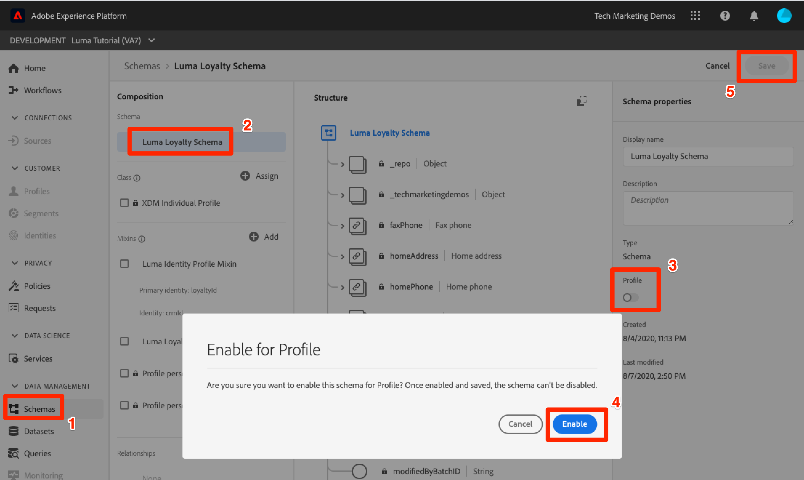
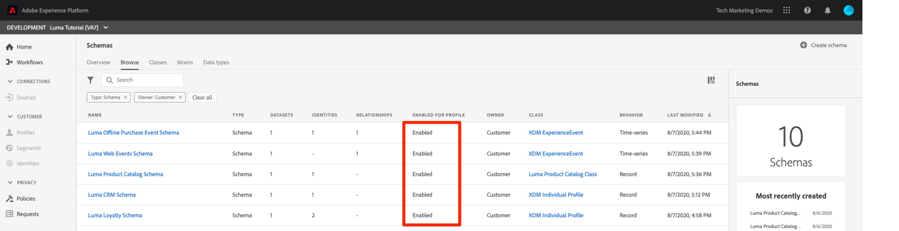
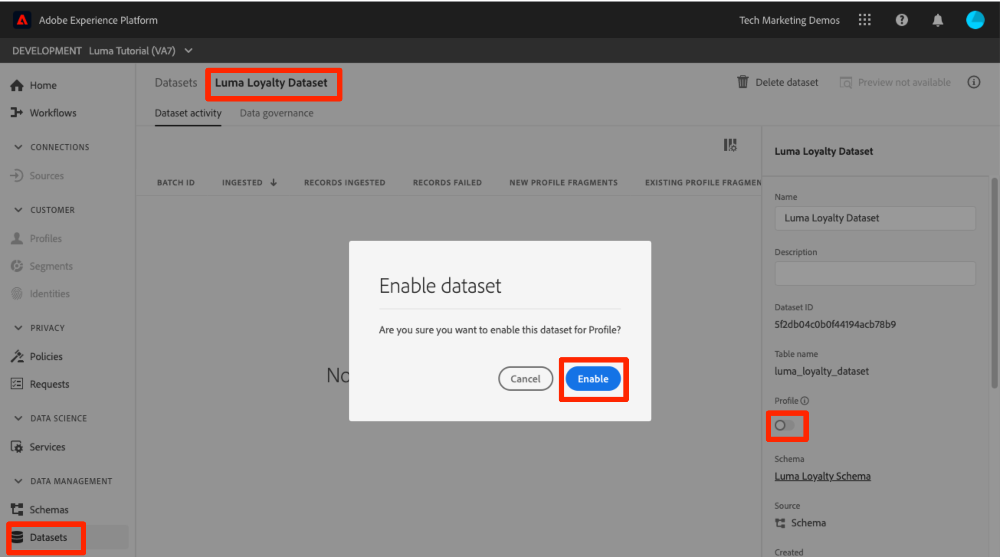
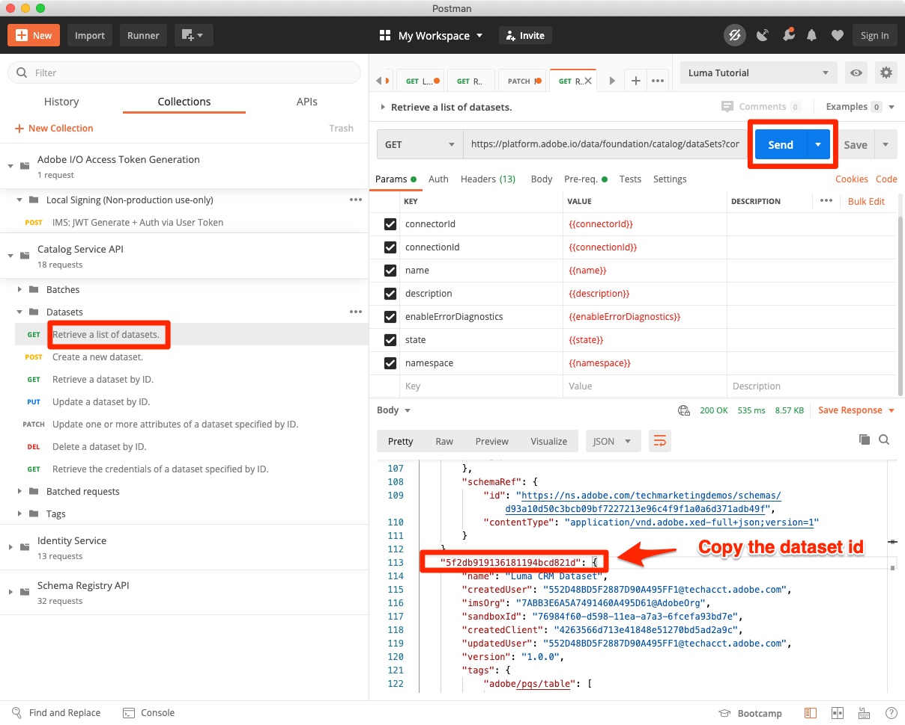
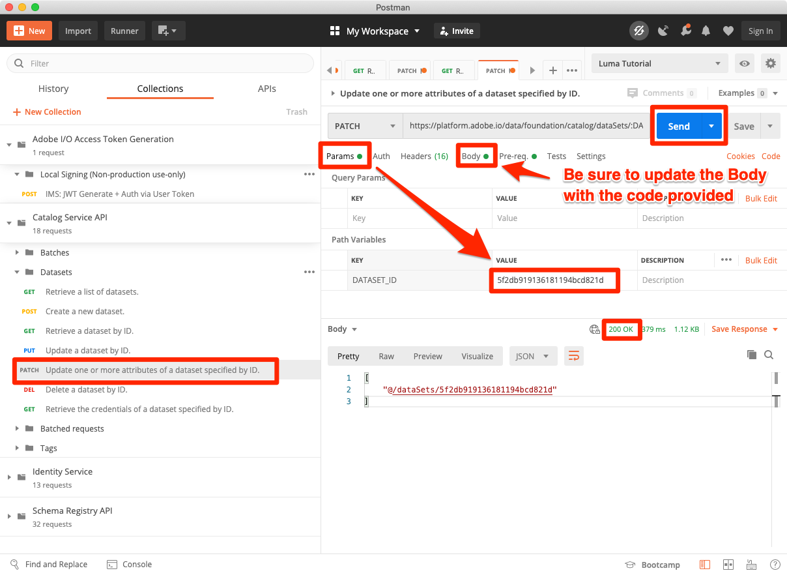
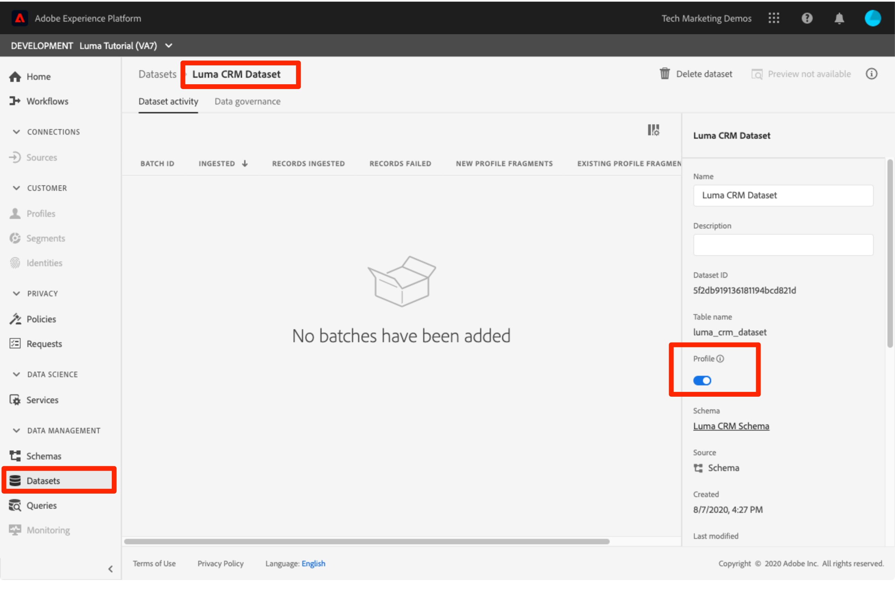

# Enable Real-time Customer Profiles


In this lesson, you will enable your schemas and datasets for Real-time Customer Profile. 

Okay, I lied when I said the Datasets lesson was the quickest. This one should be even faster! Literally all you are going to do is flip a bunch of toggles. But what happens when you flip these toggles is really, really important so I wanted to dedicate a whole page to it.

With Real-time Customer Profile, you can see a holistic view of each individual customer that combines data from multiple channels, including online, offline, CRM, and third party data. Profile allows you to consolidate your disparate customer data into a unified view offering an actionable, timestamped account of every customer interaction. 

As amazing as all that sounds, you don't need to activate *all of your data* for profile. You should  only enable the data you need for activation use cases. Data that you want to use for marketing use cases, call center integrations, etc where you need fast access to a robust customer profile should be enabled. If you are just uploading data for analysis, it might not need to be enabled for profile.
<!--is this accurate. Are there other considerations to point out? -->

**Data Architects** will need to enable Real-time Customer Profile outside of this tutorial.

First, watch this short video to learn more about Real-time Customer Profile:
>[!VIDEO](https://video.tv.adobe.com/v/27251?quality=12&learn=on)

## Permissions required

In the [Configure Permissions](configure-permissions.md) lesson, you setup all the access controls you need to complete this lesson, specifically:


* Permission item **[!UICONTROL Data Modeling]** > **[!UICONTROL View Schemas]**
* Permission item **[!UICONTROL Data Modeling]** > **[!UICONTROL Manage Schemas]**
* Permission item **[!UICONTROL Data Management]** > **[!UICONTROL View Datasets]**
* Permission item **[!UICONTROL Data Management]** > **[!UICONTROL Manage Datasets]**
* Permission item Sandboxes > `Luma Tutorial`
* User-role access to the `Luma Tutorial Platform` product profile
* Developer-role access to the `Luma Tutorial Platform` product profile (for API)


## Enable schemas for Real-time Customer Profile using Platform UI 

Let's start with the simple task of enabling a schema:

1. In the Platform UI, open the **Luma Loyalty Schema**
1. In **[!UICONTROL Schema Properties]**, toggle the **Profile** switch
1. In the confirmation modal, press the Enable button to confirm
    >[!IMPORTANT]
    >
    >Once a schema is enabled for Profile, it cannot be disabled or deleted. Also, fields cannot be removed from the schema after this point. These implications are important to keep in mind later on when you are working with your own data in your own Production environment. You should be using a development sandbox in this tutorial and of course the entire sandbox can be deleted at any time.
1. Click the **[!UICONTROL Save]** button to save your changes.

    

Easy right? Repeat the steps above for these other schema:

1. Luma Offline Purchase Event Schema
1. Luma Web Events Schema (on the confirmation modal, check the box "Data for this schema will contain a primary identity in the identityMap field.")
1. Luma Product Catalog Schema

## Enable schemas for Real-time Customer Profile using Platform API 

Now, it's time to enable the `Luma CRM Schema` with the API. If you want to skip this exercise and just enable it in the UI, go right ahead/

### Get the meta:altId of the schema

First we need to get the `meta:altId` of the `Luma CRM Schema`:

1. Open [!DNL Postman]
1. If you haven't made a call in the last 24 hours, your authorization tokens have probably expired. Open the call **[!DNL Adobe I/O Access Token Generation > Local Signing (Non-production use-only) > IMS: JWT Generate + Auth via User Token]** and click **Send** to request new JWT and Access Tokens, just like you did in the [!DNL Postman] lesson.
1. Open the call **[!DNL Schema Registry API > Schemas > List all schemas within the specified container.]**
1. Update the Accept Header to one of the allowed values, e.g. `application/vnd.adobe.xdm+json`
1. Click the **Send** button
1. You should get a 200 response
1. Look in the response for the `Luma CRM Schema` item and copy the `meta:altId` value
  

### Enable the schema

Now that we have the meta:altId of the schema, we can enable it for profile:

1. Open the call **[!DNL Schema Registry API > Schemas > Modify or update part of a tenant-defined schema.]**
1. In the **Params** paste your `meta:altId` value as the `$id` value
1. In the **Body** tab, paste the following code

    ```json
    [
        { "op": "add", "path": "/meta:immutableTags", "value": ["union"]}
    ]
    ```

1. Click the **Send** button
1. You should get a 200 response

You should be able to see in the UI that all five schemas are enabled for Profile:
  


## Enable datasets for Real-time Customer Profile using Platform UI 

1. In the Platform UI, open the **Luma Loyalty Dataset**
1. Toggle the **Profile** switch
1. In the confirmation modal, press the Enable button to confirm

    

Repeat the steps above for these other datasets:

1. Luma Offline Purchase Event Dataset
1. Luma Web Events Dataset
1. Luma Product Catalog Dataset

## Enable datasets for Real-time Customer Profile using Platform API 

### Get the id of the dataset

First we need to get the `id` of the `Luma CRM Dataset`:

1. Open [!DNL Postman]
1. If you haven't made a call in the last 24 hours, your authorization tokens have probably expired. Open the call **[!DNL Adobe I/O Access Token Generation > Local Signing (Non-production use-only) > IMS: JWT Generate + Auth via User Token]** and click **Send** to request new JWT and Access Tokens, just like you did in the [!DNL Postman] lesson.
1. Open the call **[!DNL Catalog Service API > Datasets > Retrieve a list of datasets.]**
1. Click the **Send** button
1. You should get a 200 response
1. Look in the response for the `Luma CRM Dataset` item and copy the id:
  

### Enable the dataset

Now that we have the id of the dataset, we can enable it for profile:

1. Open the call **[!DNL Catalog Service API > Datasets > Modify or update part of a tenant-defined schema.]**
1. In the **Params** update the `DATASET_ID` value to your own
1. In the **Body** tab, paste the following code. Note that the first two values are pre-existing tags that are visible in the previous response. They need to be included in the body, in addition to the two new tags which we are adding:

    ```json
    {
        "tags":{
            "adobe/pqs/table":["luma_crm_dataset"],
            "adobe/siphon/table/format":["parquet"],
            "unifiedProfile":["enabled:true"],
            "unifiedIdentity":["enabled:true"]
            }
    }
    ```

1. Click the **Send** button
1. You should get a 200 response

     

You can also confirm that the UI shows the dataset enabled:
 


## Additional Resources

* [Real-time Customer Profile documentation](https://docs.adobe.com/content/help/en/experience-platform/profile/home.html)
* [Real-time Customer Profile API reference](https://www.adobe.io/apis/experienceplatform/home/api-reference.html#!acpdr/swagger-specs/real-time-customer-profile.yaml)