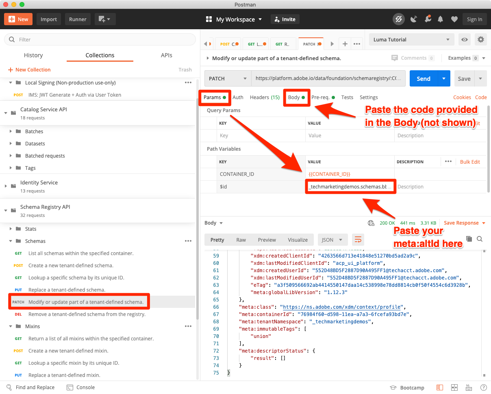

# Enable Real-time Customer Profiles

<!-- 15min--> 
In this lesson, you will enable your schemas and datasets for Real-time Customer Profile. 

Okay, I lied when I said that the datasets lesson was the shortest lesson in this tutorial&mdash;this one should take even less time! Literally all you are going to do is flip a bunch of toggles. But what happens when you flip these toggles is _really_ important so I wanted to dedicate a whole page to it.

With Real-time Customer Profile, you can see a holistic view of each individual customer that combines data from multiple channels, including online, offline, CRM, and third-party data. Profile allows you to consolidate your disparate customer data into a unified view offering an actionable, timestamped account of every customer interaction. 

As amazing as all that sounds, you don't need to activate *all of your data* for profile. In fact, you should only enable the data you need for activation use cases. Enable data that you want to use for marketing use cases, call center integrations, and so on, where you need fast access to a robust customer profile. If you are  uploading data only for analysis, it probably shouldn't be enabled for profile.

There are important [guardrails for Real-time Customer Profile data](https://experienceleague.adobe.com/docs/experience-platform/profile/guardrails.html?lang=en) which you should review when deciding which of your own data you should enable for profile. 

<!--is this accurate. Are there other considerations to point out? -->

**Data Architects** will need to enable Real-time Customer Profile outside of this tutorial.

Before you begin the exercises, watch this short video to learn more about Real-time Customer Profile:
>[!VIDEO](https://video.tv.adobe.com/v/27251?quality=12&learn=on)

## Permissions required

In the [Configure Permissions](configure-permissions.md) lesson, you set up all the access controls required to complete this lesson.


<!--* Permission items **[!UICONTROL Data Modeling]** > **[!UICONTROL View Schemas]** and **[!UICONTROL Manage Schemas]**
* Permission items **[!UICONTROL Data Management]** > **[!UICONTROL View Datasets]** and **[!UICONTROL Manage Datasets]**
* Permission item **[!UICONTROL Sandboxes]** > `Luma Tutorial`
* User-role access to the `Luma Tutorial Platform` product profile
* Developer-role access to the `Luma Tutorial Platform` product profile (for API)
-->

## Enable schemas for Real-time Customer Profile using Platform UI 

Let's start with the simple task of enabling a schema:

1. In the Platform user interface, open the **Luma Loyalty Schema**
1. In **[!UICONTROL Schema Properties]**, toggle the **Profile** switch
1. In the confirmation modal, press the **[!UICONTROL Enable]** button to confirm
1. Select the **[!UICONTROL Save]** button to save your changes

    >[!IMPORTANT]
    >
    >Once a schema is enabled for Profile, it cannot be disabled or deleted. Also, fields cannot be removed from the schema after this point. These implications are important to keep in mind later on when you are working with your own data in your Production environment. You should be using a development sandbox in this tutorial, which can be deleted at any time. 
    >
    >In the controlled environment of this tutorial, you will enable your schemas and datasets for profile, _before ingesting any data_. When working with your own data, we recommend you do things in the following order:
    >
    > 1. First, ingest some data into your datasets.
    > 1. Address any issues that arise during the data ingestion process (for example, data validation or mapping issues).
    > 1. Enable your datasets and schemas for Profile
    > 1. Reingest the data


    

Easy right? Repeat the steps above for these other schema:

1. Luma Product Catalog Schema
1. Luma Offline Purchase Events Schema
1. Luma Web Events Schema (on the confirmation modal, check the box "Data for this schema will contain a primary identity in the identityMap field.")

## Enable schemas for Real-time Customer Profile using Platform API 

Now, it's time to enable the `Luma CRM Schema` with the API. If you want to skip this exercise and just enable it in the UI, go right ahead.

### Get the meta:altId of the schema

First let's get the `meta:altId` of the `Luma CRM Schema`:

1. Open [!DNL Postman]
1. If you haven't made a request in the last 24 hours, your authorization tokens have probably expired. Open the request **[!DNL Adobe I/O Access Token Generation > Local Signing (Non-production use-only) > IMS: JWT Generate + Auth via User Token]** and select **Send** to request new JWT and Access Tokens, just like you did in the [!DNL Postman] lesson.
1. Open the request **[!DNL Schema Registry API > Schemas > Retrieve a list of schemas within the specified container.]**
1. Select the **Send** button
1. You should get a 200 response
1. Look in the response for the `Luma CRM Schema` item and copy the `meta:altId` value
  

### Enable the schema

Now that we have the meta:altId of the schema, we can enable it for profile:

1. Open the request **[!DNL Schema Registry API > Schemas > Update one or more attributes of a custom schema specified by ID.]**
1. In the **Params** paste your `meta:altId` value as the `SCHEMA_ID` param value
1. In the **Body** tab, paste the following code

    ```json
    [{
        "op": "add",
        "path": "/meta:immutableTags",
        "value": ["union"]
    }]
    ```

1. Select the **Send** button
1. You should get a 200 response

     

You should be able to see in the UI that all five schemas are enabled for Profile (you might need to SHIFT-Reload to see that `Luma CRM Schema` is enabled):
  


## Enable datasets for Real-time Customer Profile using Platform UI 

The datasets must be enabled for Profile, too, and the process is even simpler:

1. In the Platform user interface, open the `Luma Loyalty Dataset`
1. Toggle the **[!UICONTROL Profile]** switch
1. In the confirmation modal, press the **[!UICONTROL Enable]** button to confirm

    

Repeat the steps above for these other datasets:

1. Luma Product Catalog Dataset
1. Luma Offline Purchase Events Dataset
1. Luma Web Events Dataset

>[!NOTE]
>
>Unlike schemas, you can disable datasets from Profile, however all previously ingested data will remain in Profile.

## Enable datasets for Real-time Customer Profile using Platform API 

Now you will enable a dataset for Profile using the API. Again, if you want to enable it via the UI using the method above, that's fine, too.

### Get the id of the dataset

First we need to get the `id` of the `Luma CRM Dataset`:

1. Open [!DNL Postman]
1. If you haven't made a request in the last 24 hours, your authorization tokens have probably expired. Open the request **[!DNL Adobe I/O Access Token Generation > Local Signing (Non-production use-only) > IMS: JWT Generate + Auth via User Token]** and select **Send** to request new JWT and Access Tokens, just like you did in the [!DNL Postman] lesson.
1. Open the request **[!DNL Catalog Service API > Datasets > Retrieve a list of datasets.]**
1. Select the **Send** button
1. You should get a 200 response
1. Look in the response for the `Luma CRM Dataset` item and copy the id:
  

### Enable the dataset

Now that we have the id of the dataset, we can enable it for profile:

1. Open the request **[!DNL Catalog Service API > Datasets > Update one or more attributes of a dataset specified by ID.]**
1. In the **Params** update the `DATASET_ID` value to your own
1. In the **Body** tab, paste the following code. Note that the first two values are pre-existing tags that are visible in the previous response. They need to be included in the body, in addition to the two new tags which we are adding:

    ```json
    {
        "tags":{
            "adobe/pqs/table":["luma_crm_dataset"],
            "adobe/siphon/table/format":["parquet"],
            "unifiedProfile":["enabled:true"],
            "unifiedIdentity":["enabled:true"]
            }
    }
    ```

1. Select the **Send** button
1. You should get a 200 response

     

You can also confirm that the UI shows the dataset enabled:
 

>[!IMPORTANT]
>
> If you ingest data before enabling the schema and dataset for profile, you will need to re-ingest that data again afterwards.

## Additional Resources

* [Real-time Customer Profile documentation](https://experienceleague.adobe.com/docs/experience-platform/profile/home.html)
* [Real-time Customer Profile API reference](https://www.adobe.io/apis/experienceplatform/home/api-reference.html#!acpdr/swagger-specs/real-time-customer-profile.yaml)


**Data Engineers** should continue to the [Subscribe to data ingestion events](subscribe-to-data-ingestion-events.md) lesson.
**Data Architects** _can skip ahead_ and go to the [batch ingestion lesson](ingest-batch-data.md).
