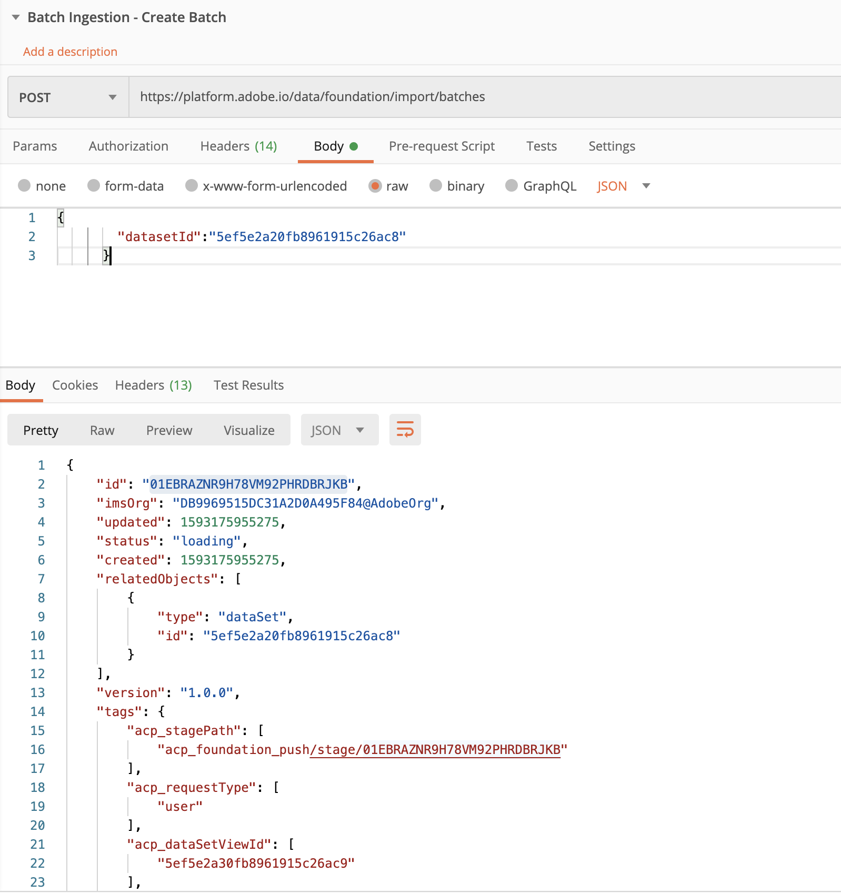

# Ingest Batch Data

Batch data ingestion allows you to ingest a large amount of data into Adobe Experience Platform at once. You can ingest batch data in a one time upload directly with the Platform interface or API, or you can configure regularly scheduled batch uploads from third-party services such as cloud storage services using Source connectors.

First, watch this short video to learn more about data ingestion:
>[!VIDEO](https://video.tv.adobe.com/v/27106?quality=12&learn=on)

## Permissions required

In the [Configure Permissions](configure-permissions.md) lesson, you setup all the access controls you need to complete this lesson, specifically:

* Permission item Datasets > View Datasets
* Permission item Datasets > Data Monitoring
* Permission item Sandboxes > `Luma Tutorial`
* User-role access to the `Luma Tutorial Platform` product profile
* Developer-role access to the `Luma Tutorial Platform` product profile (for API)

## Ingest data in batches by using Platform UI

1. Download [`luma-loyalty.json`](assets/luma-loyalty.json) file to **AEP Training Assets** folder.
1. Go to Datasets, Select **Luma Loyalty Members Dataset**
1. In Dataset properties, scroll down to add data section.
1. Upload `luma-loyalty.json` file.
1. After a few minutes of processing you should see **success** status as below screenshot.

    

### Validate data ingested in Platform

1. In the same page where you have uploaded the data , you should see a **Preview** button on top-right
1. Click **Preview** button and you should be able to see all the uploaded data in dataset.


    


1. Download [`luma-offline.json`](assets/luma-offline.json)
1. Repeat the step 1-7 for **Luma Offline Purchase Event Dataset** as well. 


```
Note to SME : 
You may ingest this data for Luma Offline Purchase Event Dataset in other possible ways as well using source connector or AWS S3 as well. 
```

## Ingest data in batches by using API

1. In platform collection, Go to folder **4-Dataset**
1. Select Request , **List Dataset**, 
1. From Response, copy node name of **LUMA CRM Dataset**
1. Select Request , **Batch Ingestion - Create Batch**
 Verify **URL**

    ```
    https://platform.adobe.io/data/foundation/import/batches
    ```
 
    **Body** : Replace datasetId with value copied in step 3.

    ```
    {
            "datasetId":"5ec687cc51c1c618a80d65b6"
        }
    ```

    

1. This will return a response with **$id** , this is batch id we need to upload file.

1. Select Request , **Batch Ingestion - Upload File**
1. Verify **URL** and replace BATCH_ID from copied response in last request and replace dataset Id used in body in last request.

    ```
    https://platform.adobe.io/data/foundation/import/batches/BATCH_ID/datasets/DATASET_ID/files/crm.json
    ```

1. Download [`luma-crm.json`](assets/luma-crm.json)
1. In body of POSTMAN request select **binary** options as we want to send file
1. Browse to downloaded `luma-crm.json` 
1. Click Send and if everything goes well , you should get '1' as response.


## Additional Resources

* [Batch Ingestion documentation](https://docs.adobe.com/content/help/en/experience-platform/ingestion/batch/overview.html)
* [Data Ingestion API reference](https://www.adobe.io/apis/experienceplatform/home/api-reference.html#!acpdr/swagger-specs/ingest-api.yaml)