# Ingest batch data

<!-- 1hr-->
In this lesson, you will ingest batch data into Experience Platform using various methods.

Batch data ingestion allows you to ingest a large amount of data into Adobe Experience Platform at once. You can ingest batch data in a one time upload within Platform's interface or using the API. You can also configure regularly scheduled batch uploads from third-party services such as cloud storage services using Source connectors.

**Data Engineers** will need to ingest batch data outside of this tutorial.

Before you begin the exercises, watch this short video to learn more about data ingestion:
>[!VIDEO](https://video.tv.adobe.com/v/27106?quality=12&learn=on)


## Permissions required

In the [Configure Permissions](configure-permissions.md) lesson, you set up all the access controls required to complete this lesson.

<!--
* Permission item **[!UICONTROL Data Management]** > **[!UICONTROL View Datasets]**, **[!UICONTROL Manage Datasets]** and **[!UICONTROL Data Monitoring]**
* Permission items **[!UICONTROL Data Ingestion]** > **[!UICONTROL View Sources]** and **[!UICONTROL Manage Sources]**
* Permission item **[!UICONTROL Profile Management]** > **[!UICONTROL View Profiles]**
* Permission item **[!UICONTROL Sandboxes]** > `Luma Tutorial`
* User-role access to the `Luma Tutorial Platform` product profile
* Developer-role access to the `Luma Tutorial Platform` product profile (for API)
-->

You will need access to an (S)FTP server or cloud storage solution for the Sources exercise. There is a workaround if you do not have one.

## Ingest data in batches with Platform user interface

Data can be uploaded directly into a dataset on the datasets screen in JSON and parquet formats.

### Download and prep the data

First, get the sample data and customize it for your tenant:

>[!NOTE]
>
>Data contained in the [luma-data.zip](assets/luma-data.zip) file is fictitious and is to be used for demonstration purposes only.

1. Download [luma-data.zip](assets/luma-data.zip) to your **Luma Tutorial Assets** folder.
1. Unzip the file, creating a folder called `luma-data` which contains the four data files we will use in this lesson
1. Open `luma-loyalty.json` in a text editor and replace all instances of `_techmarketingdemos` with your own underscore-tenant id, as seen in your own schemas:
    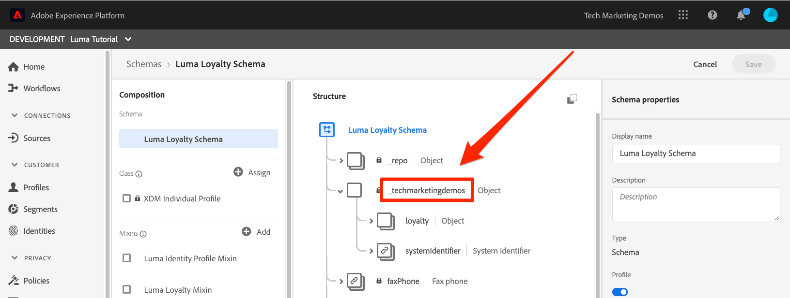
    
1. Save the updated file

### Ingest the data

1. In the Platform user interface, select **[!UICONTROL Datasets]** in the left navigation
1. Select on your `Luma Loyalty Dataset`
1. Scroll down until you see the **[!UICONTROL Add Data]** section in the right column
1. Upload the `luma-loyalty.json` file.
1. Once the file uploads, a row for the batch will appear
1. If you reload the page after a few minutes, you should see that the batch has successfully uploaded with 1000 records and 1000 profile fragments.

    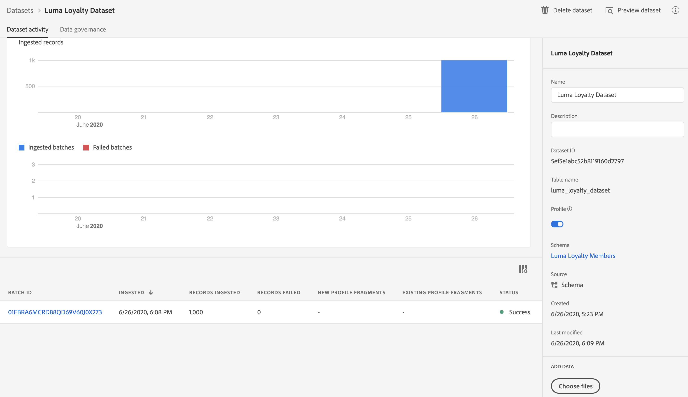
<!--do i need to explain error diagnostics and partial ingestion-->

>[!NOTE]
>
>There are a few options, **[!UICONTROL Error diagnostics]** and **[!UICONTROL Partial ingestion]**, that you will see on various screens in this lesson. These options aren't covered in the tutorial. Some quick info:
>
>* Enabling error diagnostics generates data about the ingestion of your data, which you can then review using the Data Access API. Learn more about it in [the documentation](https://experienceleague.adobe.com/docs/experience-platform/data-access/home.html).
>* Partial ingestion allows you to ingest data containing errors, up to a certain threshold which you can specify. Learn more about it in [the documentation](https://experienceleague.adobe.com/docs/experience-platform/ingestion/batch/partial.html)

### Validate the data

There are a few ways to confirm that the data was successfully ingested.

#### Validate in the Platform user interface

To confirm that the data was ingested into the dataset:

1. On the same page where you have ingested the data, select the **[!UICONTROL Preview dataset]** button on top-right
1. Select the **Preview** button and you should be able to see some of the ingested data.

    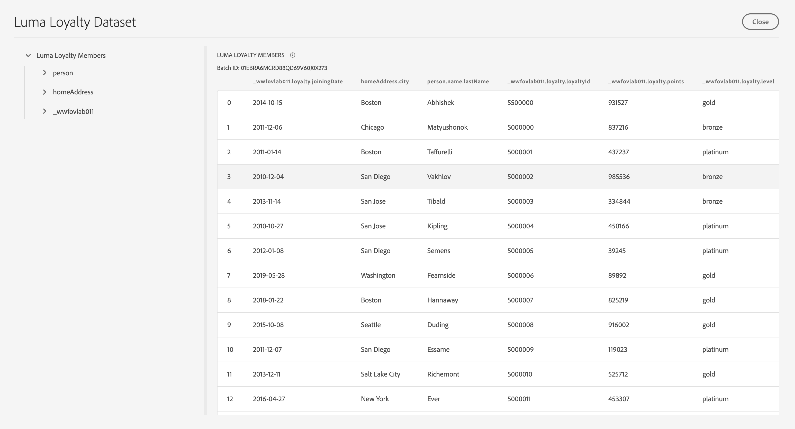


To confirm that the data landed in Profile (may take a few minutes for the data to land):

1. Go to **[!UICONTROL Profiles]** in the left navigation
1. Select the icon next to the **[!UICONTROL Select identity namespace]** field to open the modal
1. Select your `Luma Loyalty Id` namespace
1. Then enter one of the `loyaltyId` values from your dataset,  `5625458`
1. Select **[!UICONTROL View]**
    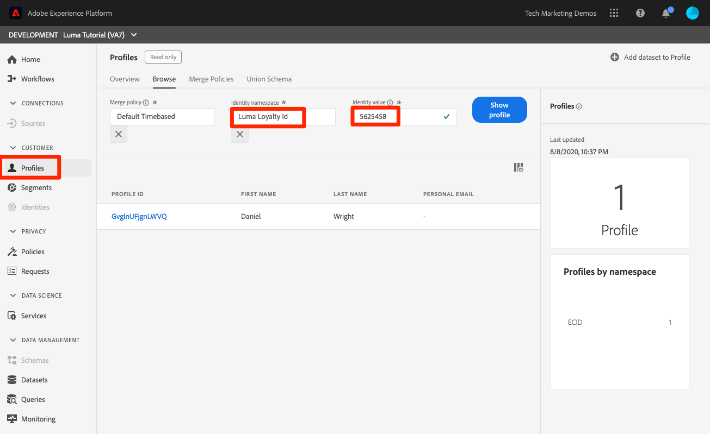

#### Validate with data ingestion events

If you subscribed to data ingestion events in the previous lesson, check your unique webhook.site URL. You should see three requests show up in the following order, with some time in between them, with the following `eventCode` values:

1. `ing_load_success`&mdash;the batch as ingested
1. `ig_load_success`&mdash;the batch was ingested into identity graph
1. `ps_load_success`&mdash;the batch was ingested into profile service

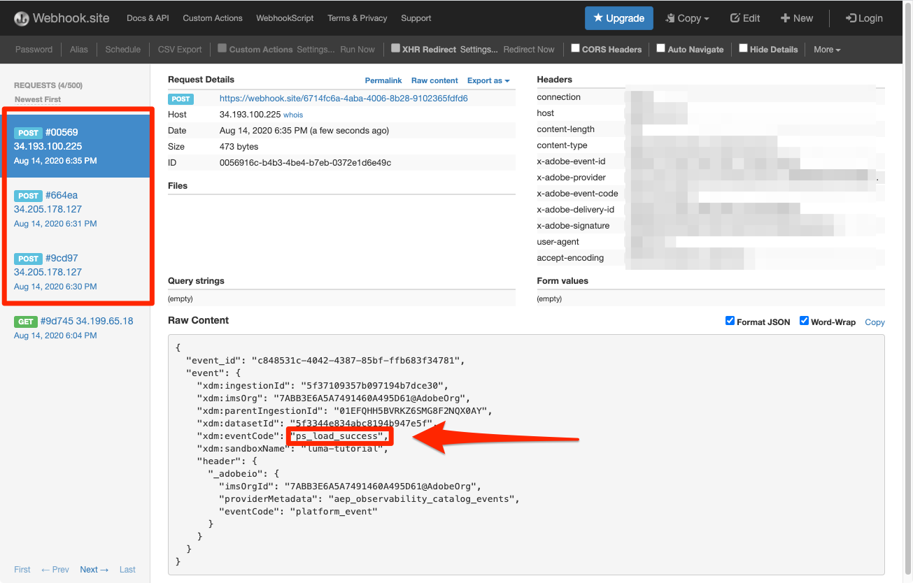

See the [documentation](https://experienceleague.adobe.com/docs/experience-platform/ingestion/quality/subscribe-events.html#available-status-notification-events) for more details on the notifications.

## Ingest data in batches with Platform API

Now let's upload data using the API.  

>[!NOTE]
>
>Data architects, feel free to upload the CRM data via the user interface method.

### Download and prep the data

1. You should have already downloaded and unzipped [luma-data.zip](assets/luma-data.zip) into your `Luma Tutorial Assets` folder.
2. Open `luma-crm.json` in a text editor and replace all instances of `_techmarketingdemos` with your own underscore-tenant id, as seen in your schemas
3. Save the updated file

### Get the dataset id

First we let's get the id of the dataset id of the dataset into which we want to ingest data:

1. Open [!DNL Postman]
1. If you haven't made a request in the last 24 hours, your authorization tokens have probably expired. Open the request **[!DNL Adobe I/O Access Token Generation > Local Signing (Non-production use-only) > IMS: JWT Generate + Auth via User Token]** and select **Send** to request new JWT and Access Tokens, just like you did in the [!DNL Postman] lesson.
1. Open your environment variables and make sure the value of **CONTAINER_ID** is still `tenant`
1. Open the request **[!DNL Catalog Service API > Datasets > Retrieve a list of datasets.]** and select **Send**
1. You should get a `200 OK` response
1. Copy the id of the `Luma CRM Dataset` from the Response body
  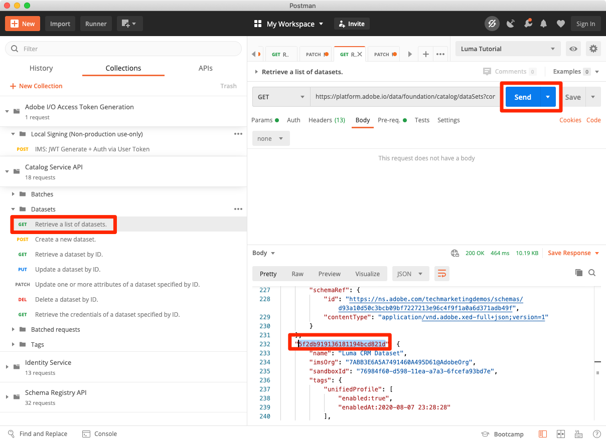 

### Create the batch

Now we can create a batch in the dataset:

1. Download [Data Ingestion API.postman_collection.json](https://raw.githubusercontent.com/adobe/experience-platform-postman-samples/master/apis/experience-platform/Data%20Ingestion%20API.postman_collection.json) to your `Luma Tutorial Assets` folder
1. Import the collection into [!DNL Postman]
1. Select the request **[!DNL Data Ingestion API > Batch Ingestion > Create a new batch in Catalog Service.]**
1. Paste the following as the **Body** of the request, ***replacing the datasetId value with your own***:

    ```json
    {
        "datasetId":"REPLACE_WITH_YOUR_OWN_DATASETID",
        "inputFormat": {
            "format": "json"
        }
    }
    ```

1. Select the **Send** button
1. You should get a 201 Created response containing the id of your new batch!
1. Copy the `id` of the new batch
    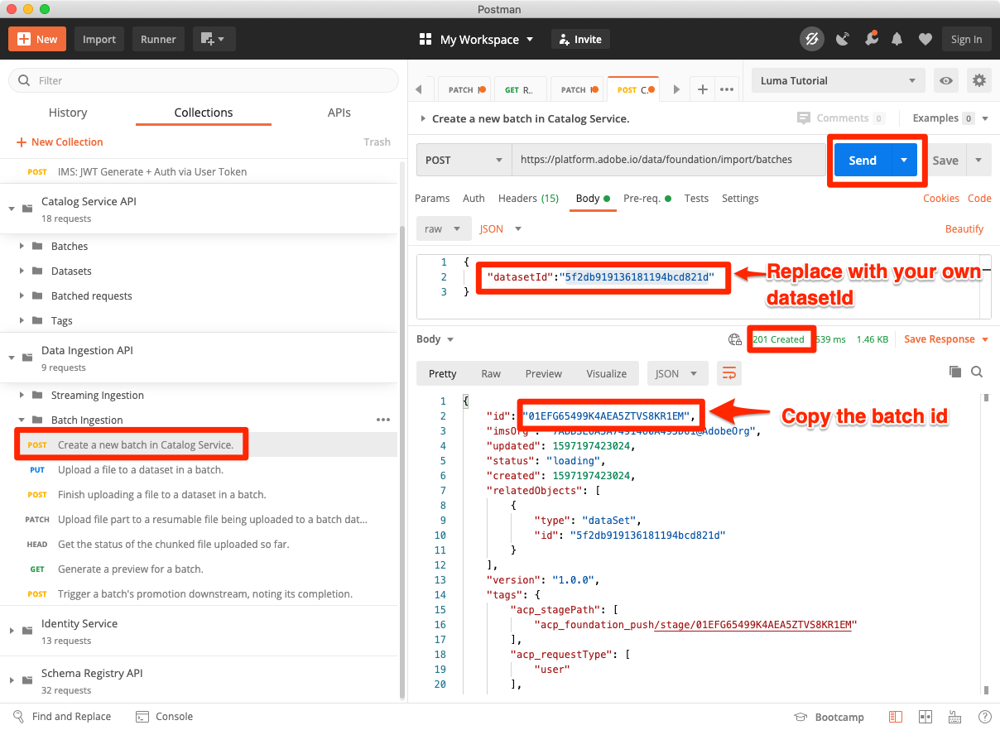
   
### Ingest the data

Now we can upload the data into the batch:
    
1. Select the request **[!DNL Data Ingestion API > Batch Ingestion > Upload a file to a dataset in a batch.]**
1. In the **Params** tab, enter your dataset id and batch id into their respective fields
1. In the **Params** tab, enter `luma-crm.json` as the **filePath**
1. In the **Body** tab, select the **binary** option
1. Select the downloaded `luma-crm.json` from your local `Luma Tutorial Assets` folder
1. Select **Send** and you should get a 200 OK response with '1' in the response body

    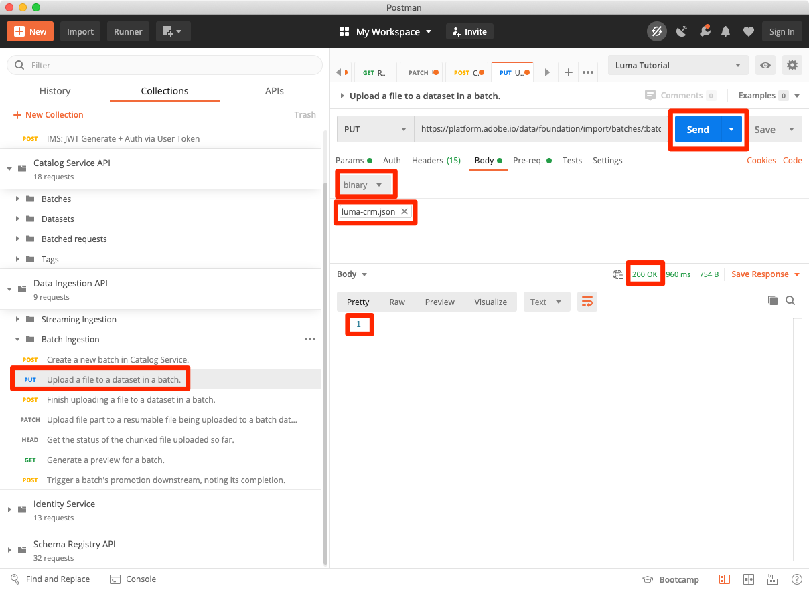

At this point, if you look at your batch in the Platform user interface, you will see that it is in a "[!UICONTROL Loading]" status:
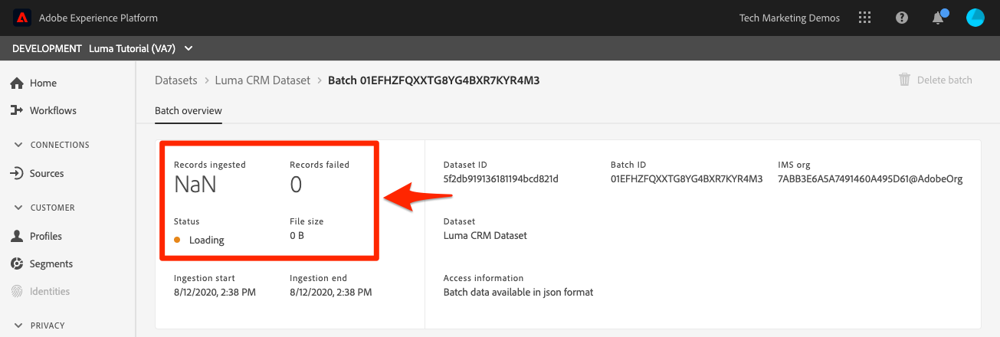

Because the Batch API is often used to upload multiple files, you need need to tell Platform when a batch is complete, which we will do in the next step.

### Complete the batch

To complete the batch:

1. Select the request **[!DNL Data Ingestion API > Batch Ingestion > Finish uploading a file to a dataset in a batch.]**
1. In the **Params** tab, enter `COMPLETE` as the **action**
1. In the **Params** tab, enter your batch id. Do not worry about dataset id or filePath, if they are present.
1. Make sure that the URL of the POST is `https://platform.adobe.io/data/foundation/import/batches/:batchId?action=COMPLETE` and that there aren't any unnecessary references to the `datasetId` or `filePath`
1. Select **Send** and you should get a 200 OK response with '1' in the response body

    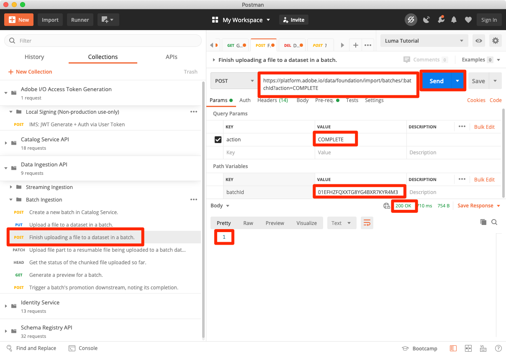

### Validate the data

#### Validate in the Platform user interface

Validate the data has landed in the Platform user interface just like you did for the Loyalty dataset.

First, confirm the batch shows that 1000 records have ingested:

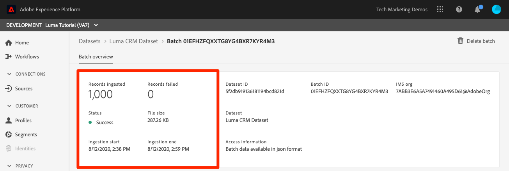

Next, confirm the batch using Preview dataset:

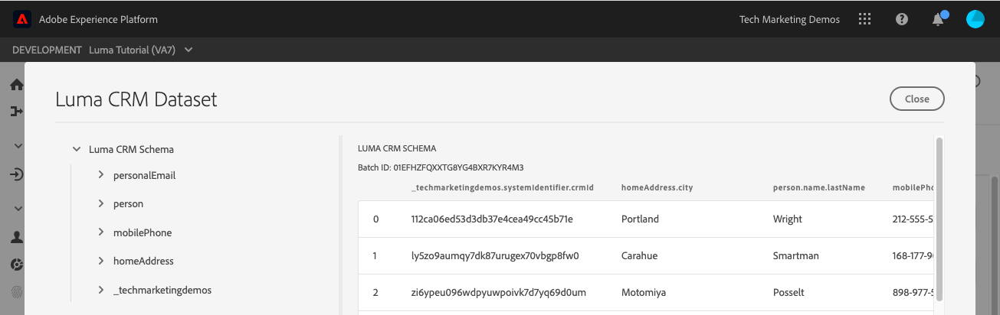

Finally, confirm one of your profiles has been created by looking up one of the profiles by the `Luma CRM Id` namespace, for example `112ca06ed53d3db37e4cea49cc45b71e`

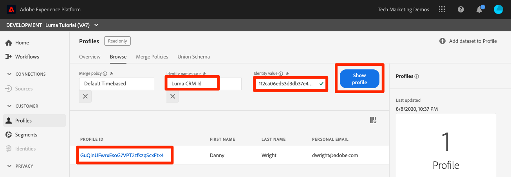

There is one interesting thing that just happened that I want to point out. Open that `Danny Wright` profile. The profile has both a `Lumacrmid` and a `Lumaloyaltyid`. Remember the `Luma Loyalty Schema` contained two identity fields, Luma Loyalty Id and CRM Id. Now that we've uploaded both datasets, they've merged into a single profile. The Loyalty data had `Daniel` as the first name and "New York City" as the home address, while the CRM data had `Danny` as the first name and `Portland` as the home address for the customer with the same Loyalty Id. We will come back to why the first name displays `Danny` in the lesson on merge policies.

Congratulations, you've just merged profiles!

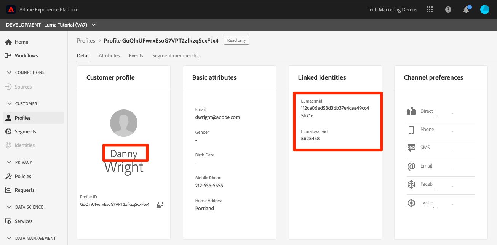

#### Validate with data ingestion events

If you subscribed to data ingestion events in the previous lesson, check your unique webhook.site URL. You should see three requests come in, just like with the loyalty data:

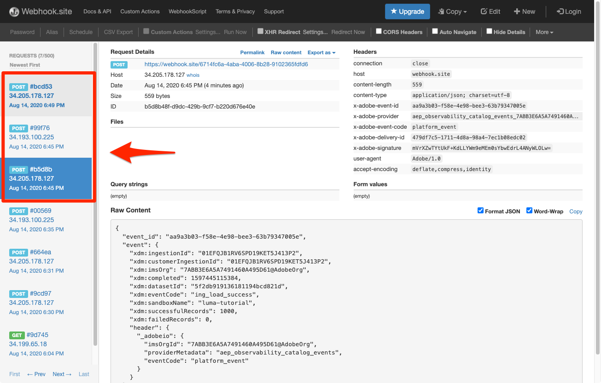

See the [documentation](https://experienceleague.adobe.com/docs/experience-platform/ingestion/quality/subscribe-events.html#available-status-notification-events) for more details on the notifications.

## Ingest data with Workflows

Let's look at another way of uploading data. The workflows feature allows you to ingest CSV data which is not already modeled in XDM.

### Download and prep the data

1. You should have already downloaded and unzipped [luma-data.zip](assets/luma-data.zip) into your `Luma Tutorial Assets` folder.
1. Confirm that you have`luma-products.csv`

### Create a workflow

Now let's set up workflow:

1. Go to **[!UICONTROL Workflows]** in the left navigation
1. Select **[!UICONTROL Map CSV to XDM schema]** and select the **[!UICONTROL Launch]** button
    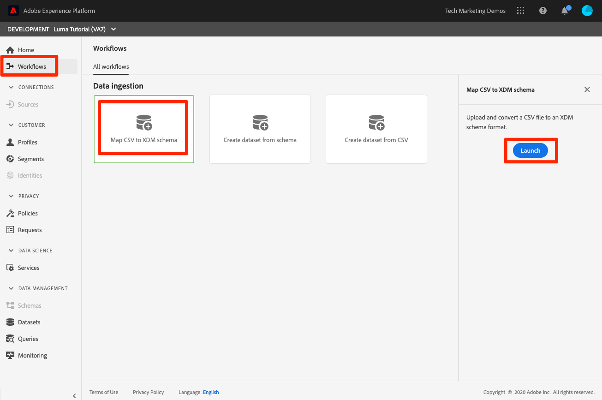
1. Select your `Luma Product Catalog Dataset` and select the **[!UICONTROL Next]** button
    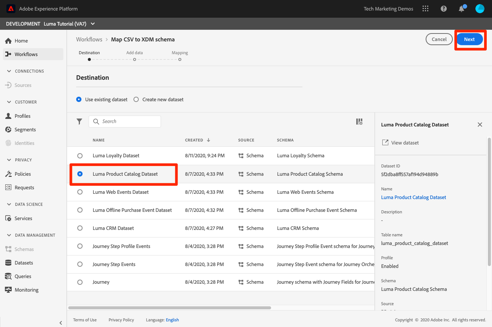
1. Add the `luma-products.csv` file you downloaded and select the **[!UICONTROL Next]** button 
    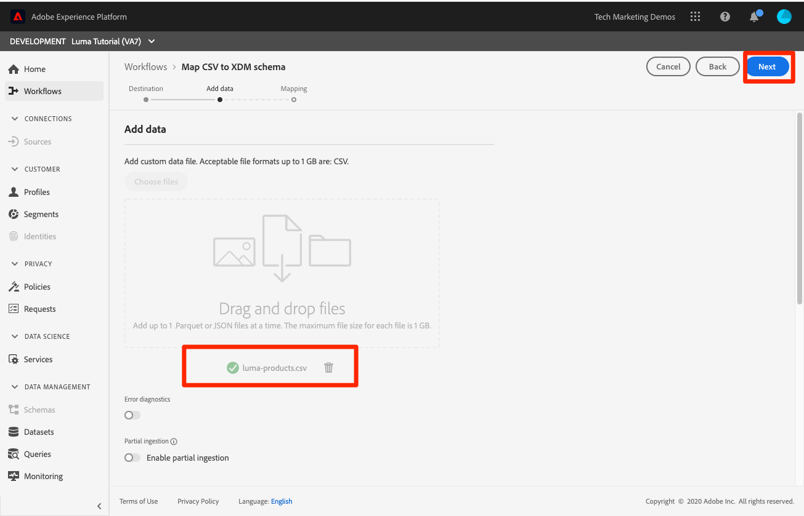
1. Now you are in the mapper interface, in which you can map a field from the source data (one of the column names in the `luma-products.csv` file) to XDM fields in the target schema. In our example, the column names are close enough to the schema field names that the mapper is able to auto-detect the right mapping! If the mapper was unable to auto-detect the right field, you would select the icon to the right of the target field to select the correct XDM field. Also, if you didn't want to ingest one of the columns from the CSV, you could delete the row from the mapper. Feel free to play around and change column headings in the `luma-products.csv` to get familiar with how the mapper works.
1. Select the **[!UICONTROL Finish]** button
    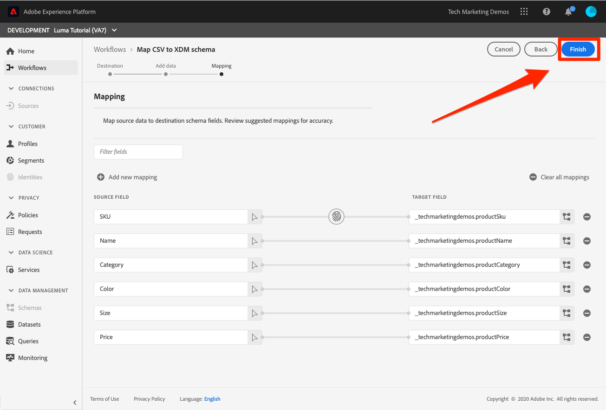

### Validate the data

When the batch has uploaded, verify the upload by previewing the dataset.

Since the `Luma Product SKU` is a non-people namespace, we won't see any profiles for the product skus.

You should see the three hits to your webhook.

## Ingest data with Sources

Okay, you did things the hard way. Now let's move into the promised land of _automated_ batch ingestion! When I say, "SET IT!" you say, "FORGET IT!" "SET IT!" "FORGET IT!" "SET IT!" "FORGET IT!" Just kidding, you would never do such a thing! Ok, back to work. You're almost done.

Go to **[!UICONTROL Sources]** in the left navigation to open the Sources catalog. Here you will see various out-of-the-box integrations with industry-leading data and storage providers. 

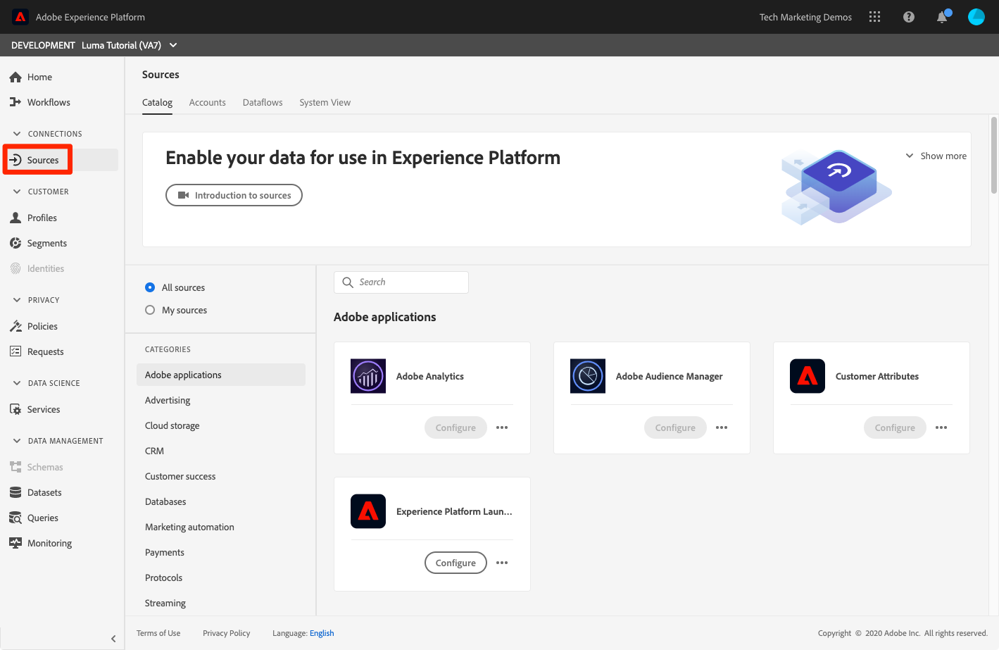

Okay, let's ingest data using a source connector.

This exercise will be choose-your-own-adventure style. I am going to show the workflow  using the FTP source connector. You can either use a different Cloud Storage source connector that you use at your company, or upload the json file using the dataset user interface like we did with the loyalty data.

Many of the Sources have a similar configuration workflow, in which you:

1. Enter your authentication details
1. Select the data you want to ingest
1. Select the Platform dataset into which you want to ingest it
1. Map the fields to your XDM schema
1. Choose the frequency with which you want to reingest data from that location

>[!NOTE]
>
>The Offline Purchase data we will be using in this exercise contains datetime data. Datetime data should be in either [ISO 8061 formatted strings](https://www.iso.org/iso-8601-date-and-time-format.html) ("2018-07-10T15:05:59.000-08:00") or Unix Time formatted in milliseconds (1531263959000) and are converted at ingestion time to the target XDM type. For more on data conversion and other constraints, see [the Batch Ingestion API documentation](https://experienceleague.adobe.com/docs/experience-platform/ingestion/batch/api-overview.html#types).

### Download, prep, and upload the data to your preferred cloud storage vendor

1. You should have already downloaded and unzipped [luma-data.zip](assets/luma-data.zip) into your `Luma Tutorial Assets` folder.
1. Open `luma-offline-purchases.json` in a text editor and replace all instances of `_techmarketingdemos` with your own underscore-tenant id, as seen in your schemas
1. Choose your preferred cloud storage provider, making sure it is available in the [!UICONTROL Sources] catalog
1. Upload `luma-offline-purchases.json` to a location in your preferred cloud storage provider

### Ingest the data to your preferred cloud storage location

1. In the Platform user interface, filter the [!UICONTROL Sources] catalog to **[!UICONTROL Cloud storage]**
1. Note that there are convenient links to documentation under the `...`
1. In the box of your preferred Cloud storage vendor, select the **[!UICONTROL Configure]** button 
    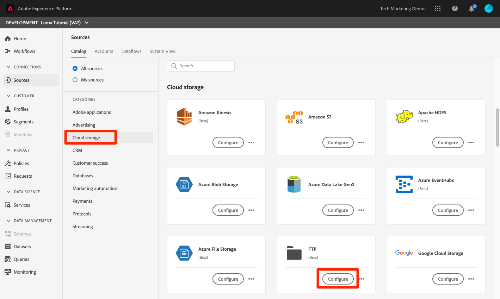
1. **[!UICONTROL Authentication]** is the first step. Enter the name for your account, for example `Luma's FTP Account` and your authentication details. This step should be fairly similar for all cloud storage sources, although the fields may vary slightly. Once you've entered the authentication details for an account, you can reuse them for other source connections that might be sending different data on different schedules from other files in the same account
1. Select the **[!UICONTROL Connect to source button]**
1. When Platform has successfully connected to the Source, select the **[!UICONTROL Next]** button
    

1. On the **[!UICONTROL Select data]** step, the user interface will use your credentials to open the folder on your cloud storage solution
1. Select the files you would like to ingest, for example `luma-offline-purchases.json`
1. As the **[!UICONTROL Data format]**, select `XDM JSON`
1. You can then preview the json structure and sample data in your file
1. Select the **[!UICONTROL Next]** button
    

1. On the **[!UICONTROL Mapping]** step, select your `Luma Offline Purchase Events Dataset` and select the **[!UICONTROL Next]** button. Note in the message that since the data we are ingesting is a JSON file, there is no mapping step where we map source field to target field. JSON data must be in XDM already. If you were ingesting a CSV, you would see the full mapping user interface on this step:
    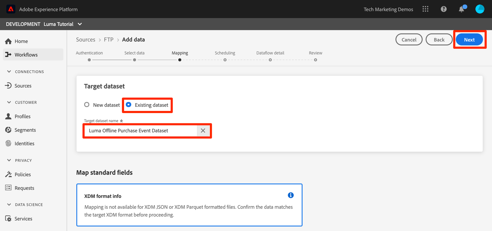
1. On the **[!UICONTROL Scheduling]** step, you choose the frequency with which you want to reingest data from the Source. Take a moment to look at the options. We are just going to do a one-time ingestion, so leave the **[!UICONTROL Frequency]** on **[!UICONTROL Once]** and select the **[!UICONTROL Next]** button:
    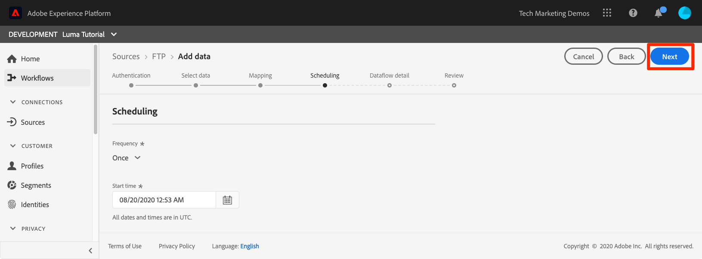
1. On the **[!UICONTROL Dataflow detail]** step, you can choose a name for your dataflow, enter an optional description, turn on error diagnostics, and partial ingestion. Leave the settings as they are and select the **[!UICONTROL Next]** button: 
    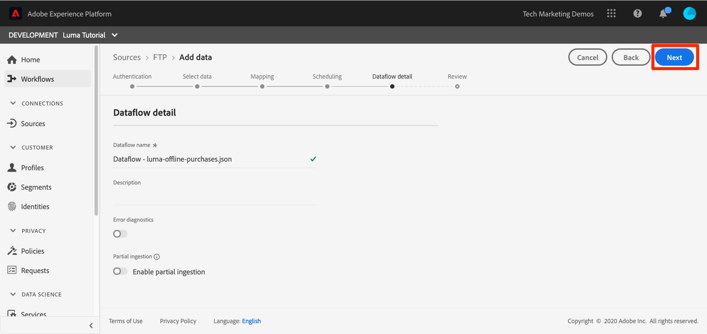
1. On the **[!UICONTROL Review]** step, you can review all of your settings together and either edit them or select the **[!UICONTROL Finish]** button
1. After saving you will land on a screen like this:
    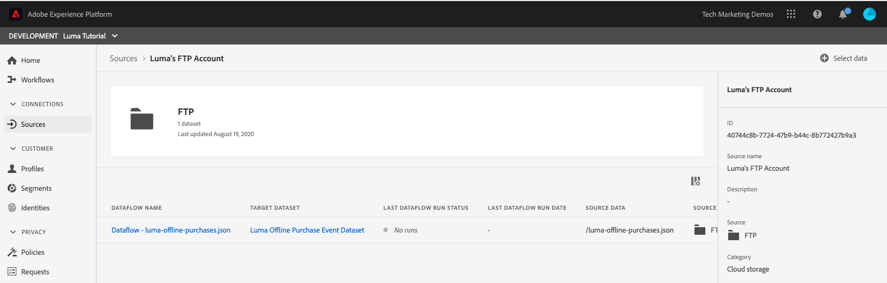

### Validate the data

When the batch has uploaded, verify the upload by previewing the dataset.

You should see the three hits to your webhook.

Look up the profile with value `5625458` in the `loyaltyId` namespace again to see if there are any purchase events in their profile. You should see one purchase. You can dig into the details of the purchase by selecting **[!UICONTROL View JSON]**:

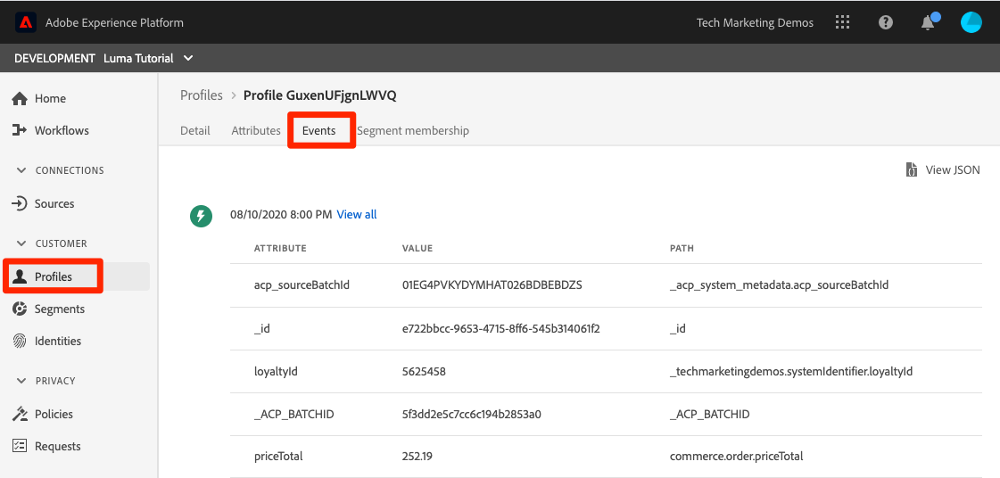

## ETL Tools

Adobe partners with multiple ETL vendors to support data ingestion into Experience Platform. Because of the variety of third-party vendors, ETL is not covered in this tutorial, although you are welcome to review some of these resources:

* [Developing ETL Integrations for Adobe Experience Platform](https://experienceleague.adobe.com/docs/experience-platform/etl/home.html)
* [Informatica Adobe Experience Platform Connector page on Adobe Exchange](https://exchange.adobe.com/experiencecloud.details.101570.informatica-adobe-experience-cloud-connector.html)
* [Informatica documentation of the Adobe Experience Platform Connector ](https://docs.informatica.com/integration-cloud/cloud-data-integration-connectors/current-version/adobe-experience-platform-connector/preface.html)
* [Unique Audience Experiences Derived from Data:  Unifi and Adobe Experience Platform](https://unifisoftware.com/solutions/adobe-experience-platform/)
* [[!DNL Snaplogic] Adobe Experience Platform Snap Pack](https://www.snaplogic.com/resources/videos/august-2020-aep)

## Additional Resources

* [Batch Ingestion documentation](https://experienceleague.adobe.com/docs/experience-platform/ingestion/batch/overview.html)
* [Data Ingestion API reference](https://www.adobe.io/apis/experienceplatform/home/api-reference.html#!acpdr/swagger-specs/ingest-api.yaml)

Now let's [stream data using the Web SDK](ingest-streaming-data.md)
