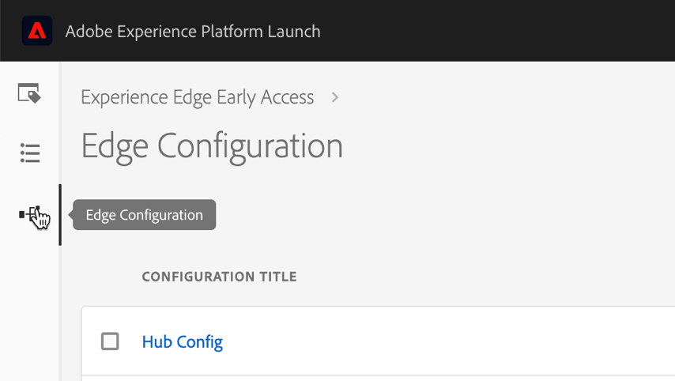

# Ingest Streaming Data

Lorem Ipsum

## Create a Launch Configuration

Next we’re going to create an Edge Configuration. This configuration will generate a Configuration ID. This ID will be added to the AEP Web SDK configuration in Launch and will be used to route data appropriately when it hits the Experience Edge.

1. Navigate to launch.adobe.com
    <!--when will the edge config go live?-->

1. Select the Edge Configuration icon from the left-hand rail

    

1. Click the **[!UICONTROL New Edge Configuration]** button in the upper-right hand corner

1. Give your Configuration a Name and Description (optional) and click Save

## Install the Web SDK Extension

## Create Rules to Send Data

## Use the Data Layer to XDM Mapper

