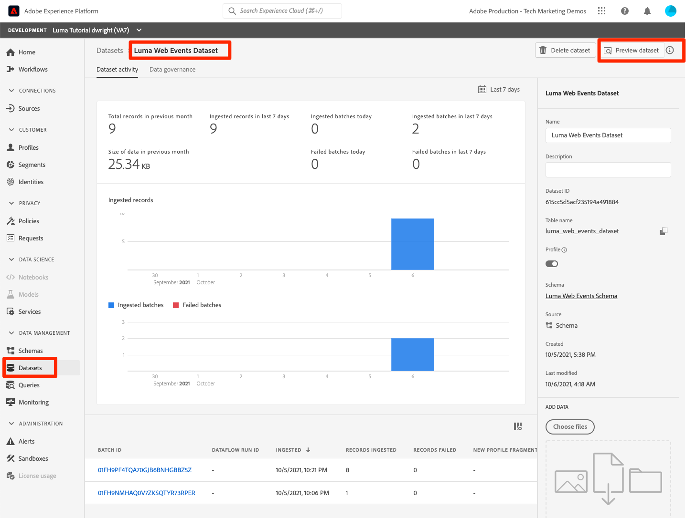
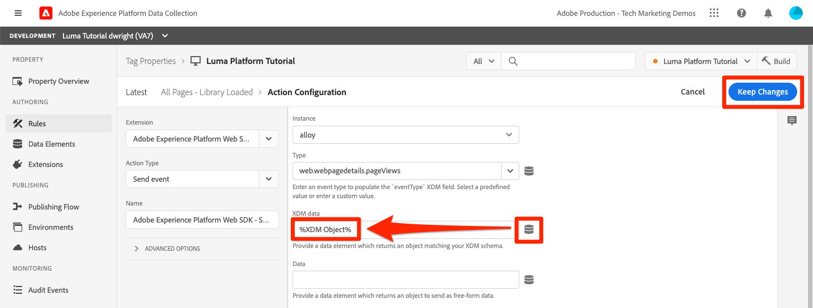

# Ingest streaming data

<!--1hr-->

In this lesson, you will stream data into Experience Platform using the Web SDK.

There are two main tasks we need to complete in the Adobe Experience Platform Launch interface:

* First, we need to create an Edge configuration, which tells the Adobe servers where data should go (e.g. Platform, Adobe Analytics, Adobe Target, etc) after it has been sent to the Edge network by Web SDK. This step needs to be taken by all Web SDK customers, regardless of how they are deploying Web SDK
* Second, we need to implement Web SDK. Web SDK can be deployed via the Launch interface or it can be deployed using the raw javascript file, alloy.js. In this tutorial, we will use the Launch interface. This tutorial will just focus on the minimal amount of features needed to deploy a simple Web SDK implementation to stream data into Experience Platform and is not meant to be a complete Launch tutorial.

**Data Engineers** will need to ingest streaming data outside of this tutorial. When implementing Adobe Experience Platform's Web or Mobile SDKs, typically a web or mobile developer will also be involved in the tagging and/or Launch steps.

Before you begin the exercises, watch these two short video to learn more about streaming data ingestion and Web SDK:
>[!VIDEO](https://video.tv.adobe.com/v/28425?quality=12&learn=on)

>[!VIDEO](https://video.tv.adobe.com/v/34141?quality=12&learn=on)

>[!NOTE]
>
>While this tutorial focuses on streaming ingestion from websites with Web SDK, you can also stream data using the [Adobe Mobile SDK](https://aep-sdks.gitbook.io/), [Apache Kafka Connect](https://github.com/adobe/experience-platform-streaming-connect), and other mechanisms.

## Permissions required

In the [Configure Permissions](configure-permissions.md) lesson, you setup all the access controls you need to complete this lesson, specifically:

* Permission items **[!UICONTROL Launch]** > **[!UICONTROL Property Rights]** > **[!UICONTROL Approve]**, **[!UICONTROL Develop]**, **[!UICONTROL Manage Environments]**, **[!UICONTROL Manage Extensions]**, and **[!UICONTROL Publish]**
* Permission item **[!UICONTROL Launch]** > **[!UICONTROL Company Rights]** > **[!UICONTROL Manage Properties]**
* User-role access to the `Luma Tutorial Launch` product profile
* Admin-role access to the `Luma Tutorial Launch` product profile
* Permission items **[!UICONTROL Platform]** > **[!UICONTROL Data Ingestion]** > **[!UICONTROL View Sources]** and **[!UICONTROL Manage Sources]**
* Permission items **[!UICONTROL Platform]** > **[!UICONTROL Data Management]** > **[!UICONTROL View Datasets]** and **[!UICONTROL Manage Datasets]**
* Permission items **[!UICONTROL Platform]** > **[!UICONTROL Profiles]** > **[!UICONTROL View Profiles]**, **[!UICONTROL Manage Profiles]** and **[!UICONTROL Export Audience Segment]**
* Permission item **[!UICONTROL Platform]** > **[!UICONTROL Sandbox Administration]** > **[!UICONTROL View Sandboxes]**
* Permission item **[!UICONTROL Platform]** > **[!UICONTROL Sandboxes]** > `Luma Tutorial`
* User-role access to the `Luma Tutorial Platform` product profile
  
## Create a streaming source

1. Log into the [Experience Platform  user interface](https://experience.adobe.com/platform/)
1. Click **[!UICONTROL Sources]** in the left navigation
1. Filter the list by clicking **[!UICONTROL Streaming]**
1. In the **[!UICONTROL HTTP API]** section, click the **[!UICONTROL Configure]** button
    
1. On the **[!UICONTROL Authentication]** step, enter `Luma Web Events Source` as the **[!UICONTROL Account name]** and click the **[!UICONTROL Connect to source]** button (we don't need to enable authentication since the data will be originating from website visitors)
    
1. Once connected, click the **[!UICONTROL Next]** button to proceed to the next step in the workflow
1. On the **[!UICONTROL Select data]** step, choose **[!UICONTROL Existing Dataset]**, select your `Luma Web Events Dataset`, and then click the **[!UICONTROL Next]** button
    
1. On the **[!UICONTROL Dataflow detail]** step, just click the **[!UICONTROL Next]** button:
    
    <!--What is a good practice for naming the data flow vs the source-->

1. On the **[!UICONTROL Review]** step, review your source details and click the **[!UICONTROL Finish]** button:
    

## Create an Edge Configuration

Next, we are going to create an Edge Configuration. An Edge Configuration tells the Adobe Edge network where to send the data after receiving it from the Web SDK call. For example, do you want to send the data to Experience Platform? Adobe Analytics? Adobe Audience Manager? Adobe Target? Edge Configurations are managed in the Launch user interface and are critical to Platform data collection with Web SDK, regardless of whether or not you are implementing Web SDK via Launch.

To create your [!UICONTROL Edge Configuration]:

1. Log into the [Experience Platform Launch user interface](https://experience.adobe.com/launch/)
    <!--when will the edge config go live?-->

1. Click **[!UICONTROL Edge Configurations]** in the left navigation
1. Click the **[!UICONTROL New Edge Configuration]** button in the upper-right hand corner

    

1. For the **[!UICONTROL Friendly Name]**, enter `Luma Platform Tutorial` (add your name to the end, if multiple people from your company are taking this tutorial)
1. Click the **[!UICONTROL Save]** button
   
    

On the next screen you create the environment of the config. Here is where you specify where you want to send data. To send data to Experience Platform only, do the following:

1. Toggle on **[!UICONTROL Adobe Experience Platform]** which will expose additional fields
1. For **[!UICONTROL Sandbox]**, select `Luma Tutorial`
1. For **[!UICONTROL Streaming Inlet]**, select `Luma Web Events Source`
1. For **[!UICONTROL Event Dataset]**, select `Luma Web Events Dataset`
1. If you use other Adobe applications, feel free to explore the other sections to see which information is required in the Edge Configuration of these other solutions. Remember, Web SDK was developed not only to stream data into Experience Platform, but also to replace all previous JavaScript libraries used by other Adobe applications. The Edge Configuration is used to specify the account details of each application to which you want to send the data.
1. Click the **[!UICONTROL Save]** button to save your configuration
    

Once the Edge Configuration has saved, on the resulting screen you will notice that three environments have been created for Development, Staging, and Production and that additional Development environments can be added:
    
If you open up any one of these environments you will see the Platform details you just entered. However, these details can be configured differently per environment. You can have Web SDK send data to different Edge Configuration environments, which can then in turn forward the data to different application environments, if required as part of your code deployment process. In this tutorial, we will not do any additional customization to our Edge Configuration.

## Install the Web SDK Extension

### Add a property

First we need to create a Launch property. A property is a container for all the JavaScript, rules, and other features needed to collect details from a web page and send it to various locations.

To create a property:

1. Click **[!UICONTROL Properties]** in the left navigation
1. Click the **[!UICONTROL Add New Property]** button
    
1. As the **[!UICONTROL Name]**, enter `Luma Platform Tutorial` (add your name to the end, if multiple people from your company are taking this tutorial)
1. As the **[!UICONTROL Domains]**, enter `enablementadobe.com` (this will be explained later)
1. Click the **[!UICONTROL Save]** button
    

After saving the property, you might see an error message like the one below. If so, this is because you don't actually have access to the property you just created. To fix this, we need to go to the Admin Console to give yourself access:
    

To give yourself access to the property:

1. In a separate browser tab, log into the [Admin Console](https://adminconsole.adobe.com/)
1. Go to **[!UICONTROL Products]** from the top navigation
1. Select **[!UICONTROL Adobe Experience Platform Launch]** on the left navigation
1. Go to your `Luma Tutorial Launch` product profile
1. Click on the **[!UICONTROL Permissions]** tab
1. On the **[!UICONTROL Properties]** row, click **[!UICONTROL Edit]**
    
1. Click the "+" icon to move your `Luma Platform Tutorial` property to the right hand side and click the **[!UICONTROL Save]** button to update the permissions
   
    

Now switch back to your browser tab with the Launch interface still open. Reload the page and the `Luma Platform Tutorial` property should display in the list. Click to open the property:

## Add the Web SDK extension

Now that we have a property we can add the Web SDK using an extension. An extension is a package of code that extends the Launch interface and client functionality. To add the extension:

1. Click **[!UICONTROL Extensions]** in the left navigation
1. Click the **[!UICONTROL Catalog]** tab
1. There are many extensions available for Launch. Filter the catalog with the term `Web SDK`
1. In the **[!UICONTROL AEP Web SDK]** extension, click the **[!UICONTROL Install]** button
        
1. There are a number of configurations available for the Web SDK extension, but there only two we are going to configure for this tutorial. Update the **[!UICONTROL Edge Domain]** to `data.enablementadobe.com`. This setting allows you to set first party cookies with your Web SDK implementation, which is strongly encouraged. Later in this lesson, you will map a website on the `enablementadobe.com` domain to your Launch property. The CNAME for the `enablementadobe.com` domain has already been configured so that `data.enablementadobe.com` will forward to Adobe servers. When you implement Web SDK on your own website, you will need to create a CNAME for your own data collection purposes, e.g. `data.YOUR_DOMAIN.com`
1. From the **[!UICONTROL Edge Configuration]** dropdown, select your `Luma Platform Tutorial` configuration.
1. Feel free to look at the other configuration options (but don't change them!) and then click the **[!UICONTROL Save]** button
    <!--is edge domain required for first party? when will it break?-->
   <!--any other fields that should be highlighted-->
    
 
    

## Create a rule to send data

Now we will use a rule to send data to Platform. A rule is a combination of events, conditions and actions that tell Launch to do something. To create a rule:

1. Click **[!UICONTROL Rules]** in the left navigation
1. Click the **[!UICONTROL Create New Rule]** button
    
1. Name the rule `All Pages - Library Loaded`
1. Under **[!UICONTROL Events]**, click the **[!UICONTROL Add]** button
       
1. Use the **[!UICONTROL Core]** **[!UICONTROL Extension]** and select **[!UICONTROL Library Loaded (Page Top)]** as the **[!UICONTROL Event Type]**. This means that our rule will fire whenever the Launch library loads on a page.
1. Click **[!UICONTROL Keep Changes]** to return to the main rule screen
        
1. Leave **[!UICONTROL Conditions]** empty, since we want this rule to fire on all pages, as per the name we gave it
1. Under **[!UICONTROL Actions]**, click the **[!UICONTROL Add]** button
1. Use the **[!UICONTROL AEP Web SDK]** **[!UICONTROL Extension]** and select **[!UICONTROL Send Event]** as the **[!UICONTROL Action Type]**
1. On the right, select **[!UICONTROL web.webpagedetails.pageViews]** from the **[!UICONTROL Type]** dropdown. This is one of the XDM fields in our `Luma Web Events Schema`
1. Click **[!UICONTROL Keep Changes]** to return to the main rule screen
    
1. Click **[!UICONTROL Save]** to save the rule    
       

## Publish the rule in a library

In order to validate the rule we just created, we need to publish a library containing all of the items in our property. There are a few quick steps we need to take in the **[!UICONTROL Publishing]** section of Launch.

### Create a host

Launch libraries can be hosted on Adobe's Content Delivery Network (CDN) or on your own servers. In this tutorial we will use Adobe's CDN since it is just must faster to set up:

1. Click **[!UICONTROL Hosts]** in the left navigation
1. Click the **[!UICONTROL Create New Host]** button
       
1. For the **[!UICONTROL Name]**, enter `Adobe CDN`
1. For the **[!UICONTROL Type]**, select **[!UICONTROL Managed by Adobe]**
1. Click the **[!UICONTROL Save]** button to complete the setup of the host
       

### Create an environment

Environments allow you to have different versions of a library in different publishing environments to accommodate your publishing workflow. For example, the fully tested version of your library can be published to a Production environment, while new changes are being created in a Development environment. You can also use different hosts for each environment. To create an environment:

1. Click **[!UICONTROL Environments]** in the left navigation
1. Click the **[!UICONTROL Create New Environment]** button
     
1. Under **[!UICONTROL Development]** click **[!UICONTROL Select]**   
     
1. For the **[!UICONTROL Name]**, enter `Development`
1. For the **[!UICONTROL Select Host]** dropdown, select `Adobe CDN`
1. Click the **[!UICONTROL Save]** button to complete the setup of the environment
    
1. You will see a modal with URL and other implementation details of this library. These are critical for a real Launch implementation, but we don't need to worry about them for this tutorial. Click the **[!UICONTROL Close]** button to exit the modal.

### Create and publish the library

Now let's bundle the contents of our property&mdash;currently an extension and a rule&mdash;into a library. To create a library:

1. Click **[!UICONTROL Publishing Flow]** in the left navigation
1. Click the **[!UICONTROL Add New Library]** button
    
1. For the **[!UICONTROL Name]**, enter `Luma Platform Tutorial`
1. For the **[!UICONTROL Environment]**, select `Development`
1. Click the **[!UICONTROL Add All Changed Resources]** button. (In addition to the [!UICONTROL AEP Web SDK] extension and the `All Pages - Library Loaded` rule, you will also see the [!UICONTROL Core] extension added which contains the base JavaScript required by all Launch web properties.)
1. Click the **[!UICONTROL Save & Build for Development]** button 
    

The library may take a few minutes to build and when it is complete it will display a green dot to the left of the library name:
       

As you can see on the [!UICONTROL Publishing Flow] screen, there is a lot more to the publishing process in Launch which is beyond the scope of this tutorial. We are just going to use a single library in our Development environment.

## Validate the data in the request

### Add the Adobe Experience Platform Debugger

The Experience Platform Debugger is an extension available for Chrome and Firefox browsers which helps you see the Adobe technology implemented in your web pages. Download the version for your preferred browser:

* [Firefox extension](https://addons.mozilla.org/en-US/firefox/addon/adobe-experience-platform-dbg/)
* [Chrome extension](https://chrome.google.com/webstore/detail/adobe-experience-platform/bfnnokhpnncpkdmbokanobigaccjkpob)

If you've never used the Debugger before&mdash;and this one is different from the older Adobe Experience Cloud Debugger&mdash;you might want to watch this five minute overview video:

>[!VIDEO](https://video.tv.adobe.com/v/32156?quality=12&learn=on)

### Open the Luma website

For this tutorial, we will be using a publicly hosted version of the Luma demo website. Let's open it and bookmark it:

 1. In a new browser tab, open [https://luma.enablementadobe.com](https://luma.enablementadobe.com). 
 1. Bookmark the page for use throughout the rest of the tutorial

This is why we used `enablementadobe.com` in the [!UICONTROL Domains] field of our initial Launch property configuration and why we used `data.enablementadobe.com` as our first-party domain in the [!UICONTROL AEP Web SDK] extension. See, I had a plan!

   

### Use the Experience Platform Debugger to map to your Launch property

The Experience Platform Debugger has a cool feature in it that allows your to replace an existing Launch property with a different one (or inject one on a site that doesn't have Launch implemented at all). This is useful for validation and in this tutorial allows us to skip a lot of implementation steps with which only your web developers need to be concerned.

1. Make sure you have the Luma site open and click the Experience Platform Debugger extension icon
1. The Debugger will open and show some details of the hardcoded implementation, which is unrelated to this tutorial (you may need to reload the Luma site after opening the Debugger)
1. Confirm the Debugger is "**[!UICONTROL Connected to Luma]**" as pictured below and then click the "**[!UICONTROL lock]**" icon to lock the Debugger to the Luma site. If you don't do this, the Debugger will keep switching to expose the implementation details of whatever browser tab is in focus, which can be confusing.
1. Click the **[!UICONTROL Sign In]** button on the top right to authenticate. If you already have a browser tab open with the Launch interface, the authentication step will be automatic and you won't have to enter your username and password again.
1. Now click **[!UICONTROL Launch]** in the left navigation
1. Select the Configuration tab
1. To the right of where it shows you the **[!UICONTROL Page Embed Codes]**, open the **[!UICONTROL Actions]** dropdown and select **[!UICONTROL Replace]**
    
1. Since you are authenticated, the Debugger is going to pull in your available Launch properties and environments. Select your `Luma Platform Tutorial` property
1. Select your `Development` environment
1. Click the **[!UICONTROL Apply]** button
    
1. The Luma website will now reload _with your Launch property_. Help, I've been hacked! Just kidding.
    
1. Click **[!UICONTROL Summary]** in the left navigation, to see the details of your [!UICONTROL Launch] property
    
1. Now click **[!UICONTROL AEP Web SDK]** in the left navigation to see the **[!UICONTROL Network Requests]**
1. Click to open the **[!UICONTROL events]** row

    
1. Note how we can see the `web.webpagedetails.pageView` event type we specified in our [!UICONTROL Send Event] action, as well as other, out-of-the-box variables adhering to the `AEP Web SDK ExperienceEvent Mixin` format
       
1. These types of request details are also visible in the browser's web developer tools **Network** tab. Open it and reload the page. Filter for calls with `interact` to locate the call, click it, and then look in the **Headers** tab, **Request Payload** area.
       
1. Click on the **Response** tab and note how the ECID value is included in the response. Copy this value as you will use it to validate the profile information in the next exercise.
       

## Validate the data in Experience Platform

You can validate that data is landing in Platform by looking at the batches of data arriving in the `Luma Web Events Dataset`. (I know, it's called streaming data ingestion but now I'm saying it arrives in batches! It streams in real-time to Profile, so it can be used for real-time segmentation and activation, but is sent in batches every 15-minutes to the data lake.)

To validate the data:

1. In the Platform UI, go to **[!UICONTROL Datasets]** in the left navigation
1. Open the `Luma Web Events Dataset` and confirm that a batch has arrived. Remember, they are sent every fifteen minutes, so you might need to wait a little bit for the batch to show up.
1. Click the **[!UICONTROL Preview dataset]** button
    
1. In the preview modal, note how you can select different fields of the schema on the left to preview those specific data points:
       

You can also confirm that the new profile is showing up:

1. In the Platform UI, go to **[!UICONTROL Profiles]** in the left navigation
1. Select the **[!UICONTROL ECID]** namespace and search for your ECID value (copy it from the response in the web developer tools network tab as noted in the last exercise) 
1. The profile will will have its own id, separate from the ECID, click it to open the profile
    
1. While there may note be much in it, you should at least be able to see the pages you viewed in the **[!UICONTROL Events]** tab
       
    <!---->  

## Add custom data to the event

### Create a data element for page name

1. In the Launch UI, on the top right corner of your `Luma Platform Tutorial` property, open the **[!UICONTROL Select a Working Library]** dropdown and select your `Luma Platform Tutorial` library. This is going to make it easier to publish additional updates to our library.
1. Now go to **[!UICONTROL Data Elements]** in the left navigation
1. Click the **[!UICONTROL Create New Data Element]** button

       
1. As the **[!UICONTROL Name]** enter `Page Name` 
1. As the **[!UICONTROL Data Element Type]**, select `JavaScript Variable`
1. As the **[!UICONTROL JavaScript variable name]**, enter `digitalData.page.pageInfo.pageName`
1. To help standardize the format of the values, check the boxes for **[!UICONTROL Force lowercase value]** and **[!UICONTROL Clean text]**
1. Make sure that `Luma Platform Tutorial` is selected as the working library, and click the **[!UICONTROL Save to Library]** button
     

### Map the page name to the XDM Object data element

Now we will map our page name to the Web SDK. 

>[!IMPORTANT]
>
>In order to complete this task, we need to make sure your user first has access to the Prod sandbox. If you don't already have access to the Prod sandbox from a different product profile, quickly open your `Luma Tutorial Platform` profile and add the permission item **[!UICONTROL Sandboxes]** > **[!UICONTROL Prod]**.
>

1. If you just updated your permissions to include the Prod sandbox, do a SHIFT-Reload on the Data Elements page to clear your cache
1. On the **[!UICONTROL Data Elements]** screen in Launch, create another data element with the **[!UICONTROL Name]** of `XDM Object`
1. As the **[!UICONTROL Extension]**, select `AEP Web SDK`
1. As the **[!UICONTROL Data Element Type]**, select `XDM Object`
1. Lists of your Platform sandboxes and schemas are retrieved. As the Sandbox, select your `Luma Tutorial` sandbox
1. As the **[!UICONTROL Schema]**, select your `Luma Web Events Schema`
1. Your schema will load in the Launch UI. Select the `web.webPageDetails.name` field
1. As the **[!UICONTROL Value]**, click the icon to open the data element selection modal and choose your `Page Name` data element
1. Click the **[!UICONTROL Save to Library]** button
       

This same basic process is used to map all of your custom data on your website to the XDM schema fields.

### Add the XDM data to your Send Event action

Now that you have data mapped to XDM fields, you can include it in your Send Event action:

1. Go to the **[!UICONTROL Rules]** screen and open your `All Pages - Library Loaded` rule
1. Open the `AEP Web SDK - Send Event` action
1. As the **[!UICONTROL XDM Data]**, click the icon to open the data element selection modal and choose your `XDM Object` data element
1. Click the **[!UICONTROL Keep Changes]** button
    
1. Now, since you have had `Luma Platform Tutorial` selected as your working library for the last several exercises, your recent changes have been saving directly to the library. Instead of having to publish our changes via the Publishing Flow screen, you can just open the dropdown on the blue button and select **[!UICONTROL Save to Library and Build]**
    

This will start building a new Launch library with the three changes you just made.

### Validate the XDM data

You should now be able to reload the Luma homepage, while mapped to your Launch property using the Debugger as I showed you earlier, and see the page name field populates in the request!
    

You can also validate the page name data was received in Platform, by previewing the dataset and profile.

## Send additional identities

Your Web SDK implementation is now sending events with the Experience Cloud ID (ECID) as the primary identifier. The ECID is generated automatically by the Web SDK and is unique per device and browser. A single customer can have multiple ECIDs depending on which device and browser they are using. So how can we get a unified view of this customer and link their online activity to our CRM, Loyalty, and Offline Purchase data? We do that by collecting additional identities during their session and deterministically linking their profile via identity stitching.

If you recall, I mentioned that we would be using the ECID and CRM Id as identities for our web data in the [Map Identities](map-identities.md) lesson. So let's collect the CRM Id with the Web SDK!

### Add Data Element for the CRM Id

First we will store the CRM Id in a data element:

1. In the Launch interface, create a new data element named `CRM Id`
1. As the **[!UICONTROL Data Element Type]**, select **[!UICONTROL JavaScript Variable]**
1. As the **[!UICONTROL JavaScript variable name]**, enter `digitalData.user.0.profile.0.attributes.username`
1. Click the **[!UICONTROL Save to Library]** button (`Luma Platform Tutorial` should still be your working library)
    

### Add the CRM Id to the Identity Map data element

Now that we have captured the CRM Id value, we need to associate it with a special data element type called the [!UICONTROL Identity Map] data element:

1. Create a new data element named `Identities`
1. As the **[!UICONTROL Extension]**, select **[!UICONTROL AEP Web SDK]**
1. As the **[!UICONTROL Data Element Type]**, select **[!UICONTROL Identity Map]**
1. As the Namespace, enter `lumaCRMId`, which is the [!UICONTROL Identity Symbol] we created in an earlier lesson

   >[!WARNING]
   >
   >The AEP Web SDK extension version 2.2 allows you to select Namepsace from a pre-populated dropdown using the actual values in your Platform account. Unfortunately, this feature is not yet "sandbox aware" and thus the `lumaCRMId` value may not appear in the dropdown. This may prevent you from completing this exercise. We will post a workaround once confirmed.

1. As the **[!UICONTROL ID]**, click the icon to open the data element selection modal and choose your `CRM Id` data element
1. As the **[!UICONTROL Authenticated State]**, select **[!UICONTROL Authenticated]**
1. Leave **[!UICONTROL Primary]** _unchecked_. Since the CRM Id is not present for most visitors to the Luma website, you definitely _do not want to override the ECID as the primary identifier_. It would be a very rare use case to use anything other than the ECID as the primary identifier. Usually I don't mention the default settings in these instructions, but I am calling this one out to help you avoid headaches later on in your own implementation.
1. Click the **[!UICONTROL Save to Library]** button (`Luma Platform Tutorial` should still be your working library)
    

>[!NOTE]
>
>You can pass multiple identifiers using the [!UICONTROL Identity Map] data type.

### Add the IdentityMap data element to the XDM Object

There is one more data element we need to update&mdash;the XDM Object data element. It may seem weird to have to update three separate data elements to pass this one identity, but this process is designed to scale for multiple identities in multiple states. Don't worry, we're almost done with this lesson!

1. Open your XDM Object data element
1. Open the IdentityMap XDM field
1. As the **[!UICONTROL Data element providing object]**, click the icon to open the data element selection modal and choose your `Identities` data element
1. Now, since you have had `Luma Platform Tutorial` selected as your working library for the last several exercises, your recent changes have been saving directly to the library. Instead of having to publish our changes via the Publishing Flow screen, you can just open the dropdown on the blue button and select **[!UICONTROL Save to Library and Build]**
    

### Validate the identity

To validate that the CRM Id is now being sent by the Web SDK:

1. Open the [Luma website](https://luma.enablementadobe.com/)
1. Map it to your own Launch property using the Debugger, as per the earlier instructions
1. Click the **Login** link on the top right of the Luma website
1. Log in using the credentials `test@adobe.com`/`test`
1. Once authenticated, inspect the AEP Web SDK call in the Debugger (**[!UICONTROL AEP Web SDK]** > **[!UICONTROL Network Requests]** > **[!UICONTROL events]** of the most recent request) and you should see the `lumaCrmId`:
    
1. Look up the user profile using the ECID namespace and value again. Note that in the profile you will not only see the CRM Id, but also the Loyalty Id and the profile details like the name and phone number. All of the identities and data have been stitched together into a single, real-time customer profile!
    
    

## Additional Resources

* [Streaming Ingestion documentation](https://experienceleague.adobe.com/docs/experience-platform/ingestion/streaming/overview.html)
* [Data Ingestion API reference](https://www.adobe.io/apis/experienceplatform/home/api-reference.html#!acpdr/swagger-specs/ingest-api.yaml)

Great job! That was a lot of information about Web SDK and Launch. There is a lot more involved in a full-blown implementation, but those are the basics to help you get started and see the results in Platform.

>[!NOTE]
>
>Now that you are done with the Streaming Ingestion lesson, you can remove the [!UICONTROL Prod] sandbox from your `Luma Tutorial Platform` product profile

Data Engineers, if you like you can skip ahead to the [run queries lesson](run-queries.md).

Data Architects, you can move on to [merge policies](create-merge-policies.md)!

