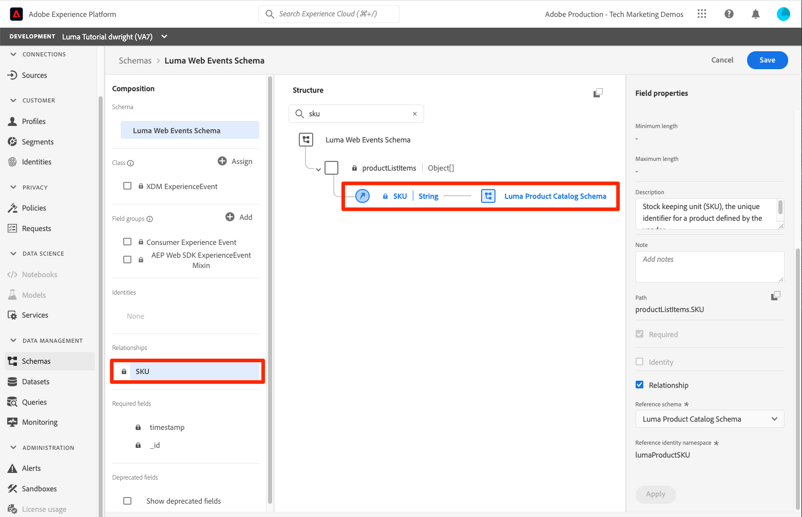

# Map identities

<!-- 30 min-->

In this lesson, we will create identity namespaces and add identity fields to our schemas. After doing so, we'll also be able to complete the schema relationships from the previous lesson.

Adobe Experience Platform Identity Service helps you to gain a better view of your customers and their behaviors by bridging identities across devices and systems, allowing you to deliver impactful, personal digital experiences in real-time. Identity fields and namespaces are the glue that joins different data sources together to build the 360-degree real-time customer profile.

**Data Architects** will need to map identities outside of this tutorial.

Before you begin the exercises, watch this short video to learn more about identity in Adobe Experience Platform:
>[!VIDEO](https://video.tv.adobe.com/v/27841?quality=12&learn=on)

>[!NOTE]
>
>Identity fields are only required if you building real-time customer profiles. They are not required if you are only ingesting data into the data lake.

<!--explain identity maps-->
<!--explain the strategy behind the identity selection, how these identities will join all the data together-->

## Permissions required

In the [Configure Permissions](configure-permissions.md) lesson, you set up all the access controls required to complete this lesson.

<!--
* Permission items **[!UICONTROL Identity Management]** > **[!UICONTROL View Identity Namespaces]** and **[!UICONTROL Manage Identity Namespaces]**
* Permission item **[!UICONTROL Data Modeling]** > **[!UICONTROL View Schemas]** and **[!UICONTROL Manage Schemas]**
* Permission item **[!UICONTROL Sandboxes]** > `Luma Tutorial`
* User-role access to the `Luma Tutorial Platform` product profile
* Developer-role access to the `Luma Tutorial Platform` product profile (for API)
-->

## Create Identity Namespace

In this exercise, we'll create identity namespaces for Luma's custom identity fields, `loyaltyId`, `crmId`, and `productSku`. Identity namespaces play a critical role in building real-time customer profiles, as two matching values in the same namespace allow two data sources to form an identity graph.


### Create Namespaces in the UI

Let's start by creating a namespace for the Luma Loyalty Schema:

1. In the Platform user interface, go to **[!UICONTROL Identities]** in the left navigation
1. You will notice that there are several out-of-the-box identity namespaces available. Select the **[!UICONTROL Create identity namespace]** button
1. Provide details as following
   
    | Field         |  Value    |  
    |---------------|-----------|
    | Display name  | Luma Loyalty Id    | 
    | Identity symbol| lumaLoyaltyId    |  
    | Type           | Cross-Device      |  

1. Select **[!UICONTROL Create]**

    

Now set up another namespace for the Luma Product Catalog Schema with the following details:
   
| Field         |  Value    |  
|---------------|-----------|
| Display name  | Luma Product SKU   | 
| Identity symbol| lumaProductSKU    |  
| Type           | Non-people identifier      |  


## Create Identity Namespace Using API

We will create our CRM namespace via API. 

>[!NOTE]
>
>If you'd prefer to skip the API exercises, feel free to create the CRM namespace via the UI method you used with the following details:
>
> 1. As the **[!UICONTROL Display name]**, use `Luma CRM Id`
> 1. As the **[!UICONTROL Identity symbol]**, use `lumaCrmId`
> 1. As the **[!UICONTROL Type]**, use Cross-Device

Let's create the Identity Namespace `Luma CRM Id`:

1. Download [Identity Service.postman_collection.json](https://raw.githubusercontent.com/adobe/experience-platform-postman-samples/master/apis/experience-platform/Identity%20Service.postman_collection.json) to your `Luma Tutorial Assets` folder
1. Import the collection into [!DNL Postman]
1. If you haven't made a request in the last 24 hours, your authorization tokens have probably expired. Open the request **[!DNL Adobe I/O Access Token Generation > Local Signing (Non-production use-only) > IMS: JWT Generate + Auth via User Token]**, and select **Send** to request new JWT and Access Tokens.
1. Select the request **[!UICONTROL Identity Service] > [!UICONTROL Identity Namespace] > [!UICONTROL Create a new identity namespace].**
1. Paste the following as the [!DNL Body] of the request:

    ```json
    {
        "name": "Luma CRM Id",
        "code": "lumaCrmId",
        "idType": "Cross_device"
    }
    ```

1. Press the **Send** button and you should get a **200 OK** response: 

    

If you return to the UI, you should now see your three new custom namespaces:


## Label identity fields in schemas

Now that we have our namespaces, the next step is to update our schemas to label our identity fields.


### Label XDM Fields For Primary Identity

Each schema used with Real-time Customer Profile is required to have a primary identity specified. And each record ingested must have a value for that field.

Let's add a primary identity to the `Luma Loyalty Schema`:

1. Open the `Luma Loyalty Schema`
1. Select the `Luma Identity profile field group`
1. Select the `loyaltyId` field
1. Check the **[!UICONTROL Identity]** box
1. Check the **[!UICONTROL Primary Identity]** box, too
1. Select the `Luma Loyalty Id` namespace from **[!UICONTROL Identity namespaces]** dropdown
1. Select **[!UICONTROL Apply]** 
1. Select **[!UICONTROL Save]**

    

Repeat the process for some of your other schema:

1. In the `Luma CRM Schema`, label the `crmId` field as the primary identity using the `Luma CRM Id` namespace
1. In the `Luma Offline Purchase Events Schema`, label the `loyaltyId` field as the primary identity using the `Luma Loyalty Id` namespace
1. In the `Luma Product Catalog Schema`, label the `productSku` field as the primary identity using the `Luma Product SKU` namespace

>[!NOTE]
>
>Data collected with the Web SDK is an exception to the typical practice of labeling identity fields in the schema. Web SDK uses the Identity Map to label identities *on the implementation side* and thus we'll determine the identities for the `Luma Web Events Schema` when we implement the Web SDK on the Luma website. In that later lesson, we'll collect the Experience Cloud Visitor ID (ECID) as the primary id and crmId as a secondary id. 

With our selection of primary identities, it's clear to see how `Luma CRM Schema` can connect to the `Luma Offline Purchase Events Schema` since they both use `loyaltyId` as an identifier. But how can we connect our offline purchases to online behavior? How can we classify the products purchased with our product catalog? We will use additional identity fields and schema relationships.

<!--use a visual-->

### Label XDM Fields For Secondary Identity

Multiple identity fields can be added to a schema. Non-primary identities are often referred to as secondary identities. To connect offline purchases to online behavior, we will add the crmId as a secondary identifier to our `Luma Loyalty Schema` and later in our web events data. Let's update the `Luma Loyalty Schema`:

1. Open the `Luma Loyalty Schema`
1. Select `Luma Identity Profile Field group`
1. Select `crmId` field
1. Check the **[!UICONTROL Identity]** box
1. Select the `Luma CRM Id` namespace from **[!UICONTROL Identity namespaces]** dropdown
1. Select **[!UICONTROL Apply]** and then select the **[!UICONTROL Save]** button to save your changes

    

## Complete the schema relationships

Now that we have our identity fields labeled, we can complete the setup of the schema relationships between Luma's product catalog and the event schemas:

1. Open the `Luma Offline Purchase Events Schema`
1. Select **[!UICONTROL Commerce Details]** field group
1. Select **[!UICONTROL productListItems]** > **[!UICONTROL SKU]** field
1. Check the **[!UICONTROL Relationship]** box
1. Select `Luma Product Catalog Schema` as the **[!UICONTROL Reference schema]**
1. `Luma Product SKU` should automatically populate as the **[!UICONTROL Reference Identity namespace]**
1. Select **[!UICONTROL Apply]** 
1. Select **[!UICONTROL Save]**

    

Repeat this process to create a relationship between the `Luma Web Events Schema` and the `Luma Product Catalog Schema`.

Note that after defining the relationship, it is indicated in both the **[!UICONTROL Composition]** and **[!UICONTROL Structure]** section of the schema editor.



<!--need to verify that the relationship schema works-->

## Additional Resources

* [Identity Service documentation](https://experienceleague.adobe.com/docs/experience-platform/identity/home.html)
* [Identity Service API](https://www.adobe.io/experience-platform-apis/references/identity-service/)

Now that our identities are in place, we can [create our datasets](create-datasets.md)!
