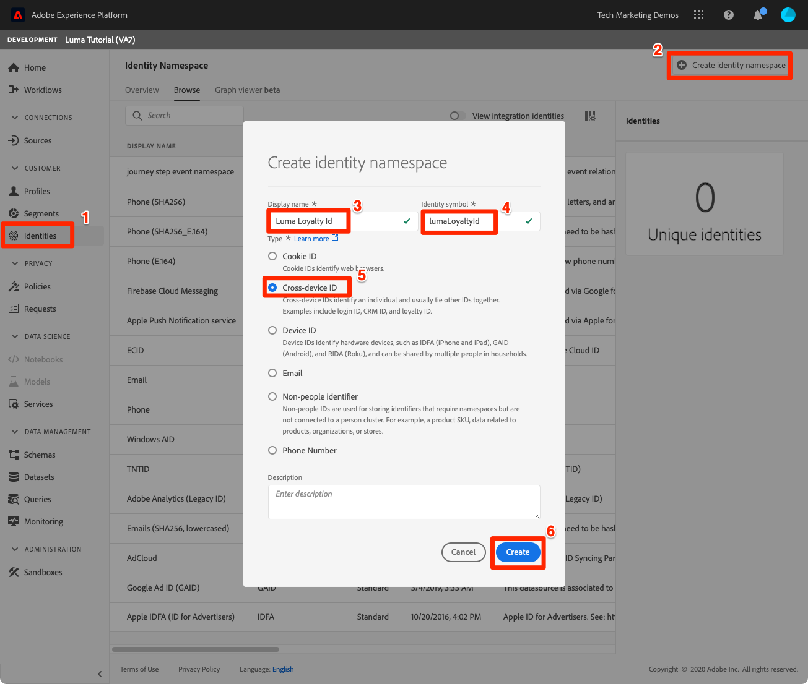
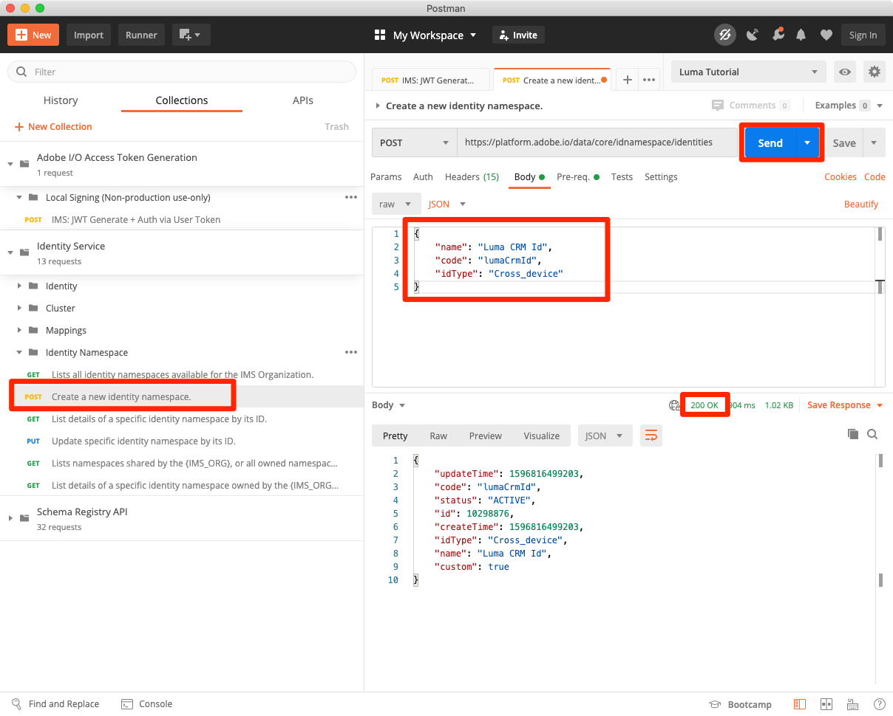
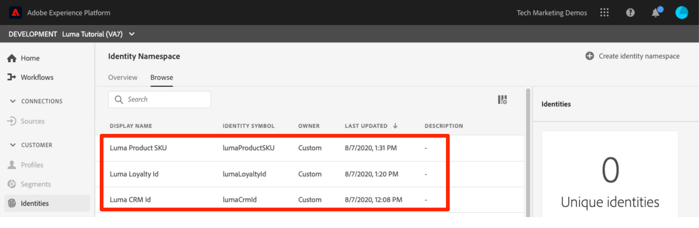
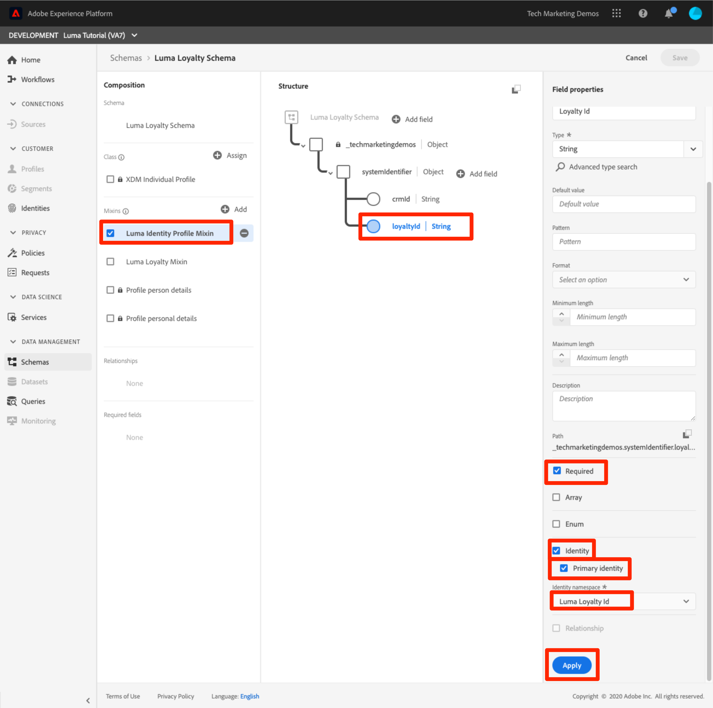
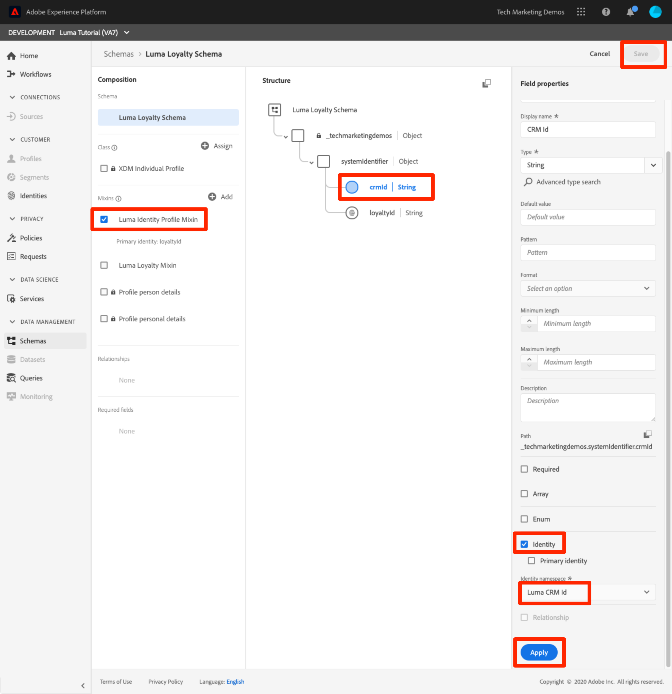
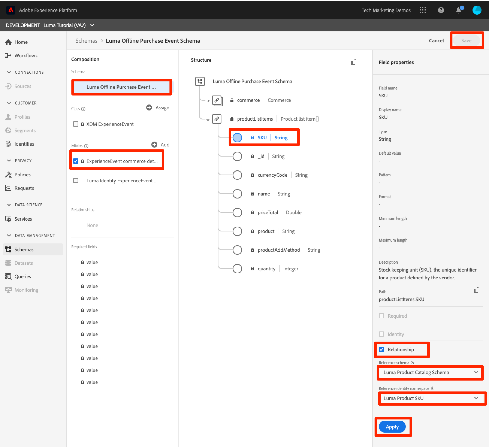

# Map identities

<!-- 30 min-->

In this lesson, we will create identity namespaces and add identity fields to our schemas. After doing so, we'll also be able to complete the setup of our schema relationships from the previous lesson.

Adobe Experience Platform Identity Service helps you to gain a better view of your customer and their behavior by bridging identities across devices and systems, allowing you to deliver impactful, personal digital experiences in real-time. Identity fields and namespaces are the glue that joins different datasources together to build the 360 degree real-time customer profile.

**Data Architects** will need to map identities outside of this tutorial.

Before you begin the exercises, watch this short video to learn more about identity in Adobe Experience Platform:
>[!VIDEO](https://video.tv.adobe.com/v/27841?quality=12&learn=on)

>[!IMPORTANT]
>
>Probabilistic private graphs is still in development and set to release at a later date.

>[!NOTE]
>
>Identity fields are not required if you are only ingesting data into the data lake and are not using real-time customer profiles.

<!--explain identity maps-->
<!--explain the strategy behind the identity selection, how these identities will join all the data together-->

## Permissions required

In the [Configure Permissions](configure-permissions.md) lesson, you set up all the access controls you need to complete this lesson, specifically:

* Permission items **[!UICONTROL Identities]** > **[!UICONTROL View Identity Namespaces]** and **[!UICONTROL Manage Identity Namespaces]**
* Permission item **[!UICONTROL Data Modeling]** > **[!UICONTROL View Schemas]** and **[!UICONTROL Manage Schemas]**
* Permission item **[!UICONTROL Sandboxes]** > `Luma Tutorial`
* User-role access to the `Luma Tutorial Platform` product profile
* Developer-role access to the `Luma Tutorial Platform` product profile (for API)

## Create Identity Namespace

In this exercise we will create identity namespaces for Luma's custom identity fields, `loyaltyId`, `crmId` and `productSku`. Identity namespaces play a critical role in building real-time customer profiles, as two matching values in the same identity namespace allow two data sources to form a robust customer profile.


### Create Namespaces in the UI

Let's start by creating a namespace for the Luma Loyalty Schema:

1. In the Platform UI, click **[!UICONTROL Identities]** in the left navigation
1. You will notice there are a number of out-of-the-box identity namespaces available. Click the **[!UICONTROL Create identity namespace]** button
1. Provide details as following
   
    | Field         |  Value    |  
    |---------------|-----------|
    | Display name  | Luma Loyalty Id    | 
    | Identity symbol| lumaLoyaltyId    |  
    | Type           | Cross-Device      |  

1. Click Create.

    

Now set up another namespace for the Luma Product Catalog Schema with the following details:
   
| Field         |  Value    |  
|---------------|-----------|
| Display name  | Luma Product SKU   | 
| Identity symbol| lumaProductSKU    |  
| Type           | Non-People      |  


## Create Identity Namespace Using API

We will keep doing all of our CRM tasks via API. 

>[!NOTE]
>
>If you'd prefer to skip the API exercises, feel free to just create the CRM namespace via the UI method you just used with the following details:
>
> 1. As the **[!UICONTROL Display name]**, use `Luma CRM Id`
> 1. As the **[!UICONTROL Identity symbol]**, use `lumaCrmId`
> 1. As the **[!UICONTROL Type]**, use Cross-Device

Let's create the Identity Namespace `Luma CRM Id`:

1. Download [Identity Service.postman_collection.json](https://raw.githubusercontent.com/adobe/experience-platform-postman-samples/master/apis/experience-platform/Identity%20Service.postman_collection.json) to your `Luma Tutorial Assets` folder
1. Import the collection into [!DNL Postman]
1. If you haven't made a call in the last 24 hours, your authorization tokens have probably expired. Open the call **[!DNL Adobe I/O Access Token Generation > Local Signing (Non-production use-only) > IMS: JWT Generate + Auth via User Token]** and click **Send** to request new JWT and Access Tokens, just like you did in the Postman lesson.
1. Select the request **[!UICONTROL Identity Service] > [!UICONTROL Identity Namespace] > [!UICONTROL Create a new identity namespace].**
1. Paste the following as the [!DNL Body] of the request:

    ```json
    {
        "name": "Luma CRM Id",
        "code": "lumaCrmId",
        "idType": "Cross_device"
    }
    ```

1. Press the **Send** button and you should get a **200 OK** response: 

    

If you return to the UI, you should now see your three new custom namespaces:



## Label identity fields in schemas

Now that we have our namespaces, the next step is to label our identity fields as such in our schemas.


### Label XDM Fields For Primary Identity

Each schema used with the Real-time Customer Profile is required to have a primary identity specified. And each record ingested must have a value for that field. Additionally, primary identities are used as keys to look up profiles in the profile browser (we will come back to this later). 

Let's add a primary identity to the `Luma Loyalty Schema`:

1. Open the `Luma Loyalty Schema`
1. Select the `Luma Identity Profile Mixin`
1. Select the `loyaltyId` field
1. Check the **[!UICONTROL Identity]** box
1. Check the **[!UICONTROL Primary Identity]** box, too
1. Select the `Luma Loyalty Id` namespace from **[!UICONTROL Identity namespaces]** dropdown
1. Click **[!UICONTROL Apply]** and then press the **[!UICONTROL Save]** button to save your changes

    

Repeat the process for some of your other schema:

1. In the `Luma CRM Schema`, label the `crmId` field as the primary identity using the `Luma CRM Id` namespace
1. In the `Luma Offline Purchase Event Schema`, label the `loyaltyId` field as as the primary identity using the `Luma Loyalty Id` namespace
1. In the `Luma Product Catalog Schema`, label the `productSku` field as as the primary identity using the `Luma Product SKU` namespace

>[!NOTE]
>
>Data collected with the Web SDK is an exception to the typical practice of labeling identity fields in the schema. Web SDK uses something called an Identity Map to label identities *on the implementation side* and thus we will determine the identities for the `Luma Web Events Schema` when we implement the Web SDK on the Luma website. (We will collect the Experience Cloud Visitor ID (ECID) as the primary id and crmId as a secondary id. 

With our selection of primary identities, it's clear to see how `Luma CRM Schema` can connect to the `Luma Offline Purchase Event Schema` since they both use `loyaltyId` as an identifier. But how can we connect our offline purchases to online behavior? How can we classify the products purchase with our product catalog? To do those we will use additional identity fields and complete the set up of our schema relationship.

<!--use a visual-->

### Label XDM Fields For Secondary Identity

Multiple identity fields can be added to a single schema. Additional identities are added as secondary identities. To connect offline purchases to online behavior, we will add add the crmId as a secondary identifier to our `Luma Loyalty Schema` and later in our web events data. Let's update the `Luma Loyalty Schema`:

1. Open the `Luma Loyalty Schema`
1. Select `Luma Identity Profile Mixin`
1. Select `crmId` field
1. Check the **[!UICONTROL Identity]** box
1. Select the `Luma CRM Id` namespace from **[!UICONTROL Identity namespaces]** dropdown
1. Click **[!UICONTROL Apply]** and then press the **[!UICONTROL Save]** button to save your changes

    

## Complete the schema relationships

Now that we have our identity fields labeled, we can complete the setup of the schema relationships between Luma's product catalog and the event schemas:

1. Open the `Luma Offline Purchase Event Schema`
1. Select **[!UICONTROL ExperienceEvent commerce details]** mixin
1. Select **[!UICONTROL productListItems]** > **[!UICONTROL SKU]** field
1. Check the **[!UICONTROL Relationship]** box
1. Select `Luma Product Catalog Schema` as the **[!UICONTROL Reference schema]**
1. Select the `Luma Product Sku` namespace as the **[!UICONTROL Reference Identity namespace]**
1. Click **[!UICONTROL Apply]** and then press the **[!UICONTROL Save]** button to save your changes

    

Repeat this process to create a relationship between the `Luma Web Events Schema` and the `Luma Product Catalog Schema`.

<!--need to verify that the relationship schema works-->

## Additional Resources

* [Identity Service documentation](https://docs.adobe.com/content/help/en/experience-platform/identity/home.html)
* [Identity Service API](https://www.adobe.io/apis/experienceplatform/home/api-reference.html#!acpdr/swagger-specs/id-service-api.yaml)

Now that our identities are in place, we can [create our datasets](create-datasets.md)!