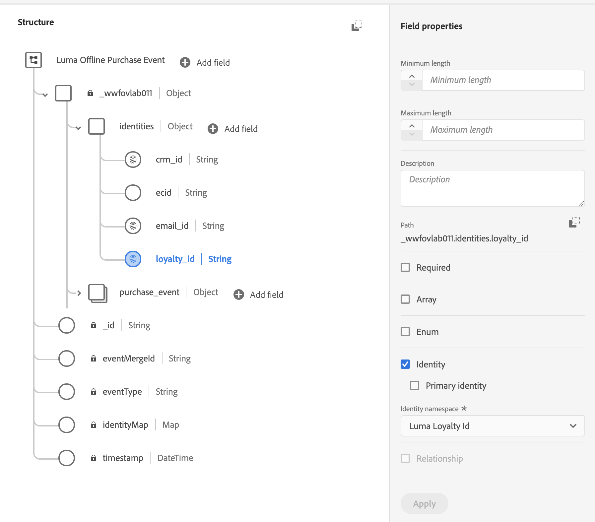
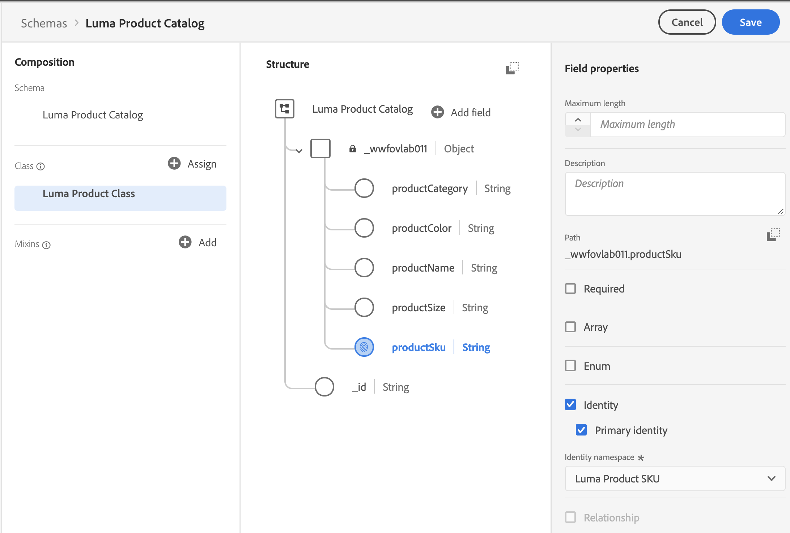

# Map Identities

Adobe Experience Platform Identity Service helps you to gain a better view of your customer and their behavior by bridging identities across devices and systems, allowing you to deliver impactful, personal digital experiences in real-time. 

First, watch this short video to learn more about identity in Adobe Experience Platform:
>[!VIDEO](https://video.tv.adobe.com/v/27841?quality=12&learn=on)

>[!IMPORTANT]
>
>Probabilistic private graphs is still in development and set to release at a later date.

>[!NOTE]
>
>While you can ingest data into Experience Platform's data lake without specifying identity fields, you must label an identity field and primary identity in the schema used by any data that you wish to use in the Real-time Customer Data Platform.

## Permissions required

In the [Configure Permissions](configure-permissions.md) lesson, you setup all the access controls you need to complete this lesson, specifically:

* Permission item **[!UICONTROL Identities]** > **[!UICONTROL Manage Identity Namespaces]**
* Permission item **[!UICONTROL Identities]** > **[!UICONTROL View Identity Namespaces]**
* Permission item **[!UICONTROL Data Modeling]** > **[!UICONTROL View Schemas]**
* Permission item **[!UICONTROL Data Modeling]** > **[!UICONTROL Manage Schemas]**
* Permission item Sandboxes > `Luma Tutorial`
* User-role access to the `Luma Tutorial Platform` product profile
* Developer-role access to the `Luma Tutorial Platform` product profile (for API)

## Create Identity Namespace

In this chapter we will create identity namespaces.


### Exercise : Mark XDM Fields For Identity

1. Go to **Identities** under **Customer** section.
1. Click **Create identity namespace** on top-right of the page.
1. Provide details as following
   
    | Label         |  value    |  
    |---------------|-----------|
    | Display Name  | Luma Loyalty Id    | 
    | Identity Symbol| lumaLoyaltyId    |  
    | Type           | Cross-Device      |  

1. Click Create.

    

1. Repeat the same process with following details:

    | Label         |  value    |  
    |---------------|-----------|
    | Display Name  | Luma Personal Email Id    | 
    | Identity Symbol| lumaPersonalEmail    |  
    | Type           | Cross-Device      | 


1. Repeat the same process with following details:

    | Label         |  value    |  
    |---------------|-----------|
    | Display Name  | Luma Product SKU    | 
    | Identity Symbol| lumaProductSKU   |  
    | Type           | Non-People     | 


## Create Identity Namespace Using API

In this chapter we will create Identity Namespace **crmId** using API


1. In Platform Collection , Go to folder **5-Profile** 
1. Select request **Create Namespace**
1. Verify it's URL and body

    URL

    ```
    https://platform-va7.adobe.io/data/core/idnamespace/identities
    ```

    BODY

    ```
    {
        "name": "Luma CRM ID",
        "code": "lumaCrmId",
        "description": "Luma CRM Id ",
        "idType": "Cross_device"
    }
    ```

1. Press send button and you should get  following response with **Status :200 OK** : 

    ```
    {
        "updateTime": 1593173280928,
        "code": "lumaCrmId",
        "status": "ACTIVE",
        "description": "Luma CRM Id Number",
        "id": 10240716,
        "createTime": 1593173280928,
        "idType": "Cross_device",
        "name": "Luma CRM ID",
        "custom": true
    }
    ```

    

## Identity Service

In this chapter we will mark schemas for primary and secondary namespaces.

### Exercise : Mark XDM Fields For Identity

1. Open schema **Luma Loyalty Members**
1. Select **Luma Loyalty Details** mixin
1. Select **loyaltyId** field under **loyalty** object
1. In Field Properties, Select Identity Checkbox
1. Check **Primary Identity** checkbox.
1. Select **Luma Loyalty Id** namespace from **Identity namespaces** dropdown


1. Press **Apply** button and then press **Save** Button to save changes


### Exercise : Mark XDM Fields For Secondary Identity

1. Open schema **Luma Offline Purchase Event** 
1. Select **Luma Identities Mixin**
1. Go to identities object and select **crmId** field under loyalty object
1. In Field Properties, Select Identity Checkbox
1. Mark Primary Identity , Select **Luma CRM Id** namespace from Identities namespaces
   
1. Select **loyaltyId** field under loyalty object
1. In Field Properties, Select Identity Checkbox
1. Do not Mark Primary Identity , Select **Luma Loyalty Id** namespace from Identities namespaces
    
    
1.  Select **emailId** field under loyalty object
1. In Field Properties, Select Identity Checkbox
1. Do not Mark Primary Identity , Select **Luma Personal Email** namespace from Identities namespaces


### Exercise : Mark Identity in Product Class

1. Open **Luma Product Catalog** Schema
1. Select **Luma Product Class**
1. Select **productSku** field 
1. In field properties, Check Identity & Primary Identity
1. Select **Luma Product SKU** as identifies.
1. Apply & Save.

    


### Exercise : Mark Field For Identity using API 

In this exercise , we will be marking **crmId** as primary identity in **LUMA CRM Schema** using API

```
NOTE TO SME : TODO 
```

### Label identity for Luma Web Data

Data collected with the Web SDK is an exception to the typical practice of labeling identity fields in the schema. Web SDK uses something called an Identity Map to label identities *on the implementation side* and thus we will get to it when we implement the Web SDK on the Luma website.

## Additional Resources

* [Identity Service documentation](https://docs.adobe.com/content/help/en/experience-platform/identity/home.html)
* [Identity Service API](https://www.adobe.io/apis/experienceplatform/home/api-reference.html#!acpdr/swagger-specs/id-service-api.yaml)