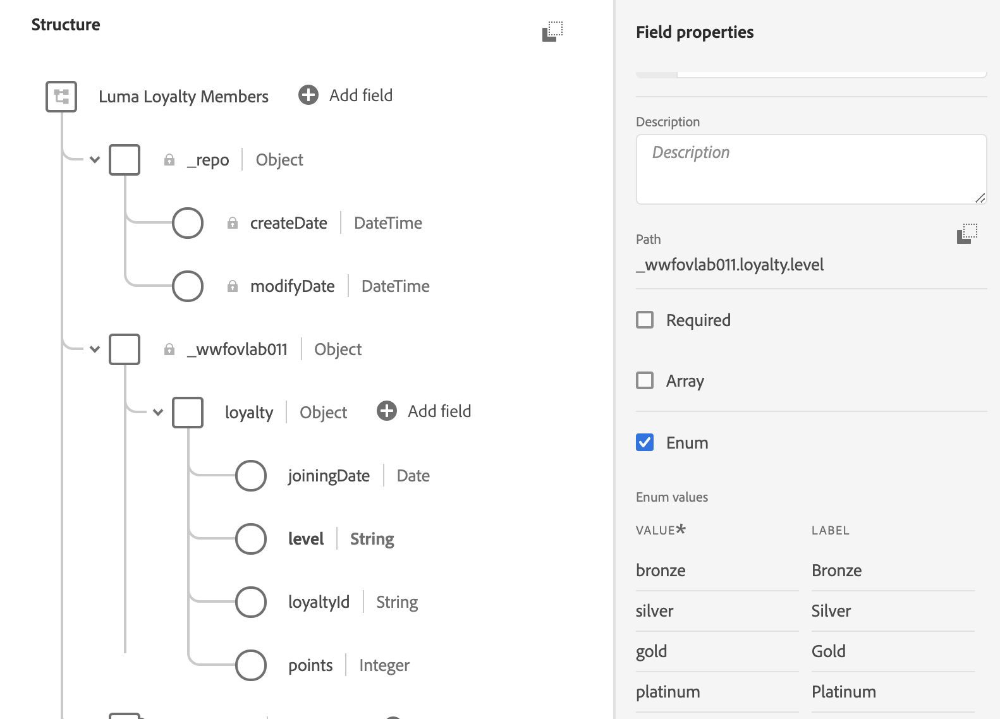
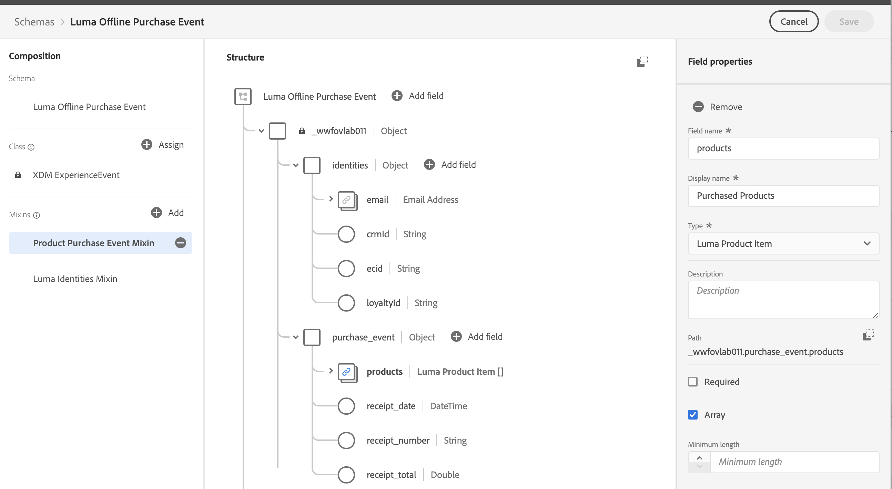
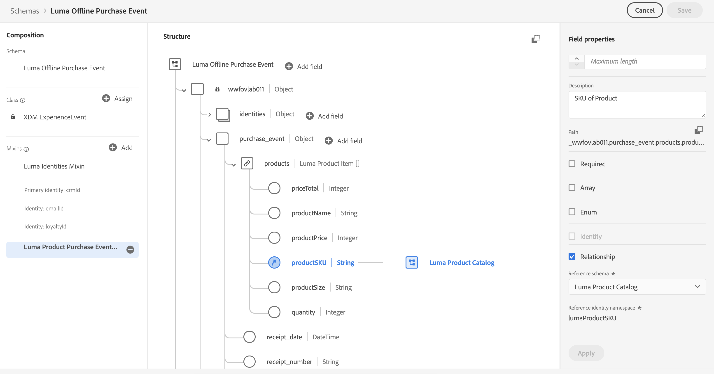

# Model Data in Schemas

Standardization and interoperability are key concepts behind Adobe Experience Platform. Experience Data Model (XDM), driven by Adobe, is an effort to standardize customer experience data and define schemas for customer experience management.

XDM is a publicly documented specification designed to improve the power of digital experiences. It provides common structures and definitions for any application to use to communicate with Platform services. By adhering to XDM standards, all customer experience data can be incorporated into a common representation that can deliver insights in a faster, more integrated way. You can gain valuable insights from customer actions, define customer audiences through segments, and express customer attributes for personalization purposes.

XDM is the foundational framework that allows Adobe Experience Cloud, powered by Experience Platform, to deliver the right message to the right person, on the right channel, at exactly the right moment. The methodology on which Experience Platform is built, **XDM System**, operationalizes Experience Data Model schemas for use by Platform services.

<!--
This seems too lengthy. The video should suffice

Key terms:

* **Schema**: a representation of your data. A schema is comprised of a class and optional mixins and is used to create datasets. A schema includes behavioral attributes, timestamp, identity, attribute definitions, and relationships.
* **XDM Profile Class**: a common schema class used to represent record data
* **XDM ExperienceEvent Class**: a common schema class used to reporesent time-series data
* **Mixin**: allows users to extend reusable fields that contain variables defining one or more attribute intended to be included in a schema or added to a class.
* **Standard Mixin**: an open-source Mixin built to conform to common industry standards, used to accelerate implementation and support repeatable services operating on the data
* **Data type**: a reusable object with properties in a hierarchical representation. These can be standard types or custom-defined defined types to describe your own data in your own way (for example, a collection of fields that you use to describe your products). Unlike Mixins, data types can be used in schemas regardless of the class.
* **Field**: a field is the lowest level element of a schema. Each field has a name for referencing and a type to identify the type of data that it contains. Field types can include, integer, number, string, Boolean and schema.
-->

First, watch this short video to learn more about schemas and the Experience Data Model (XDM):
>[!VIDEO](https://video.tv.adobe.com/v/27105?quality=12&learn=on)


## Permissions required

In the [Configure Permissions](configure-permissions.md) lesson, you setup all the access controls you need to complete this lesson, specifically:

* Permission item **[!UICONTROL Data Modeling]** > **[!UICONTROL View Schemas]**
* Permission item **[!UICONTROL Data Modeling]** > **[!UICONTROL Manage Schemas]**
* Permission item **[!UICONTROL Sandboxes]** > `Luma Tutorial`
* User-role access to the `Luma Tutorial` product profile
* Developer-role access to the `Luma Tutorial` product profile (for API)


## Luma's goals

## Create Luma Loyalty Members schema

In this exercise we will create a Luma Loyalty Schema to ingest loyalty data of customers.

### Create Schema

1. Go to Platform UI and ensure your sandbox is selected.
1. Go to **[!UICONTROL Schemas]** in the left navigation
1. Click the **[!UICONTROL Create Schema]** button on the top right.
1. From the dropdown menu, select **[!UICONTROL XDM Individual Profile]**
  

1. In **[!UICONTROL Schema Properties]**, on the right-hand side of the screen, enter **[!UICONTROL Display Name]** `Luma Loyalty Members`
1. Note that the **[!UICONTROL XDM Individual Profile]** class has already been assigned
1. Click the Add Mixin button:
   
    

1. In the **[!UICONTROL Mixins]** section,  Add following mixins
   1. **[!UICONTROL Profile Personal Details]**
   1. **[!UICONTROL Profile Person Details]**

1. Click **[!UICONTROL Save]** to save the schema.

    

Now take some time to explore the current state of the schema. Note that these two mixins have added standard fields related to a person and their contact details. You may find these two mixins very useful when you create schemas for your own company's data. 

>[!NOTE]
>
>It is okay if a mixin adds a field for a data point that you are not going to upload during the ingestion process. For example, "faxPhone" might be a field for which Luma doesn't actually have data. That's fine. Just because a field is defined in the schema doesn't mean that data for it *needs* to be ingested later on.

### Create & Add Custom Mixin to Schema

Next we need to add fields that are specific to Luma's Loyalty system. As you start using Experience Platform, it is good to become familiar with the industry-standard mixins provided by Adobe. Whenever possible, it is a best-practice to use these mixins as they sometimes power downstream services, for example Customer AI, Attribution AI

1. Go to Mixins section, Click the **[!UICONTROL Add]** button
1.  Select **[!UICONTROL Create new mixin]** radio button
1.  Enter the Display name as `Luma Loyalty Details` and click the **[!UICONTROL Add mixin]** button
1.  From the **[!UICONTROL Mixins]** section of the schema editor, select the newly created mixin
1.  In **[!UICONTROL Structure]** section, click **[!UICONTROL Add field]** at top level in structure of Schema. It will create an object with org name and a field 'New field'.

    

1. In Field Properties section, enter the following
   1. Field Name : `loyalty`
   1. Display Name : `Loyalty`
   1. Type : **[!UICONTROL Object]**
1.  Click **[!UICONTROL Apply]** to save changes
1.  Select the newly created `loyalty` field and click **[!UICONTROL Add Field]** button next to it
1.  Create a field with following values

    **Loyalty ID**

    | Variable          |  Value     |  
    |-------------------|------------|
    | Field Name        | loyaltyId  | 
    | Display Name      | Loyalty ID |  
    | Type              | String     |  
    | Required          | True       |  


1.  Repeat Step 8 and 9 for 3 more fields.


    **Member Since**


      | Variable          |  Value     |  
      |-------------------|------------|
      | Field Name        | memberSince  | 
      | Display Name      | Member Since |  
      | Type              | Date     |  
 

     **Points**


    | Variable          |  Value     |  
    |-------------------|------------|
    | Field Name        | points     | 
    | Display Name      | Points     |  
    | Type              | Integer    |  
    | Default           | 0          |  


     **Loyalty Level**

    | Variable          |  Value    |  
    |-------------------|-----------|
    | Field Name        | level     | 
    | Display Name      | Level     |  
    | Type              | String    |  
    | Enum              | Checked   |  

    **Enum Values** : Add following values to enum  :
    | Value              |  Label    |  
    |-------------------|-----------|
    | bronze            | Bronze    | 
    | silver            | Silver    |  
    | gold              | Gold      |  
    | platinum          | Platinum  |  
    
   
1. Click **[!UICONTROL Apply]** and **[!UICONTROL Save]** 
1. Verify your final Schema.

## Exercise: Create data types

Custom mixins, such as your new Luma Loyalty Details Mixin, can be reused in other schemas, allowing you to enforce standard data definitions for fields used in multiple systems. Mixins, however, are specific to a base class and can only be reused in schemas that share the same base class. So, while the Luma Loyalty Details mixin can be reused in other schemas using the XDM Profile class, it cannot be used in schemas using other classes.

The data type is another multi-field construct which can be reused in schemas across multiple classes. When we specified our loyalty fields with types of "object", "string", "integer", and "date"

### Create a data type via the UI

### Create a data type via the API


```json

{
        "title":"Luma System Identifiers",
        "description":"Various identifiers used in Luma's tech stack",
        "type":"object",
        "properties": {
          "loyaltyId": {
            "type":"string",
            "title": "Loyalty Id",
            "description": "The customer's id in the Loyalty system."
          },
          "crmId": {
            "type":"string",
            "title": "CRM Id",
            "description": "The customer's id in the CRM system"
          }
        }
} 

```

Should I just create
Should i do product data type for online/offline

## Exercise: Create Luma CRM Schema

Now we will create a schema using the API. 

### Add the schema

1. 
First we need to create the schema

1. Open Postman
1. If you haven't made a call in a while your token might have expired. Open the call **[!DNL Adobe I/O Access Token Generation > Local Signing (Non-production use-only) > IMS: JWT Generate + Auth via User Token]** and click **Send** to request new JWT and Access Tokens
1. Open your environment variables and change the value of **CONTAINER_ID** from global to tenant
1. Open the call **[!DNL Schema Registry API > Schemas > Create a new tenant-defined schema]**
1. Open the Body tab and paste the following code and click **Send** to make the API call. This will create a new schema using the same `XDM Individual Profile` base class that was used in the Loyalty schema:

    ```json
    {
    "type": "object",
    "title": "Luma CRM",
    "description": "Schema for CRM data of Luma Retail ",
    "allOf": [
      {
        "$ref": "https://ns.adobe.com/xdm/context/profile"
      }
      ]
    }
    ```

1. You should get a "201 Created" response
1. Copy `meta:altId` from Response body. We will use it later in exercise.
1. The new schema should be visible in the UI but without any mixins


    >[!NOTE]
    > Common issues making this call:
    >
    > 1. No auth token
    >   Run the **IMS: JWT Generate + Auth via User Token** call to generate new tokens
    > 1. `401: Not Authorized to PUT/POST/PATCH/DELETE for this path : /global/schemas/`
    >   Update the **CONTAINER_ID** environment variable from `global` to `tenant`
    > 1. `403: PALM Access Denied. POST access is denied for this resource from access control`

### Add the Mixins to the Schema

1. In Postman, open the call, open the call **[!DNL Schema Registry API > Schemas > Modify or update part of a tenant-defined schema]**
1. In the **Params** tab, paste the `meta:altId` value from the previous response as the `$id`
1. Open the Body tab and paste the following code and click **Send** to make the API call. This will add the three standard mixins to your `Luma CRM` schema:

    ```json
    [
      { 
        "op": "add",
        "path": "/allOf/-",
        "value":  
        {
          "$ref": "https://ns.adobe.com/xdm/context/profile-personal-details"
          }
        },
        { 
          "op": "add",
          "path": "/allOf/-",
          "value":  
          {
            "$ref": "https://ns.adobe.com/xdm/context/profile-person-details"
          }
        },
        { "op": "add",
        "path": "/allOf/-",
        "value":  
          {
          "$ref": "https://ns.adobe.com/xdm/context/profile-preferences-details"
          }
        }
    ]
    ```

1. You should get a 200 OK status for the response and the mixins should be visible as part of your schema in the UI


## Exercise: Add Offline Purchase Event Schema


Now we have required datatype and custom mixin available, we will now create **Luma Offline Purchase Schema** based on **XDM ExperienceEvent** class.

### Create Schema

1. Go to **Schemas** under **Data Management**.
1. Click **Create Schema** in top left
1. Provide Display Name **Luma Offline Purchase Event**
1. Assign class **XDM ExperienceEvent**
1. Save it and review the difference in base structure, Notice _id and timestamp are required fields in experience event class.

    


### Add Mixins and Fields

#### Adding Luma Identities Mixin

1. Go to Mixins section, and click Add button.
1. Search for **Luma Identities Mixin** and press **Add mixin**

##### Adding Luma Purchase Event Mixin

1. Now we will create another mixin for Purchase Event.
1. Add Mixin > Create New Mixin
1. Provide Label **Luma Product Purchase Event Mixin** and click **Add mixin**
1. Select **Luma Product Purchase Event Mixin** and click **Add Field** icon at top of Schema Structure to add field.
1. Provide following details in field properties

| Field         |  Value          |  
|---------------|-----------------|
| Field Name    | purchase_event  | 
| Display name  | Purchase Event  |  
| Type          | Object          | 


1. Select **purchase_event** object and click **Add Field** icon to add following fields one by one.

**Receipt Number**

| Field         |  Value          |  
|---------------|-----------------|
| Field Name    | receipt_number  | 
| Display name  | Receipt Number  |  
| Type          | String          | 
| Required      | Check           | 


**Receipt Date**

| Field         |  Value          |  
|---------------|-----------------|
| Field Name    | receipt_date    | 
| Display name  | Receipt Date    |  
| Type          | DateTime        | 
| Required      | Check           | 


**Products**

| Field         |  Value             |  
|---------------|--------------------|
| Field Name    | products           | 
| Display name  | Purchased products |  
| Type          | Luma Product Item | 
| Array         | Check              | 


**Receipt Total**

| Field         |  Value          |  
|---------------|-----------------|
| Field Name    | receipt_total    | 
| Display name  | Receipt Total   |  
| Type          | Double          | 


#### Verify Final Schema

Click Apply and Save and your schema should look like following



## Add Web Event Schema

Now we are going to add one more schema for Luma's website data. By this point you should be an expert creating schema. I will keep the 

| Property         |  Value          |  
|---------------|-----------------|
| Schema Name    | Luma Web Events    | 
| Class  | XDM ExperienceEvent   |  
| Mixin          | AEP Web SDK          | 
| Mixin          | AEP Web SDK          | 

Luma Identities Mixin ( Custom Mixin)
Profile Personal Details
Profile Person Details
Profile Preferences Details

Schemas

* Luma Loyalty Members (UI)
  * Profile Person Details
  * Profile Personal Details
  * Custom Luma Loyalty Mixin
    * loyaltyId primary Id from data type
    * level
    * points
    * memberSince
  * Create Identity data type
* Luma CRM (API)
* Luma Web Events (UI)
  * AEP Web SDK Mixin
  * Commerce Mixin
* Luma Offline Purchases (API)
* Create Class
* Luma Products
* Relationship schema


## Create an Event-based Schema

In this tutorial we will be ingesting data from the following sources:

Abhishek

* Schema: Luma Loyalty Members
  * Profile Personal Details
  * Profile Person Details
  * Custom Mixin
    * loyalty object
    * loyaltyId
    * joiningDate
    * points
    * loyaltyLevel
* Data Type - Luma Product Item
  * productSKU
  * productName
  * productPrice
  * quantityPurchased
  * productTotal
  * productSize
* Mixin with API-- Luma Identities
* Schema: Luma Offline Purchase Event
  * Luma Identities
  * Luma Product Purchase Event Mixin
    * purchase_event
    * receipt_number
    * receipt_date
    * products (uses Luma Product Item data type)
    * receipt_total
* Schema with Custom Class: 
  * Schema: Luma Product Catalog
  * Custom Class: Luma Product Class
  * productName
  * productCategory
  * productColor
  * productSku
  * productSize
* Schema with API
  * CRM Schema
    * Luma Identities Mixin
    * Profile Personal Details
    * Profile Person Details
    * Profile Preferences Details


DMA

* CRM Schema
  * Profile work details
  * Profile person details
  * Profile personal details
  * Custom Identity Mixin
    * crmid
    * declaredId
    * emailId
    * phoneNbr
* Loyalty Schema
  * Custom Identity Mixin
    * add loyaltyId
  * Custom Loyalty Mixin
    * lifeTimeValue
    * loyaltyExpDate
    * loyaltyPoints
    * loyaltyStatus
* Offline Purchase Schema
  * SKU
  * Product Name
  * Price
  * Quantity
  * priceTotal
  * currencyCode
  * loyaltyId
  * receipt_nbr
  * Order Date
  * timestamp

* Website
* CRM system
* Loyalty system
* Offline purchases

We'll be starting with the CRM schema because we can build it quickly using a few standard mixins. For Luma, the fields they want to onboard into Platform from their own CRM system are:
Id
crmId
person_first_name
person_last_name
birthdate
gender
work_country
work_countryCode
work_postalCode
work_Street
work_email
home_address_city
home_address_country
home_address_country_code
home_address_country_street
home_address_country_label
home_address_country_state
home_phone
mobile_phone
personalEmail
As you go through these steps, see if you can determine which CRM fields match to which XDM fields.

### Relationship schemas

Firstly we need to establish relationship between **Luma Offline Purchase Event** schema with **Luma Product Catalog** Schema

1. Go to **Luma Offline Purchase Event**
1. Select **Luma Offline Purchase Event** mixin
1. Navigate to **_tenant > purchase_event > products** 
1. Select **productSku**
1. In field properties, mark checkbox for **Relationship**
1. In **Reference Schema** , Select **Luma Product Catalog**
1. **Reference identity namespace** will be automatically selected as **lumaProductSKU**
   
1. Apply & Save.
1. Now go back to **Luma Offline Purchase Event** dataset and re-ingest data

## Additional Resources

* [Experience Data Model (XDM) System documentation](https://docs.adobe.com/content/help/en/experience-platform/xdm/home.html)
* [Schema Registry API](https://www.adobe.io/apis/experienceplatform/home/api-reference.html#!acpdr/swagger-specs/schema-registry.yaml)