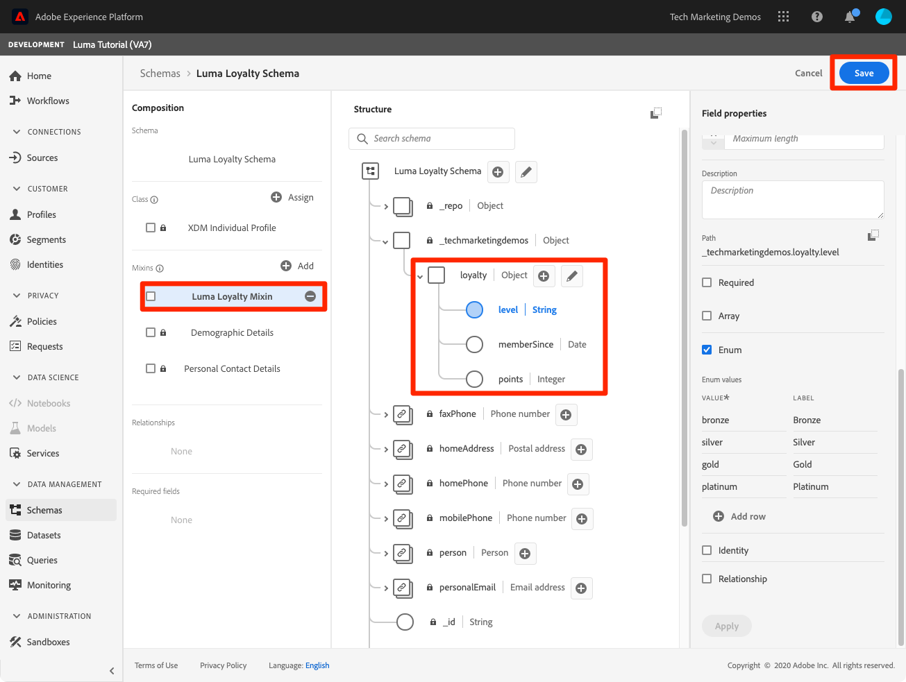

# Model Data in Schemas

In this lesson, you will model Luma's data into schemas. This is one of the longest lessons in the tutorial, so get a glass of water and buckle up!

Standardization and interoperability are key concepts behind Adobe Experience Platform. Experience Data Model (XDM), driven by Adobe, is an effort to standardize customer experience data and define schemas for customer experience management.

XDM is a publicly documented specification designed to improve the power of digital experiences. It provides common structures and definitions for any application to use to communicate with Platform services. By adhering to XDM standards, all customer experience data can be incorporated into a common representation that can deliver insights in a faster, more integrated way. You can gain valuable insights from customer actions, define customer audiences through segments, and express customer attributes for personalization purposes.

XDM is the foundational framework that allows Adobe Experience Cloud, powered by Experience Platform, to deliver the right message to the right person, on the right channel, at exactly the right moment. The methodology on which Experience Platform is built, **XDM System**, operationalizes Experience Data Model schemas for use by Platform services.

<!--
This seems too lengthy. The video should suffice

Key terms:

* **Schema**: a representation of your data. A schema is comprised of a class and optional mixins and is used to create datasets. A schema includes behavioral attributes, timestamp, identity, attribute definitions, and relationships.
* **XDM Profile Class**: a common schema class used to represent record data
* **XDM ExperienceEvent Class**: a common schema class used to represent time-series data
* **Mixin**: allows users to extend reusable fields that contain variables defining one or more attribute intended to be included in a schema or added to a class.
* **Standard Mixin**: an open-source Mixin built to conform to common industry standards, used to accelerate implementation and support repeatable services operating on the data
* **Data type**: a reusable object with properties in a hierarchical representation. These can be standard types or custom-defined defined types to describe your own data in your own way (for example, a collection of fields that you use to describe your products). Unlike Mixins, data types can be used in schemas regardless of the class.
* **Field**: a field is the lowest level element of a schema. Each field has a name for referencing and a type to identify the type of data that it contains. Field types can include, integer, number, string, Boolean and schema.
-->

**Data Architects** will need to create schemas outside of this tutorial, but **Data Engineers** will work very closely with the schemas created by the Data Architect.

First, watch this short video to learn more about schemas and the Experience Data Model (XDM):
>[!VIDEO](https://video.tv.adobe.com/v/27105?quality=12&learn=on)

## Permissions required

In the [Configure Permissions](configure-permissions.md) lesson, you setup all the access controls you need to complete this lesson, specifically:

* Permission item **[!UICONTROL Data Modeling]** > **[!UICONTROL View Schemas]**
* Permission item **[!UICONTROL Data Modeling]** > **[!UICONTROL Manage Schemas]**
* Permission item **[!UICONTROL Sandboxes]** > `Luma Tutorial`
* User-role access to the `Luma Tutorial Platform` product profile
* Developer-role access to the `Luma Tutorial Platform` product profile (for API)


<!--
## Luma's goals
-->

## Create Loyalty Schema via UI

In this exercise we will create a Luma Loyalty Schema to ingest loyalty data of customers.

1. Go to Platform's UI and ensure your sandbox is selected.
1. Go to **[!UICONTROL Schemas]** in the left navigation
1. Click the **[!UICONTROL Create Schema]** button on the top right
1. From the dropdown menu, select **[!UICONTROL XDM Individual Profile]**
  

1. In **[!UICONTROL Schema Properties]**, on the right-hand side of the screen, enter **[!UICONTROL Display Name]** `Luma Loyalty Schema`

### Add standard mixins

Fields are added to schemas by adding mixins. You can choose from a large set of industry-standard mixins provided by Adobe or create your own. As you start modeling your own data in Experience Platform, it is good to become familiar with the industry-standard mixins provided by Adobe. Whenever possible, it is a best-practice to use them as they sometimes power downstream services, such as Customer AI, Attribution AI, Adobe Analytics, etc.

To add mixins:

1. On the left side of the schema editor, in the **[!UICONTROL Mixin]** section, click the **[!UICONTROL Add]** button:
   
    

1. In the **[!UICONTROL Mixins]** modal, select following mixins
   1. **[!UICONTROL Profile Personal Details]**
   1. **[!UICONTROL Profile Person Details]**
1. Note that you can preview the fields in the mixin by clicking the icon on the right side of the row. 
1. Click **[!UICONTROL Add mixin]** to add the mixins to the schema
    


Now take some time to explore the current state of the schema. Note that these two mixins have added standard fields related to a person and their contact details. You may find these two mixins useful when you create schemas for your own company's data. Click a specific mixin row or check the box next to the mixin name to see how the visualization changes. 


>[!NOTE]
>
>It is okay if a mixin adds a field for a data point that you don't collect. For example, "faxPhone" might be a field for which Luma doesn't collect data. That's fine. Just because a field is defined in the schema doesn't mean that data for it *needs* to be ingested later on.

### Add custom mixins

Next we need to add fields that are specific to Luma's Loyalty system and which don't exist in any standard mixins. For that you can create your own mixins.

1. In the **Mixins** section of the schema editor, click the **[!UICONTROL Add]** button again
1.  Select **[!UICONTROL Create new mixin]** radio button
1.  Enter the Display name as `Luma Loyalty Mixin` and click the **[!UICONTROL Add mixin]** button
    
1.  In the **Mixins** section of the schema editor, select the newly created mixin
1.  In **[!UICONTROL Structure]** section, click **[!UICONTROL Add field]** at top level in structure of Schema. It will create an object with your tenant id and a field _'New field'_.

1. In **[!UICONTROL Field properties]** section, enter the following
   1. Field Name: `loyalty`
   1. Display Name: `Loyalty`
   1. Type: **[!UICONTROL Object]**
1.  Click **[!UICONTROL Apply]** to add the field

    

1.  Select the newly created `loyalty` object and click **[!UICONTROL Add Field]** button next to it to add a field within the object
1.  Create a field with following values
       1. Field Name: `memberSince`
       1. Display Name: `Member Since`
       1. Type: **[!UICONTROL Date]**

1.  Repeat Step 8 and 9 to add two more fields within the `loyalty` object:
    1.  Points
           1. Field Name: `points`
           1. Display Name: `Points`
           1. Type: **[!UICONTROL Integer]**
           1. Default: 0
    1. Level
       1. Field Name: `level`
       1. Display Name: `Level`
       1. Type : **[!UICONTROL String]**
       1. Enum: Checked, with the following enum values:
          | Value              |  Label    |  
          |-------------------|-----------|
          | bronze            | Bronze    | 
          |   silver            | Silver    |  
          | gold              | Gold      |  
          | platinum          | Platinum  |  

   
1. Click **[!UICONTROL Save]** to save the current state of your schema, which should look like this:

     

Now we will create another mixin to contain the loyaltyId field, as well as other identifiers which we will use in the other schemas. Since you are now familiar with how to create mixins, create one named `Luma Identity Profile Mixin` with an object called `systemIdentifier` containing the following fields, *both of type 'string'*:

   1. loyaltyId
   1. crmId

Your new mixin should look like this. Click the **[!UICONTROL Save]** button to save your schema, but leave the schema open for the next exercise. 
     


## Create a data type

Mixins, such as your new `Luma Loyalty Mixin`, can be reused in other schemas, allowing you to enforce standard data definitions across multiple systems. Mixins however can only be reused _in schemas that share the same class_, in this case the XDM Profile Class.

The data type is another multi-field construct which can be reused in schemas _across multiple classes_. Let's convert our new `systemIdentifier` object into a new data type:

With the `Luma Loyalty Schema` still open, select the `systemIdentifier` object and click the **[!UICONTROL Convert to new data type]**

 

We will use this data type later in the lesson.


## Create CRM Schema via API

Now we will create a schema using the API. 

>[!NOTE]
>
>Data engineers, feel free to just create the CRM schema via the UI method you just used, if you'd like:
>
> 1. Use the [!UICONTROL XDM Profile] class
> 1. Name it `Luma CRM Schema`
> 1. Use the following mixins: Profile Person Details, Profile Personal Details, Profile Preferences Details and Luma Identity Profile Mixin

First we will create the empty schema:

1. Open [!DNL Postman]
1. If you haven't made a call in the last 24 hours, your authorization tokens have probably expired. Open the call **[!DNL Adobe I/O Access Token Generation > Local Signing (Non-production use-only) > IMS: JWT Generate + Auth via User Token]** and click **Send** to request new JWT and Access Tokens, just like you did in the [!DNL Postman] lesson.
1. Open your environment variables and change the value of **CONTAINER_ID** from `global` to `tenant`
1. Open the call **[!DNL Schema Registry API > Schemas > Create a new tenant-defined schema]**
1. Open the Body tab and paste the following code and click **Send** to make the API call. This will create a new schema using the same `XDM Individual Profile` base class that was used in the Loyalty schema:

    ```json
    {
    "type": "object",
    "title": "Luma CRM Schema",
    "description": "Schema for CRM data of Luma Retail ",
    "allOf": [
      {
        "$ref": "https://ns.adobe.com/xdm/context/profile"
      }
      ]
    }
    ```

1. You should get a `201 Created` response
1. Copy `meta:altId` from Response body. We will use it later in another exercise.
   

1. The new schema should be visible in the UI but without any mixins
   

>[!NOTE]
>
> The `meta:altId` or schema id can also be obtained by making the API request **[!DNL Schema Registry API > Schemas > List all schemas within the specified container.]** in the tenant container or by opening the schema in the UI and extracting it from the URL.

>[!TIP]
>
> Common issues making this call and likely fixes:
>
> * No auth token: Run the **IMS: JWT Generate + Auth via User Token** call to generate new tokens
> * `401: Not Authorized to PUT/POST/PATCH/DELETE for this path : /global/schemas/`: Update the **CONTAINER_ID** environment variable from `global` to `tenant`
> * `403: PALM Access Denied. POST access is denied for this resource from access control`: Verify your user permissions in the Admin Console

### Add standard mixins

Now it's time to add the mixins to the schema:

1. In [!DNL Postman], open the call **[!DNL Schema Registry API > Schemas > Modify or update part of a tenant-defined schema]**
1. In the **Params** tab, paste the `meta:altId` value from the previous response as the `$id`
1. Open the Body tab and paste the following code and click **Send** to make the API call. This will add the three standard mixins to your `Luma CRM Schema`:

    ```json
    [
      { 
        "op": "add",
        "path": "/allOf/-",
        "value":  
        {
          "$ref": "https://ns.adobe.com/xdm/context/profile-personal-details"
          }
        },
        { 
          "op": "add",
          "path": "/allOf/-",
          "value":  
          {
            "$ref": "https://ns.adobe.com/xdm/context/profile-person-details"
          }
        },
        { "op": "add",
        "path": "/allOf/-",
        "value":  
          {
          "$ref": "https://ns.adobe.com/xdm/context/profile-preferences-details"
          }
        }
    ]
    ```

1. You should get a 200 OK status for the response and the mixins should be visible as part of your schema in the UI

### Add custom mixin

Now let's add our Identity Profile Mixin to the schema. Looking at the Body of the request from our last call, how do we know what `$ref` value to use for our custom mixin? We can find the value by using a list API:

1. Open the call **[!DNL Schema Registry API > Schemas > Return a list of all mixins within the specified container.]**
1. In the **Headers** tab, update the **Accept** header to `application/vnd.adobe.xed-id+json`
1. Click the **Send** button
1. Grab the `$id` value (which will be different from this screenshot)
   

Now see if you can modify the request Body from the request used to add the standard mixins to add the `Luma Identity Profile Mixin`. It should look something like this (with a different `$ref` value)
   

Verify that the mixin has been added to the schema by checking the UI or, for bonus points, see if you can figure out how to list the mixins in the schema using the **[!DNL Lookup a specific schema by its unique ID]** call in the [!DNL Postman] collection.

## Create Offline Purchase Events Schema

Now let's create a schema based on the **[!UICONTROL XDM ExperienceEvent]** class for Luma's offline purchase data. Since you are now getting familiar with the schema editor UI, I will reduce the number of screenshots in the instructions:

1. Create a schema with the **[!UICONTROL XDM ExperienceEvent]** class named `Luma Offline Purchase Events Schema`
1. Save it and review the difference in base structure from the XDM Profile class schemas. Notice _id and timestamp are required fields in experience event class.

    


We will add a standard mixin and a custom mixin.

### Add standard mixin

**[!UICONTROL Experience event commerce details]** is a standard mixin for capturing common order details. Go ahead and add it to your schema.

### Add custom mixin

Now let's add the identities to our new schema:

1. In the **[!UICONTROL Mixins]** section, and click the **[!UICONTROL Add]** button.
1. Search for `Luma Identity Profile Mixin`. Note that it is not available! This is because our new schema has a different base class and mixins are only available to schema of the same class. We will add a new mixin for the ExperienceEvent class that contains the same identity fields via our data type
1. Select the **[!UICONTROL Create new mixin]** radio button
1. Enter the **[!UICONTROL Display name]** as `Luma Identity ExperienceEvent Mixin` and click the **[!UICONTROL Add mixin]** button
1. In the **Mixins** section of the schema editor, select the newly created mixin
1. In **[!UICONTROL Structure]** section, click **[!UICONTROL Add field]** at top level of the schema
1. Enter `systemIdentifier` as the **[!UICONTROL Field Name]**
1. Enter `System Identifier` as the **[!UICONTROL Display Name]**
1. Select **System Identifier** as the **[!UICONTROL Type]**
1. Click the **[!UICONTROL Apply]** button 
1. Click the **[!UICONTROL Save]** button to save your schema

Note how the data type added all of the fields!


## Create Web Events Schema

Now we are going to add one more schema for Luma's website data. By this point you should be an expert creating schema! Build the following schema with these properties

| Property         |  Value          |  
|---------------|-----------------|
| Schema Name    | Luma Web Events Schema   | 
| Class  | XDM ExperienceEvent   |  
| Mixin          | AEP Web SDK ExperienceEvent Mixin  | 
| Mixin          | Consumer ExperienceEvent mixin       | 

Click on the **[!UICONTROL Consumer ExperienceEvent mixin]** in the **[!UICONTROL Composition]** section of the schema editor. Note that this mixin contains the commerce and productListItems objects that were also in the **[!UICONTROL Experience event commerce details]**. Indeed **[!UICONTROL Consumer ExperienceEvent mixin]** is a combination of several other standard mixins that are also available separately.

Notice that we didn't add the `Luma Identity ExperienceEvent Mixin` to this schema. This is because the Web SDK has a different way of collecting identities. If you select the **[!UICONTROL XDM ExperienceEvent]** class in the **[!UICONTROL Composition]** section of the schema editor, you will notice that one of the fields it adds by default is called **[!UICONTROL IdentityMap]**. [!DNL IdentityMap] is used by various Adobe applications to link to Platform. You will see how identities are sent to Platform in the Web SDK lesson.


## Create Product Catalog Schema

By using the  [!UICONTROL Experience event commerce details] and [!UICONTROL Consumer ExperienceEvent mixins]), Luma reports details of product-related events via the standard productListItems data type. But they also have additional product detail fields that they would like to send to Platform. Instead of capturing these fields in their point-of-sale and e-commerce systems and ingesting them into Platform using the schemas you just created, Luma would prefer to simply ingest these fields directly from their product catalog system. A "relationship schema" in Platform allows you to define a relationship between two schemas for the purposes of classification. Luma will use a relationship schema to classify their product details. We will begin the process now and complete it at the end of the next lesson.

>[!NOTE]
>
>If you are an existing Analytics or Target customer, classifying entities with relationship schema is analogous to SAINT classifications or uploading your product catalog for Recommendations

First we need to create a schema for Luma's product catalog using a custom class:

1. Click the **[!UICONTROL Create schema]** button and select the **[!UICONTROL Browse]** option from the dropdown
  
1. Select the **[!UICONTROL Create new class]** radio button
1. Name it `Luma Product Catalog Class`
1. Leave the **[!UICONTROL Behavior]** as **[!UICONTROL Record]**
1. Click the **[!UICONTROL Assign Class]** button
  
1. Name the schema `Luma Product Catalog Schema`
1. Add a new mixin with the following fields:
   1. productName: String
   1. productCategory: String
   1. productColor: String
   1. productSku: String | Required
   1. productSize: String
   1. productPrice: Double
1. Save the schema
  
Your new schema should look like this:
  

The next step is to define the relationship between the two ExperienceEvent schemas and the `Luma Product Catalog Schema`. There are a few additional steps that need to be taken in the next lesson before we can define the relationship.


## Additional Resources

* [Experience Data Model (XDM) System documentation](https://docs.adobe.com/content/help/en/experience-platform/xdm/home.html)
* [Schema Registry API](https://www.adobe.io/apis/experienceplatform/home/api-reference.html#!acpdr/swagger-specs/schema-registry.yaml)


Now that you have your schemas you can [map identities](map-identities.md)!