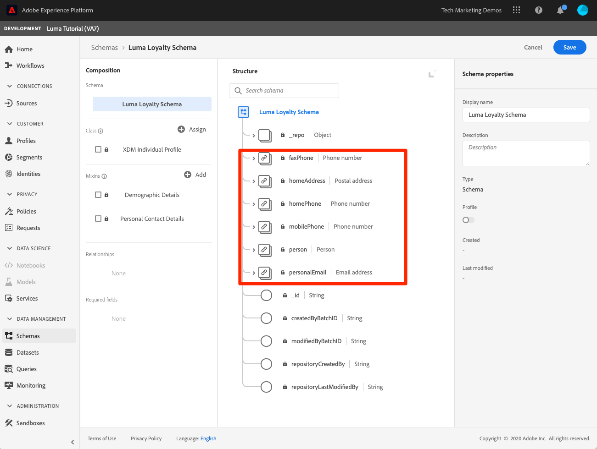
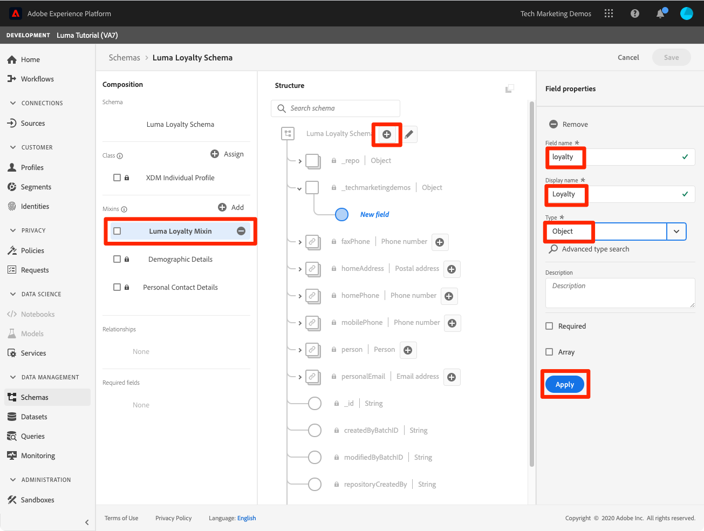

# Model Data in Schemas

## Intro to XDM

Explain Schemas, Mixins, Fields, and Datatypes

Data Type
Mixin
Schema

## Luma's goals

## Exercise: Create Luma Loyalty Members schema

In this exercise we will create a Luma Loyalty Schema to ingest loyalty data of customers.

### Create Schema

1. Go to Platform UI and ensure your sandbox is selected.
1. Go to **[!UICONTROL Schemas]** in the left navigation
1. Click the **[!UICONTROL Create Schema]** button on the top right.
1. From the dropdown menu, select **[!UICONTROL XDM Individual Profile]**
  

1. In **[!UICONTROL Schema Properties]**, on the right-hand side of the screen, enter **[!UICONTROL Display Name]** `Luma Loyalty Members`
1. Note that the **[!UICONTROL XDM Individual Profile]** class has already been assigned
1. In the **[!UICONTROL Mixins]** section,  Add following mixins
   1. **[!UICONTROL Profile Personal Details]**
   1. **[!UICONTROL Profile Person Details]**

1. Click **[!UICONTROL Save]** to save the schema.

  

Now take some time to explore the current state of the schema. Note that these two mixins have added standard fields related to a person and their contact details. You may find these two mixins very useful when you create schemas for your own company's data. It's worth noting, too, that it is okay if a mixin adds a field for a data point that you are not going to upload during the ingestion process. For example, "faxPhone" might be a field for which Luma doesn't actually have data. That's fine. Just because a field is defined in the schema doesn't mean that data for it *needs* to be ingested later on.

### Create & Add Custom Mixin to Schema

Next we need to add fields that are specific to Luma's Loyalty system. As you start using Experience Platform, it is good to become familiar with the industry-standard mixins provided by Adobe. Whenever possible, it is a best-practice to use these mixins as they sometimes power downstream services, for example Customer AI, Attribution AI

1. Go to Mixins section, Click the **[!UICONTROL Add]** button
1.  Select **[!UICONTROL Create new mixin]** radio button
1.  Enter the Display name as `Luma Loyalty Details` and click the **[!UICONTROL Add mixin]** button
1.  From the **[!UICONTROL Mixins]** section of the schema editor, select the newly created mixin
1.  In **[!UICONTROL Structure]** section, click **[!UICONTROL Add field]** at top level in structure of Schema. It will create an object with org name and a field 'New field'.

    

1. In Field Properties section, enter the following
   1. Field Name : `loyalty`
   1. Display Name : `Loyalty`
   1. Type : **[!UICONTROL Object]**
1.  Click **[!UICONTROL Apply]** to save changes
1.  Select the newly created `loyalty` field and click **[!UICONTROL Add Field]** button next to it
1.  Create a field with following values

    **Loyalty ID**

    | Variable          |  Value     |  
    |-------------------|------------|
    | Field Name        | loyaltyId  | 
    | Display Name      | Loyalty ID |  
    | Type              | String     |  
    | Required          | True       |  

1.  Repeat Step 8 and 9 for 3 more fields.

    **Joining Date**

      | Variable          |  Value     |  
      |-------------------|------------|
      | Field Name        | memberSince  | 
      | Display Name      | Member Since |  
      | Type              | Date     |  
 

     **Points**

    | Variable          |  Value     |  
    |-------------------|------------|
    | Field Name        | points     | 
    | Display Name      | Points     |  
    | Type              | Integer    |  
    | Default           | 0          |  

     **Loyalty Level**

    | Variable          |  Value    |  
    |-------------------|-----------|
    | Field Name        | level     | 
    | Display Name      | Level     |  
    | Type              | String    |  
    | Enum              | Checked   |  

    **Enum Values** : Add following values to enum  :
    | Value              |  Label    |  
    |-------------------|-----------|
    | bronze            | Bronze    | 
    | silver            | Silver    |  
    | gold              | Gold      |  
    | platinum          | Platinum  |  
    
   
1. Click **[!UICONTROL Apply]** and **[!UICONTROL Save]** 
1. Verify your final Schema.

## Exercise: Create an Identities Data type

Custom mixins, such as your new Luma Loyalty Details Mixin, can be reused in other schemas, allowing you to enforce standard data definitions for fields used in multiple systems. Mixins, however, are specific to a base class and can only be reused in schemas that share the same base class. So, while the Luma Loyalty Details mixin can be reused in other schemas using the XDM Profile class, it cannot be used in schemas using other classes.

The data type is another multi-field construct which can be reused in schemas across multiple classes. When we specified our loyalty fields with types of "object", "string", "integer", and "date"

Should I just create
Should i do product data type for online/offline

## Exercise: Create Luma CRM Schema

Now we will create an API using

Schemas

* Luma Loyalty Members (UI)
  * Profile Person Details
  * Profile Personal Details
  * Custom Luma Loyalty Mixin
    * loyaltyId primary Id from data type
    * level
    * points
    * memberSince
  * Create Identity data type
* Luma CRM (API)
* Luma Web Events (UI)
  * AEP Web SDK Mixin
  * Commerce Mixin
* Luma Offline Purchases (API)
* Create Class
* Luma Products
* Relationship schema

## Create an Event-based Schema

In this tutorial we will be ingesting data from the following sources:

Abhishek

* Schema: Luma Loyalty Members
  * Profile Personal Details
  * Profile Person Details
  * Custom Mixin
    * loyalty object
    * loyaltyId
    * joiningDate
    * points
    * loyaltyLevel
* Data Type - Luma Product Item
  * productSKU
  * productName
  * productPrice
  * quantityPurchased
  * productTotal
  * productSize
* Mixin with API-- Luma Identities
* Schema: Luma Offline Purchase Event
  * Luma Identities
  * Luma Product Purchase Event Mixin
    * purchase_event
    * receipt_number
    * receipt_date
    * products (uses Luma Product Item data type)
    * receipt_total
* Schema with Custom Class: 
  * Schema: Luma Product Catalog
  * Custom Class: Luma Product Class
  * productName
  * productCategory
  * productColor
  * productSku
  * productSize
* Schema with API
  * CRM Schema
    * Luma Identities Mixin
    * Profile Personal Details
    * Profile Person Details
    * Profile Preferences Details

DMA

* CRM Schema
  * Profile work details
  * Profile person details
  * Profile personal details
  * Custom Identity Mixin
    * crmid
    * declaredId
    * emailId
    * phoneNbr
* Loyalty Schema
  * Custom Identity Mixin
    * add loyaltyId
  * Custom Loyalty Mixin
    * lifeTimeValue
    * loyaltyExpDate
    * loyaltyPoints
    * loyaltyStatus
* Offline Purchase Schema
  * SKU
  * Product Name
  * Price
  * Quantity
  * priceTotal
  * currencyCode
  * loyaltyId
  * receipt_nbr
  * Order Date
  * timestamp

* Website
* CRM system
* Loyalty system
* Offline purchases

We'll be starting with the CRM schema because we can build it quickly using a few standard mixins. For Luma, the fields they want to onboard into Platform from their own CRM system are:
Id
crmId
person_first_name
person_last_name
birthdate
gender
work_country
work_countryCode
work_postalCode
work_Street
work_email
home_address_city
home_address_country
home_address_country_code
home_address_country_street
home_address_country_label
home_address_country_state
home_phone
mobile_phone
personalEmail
As you go through these steps, see if you can determine which CRM fields match to which XDM fields.

