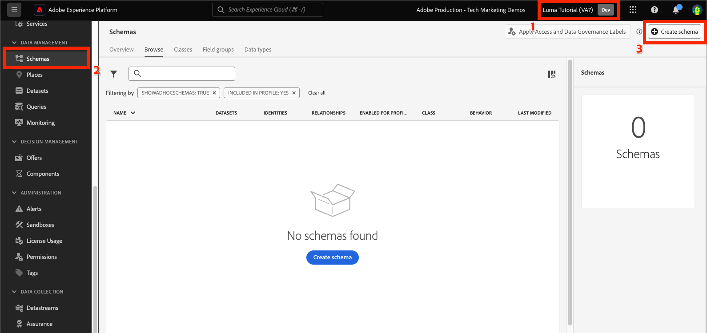

# Model data in schemas

<!-- 60min -->
In this lesson, you will model Luma's data into schemas. This is one of the longest lessons in the tutorial, so get a glass of water and buckle up!

Standardization and interoperability are key concepts behind Adobe Experience Platform. Experience Data Model (XDM), driven by Adobe, is an effort to standardize customer experience data and define schemas for customer experience management.

XDM is a publicly documented specification designed to improve the power of digital experiences. It provides common structures and definitions for any application to use to communicate with Platform services. By adhering to XDM standards, all customer experience data can be incorporated into a common representation that can deliver insights in a faster, more integrated way. You can gain valuable insights from customer actions, define customer audiences through segments, and express customer attributes for personalization purposes.

XDM is the foundational framework that allows Adobe Experience Cloud, powered by Experience Platform, to deliver the right message to the right person, on the right channel, at exactly the right moment. The methodology on which Experience Platform is built, **XDM System**, operationalizes Experience Data Model schemas for use by Platform services.

<!--
This seems too lengthy. The video should suffice

Key terms:

* **Schema**: a representation of your data. A schema is comprised of a class and optional field groups and is used to create datasets. A schema includes behavioral attributes, timestamp, identity, attribute definitions, and relationships.
* **XDM Profile Class**: a common schema class used to represent record data
* **XDM ExperienceEvent Class**: a common schema class used to represent time-series data
* **Field group**: allows users to extend reusable fields that contain variables defining one or more attribute intended to be included in a schema or added to a class.
* **Standard Field group**: an open-source Field group built to conform to common industry standards, used to accelerate implementation and support repeatable services operating on the data
* **Data type**: a reusable object with properties in a hierarchical representation. These can be standard types or custom-defined defined types to describe your own data in your own way (for example, a collection of fields that you use to describe your products). Unlike Field groups, data types can be used in schemas regardless of the class.
* **Field**: a field is the lowest level element of a schema. Each field has a name for referencing and a type to identify the type of data that it contains. Field types can include, integer, number, string, Boolean and schema.
-->

**Data Architects** will need to create schemas outside of this tutorial, but **Data Engineers** will work closely with the schemas created by the Data Architect.

Before you begin the exercises, watch this short video to learn more about schemas and the Experience Data Model (XDM):
>[!VIDEO](https://video.tv.adobe.com/v/27105?quality=12&learn=on)

>[!TIP]
>
> For a deeper dive into data modeling in Experience Platform, we recommend taking the course [Model Your Customer Experience Data with XDM](https://experienceleague.adobe.com/?recommended=ExperiencePlatform-D-1-2021.1.xdm), available for free on Experience League!

## Permissions required

In the [Configure Permissions](configure-permissions.md) lesson, you set up all the access controls required to complete this lesson. 

<!--, specifically:

* Permission items **[!UICONTROL Data Modeling]** > **[!UICONTROL View Schemas]** and **[!UICONTROL Manage Schemas]**
* Permission item **[!UICONTROL Sandboxes]** > `Luma Tutorial`
* User-role access to the `Luma Tutorial Platform` product profile
* Developer-role access to the `Luma Tutorial Platform` product profile (for API)-->


<!--
## Luma's goals
-->

## Create Loyalty Schema via UI

>[!NOTE]
>
>The term "mixin" was recently updated to "field group" in the Platform interface, might still appear in some of these screenshots.


In this exercise, we will create a Luma Loyalty Schema to ingest loyalty data of customers.

1. Go to the Platform UI and ensure that your sandbox is selected.
1. Go to **[!UICONTROL Schemas]** in the left navigation
1. Select the **[!UICONTROL Create Schema]** button on the top right
1. From the dropdown menu, select **[!UICONTROL XDM Individual Profile]**, since we will be modeling attributes of an individual customer (points, status, and so on).
  

### Add standard field groups

Next you will be prompted to add field groups to the schema. All fields must be added to schemas using groups. You can choose from a large set of industry-standard field groups provided by Adobe or create your own. As you start modeling your own data in Experience Platform, it is good to become familiar with the industry-standard field groups provided by Adobe. Whenever possible, it is a best practice to use them as they sometimes power downstream services, such as Customer AI, Attribution AI, and Adobe Analytics.

When working with your own data, a big initial step will be to determine which of your own data should be captured in Platform and how it should be modeled. This large topic is discussed in more depth in the course [Model Your Customer Experience Data with XDM](https://experienceleague.adobe.com/?recommended=ExperiencePlatform-D-1-2021.1.xdm). In this tutorial, I will just be guiding you through the implementation of pre-determined schemas.

To add field groups:

1. In the **[!UICONTROL Add Field groups]** modal, select following field groups:
   1. **[!UICONTROL Demographic Details]** for basic customer data like name and birthdate
   1. **[!UICONTROL Personal Contact Details]** for basic contact details like email address and phone number
1. You can preview the fields contributed in the field group by selecting the icon on the right side of the row. 
    

1. Check the **[!UICONTROL Industry]** > **[!UICONTROL Retail]** box to expose  industry-specific field groups.
1. Select **[!UICONTROL Loyalty]** to add the loyalty program fields.
1. Select **[!UICONTROL Add field group]** to add all three field groups to the schema.
    


Now take some time to explore the current state of the schema. The field groups have added standard fields related to a person, their contact details, and loyalty program status. You may find these two field groups useful when you create schemas for your own company's data. Select a specific field group row or check the box next to the field group name to see how the visualization changes. 

To save the schema:

1. Select the top node of the schema.
1. Enter `Luma Loyalty Schema` as the **[!UICONTROL Display Name]**.
1. Select **[!UICONTROL Save]**.


>[!NOTE]
>
>It is okay if a field group adds a field for a data point that you don't collect. For example, "faxPhone" might be a field for which Luma doesn't collect data. That's fine. Just because a field is defined in the schema doesn't mean that data for it *must* be ingested later on.

### Add a custom field group

Now let's create a custom field group. 

While the loyalty field group contained a `loyaltyID` field, Luma would like to manage all of their system identifiers in a single group to help ensure consistency across their schemas.

Field groups must be created in the schema workflow. To create the field group:

1. Select **[!UICONTROL Add]** under the **[!UICONTROL Schema Field Groups]** heading

1. Select **[!UICONTROL Create new field group]**
1. Add `Luma Identity profile field group` as the **[!UICONTROL Display name]**
1. Add a `system identifiers for XDM Individual Profile class` as the **[!UICONTROL Description]**
1. Select **[!UICONTROL Add field groups]**


The new, empty field group is added to your schema. The **[!UICONTROL +]** buttons can be used to add new fields to any location in the hierarchy. In our case we want to add fields at the root level:

1. Select **[!UICONTROL +]** next to the name of the schema. This adds a new field  under your tenant id namespace to manage conflicts between your custom fields and any standard fields.
1. In the **[!UICONTROL Field properties]** sidebar add the details of the new field:
      1. **[!UICONTROL Field name]**: `systemIdentifier`
      1. **[!UICONTROL Display name]**: `System Identifier`
      1. **[!UICONTROL Type]**: **[!UICONTROL Object]**

    
1. Select **[!UICONTROL Apply]**

Now add two fields under the `systemIdentifier` object:

   1. First field
      1. **[!UICONTROL Field name]**: `loyaltyId`
      1. **[!UICONTROL Display name:]** `Loyalty Id`
      1. **[!UICONTROL Type]**: **[!UICONTROL String]**
   1. Second field
      1. **[!UICONTROL Field Name]**: `crmId`
      1. **[!UICONTROL Display Name]**: `CRM Id`
      1. **[!UICONTROL Type]**: **[!UICONTROL String]**

Your new field group should look like this. Select the **[!UICONTROL Save]** button to save your schema, but leave the schema open for the next exercise. 
    

## Create a data type

Field groups, such as your new `Luma Identity profile field group`, can be reused in other schemas, allowing you to enforce standard data definitions across multiple systems. But they can only be reused _in schemas that share a class_, in this case the XDM Individual Profile class.

The data type is another multi-field construct which can be reused in schemas _across multiple classes_. Let's convert our new `systemIdentifier` object into a data type:

With the `Luma Loyalty Schema` still open, select the `systemIdentifier` object and select  **[!UICONTROL Convert to new data type]**

 

If you **[!UICONTROL Cancel]** out of the schema and navigate to the **[!UICONTROL Data types]** tab, you will see your newly created data type. We will use this data type later in the lesson.

 


## Create CRM Schema via API

Now we will create a schema using the API. 

>[!NOTE]
>
> If you prefer to skip the API exercise, you can create the following schema using the UI method:
>
> 1. Use the [!UICONTROL XDM Individual Profile] class
> 1. Name it `Luma CRM Schema`
> 1. Use the following field groups: Demographic Details, Personal Contact Details, and Luma Identity profile field group

First we create the empty schema:

1. Open [!DNL Postman]
1. If you haven't made a request in the last 24 hours, your authorization tokens have probably expired. Open the request **[!DNL Adobe I/O Access Token Generation > Local Signing (Non-production use-only) > IMS: JWT Generate + Auth via User Token]** and select **Send** to request new JWT and Access Tokens.
1. Open your environment variables and change the value of **CONTAINER_ID** from `global` to `tenant`. Remember, you must use `tenant` whenever you want to interact with your own custom elements in Platform, such as creating a schema.
  
1. Open the request **[!DNL Schema Registry API > Schemas > Create a new custom schema.]**
1. Open the **Body** tab and paste the following code and select **Send** to make the API call. This call creates a new schema using the same `XDM Individual Profile` base class that was used in the Loyalty schema:

    ```json
    {
      "type": "object",
      "title": "Luma CRM Schema",
      "description": "Schema for CRM data of Luma Retail ",
      "allOf": [{
        "$ref": "https://ns.adobe.com/xdm/context/profile"
      }]
    }
    ```
    
    >[!NOTE]
    >
    >The namespace references for standard class and field group objects, in this and subsequent code samples, can be obtained by using list API calls such as **[!DNL Retrieve a list of classes within the specified container.]** or **[!DNL Retrieve a list of field groups within the specified container.]** with the **[!DNL CONTAINER_ID]** set to `global` and an accept header `application/vnd.adobe.xdm+json`.

1. You should get a `201 Created` response
1. Copy `meta:altId` from Response body. We will use it later in another exercise.
   

1. The new schema should be visible in the UI but without any field groups
   

>[!NOTE]
>
> The `meta:altId` or schema id can also be obtained by making the API request **[!DNL Schema Registry API > Schemas > Retrieve a list of schemas within the specified container.]** with the **[!UICONTROL CONTAINER_ID]** set to `tenant` and an accept header `application/vnd.adobe.xdm+json`.

>[!TIP]
>
> Common issues with this call and likely fixes:
>
> * No auth token: Run the **IMS: JWT Generate + Auth via User Token** call to generate new tokens
> * `401: Not Authorized to PUT/POST/PATCH/DELETE for this path : /global/schemas/`: Update the **CONTAINER_ID** environment variable from `global` to `tenant`
> * `403: PALM Access Denied. POST access is denied for this resource from access control`: Verify your user permissions in the Admin Console

### Add standard field groups

Now it's time to add the field groups to the schema:

1. In [!DNL Postman], Open the request **[!DNL Schema Registry API > Schemas > Update one or more attributes of a custom schema specified by ID.]**
1. In the **Params** tab, paste the `meta:altId` value from the previous response as the `SCHEMA_ID`
1. Open the Body tab and paste the following code and select **Send** to make the API call. This call adds the standard field groups to your `Luma CRM Schema`:

    ```json
    [{
        "op": "add",
        "path": "/allOf/-",
        "value": {
          "$ref": "https://ns.adobe.com/xdm/context/profile-personal-details"
        }
      },
      {
        "op": "add",
        "path": "/allOf/-",
        "value": {
          "$ref": "https://ns.adobe.com/xdm/context/profile-person-details"
        }
      }
    ]
    ```

1. You should get a 200 OK status for the response and the field groups should be visible as part of your schema in the UI

     


### Add custom field group

Now let's add our `Luma Identity profile field group` to the schema. First, we need to find the id of our new field group, using a list API:

1. Open the request **[!DNL Schema Registry API > Field groups > Retrieve a list of field groups within the specified container.]**
1. Select the **Send** button to retrieve a list of all of the custom field groups in your account
1. Grab the `$id` value of the `Luma Identity profile field group` (yours will be different from the value in this screenshot)
   
1. Now Open the request **[!DNL Schema Registry API > Schemas > Update one or more attributes of a custom schema specified by ID.]** again
1. The **Params** tab should still have the `$id` of your schema
1. Open the **Body** tab and paste the following code, replacing the `$ref` value with the `$id` of your own `Luma Identity profile field group`:

    ```json
    [{
      "op": "add",
      "path": "/allOf/-",
      "value": {
        "$ref": "REPLACE_WITH_YOUR_OWN_FIELD_GROUP_ID"
      }
    }]
    ```

1. Select **Send**
   

Verify that the field group has been added to the schema by checking the UI. For bonus points, see if you can figure out how to list the field groups in the schema using the **[!DNL Lookup a specific schema by its unique ID]** call in the [!DNL Postman] collection.

## Create Offline Purchase Events Schema

Now let's create a schema based on the **[!UICONTROL XDM ExperienceEvent]** class for Luma's offline purchase data. Since you are now getting familiar with the schema editor UI, I will reduce the number of screenshots in the instructions:

1. Create a schema with the **[!UICONTROL XDM ExperienceEvent]** class named `Luma Offline Purchase Events Schema`
1. **[!UICONTROL Commerce Details]** is a standard field group for capturing common order details. Go ahead and add it to your schema. Spend a few minutes exploring the objects inside.
1. Search for `Luma Identity profile field group`. It is not available! Remember that field groups are tied to a class, and since we are using a different class for this schema we can't use it. We we need to add a new field group for the XDM ExperienceEvent class containing the identity fields. Our data type will make that really easy! 
1. Select the **[!UICONTROL Create new field group]** radio button
1. Enter the **[!UICONTROL Display name]** as `Luma Identity ExperienceEvent field group` and select the **[!UICONTROL Add field groups]** button
1.  Make sure the **[!UICONTROL +]** buttons appear on in the **[!UICONTROL Structure]** section so you can add new fields
1. In **[!UICONTROL Structure]** section, select **[!UICONTROL +]** at top level of the schema
1. As the **[!UICONTROL Field Name]**, enter `systemIdentifier`
1. As the **[!UICONTROL Display Name]**, enter `System Identifier` 
1. As the **[!UICONTROL Type]**, select **System Identifier** which is the custom data type you created earlier
1. Select the **[!UICONTROL Apply]** button 
1. Name your schema `Luma Offline Purchase Event Schema`
1. Select the **[!UICONTROL Save]** button

Note how the data type added all of the fields!


Also, select **[!UICONTROL XDM ExperienceEvent]** under the **[!UICONTROL Class]** heading and inspect some of the fields contributed by this class. Note that _id and timestamp fields are required when using the XDM ExperienceEvent class&mdash;these fields must be populated for every record you ingest when using this schema:

  

## Create Web Events Schema

Now we are going to create one more schema for Luma's website data. By this point you should be an expert at creating schemas! Build the following schema with these properties

| Property         |  Value          |  
|---------------|-----------------|
| Class  | XDM ExperienceEvent   |  
| Field group          | AEP Web SDK ExperienceEvent Mixin  | 
| Field group          | Consumer Experience Event field group       | 
| Schema Name    | Luma Web Events Schema   | 

Select the **[!UICONTROL Consumer Experience Event]** field group. This field group contains the commerce and productListItems objects that were also in [!UICONTROL Commerce Details]. Indeed [!UICONTROL Consumer Experience Event] is a combination of several other standard field groups that are also available separately. [!UICONTROL AEP Web SDK ExperienceEvent Mixin] field group also contains other field groups, including some of the same ones in [!UICONTROL Consumer Experience Event]. Fortunately, they blend together seamlessly.

Notice that we didn't add the `Luma Identity ExperienceEvent field group` to this schema. This is because the Web SDK has a different way of collecting identities. If you select the **[!UICONTROL XDM ExperienceEvent]** class in the **[!UICONTROL Composition]** section of the schema editor, you will notice that one of the fields it adds by default is called **[!UICONTROL IdentityMap]**. [!DNL IdentityMap] is used by various Adobe applications to link to Platform. You will see how identities are sent to Platform via identityMap in the streaming ingestion lesson.


## Create Product Catalog Schema

By using the  [!UICONTROL Experience event commerce details] and [!UICONTROL Consumer Experience Event field groups], Luma reports details of product-related events via the standard productListItems data type. But they also have additional product detail fields that they would like to send to Platform. Instead of capturing all of these fields in their point-of-sale and e-commerce systems and ingesting them into Platform using the schemas you created, Luma would prefer to simply ingest these fields directly from their product catalog system. A "schema relationship" in Platform allows you to define a relationship between two schemas for the purposes of classification or lookups. Luma will use a relationship to classify their product details. We will begin the process now and complete it at the end of the next lesson.

>[!NOTE]
>
>If you are an existing Analytics or Target customer, classifying entities with relationship schema is analogous to SAINT classifications or uploading your product catalog for Recommendations

First we must create a schema for Luma's product catalog using a custom class:

1. Select the **[!UICONTROL Create schema]** button and select the **[!UICONTROL Browse]** option from the dropdown
  
1. Select **[!UICONTROL Assign]**
  
1. Select the **[!UICONTROL Create new class]** radio button
1. Name it `Luma Product Catalog Class`
1. Leave the **[!UICONTROL Behavior]** as **[!UICONTROL Record]**
1. Select the **[!UICONTROL Assign Class]** button
  
1. Create a new [!UICONTROL field group] called `Luma Product Catalog field group` with the following fields:
   1. productName: Product Name: String
   1. productCategory: Product Category: String
   1. productColor: Product Color: String
   1. productSku: Product SKU: String | Required
   1. productSize: Product Size: String
   1. productPrice: Product Price: Double
1. Name the schema `Luma Product Catalog Schema` (be sure to update the correct field and not update the class name)
1. **[!UICONTROL Save]** the schema
  
Your new schema should look like this. Note how the `productSku` field is listed in the [!UICONTROL Required fields] section:
   

The next step is to define the relationship between the two ExperienceEvent schemas and the `Luma Product Catalog Schema`, however there are a few additional steps that we must take in the next lesson before we can do that.


## Additional Resources

* [Experience Data Model (XDM) System documentation](https://experienceleague.adobe.com/docs/experience-platform/xdm/home.html)
* [Schema Registry API](https://www.adobe.io/apis/experienceplatform/home/api-reference.html#!acpdr/swagger-specs/schema-registry.yaml)


Now that you have your schemas you can [map identities](map-identities.md)!
