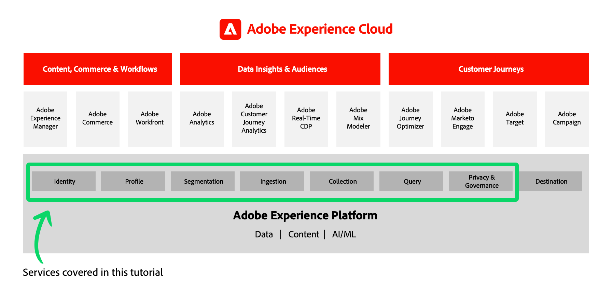

# Getting Started with Adobe Experience Platform for Data Architects and Data Engineers

<!--5min-->

_Getting Started with Adobe Experience Platform for Data Architects and Data Engineers_ is the perfect starting point to get hands-on with Experience Platform.

<!--How do we address ETL-->

## Learning Objectives

Data Architects and Data Engineers must closely collaborate for a successful Experience Platform deployment. This hands-on tutorial teaches you the key tasks executed by _both roles_ so you know how to start implementing Platform for your own business. You will be guided through exercises that will introduce you to the key terminology, features, interface, and API of Experience Platform. Customers of Adobe Experience Cloud applications like Real-Time Customer Data Platform, Customer Journey Analytics, and Journey Optimizer will also find this content useful, as Platform services are critical foundations of those applications.

Topics include: 

* Configuring user permissions
* Creating sandboxes
* Setting up a Developer Console project and using the Platform API
* Data management&mdash;including creating schemas, datasets, identities, merge policies, and data governance
* Data ingestion using batch and streaming modes
* Capturing web data with Adobe Experience Platform Web SDK
* Building Real-Time Customer Profiles
* Using Query Service to validate data and extract data
* Building segments

## Business Scenario

Adobe Experience Platform is a technical platform designed to help you achieve marketing objectives. The business use cases should drive how you design and implement the technology. This tutorial focuses on a fictional retail brand called Luma. Luma operates brick-and-mortar stores in multiple countries and also has an online presence with a website and mobile apps. They are investing in Adobe Experience Platform to combine loyalty, CRM, web, and offline purchase data into real-time customer profiles and activate these profiles to take their marketing to the next level. The business objectives of Luma may or may not align with the objectives of your company, but you should be able to relate the hands-on steps in this tutorial to your own business objectives.

## Pre-requisites

* You have completed the [Introduction to Adobe Experience Platform course](https://experienceleague.adobe.com/?recommended=ExperiencePlatform-U-1-2020.1) on Experience League and are familiar with Platform capabilities
* You have access to an account provisioned with Adobe Experience Platform (or a Platform-based application such as Real-Time CDP or Journey Optimizer) and Data Collection (formerly Launch).  
* You are a System Administrator of that account or can have one [configure user permissions](configure-permissions.md) for you.

## Using this tutorial

This tutorial combines tasks for both Data Engineers and Data Architects. Since it's an introductory-level tutorial, you should be able to complete the tasks for both roles. Because many of the lessons build on what was implemented in earlier lessons, you should move through the lessons in order. I will call out which lessons can be skipped.

As you create various Platform elements during this tutorial, try to stick to the names I recommend as much as possible. However, there are a few high-level element names that you may want to customize in case there are multiple people at your organization taking this tutorial simultaneously. For example, you may want to name the Platform sandbox "Luma Tutorial Platform - Ignatius J Reilly" instead of just "Luma Tutorial Platform."

If you get stuck, try re-reading the instructions first, and then use the  link on the sidebar of each page to contact me. 

## Technical notes

### Sandbox environments

In the tutorial, you will create a sandbox environment and use it to complete the exercises. The sandbox environment makes it safe for you to complete the exercises and experiment without being concerned about compromising your production data.

### API

Platform is built API-first. While interface workflows exist for all major Platform workflows and will be used primarily, the tutorial contains some API-oriented exercises. I will guide you through the basic project setup in the Adobe Developer Console and provide you with [!DNL Postman] environments and collections to get started with the Platform API. After completing the tutorial, you may find it valuable to be familiar with the Platform API and use it in your own deployment.

### Third-party technologies

Although you will use multiple technologies in this tutorial, you will remain almost entirely within the Adobe ecosystem. In your own Platform implementation, you will likely integrate Platform with specific third-party technologies. To keep this tutorial relevant for all customers, we will use a more generic implementation. 

Now let's move on to the first lesson&mdash;[configure permissions](configure-permissions.md).
