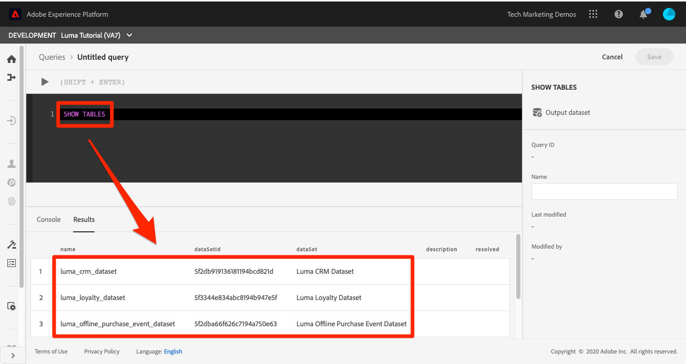
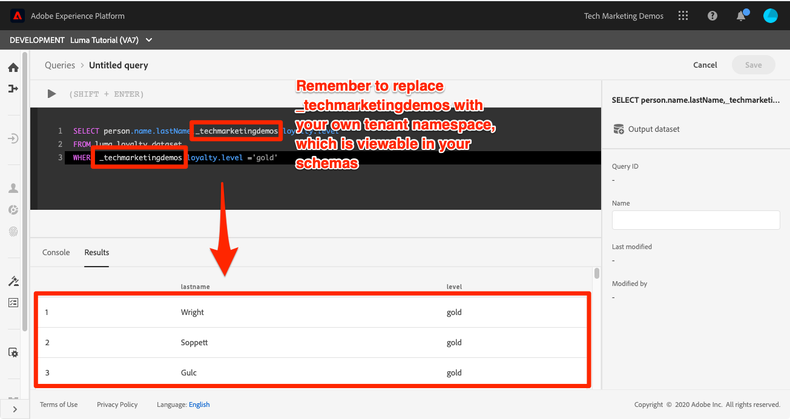
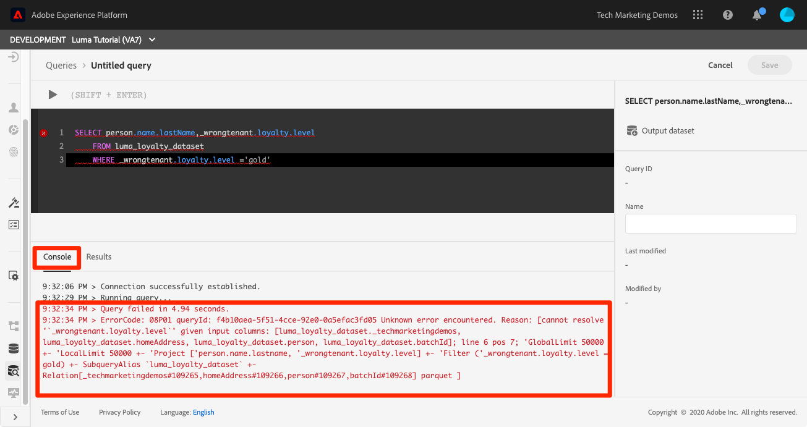
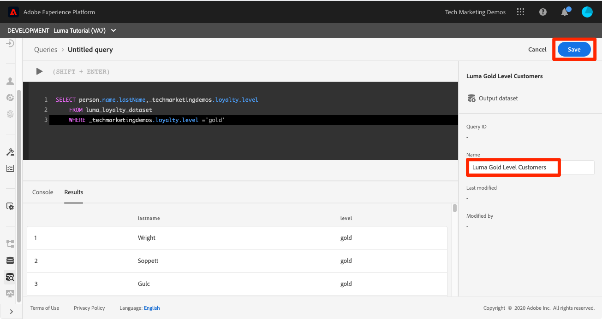

# Run queries

<!-- 15 min-->
In this lesson, you will learn how to setup, write, and execute queries to validate the data you have ingested.

Adobe Experience Platform Query Service helps you make sense of your data by allowing you to use standard SQL to query data in Platform. Using Query Service, you can join any dataset in the Data Lake and capture the query results as a new dataset for use in reporting, machine learning, or for ingestion into Real-Time Customer Profile.

**Data Architects** and **Data Engineers** will need to use query service outside of this tutorial.

Before you begin the exercises, watch this short video to learn more about Query Service:
>[!VIDEO](https://video.tv.adobe.com/v/29795?quality=12&learn=on)

## Permissions required

In the [Configure Permissions](configure-permissions.md) lesson, you set up all the access controls required to complete this lesson.

<!-- Settings > **[!UICONTROL Services]** > **[!UICONTROL Query Service]**
* Permission items Data Management > **[!UICONTROL View Datasets]** and  **[!UICONTROL Manage Datasets]**
* Permission item Sandboxes > `Luma Tutorial`
* User-role access to the `Luma Tutorial Platform` product profile
-->

## Simple Queries

Let's start with some simple queries:

1. In the Platform user interface, go to **Queries** in the left navigation
1. Select the **Create Query** button on the top right to open a text box to run and execute queries
1. Enter the following query in the editor and press Shift+Enter or Shift+Return to execute the query.

    ```
    SHOW TABLES
    ```

1. This shows the list of available tables

    


1. Now try this query, replacing `_techmarketingdemos` with your own tenant namespace, which, if you recall, is visible in your schemas.
   
    ```
    SELECT person.name.lastName,loyalty.tier
    FROM luma_loyalty_dataset
    WHERE loyalty.tier ='gold'
    ```

    

1. If there is any error, detailed messages will appear in the **[!UICONTROL Console]** tab, as pictured below
    

1. With your successful query, **[!UICONTROL Name]** it `Luma Gold Level Customers`
1. Select the **[!UICONTROL Save]** button
    


<!--SELECT COUNT(DISTINCT (_techmarketingdemos.systemIdentifier.loyaltyId)) FROM luma_loyalty_dataset 


SELECT _techmarketingdemos.systemIdentifier.loyaltyId, COUNT(_techmarketingdemos.systemIdentifier.loyaltyId)
FROM luma_loyalty_dataset 
GROUP BY _techmarketingdemos.systemIdentifier.loyaltyId
HAVING COUNT(_techmarketingdemos.systemIdentifier.loyaltyId) > 1;-->

## Additional Exercises

Additional Query Service exercises will be added to the tutorial at a later date.
<!--
## Join Datasets

In this exercise, we will join two datasets `Luma Loyalty Dataset` and `Luma Offline Purchase` to get list of gold customers who have spend over $500 dollars in one purchase.

1. Create a new query
1. Copy and paste following query in query editor and execute, again replacing `_techmarketingdemos` with your own tenant namespace
    
    ```
    SELECT DISTINCT lopd.commerce.order.purchaseID as PurchaseId ,
        lld.person.name.firstName as LastName ,
        lld.person.name.lastName as LastName ,
        lopd.personalEmail.address as email,
        lopd.commerce.order.priceTotal as Total

    FROM luma_loyalty_dataset lld
    JOIN luma_offline_purchase_event_dataset lopd
    ON lopd._techmarketingdemos.systemIdentifier.loyaltyId = lld._techmarketingdemos.systemIdentifier.loyaltyId

    WHERE lld._techmarketingdemos.loyalty.level ='gold' AND lopd.commerce.order.priceTotal >500;
    ```

1. You should get list of Gold Customers who have spend over $500 in single purchase.

## Output datasets

1. Select on Output Dataset button
1. Provide name and description to the dataset
1. Save.
1. Go to **Datasets** under **Data Management** to find new dataset created.

-->
<!--Add content for Adobe Defined Functions-->

## Additional Resources

* [Query Service documentation](https://experienceleague.adobe.com/docs/experience-platform/query/home.html)
* [Query Service API reference](https://www.adobe.io/experience-platform-apis/references/query-service/)

And now for the final hands-on lesson, [creating segments](build-segments.md)!
