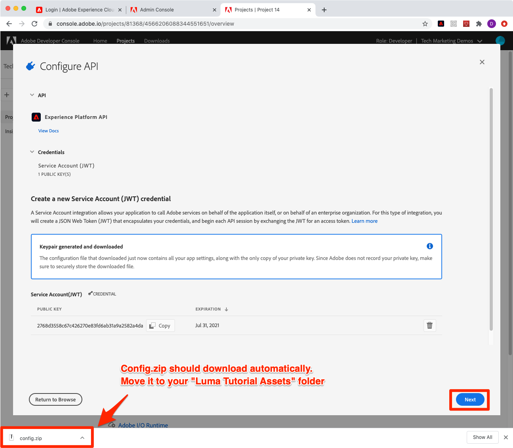

# Set up Adobe IO and Postman

## Set up Adobe IO
 
1. Create a folder on your local machine named `Platform Training Assets`. 
   

   * This folder will be used to save files and configuration required for this training. 
   
   *  It can be named anything but for training purpose let's go with `Platform Training Assets`, so it will be easy to reference throughout the training.

1. Open [https://console.adobe.io/](https://console.adobe.io)

1. Log in and confirm that you are in the correct Org

1. Click button **[!UICONTROL Create New Project]** in Quickstart menu. 
    
    

1. Inside the newly created project, Click button **[!UICONTROL Add to Project]** and then select option **[!UICONTROL API]**
   
    

1. Filter the list by clicking **[!UICONTROL Adobe Experience Platform]**

1. In list of available APIs, select **[!UICONTROL Experience Platform API]** and click **[!UICONTROL Next]**.

    

1. For authentication from external systems like Postman, we require a private-public key pair. To generate new key pair selection **[!UICONTROL Option 1]**  and press the **[!UICONTROL Generate a key pair]** button
   
   

1. Once keys are ready, it will prompt you to download keys on your local machine. Save keys packaged in `config.zip` in folder `Platform Training Assets`. We will need it in the next exercise.

   
1.  After the key is generated, the public key will automatically be added to your project as shown in the screenshot. Press **[!UICONTROL Next]**

    

1. Select a Product Profile to which you have access and which contains the permissions you need. For each reader of this tutorial, this will vary depending on how your own Org is managed
   
    <!--what permissions are needed for this lesson? what permissions are needed for this step?-->

    

1.  Click **[!UICONTROL Save Configured API]**. Now your Adobe IO integration is created.

    

1. In **[!UICONTROL Try it out]** section of the page , Click **[!UICONTROL Download for Postman]** and then click **[!UICONTROL Service Account (JWT)]** to download the Postman environment json file. Save the `service.postman_environment.json` in your `Platform Training Assets` folder.

1. Name the environment `Luma Tutorial`

## Set up Postman

1. Download & Install [Postman](https://www.postman.com/)
1. Open Postman and import downloaded json environment file
   
1. In Postman, select your environment in the top-right dropdown and click the **Eye** icon to view the environment variables 
   
   

1. You should see that the following variables are blank.

    | Variable          |  Value     |  
    |-------------------|------------|
    | ACCESS_TOKEN      |            | 
    | PRIVATE_KEY       |            |  
    | JWT_TOKEN         |            |  

### Update the Environment Name

Since the exported name of the environments from Adobe IO is randomly generated, let's quickly give it a more descriptive name so you don't confuse environments later on when you start working on your real Platform implementation

1. With the environment variables screen still open, click the **Edit** on the top-right
1. Update the Environment Name to `Luma Tutorial`
1. Leave Environment screen open in Edit mode, as we will be editing it further in the next step

### Add the Private Key

Now it's time to add the PRIVATE_KEY value to the Postman environment

1. Extract the downloaded `config.zip` file which was generated in the previous exercise while creating the Adobe IO Project. This will have two files: 
   * `private.key`
   * `certificate_pub.crt`
1. Open the `private.key` file in a text editor and copy all the content available.
1. In Postman, on the Manage Environments > Edit screen which was still open from when you renamed the environment, paste copied values in front of **PRIVATE_KEY** in **initial value** and **current value** column.

    
    
### Add the JWT and Access Tokens

In addition to the Postman environment, which you exported from the Adobe IO console in the previous exercises, Adobe also provides a rich set of Postman collections to help you explore the Experience Platform API. These collections are located in the GitHub repo [Adobe Experience Platform Postman Samples](https://github.com/adobe/experience-platform-postman-samples). You should bookmark this repo as you will be using this numerous times throughout this tutorial and later as you implement Experience Platform for your own company.

The first collection we will use works with the Adobe Identity Management Service (IMS) APIs. It is a convenient way to populating the JWT_TOKEN and ACCESS_TOKEN from within Postman *intended for non-production use cases* such as completing this tutorial in your sandbox. Alternatively, the JWT Token can be generated within the Adobe IO console, but since it expires regularly, using this Postman will allow you to refresh it without needing to revisit the Adobe IO console for the remainder of this tutorial.

>[!WARNING]
>
>As noted in the [Adobe I/O Access Token Generation Postman collection documentation](https://github.com/adobe/experience-platform-postman-samples/tree/master/apis/ims), the denoted generation methods are suitable for non-production use. Local Signing loads a JavaScript library from a 3rd-party host, and Remote signing sends the private key to an Adobe owned and operated web service. While Adobe does not store this private key, production keys should never be shared with anyone.  

1.  Download the [Adobe IO Access Token Generation collection](https://raw.githubusercontent.com/adobe/experience-platform-postman-samples/master/apis/ims/Adobe%20IO%20Access%20Token%20Generation.postman_collection.json) to your `Platform Training Assets` folder

1.  Select Request **IMS: JWT Generate + Auth via User Token** and Click **Send**
1.  The **JWT_TOKEN** and **ACCESS_TOKEN** will be auto-populated in the environment variables of Postman.

    

<!--do i even need this section or does the Postman Collection do this?
1.  Go to Adobe IO Project, Select **[!UICONTROL Service Account(JWT)]** and select tab **[!UICONTROL Generate JWT]**
1. Paste private key in textbox and click **[!UICONTROL Generate JWT Token]** to generate JWT Token

    

1.  Click the **[!UICONTROL Generate Token]** button, and the output will appear in the  **[!UICONTROL Generated JWT]** textbox. 

    

1.  Copy the generated JWT Token and paste it into the Postman Environment Variables in front of JWT_TOKEN in **INITIAL VALUE** and **CURRENT VALUE** columns.

1. Click the **Update** button to save the changes to your Postman environment details.
   
    [Adobe Experience Platform Postman Samples](https://github.com/adobe/experience-platform-postman-samples)
-->

## Add the Sandbox Name and Tenant ID

The `SANDBOX_NAME` and `TENANT_ID` variables are not provided in the environment export from Adobe IO so we will add that manually:

1. Open the Environment Variables screen
1. Click the **Edit** button
1. Enter `SANDBOX_NAME` in the **Add new variable field**
1. Enter `luma-tutorial` into both value fields (the name we gave to our sandbox in the previous lesson)
1. Switch to your web browser and look up your company's tenant id by going to the Experience Platform interface and extracting the portion of the URL *after the @ sign*. For example, my Tenant Id is `techmarketingdemos` but yours will be something different:

    

1. Copy this value and return to the Postman Manage Environments screen
1. Enter `TENANT_ID` in the **Add new variable field**
1. Paste your Tenant Id into both value fields
1. Enter `CONTAINER_ID` in the **Add new variable field**
1. Enter `global` into both value fields

1. Click the **Update** button to save the variables
1. Close the Manage Environments screen

## Make a Platform API Call

Now let's confirm that we've configured everything correctly by making an API call!

Open the other group of Experience Platform postman collections in Github, the [experience-platform-postman-samples](https://github.com/adobe/experience-platform-postman-samples/tree/master/apis/experience-platform). There are a number of collections on this page, related to various Platform features. Note that there is even a collection **[!DNL Sandbox API]** which could be used to create a sandbox like we did in the previous lesson.  

We will download some of these collections as we need them for this tutorial. This resource will be extremely useful to you after this tutorial as you begin to implement Platform for your company. 

1. Download the [Schema Registry API collection](https://raw.githubusercontent.com/adobe/experience-platform-postman-samples/master/apis/experience-platform/Schema%20Registry%20API.postman_collection.json) to your `Platform Training Assets` folder
1. Import it into Postman
1. Open **Schema Registry API > Classes > List all classes** in the specified container
1. Look at the **Params** and **Headers** tabs and note how these include some of the environment variables we entered earlier.
1. Click in the Headers > Accept value field and change it to `application/vnd.adobe.xed-id+json`. The Schema Registry API require one of these [specified Accept header formats](https://experienceleague.adobe.com/docs/experience-platform/xdm/api/getting-started.html?lang=en#accept) which provide different formats in the response.
1. Click **Send** button to make for first Platform API call!
   
Hopefully you got a successful 200 response containing a list of the available standard XDM classes in your sandbox, as pictured below. You will learn more about XDM classes in the next lesson. 

If your call was not successful, take a moment to debug using the error response details of the API call and review the steps above. If you get really stuck, please request help in the Community Forum or use the link in the right side of this page to "Log an issue".

<!--maybe have a dedicated thread for this page of the tutorial??-->