# Set up Developer Console and [!DNL Postman]

<!--30min-->

In this lesson, you will set up a project in the Adobe Developer Console and download [!DNL Postman] collections so you can start using Platform APIs.

In order to complete the API exercises in this tutorial, [download the Postman app for your operating system.](https://www.postman.com/downloads/) While not required in order to use Experience Platform APIs, Postman makes API workflows easier, and Adobe Experience Platform provides dozens of Postman collections to help you execute API calls and learn how they operate. The rest of this tutorial assumes some working knowledge of Postman. For assistance, please reference the [Postman documentation](https://learning.postman.com/).

Platform is built API-first. While interface options also exist for all major tasks, you might want to use the Platform API at some point. For example to ingest data, move items around between sandboxes, automate routine tasks or to use new Platform features before the user interface has been built.

**Data Architects** and **Data Engineers** may need to use Platform API outside of this tutorial.

## Permissions required

In the [Configure Permissions](configure-permissions.md) lesson, you set up all the access controls required to complete this lesson.

<!--
* Permission item Sandboxes > `Luma Tutorial`
* Developer-role access to the `Luma Tutorial Platform` product profile
-->

## Set up Adobe Developer Console

Adobe Developer Console is the developer destination to access Adobe APIs & SDKs, listen to near real-time Events, run functions on Runtime, or build plugins or App Builder apps. You will use it to access the Experience Platform API. For more details, see the [Adobe Developer Console documentation](https://www.adobe.io/apis/experienceplatform/console/docs.html)
 
1. Create a folder on your local machine named `Luma Tutorial Assets` for files used in the tutorial.

1. Open the [Adobe Developer Console](https://console.adobe.io)

1. Log in and confirm that you are in the correct Org

1. Select **[!UICONTROL Create New Project]** in [!UICONTROL Quick Start] menu. 
    
    

1. In the newly created project, select the **[!UICONTROL Add to Project]** button and then select **[!UICONTROL API]**
   
    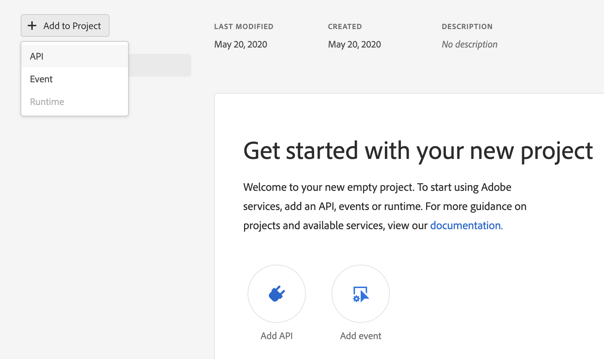

1. Filter the list by selecting **[!UICONTROL Adobe Experience Platform]**

1. In list of available APIs, select **[!UICONTROL Experience Platform API]** and select **[!UICONTROL Next]**.

    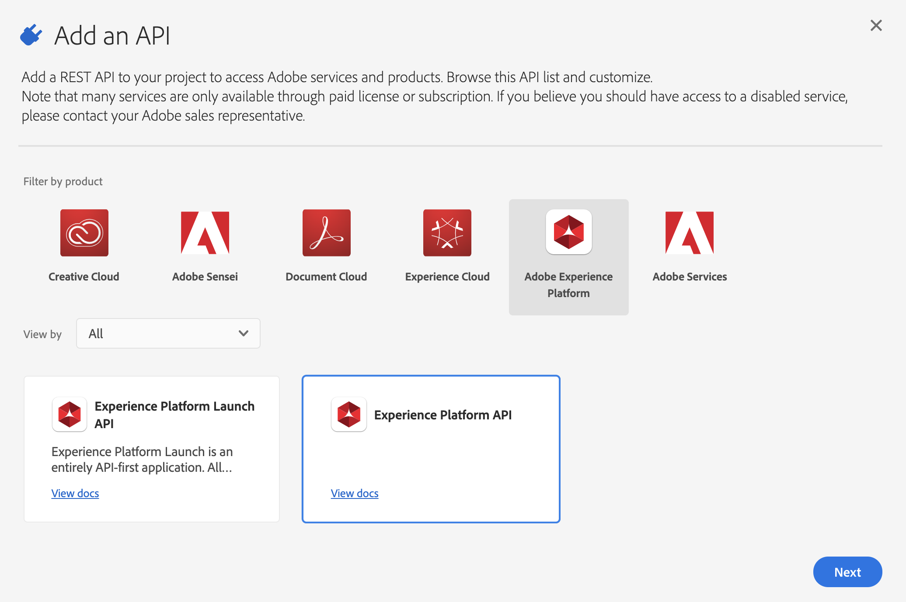

1. For authentication from external systems like [!DNL Postman], we require a public/private key pair. To generate a new key pair, select **[!UICONTROL Option 1]**  and press the **[!UICONTROL Generate keypair]** button
   
   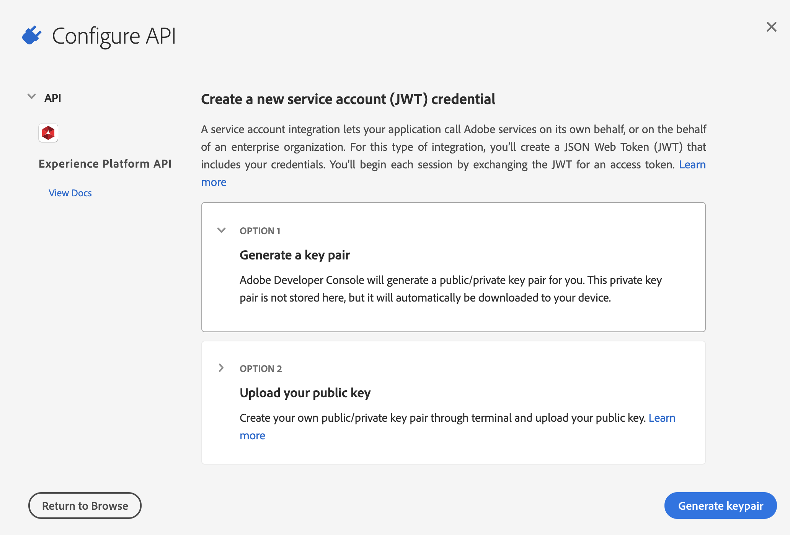

1. Once the keys are ready, you may be prompted to download the keys onto your local machine. Save the keys packaged in `config.zip` to the folder `Luma Tutorial Assets`. We will need them in the next exercise.

   
1.  After the key is generated, the public key will automatically be added to your project as shown in the screenshot. Select the **[!UICONTROL Next]** button.

    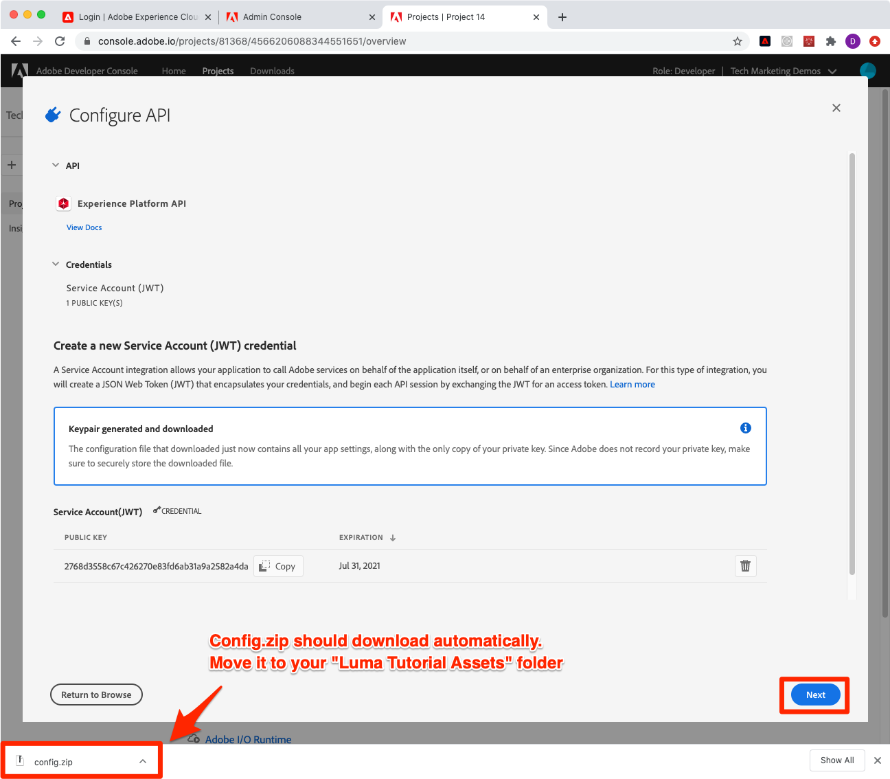

1. Select the `Luma Tutorial Platform` product profile and select the **[!UICONTROL Save Configured API]** button
   
    

1. Now your Developer Console project has been created!

1. In the **[!UICONTROL Try it out]** section of the page, select **[!UICONTROL Download for Postman]** and then select **[!UICONTROL Service Account (JWT)]** to download the [!DNL Postman] environment json file. Save the `service.postman_environment.json` in your `Luma Tutorial Assets` folder.

    

    >[!NOTE]
    >
    >System Administrators of your organization can see the project as an "API Credential" in the product profile in the Admin Console
    >
    >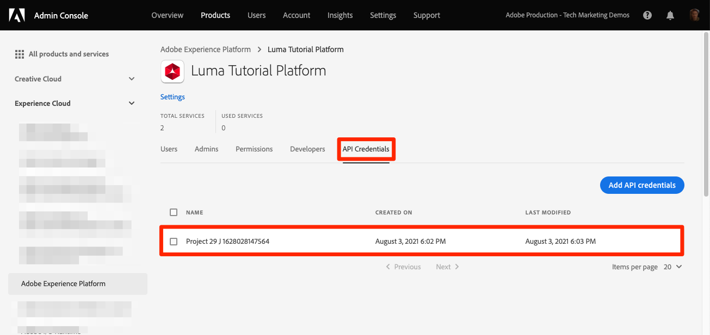

You might have noticed that the project was assigned a number, for example, "Project 12":

1. Select the project number in the breadcrumb
1. Select the **[!UICONTROL Edit Project]** button
1. Change the **[!UICONTROL Project Title]** to `Luma Tutorial API Project` (add your name to the end, if multiple people from your company are taking this tutorial)
1. Select the **[!UICONTROL Save]** button

    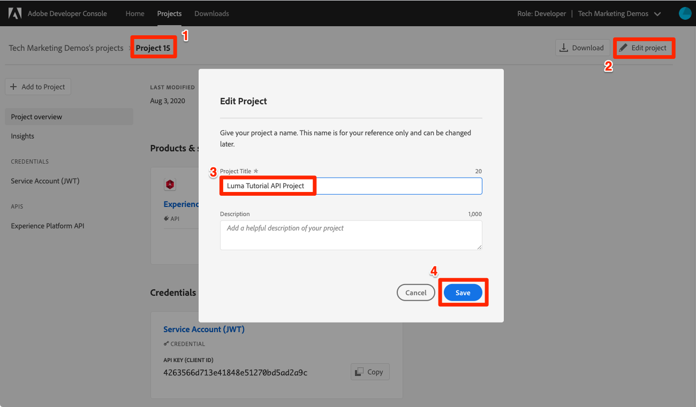

## Set up Postman

>[!CAUTION]
>
>The Postman interface is regularly updated. The screenshots in this tutorial were taken with Postman v9.0.5 for Mac, but interface options may have changed.

1. Download and install [[!DNL Postman]](https://www.postman.com/downloads/)
1. Open [!DNL Postman] and import the downloaded json environment file, `service.postman_environment.json`
   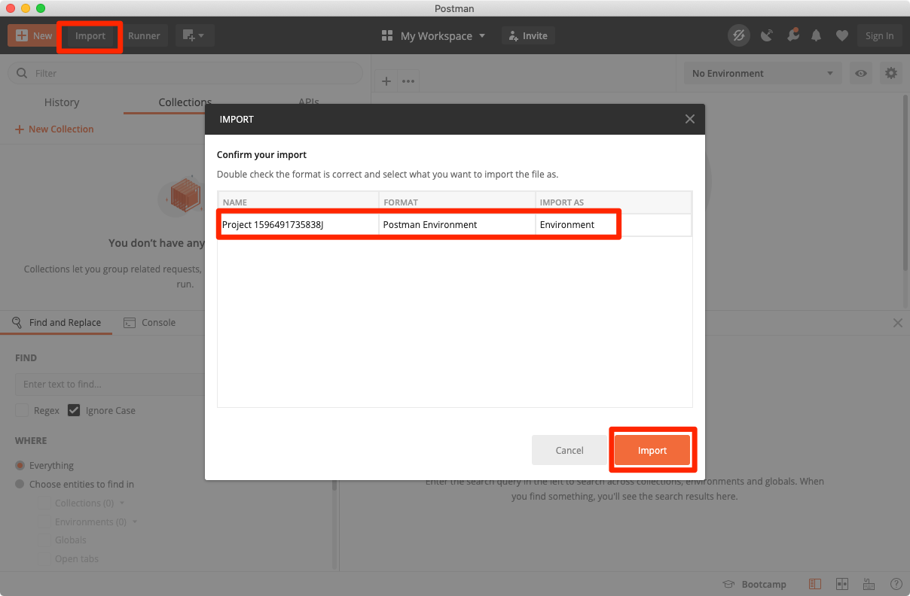
1. In [!DNL Postman], select your environment in the dropdown

   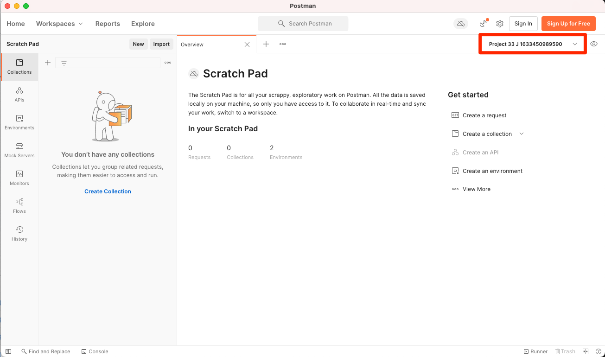
1. Select the **eye** icon to view the environment variables:

   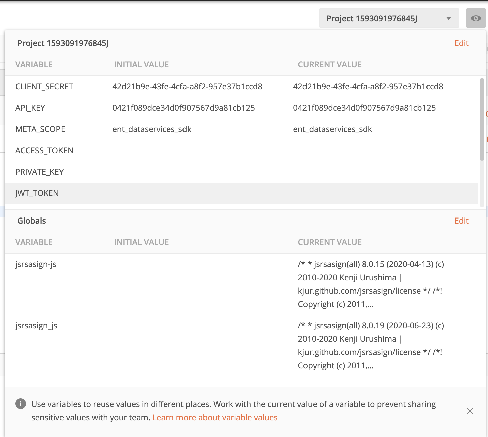

### Update the Environment Name

Since the exported name of the environment from Developer Console is randomly generated, give it a more descriptive name so you don't confuse environments later on when you start working on your real Platform implementation:

1. With the environment variables screen still open, select **Edit** on the top-right
1. Update the **Environment Name** to `Luma Tutorial`
1. Leave **Manage Environments** modal open in edit mode, as we will be editing it further in the next step

   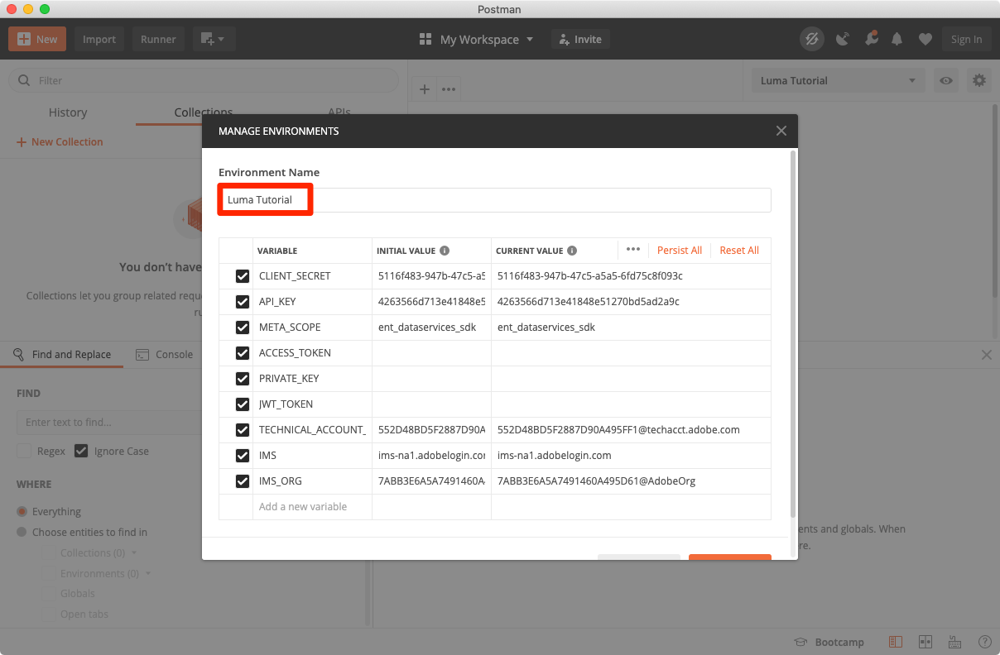

### Add the Private Key

Now it's time to add the PRIVATE_KEY value to the Postman environment

1. Extract the downloaded `config.zip` file which was generated in the previous exercise while creating the Developer Console Project. This zip contains two files: 
   * `private.key`
   * `certificate_pub.crt`
1. Open the `private.key` file in a text editor and copy the contents.
1. In Postman, on the **Manage Environments** > **Edit** modal which is still open from the last exercise, paste copied values in front of **PRIVATE_KEY** in the **Initial Value** and **Current Value** columns.
1. Select **Save**

    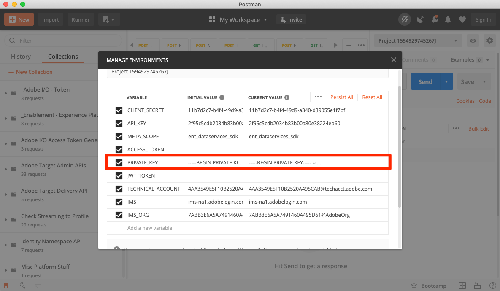
    
### Add the JWT and Access Tokens

Adobe provides a rich set of [!DNL Postman] collections to help you explore Experience Platform's API. These collections are in the [Adobe Experience Platform Postman Samples GitHub repo](https://github.com/adobe/experience-platform-postman-samples). You should bookmark this repo as you will use this numerous times throughout this tutorial and later as you implement Experience Platform for your own company.

The first collection works with the Adobe Identity Management Service (IMS) APIs. It is a convenient way to populate the JWT_TOKEN and ACCESS_TOKEN from within Postman *intended for non-production use cases* such as completing this tutorial in your sandbox. Alternatively, the JWT Token can be generated within the Adobe Developer Console. However, since it expires regularly, using this collection allows you to refresh it without needing to revisit the Adobe Developer Console again while completing this tutorial.

>[!WARNING]
>
>As noted in the [Adobe Identity Management Service APIs README](https://github.com/adobe/experience-platform-postman-samples/tree/master/apis/ims), the denoted generation methods are suitable for non-production use. Local Signing loads a JavaScript library from a 3rd-party host, and Remote signing sends the private key to an Adobe owned and operated web service. While Adobe does not store this private key, production keys should never be shared with anyone.  

To generate the tokens:

1. Download the [Developer Console Access Token Generation collection](https://raw.githubusercontent.com/adobe/experience-platform-postman-samples/master/apis/ims/Identity%20Management%20Service.postman_collection.json) to your `Luma Tutorial Assets` folder
1. Import the collection into [!DNL Postman]
1. Select the request **IMS: JWT Generate + Auth via User Token** and select **Send**
    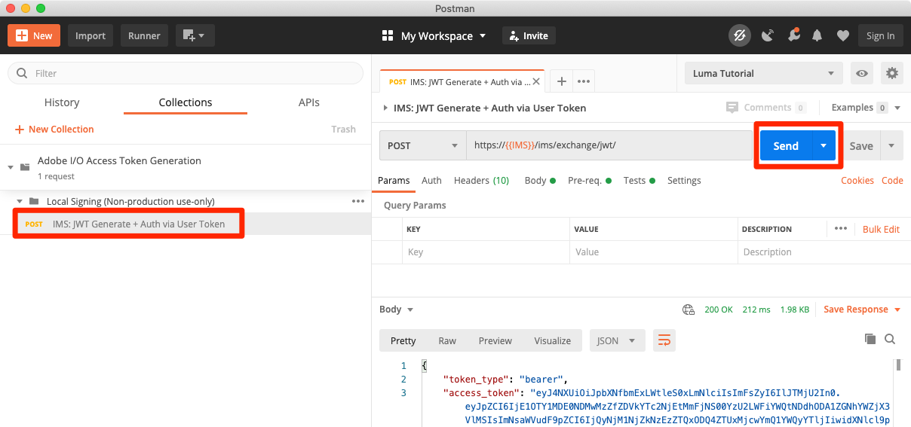
1. The **JWT_TOKEN** and **ACCESS_TOKEN** auto-populate in the environment variables of [!DNL Postman].

    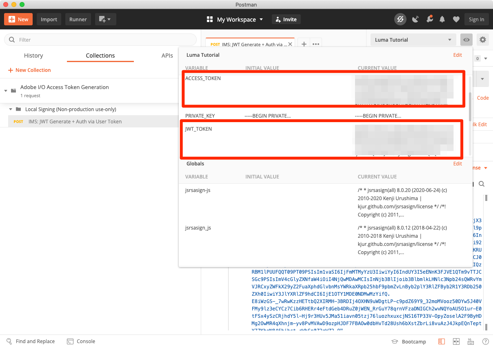

### Add the Sandbox Name and Tenant ID

The `SANDBOX_NAME` and `TENANT_ID` and `CONTAINER_ID` variables are not included in the Adobe Developer Console export, so we add them manually:

1. In [!DNL Postman], open the **Environment Variables**
1. Select the **Edit** link to the right of the environment name
1. In the **Add new variable field**, enter `SANDBOX_NAME` 
1. Into both value fields, enter `luma-tutorial`, the name we gave to our sandbox in the previous lesson. If you used a different name for your sandbox, for example, luma-tutorial-ignatiusjreilly, make sure to use that value.
1. In the **Add new variable field**, enter `TENANT_ID`
1. Switch to your web browser and look up your company's tenant id by going to Experience Platform's interface and extracting the portion of the URL *after the @ sign*. For example, my tenant id is `techmarketingdemos` but yours is different:

    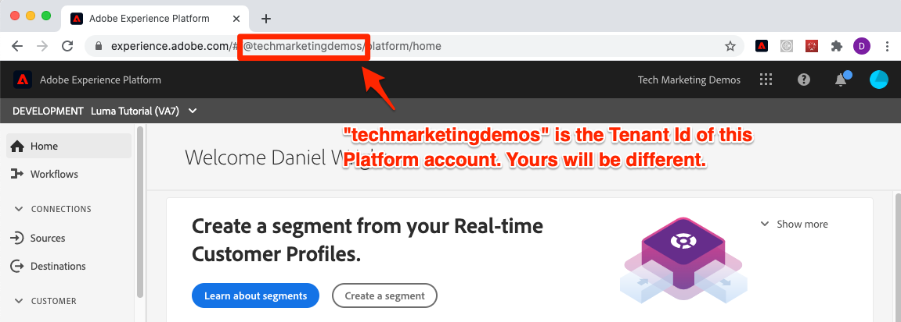

1. Copy this value and return to the [!DNL Postman] Manage Environments screen
1. Paste your tenant id into both value fields
1. In the **Add new variable field**, enter `CONTAINER_ID`
1. Enter `global` into both value fields

    >[!NOTE]
    >
    >`CONTAINER_ID` is a field whose value we change several times during the tutorial. When `global` is used, the API interacts with Adobe-provided elements in your Platform account. When `tenant` is used, the API interacts with your own custom elements.

1. Select **Save**

    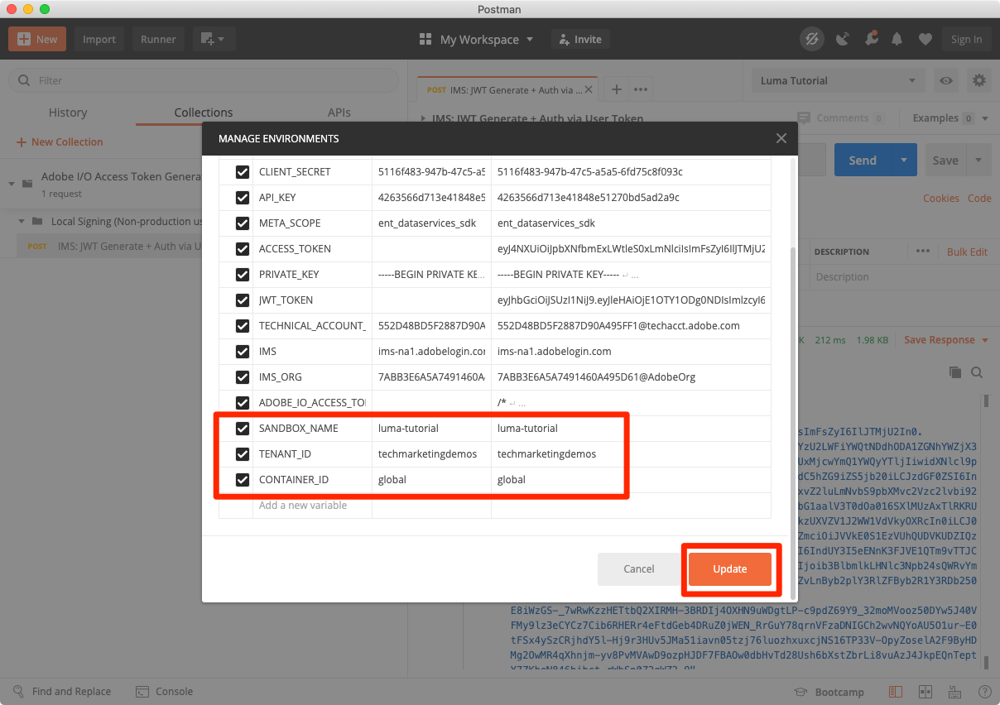

## Make a Platform API Call

Now let's make a Platform API call to confirm that we've configured everything correctly.

Open the [Experience Platform [!DNL Postman] collections in GitHub](https://github.com/adobe/experience-platform-postman-samples/tree/master/apis/experience-platform). There are many collections on this page, for various Platform APIs. I strongly recommend bookmarking it.

Now, let's make our first API call:

1. Download the [Schema Registry API collection](https://raw.githubusercontent.com/adobe/experience-platform-postman-samples/master/apis/experience-platform/Schema%20Registry%20API.postman_collection.json) to your `Luma Tutorial Assets` folder
1. Import it into [!DNL Postman]
1. Open **Schema Registry API > Classes > List classes**
1. Look at the **Params** and **Headers** tabs and note how they include some of the environment variables we entered earlier.
1. Note that the **Headers > Accept value field** is set to `application/vnd.adobe.xed-id+json`. The Schema Registry APIs require one of these [specified Accept header values](https://experienceleague.adobe.com/docs/experience-platform/xdm/api/getting-started.html?lang=en#accept) which provide different formats in the response.
1. Select **Send** to make your first Platform API call!
   
Hopefully you got a successful `200 OK` response containing a list of the available standard XDM classes in your sandbox, as pictured below. 

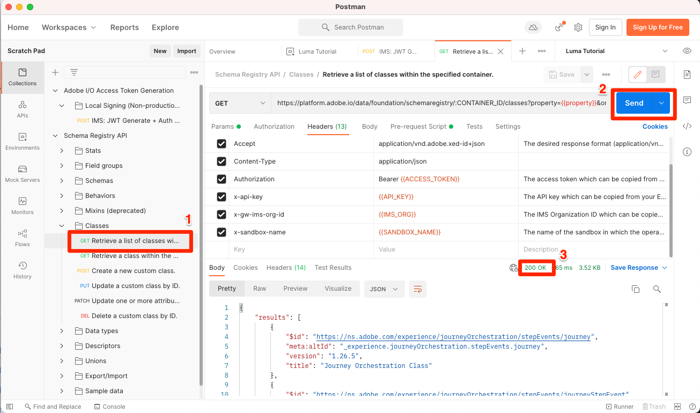

If your call was not successful, take a moment to debug using the error response details of the API call and review the steps above. If you get stuck, please request help in the [Community Forum](https://experienceleaguecommunities.adobe.com/t5/adobe-experience-platform/ct-p/adobe-experience-platform-community) or use the link in the right side of this page to "Log an issue".

With your Platform permissions, sandbox, and [!DNL Postman] set up, you are ready to [model data in schemas](model-data-in-schemas.md)!
