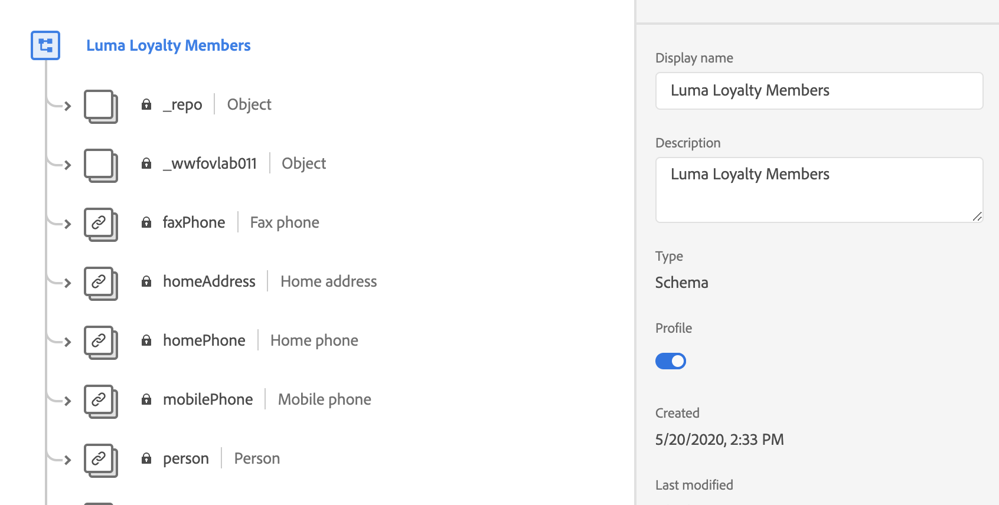
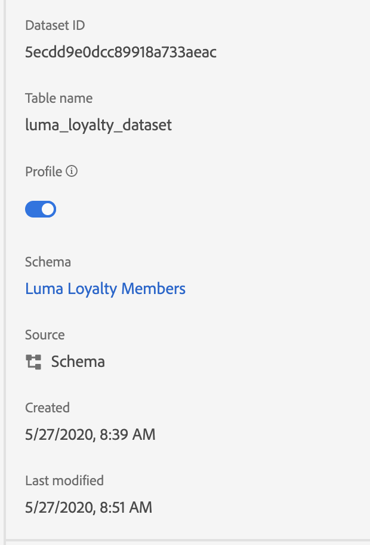
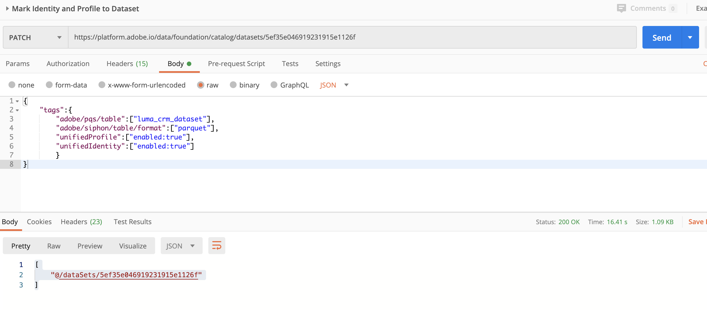

# Stitch Profiles

## UI

In this chapter we will learn how to enable Unified Profile in Schema and Datasets.

### Enable an XDM schema for Real-time Customer Profile by using Platform UI 

1. Go to **Luma Loyalty Members Schema**
1. Select Schema
1. In Schema Properties, Press Enable **Profile** toggle.
1. It will show confirmation message, Press Enable button to confirm
1. Apply & Save

    

1. Repeat Step 3-5 for **Luma Product Catalog** schema.

### Enable a dataset for Real-time Customer Profile

1. Go to Luma Loyalty Members Dataset.
1. Enable Profile toggle in dataset field 
1. It will show confirmation message, Press Enable button to confirm

    


TASK : Following the above steps , you can enable profile on **Luma Offline Purchase Schema** as well.

```
Note: Some roles won't be doing API based exercises. For such roles, we need to ask them to Enable Profile toggle in other schemas using UI only.
```

## Unified Profile using API

In this chapter we will learn how to enable Unified Profile in Schema and Datasets using API


### Enable an Schema for Real-time Customer Profile by using API 

```
NOTE TO SME : //TODO

```

### Enable an Dataset for Real-time Customer Profile by using API 

1. Open Postman,  Ensure your have authenticated.
1. Go to Platform Collection and open folder **5-Profile**
1. Select Request **Mark Identity and Profile to Dataset**
1. It is **PATCH** request with following URL , Change the data id. To get the dataset Id you may use postman request **Get XDM Status**

    ```
    https://platform.adobe.io/data/foundation/catalog/dataSets/5ef35e046919231915e1126f
    ```

1. Change dataset id from the URL and enter your own datasetId.
1. Open Body of **PATCH** Request and you should see following properties mentioned to enable unified profile and unified identity in dataset.

    ```
    {
        "tags":{
            "adobe/pqs/table":["luma_crm_dataset"],
            "adobe/siphon/table/format":["parquet"],
            "unifiedProfile":["enabled:true"],
            "unifiedIdentity":["enabled:true"]
            }
    }
    ```

1. Save and Send Request.
1. As response you should get dataset Id as following:

    ```
    [
        "@/dataSets/5ef35e046919231915e1126f"
    ]
    ```

    


### NOTE TO SME :

 While creating this doc, I am not able to mark profile in dataset without using following in tags.

```

       "adobe/pqs/table":["luma_crm_dataset"],
        "adobe/siphon/table/format":["parquet"],

```

Without these , I am getting Forbidden error as below. Please check with some one before recording this as video.

```
    "type": "/placeholder/type/uri",
    "status": 403,
    "title": "ForbiddenError",
    "detail": "Not permitted to create or modify tags for namespace(adobe/pqs/table)."

```