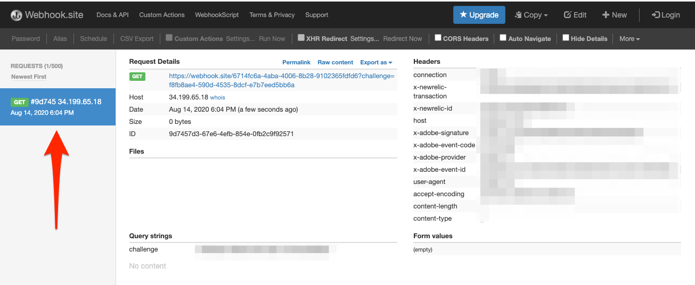

# Subscribe to data ingestion events

<!--25min-->

In this lesson, you will subscribe to data ingestion events by setting up a webhook with the Adobe Developer Console and an online webhook development tool. You will use these events to monitor the status of your data ingestion jobs in the subsequent lessons.

**Data Engineers** will want to subscribe to data ingestion events outside of this tutorial.
**Data Architects** _can skip this lesson_ and go to the [batch ingestion lesson](ingest-batch-data.md).

## Permissions required

In the [Configure Permissions](configure-permissions.md) lesson, you set up all the access controls required to complete this lesson, specifically:

* Developer-role access to the `Luma Tutorial Platform` product profile (for API)

>[!IMPORTANT]
>
> These notifications triggered by the data ingestion events will apply to _all of your sandboxes_, not just the `Luma Tutorial` sandbox we are using for the exercises in this tutorial. So, you might see notifications coming from other data ingestion events in your other sandboxes.

## Set up a webhook

In this exercise, we will create a webhook using an online tool called webhook.site (feel free to substitute any other webhook development tool you prefer to use):

1. In another browser tab, open the website [https://webhook.site/](https://webhook.site/)
1. You are assigned a unique URL, which you should bookmark, as you return to it later in the data ingestion lessons:
   
    
1. Select the **Edit** button in the top navigation
1. As the Response body, enter `$request.query.challenge$`. The Adobe I/O Events notifications we set up later in this lesson send a challenge to the webhook, and requires that it be included in the response body.
1. Select the **Save** button

    

## Set up

1. In another browser tab, open the [Adobe Developer Console](https://console.adobe.io/)
1. Open your `Luma Tutorial API Project`
1. Select the **[!UICONTROL Add to Project]** button and then select **[!UICONTROL Event]**

    
1. Filter the list by selecting **[!UICONTROL Experience Platform]**
1. Select **[!UICONTROL Platform notifications]**
1. Select the **[!UICONTROL Next]** button
    
1. Select all of the events
1. Select the **[!UICONTROL Next]** button
    
1. On the next screen for configuring credentials, select the **[!UICONTROL Next]** button again
    
1. As the **[!UICONTROL Event registration name]**, enter `Platform notifications`
1. Scroll down and select to open the **[!UICONTROL Webhook]** section
1. As the **[!UICONTROL Webhook URL]**, paste the value from the **Your unique URL** field from webhook.site
1. Select the **[!UICONTROL Save configured events]** button
    
1. Wait for your configuration to save and you should see that your `Platform notifications` event is Active with your webhook details and no error messages
    
1. Switch back to your webhook.site tab and you should see the first request to the webhook, resulting from the validation of your Developer Console configuration:
    

That's it for now, you will learn more about these notifications in the next lessons when you ingest data.

## Additional Resources

* [Webhook.site](https://webhook.site/)
* [Data ingestion notifications documentation](https://experienceleague.adobe.com/docs/experience-platform/ingestion/quality/subscribe-events.html)
* [Getting Started with Adobe I/O Events documentation](https://www.adobe.io/apis/experienceplatform/events/docs.html)

Ok, let's finally start [ingesting data](ingest-batch-data.md)!
