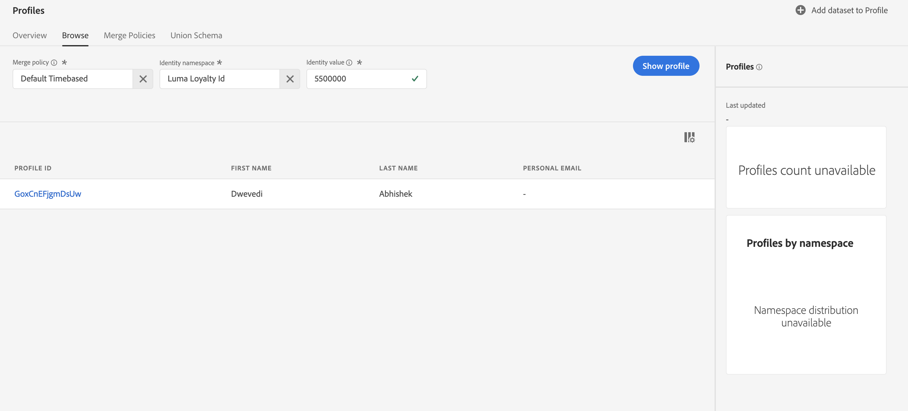

# Validate Data and Profiles

Lorem Ipsum

<!-->[!VIDEO]()-->

## Permissions required

In the [Configure Permissions](configure-permissions.md) lesson, you setup all the access controls you need to complete this lesson, specifically:

* Permission item Sandbox Management > Manage Sandboxes
* Permission item Sandbox Management > View Profiles
* Permission item Sandboxes > `Luma Tutorial`
* User-role access to the `Luma Tutorial Platform` product profile
* Developer-role access to the `Luma Tutorial Platform` product profile (for API)

## Retrieve Profile By UI

1. Go to **Profiles** under **Customer** section in platform.
1. Select Browse tab
1. Select **Identity Namespace field** and Select **Luma Loyalty Id**
1. Select **Identity value** and enter **5500000** 
1. Press Show Profile
1. You should get the relevant profile and you can click explore it further



## Retrieve Profile using API

1. In platform collection , Go to folder **5-Profile**
1. Select Request **Retrieve Profile** , verify URL

    ```
    https://platform.adobe.io/data/core/ups/access/entities?entityId=5500000&entityIdNS=lumaLoyaltyId&schema.name=_xdm.context.profile
    ```

1. Send the request and you should get all details of user

    

## Additional Resources
