# Ingest streaming data

<!--1hr-->

In this lesson, you will stream data using the Adobe Experience Platform Web SDK.

>[!WARNING]
>
> The Luma website used in this tutorial is expected to be replaced during the week of February 16, 2026. Work done as part of this tutorial might not be applicable to the new website.

There are two main tasks data collection tasks:

* Implement Web SDK on the Luma website to stream customer events to Experience Platform Edge Network. 

* Configure a datastream to tell Edge Network to forward the data to our `Luma Web Events Dataset` in Experience Platform. 

**Data Engineers** will need to ingest streaming data outside of this tutorial. Although, web developers typically implement Web SDK into a website, it is important to know how the process works. Even if you aren't a web developer, you should be able to complete this basic implementation.

Before you begin the exercises, watch these two short videos to learn more about streaming data ingestion and Web SDK:

>[!VIDEO](https://video.tv.adobe.com/v/28425?learn=on&enablevpops)

>[!VIDEO](https://video.tv.adobe.com/v/34141?learn=on&enablevpops)

>[!NOTE]
>
>While this tutorial focuses on streaming ingestion from websites with Web SDK, you can also stream data using the [Mobile SDK](https://experienceleague.adobe.com/en/docs/platform-learn/implement-mobile-sdk/overview), [Edge Network Server API](https://experienceleague.adobe.com/en/docs/platform-learn/data-collection/server-api/overview), and the [HTTP API](https://experienceleague.adobe.com/en/docs/experience-platform/sources/connectors/streaming/http).

## Permissions required

In the [Configure Permissions](configure-permissions.md) lesson, you set up all the access controls required to complete this lesson.

## Configure the datastream

First we will configure the datastream. A datastream tells Experience Platform Edge Network where to send the data after receiving it from the Web SDK call. For example, do you want to send the data to Experience Platform, Adobe Analytics, or Adobe Target? 

To create your [!UICONTROL datastream]:

1. Make sure you are still in the` Luma Tutorial` sandbox
1. Select **[!UICONTROL Datastreams]** in the left navigation
1. Select the **[!UICONTROL New Datastream]** button in the upper-right hand corner

    

1. For the **[!UICONTROL Name]**, enter `Luma Platform Tutorial` (add your name to the end, if multiple people from your company are taking this tutorial)
1. Select the **[!UICONTROL Save]** button
   
    

Once data arrives at the Edge, the [!UICONTROL Datastream] forwards it to the configured [!UICONTROL Services]. To send data to Experience Platform:

1. Select **[!UICONTROL Add Service]**
    
    
1. Select `Adobe Experience Platform`
1. Select your `Luma Web Events Dataset`
1. Select **[!UICONTROL Save]** 

    

Although there is a Profile Dataset option in the datastream configuration, this should not be used to send normal XDM Individual Profile data to Platform. This setting should only be used to send consent, push token, and user activity region details.

The checkboxes for [!UICONTROL Offer Decisioning], [!UICONTROL Edge Segmentation], [!UICONTROL Personalization Destinations], and [!UICONTROL Adobe Journey Optimizer] allow you to activate data on the Edge, but are not used in this tutorial.

## Implement Web SDK

### Add a property

First we must create a tag property (formerly a tag property). A property is a container for all the JavaScript, rules, and other features required to collect details from a web page and send it to various locations.

To create a property:

1. Go to **[!UICONTROL Tags]** in the left navigation
1. Select **[!UICONTROL New Property]** 
    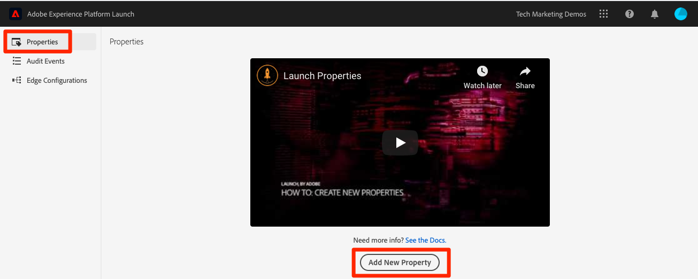
1. As the **[!UICONTROL Name]**, enter `Luma Platform Tutorial` (add your name to the end, if multiple people from your company are taking this tutorial)
1. As the **[!UICONTROL Domains]**, enter `enablementadobe.com` (explained later)
1. Select **[!UICONTROL Save]**
    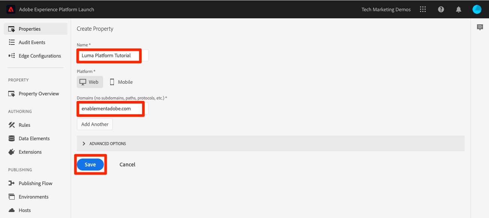

### Add extensions to the property

Now that you have a property you can add the Web SDK using an extension. An extension is a package of code that adds functionality to your tag property and implementation. To add the extension:

1. Open your tag property
1. Go to **[!UICONTROL Extensions]** in the left navigation
1. Go to the **[!UICONTROL Catalog]** tab
1. There are many extensions available for tags. Filter the catalog with the term `Web SDK`
1. Select the **[!UICONTROL Adobe Experience Platform Web SDK]** extension to open the side panel
1. Select the **[!UICONTROL Install]** button
    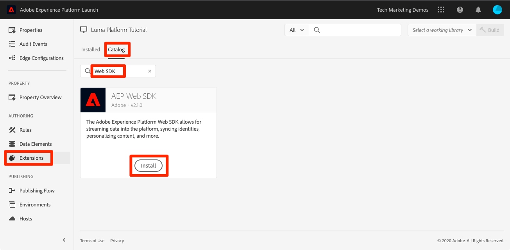  
1. There are several configurations available for the Web SDK extension, but there only two we are going to configure for this tutorial. Update the **[!UICONTROL Edge Domain]** to `data.enablementadobe.com`. This setting allows you to set first party cookies with your Web SDK implementation, which is encouraged. When you implement Web SDK on your own website, we recommend youcreate a CNAME for your own data collection purposes, for example, `data.YOUR_DOMAIN.com`
1. In the **[!UICONTROL Datastreams]** section, for the Production Environment, select your `Luma Tutorial` sandbox and your `Luma Platform Tutorial` datastream.
1. Feel free to look at the other configuration options (but don't change them!) and then select **[!UICONTROL Save]**
    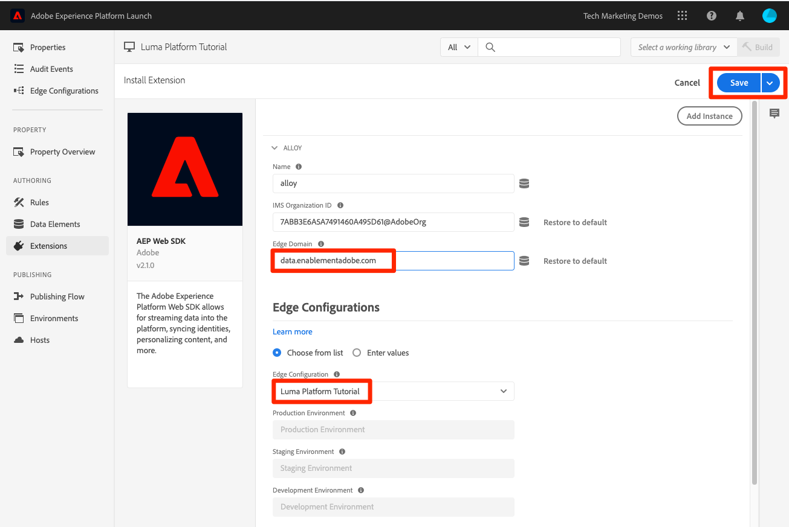
 
From the Extensions Catalog screen, install the Adobe Client Data Layer extension. This extension will help us read the data layer from the Luma website:
    

No configurations are needed in the extension, so just save it to your library.

## Create a rule to send data

Now we will create a rule to send data to Platform. A rule is a combination of events, conditions, and actions that tell tags to do something. To create a rule:

1. Navigate to **[!UICONTROL Rules]**
1. Select the **[!UICONTROL Create New Rule]** button
    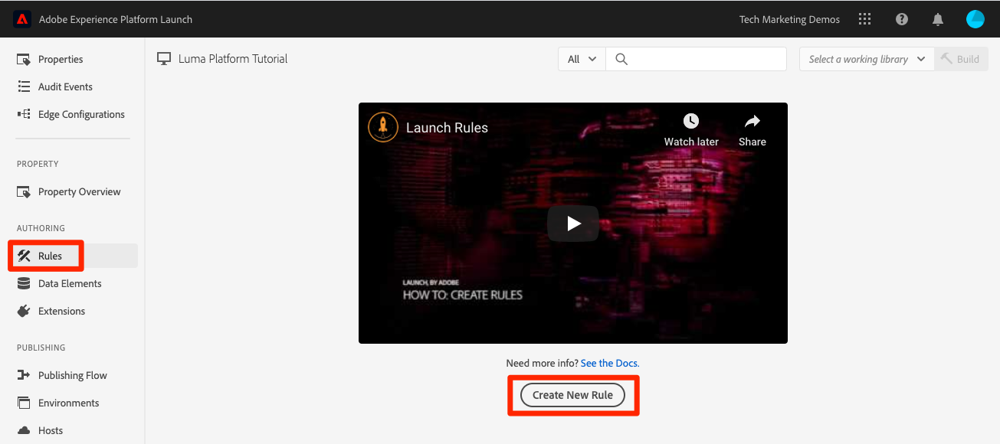
1. Name the rule `adobeDataLayer event`
1. Under **[!UICONTROL Events]**, select the **[!UICONTROL Add]** button
    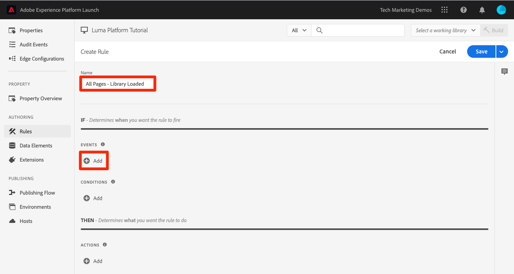  
1. Use the **[!UICONTROL Adobe Client Data Layer]** **[!UICONTROL Extension]** and select **[!UICONTROL Data Pushed]** as the **[!UICONTROL Event Type]**.
1. Select **[!UICONTROL Listen to]**. **[!UICONTROL All Events]**.
1. Select **[!UICONTROL Keep Changes]** to return to the main rule screen
    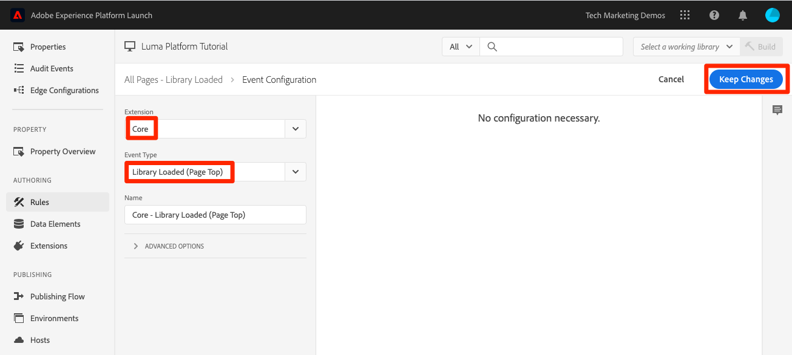    
1. Under **[!UICONTROL Actions]**, select the **[!UICONTROL Add]** button
1. Use the **[!UICONTROL Adobe Experience Platform Web SDK]** **[!UICONTROL Extension]** and select **[!UICONTROL Send Event]** as the **[!UICONTROL Action Type]**
1. On the right, select **[!UICONTROL Web Webpagedetails Page Views]** from the **[!UICONTROL Type]** dropdown. This populates the eventType field of our `Luma Web Events Schema`
1. Select **[!UICONTROL Keep Changes]** to return to the main rule screen
    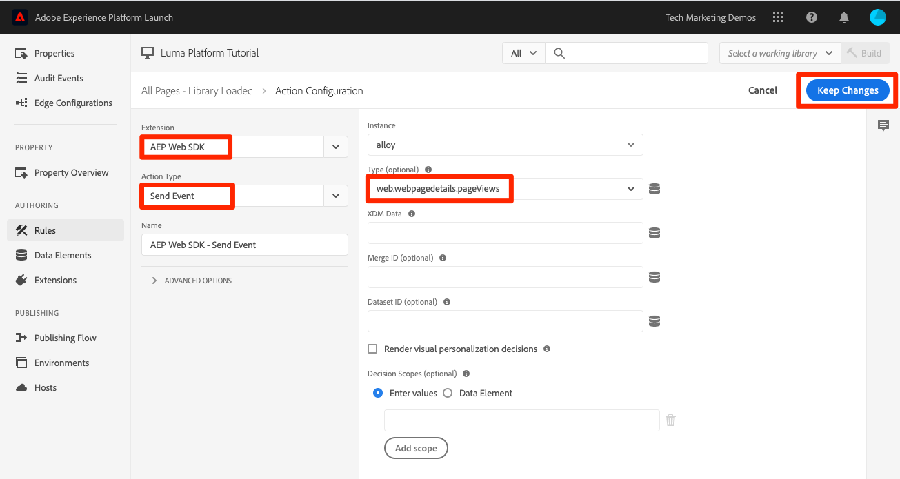
1. Select **[!UICONTROL Save]** to save the rule    
    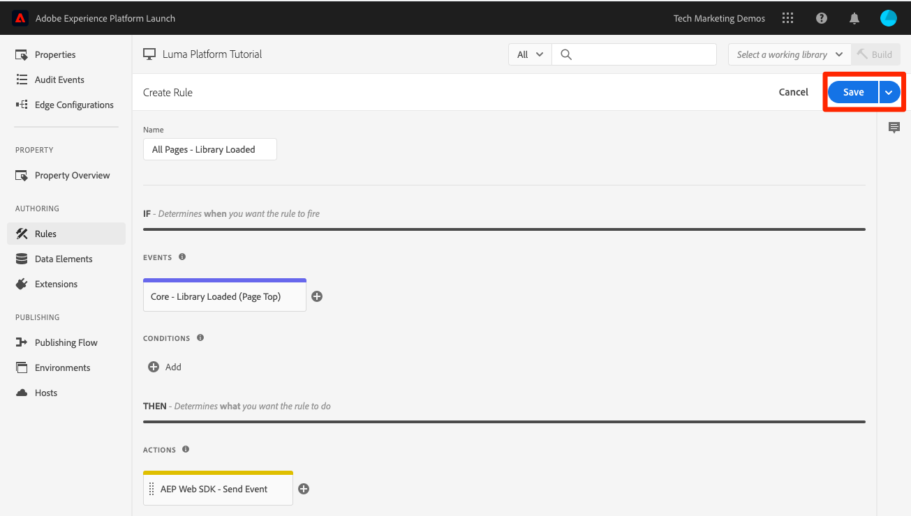   

## Publish the rule in a library

Next we will publish the rule to our development environment so we can verify that it works.

To create a library:

1. Go to **[!UICONTROL Publishing Flow]** in the left navigation
1. Select **[!UICONTROL Add Library]**
    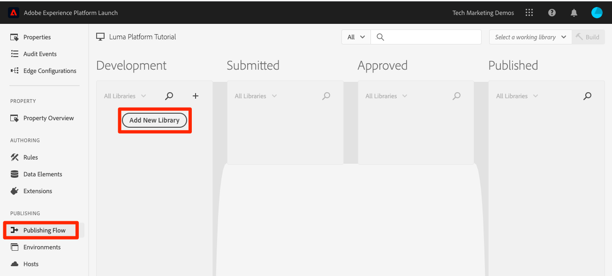
1. For the **[!UICONTROL Name]**, enter `Luma Platform Tutorial`
1. For the **[!UICONTROL Environment]**, select `Development`
1. Select the **[!UICONTROL Add All Changed Resources]** button. (In addition to the [!UICONTROL Adobe Experience Platform Web SDK] extension and the `adobeDataLayer event` rule, you will also see the [!UICONTROL Core] extension added which contains the base JavaScript required by all tags web properties.)
1. Select the **[!UICONTROL Save & Build for Development]** button 
    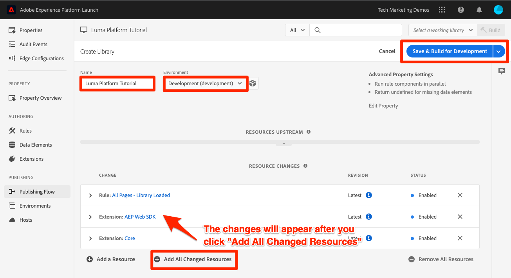

The library may take a few minutes to build and when it is complete it displays a green dot to the left of the library name:
    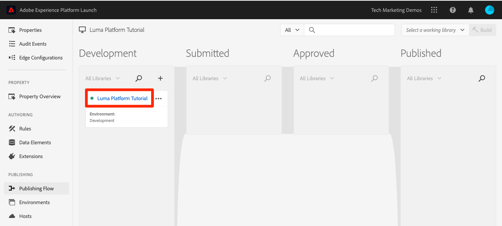   

As you can see on the [!UICONTROL Publishing Flow] screen, there is a lot more to the publishing process which is beyond the scope of this tutorial. We are just going to use a single library in our Development environment.

## Validate the data in the request

### Add the Adobe Experience Platform Debugger

The Experience Platform Debugger is an extension available for Chrome which helps you see the Adobe technology implemented in your web pages. Download the version for your preferred browser:

* [Chrome extension](https://chrome.google.com/webstore/detail/adobe-experience-platform/bfnnokhpnncpkdmbokanobigaccjkpob)

If you've never used the Debugger before, you might want to watch this five-minute overview video:

>[!VIDEO](https://video.tv.adobe.com/v/32156?learn=on&enablevpops)

### Open the Luma website

For this tutorial, we use a publicly hosted version of the Luma demo website. Let's open it and bookmark it:

 1. In a new browser tab, open the [Luma website](https://newluma.enablementadobe.com). 
 1. Bookmark the page for use throughout the rest of the tutorial

This hosted website is why we used `enablementadobe.com` in the [!UICONTROL Domains] field of our initial tag property configuration and why we used `data.enablementadobe.com` as our first-party domain in the [!UICONTROL Adobe Experience Platform Web SDK] extension. See, I had a plan!

   

### Use the Experience Platform Debugger to map to your tag property

The Experience Platform Debugger has a cool feature that allows you to replace an existing tag property with a different one. This is useful for validation and allows us to skip many implementation steps in this tutorial.

1. Make sure you have the Luma site open and select the Experience Platform Debugger extension icon
1. The Debugger will open and show some details of the hardcoded implementation, which is unrelated to this tutorial (you may need to reload the Luma site after opening the Debugger)
1. Confirm that the Debugger is "**[!UICONTROL Connected to Luma]**" as pictured below and then select the "**[!UICONTROL lock]**" icon to lock the Debugger to the Luma site.
1. Select the **[!UICONTROL Sign In]** button on the top right to authenticate.
1. Now go to **[!UICONTROL Experience Platform Tags]** in the left navigation
1. Select the Configuration tab
1. To the right of where it shows you the **[!UICONTROL Page Embed Codes]**, open the **[!UICONTROL Actions]** dropdown, and select **[!UICONTROL Replace]**
    
1. Since you are authenticated, the Debugger is going to pull in your available tag properties and environments. Select your `Luma Platform Tutorial` property
1. Select your `Development` environment
1. Select the **[!UICONTROL Apply]** button
    
1. The Luma website will now reload _with your tag property_. 
    
1. Go to **[!UICONTROL Summary]** in the left navigation, to see the details of your [!UICONTROL tag] property
    
1. Now go to **[!UICONTROL Experience Platform Web SDK]** in the left navigation to see the **[!UICONTROL Network Requests]**
1. Select the **[!UICONTROL events]** row

    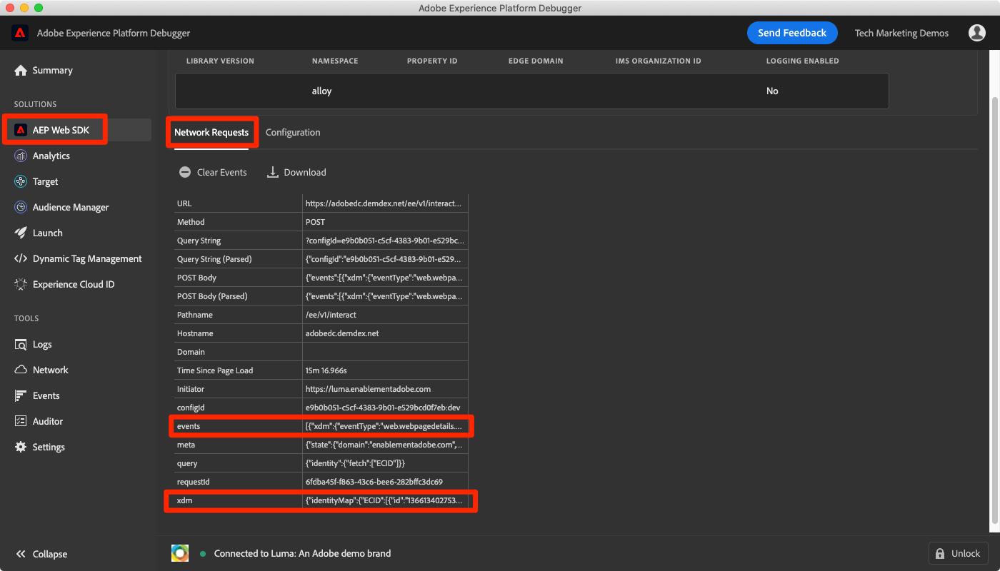

1. Note how we can see the `web.webpagedetails.pageView` event type we specified in our [!UICONTROL Send Event] action
    

1. The  request details are also visible in the browser's web developer tools **Network** tab. Open it and reload the page. Filter for calls with `interact` to locate the call, select it, and then look in the **Headers** tab, **Request Payload** area.
       
1. Go to the **Response** tab and note how the ECID value is included in the response. Copy this value as you will use it to validate the profile information in the next exercise.
       

## Validate the data in Experience Platform

You can validate that data is landing in Platform by looking at the batches of data arriving in the `Luma Web Events Dataset`. (I know, it's called streaming data ingestion but now I'm saying it arrives in batches! It streams in real-time to Profile, so it can be used for real-time segmentation and activation, but is sent in batches every 15 minutes to the data lake.)

To validate the data:

1. In the Platform user interface, go to **[!UICONTROL Datasets]** in the left navigation
1. Open the `Luma Web Events Dataset` and confirm that a batch has arrived. Remember, they are sent every 15 minutes, so you might need to wait for the batch to show up.
1. Select the **[!UICONTROL Preview dataset]** button
    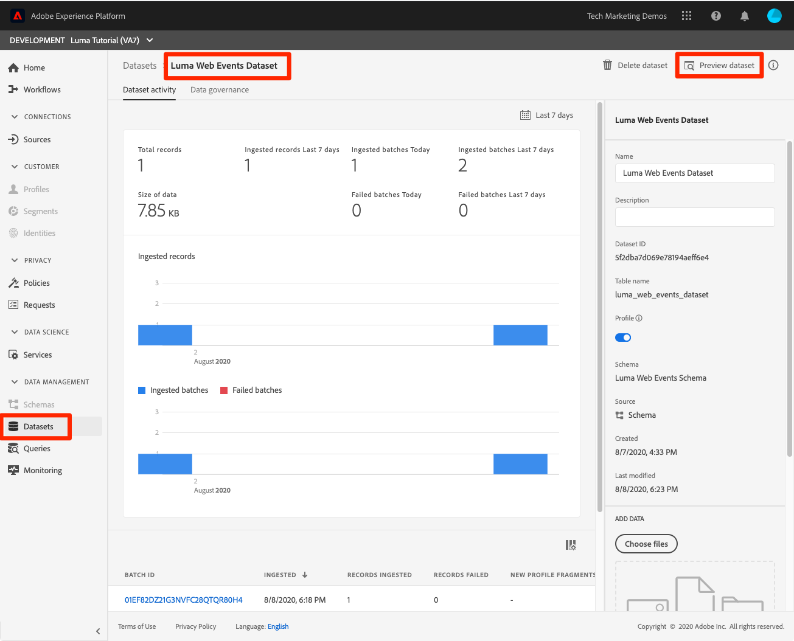
1. In the preview modal, note how you can select different fields of the schema on the left to preview those specific data points:
    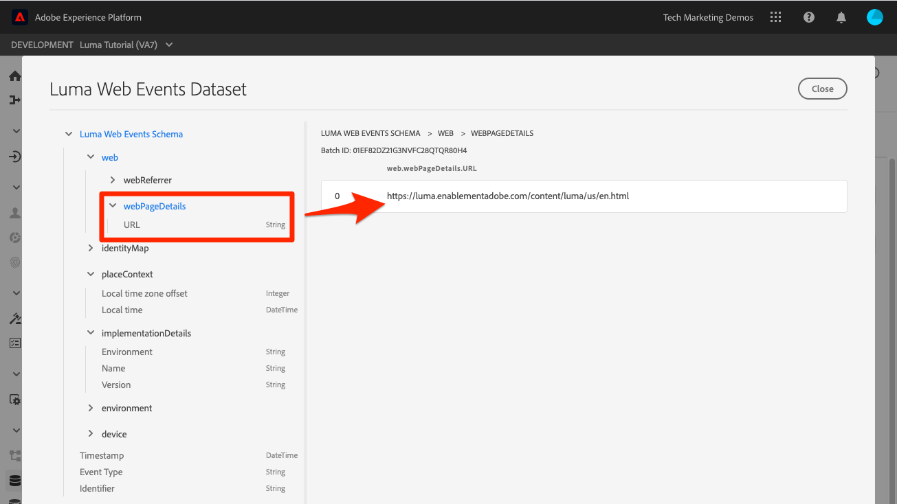   

You can also confirm that the new profile is showing up:

1. In the Platform user interface, go to **[!UICONTROL Profiles]** in the left navigation
1. Select the **[!UICONTROL ECID]** namespace and search for your ECID value (copy it from the respon. The profile will have its own id, separate from the ECID. 
1. Select the **[!UICONTROL Profile ID]** to open the profile
    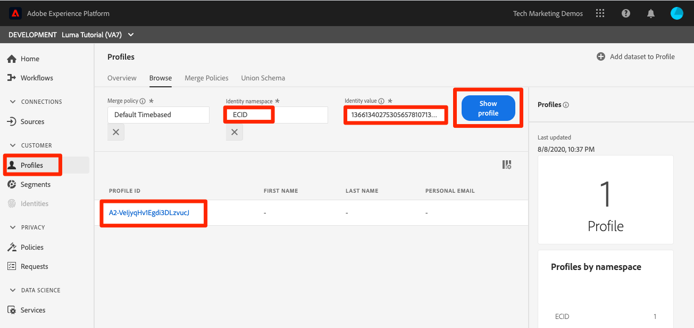
1. Select the **[!UICONTROL Events]** tab to see the pages you viewed
    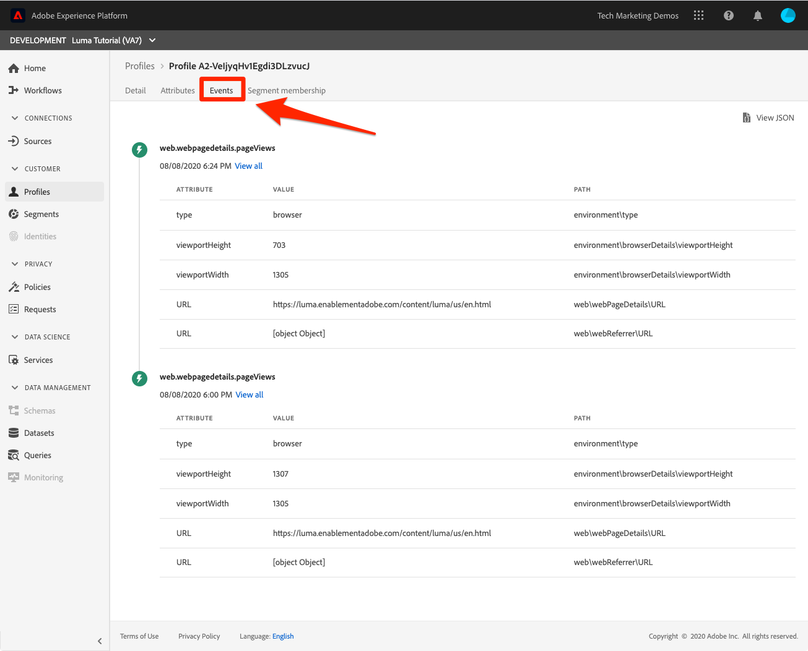   
    <!---->  

## Add custom data to the event

Web SDK populates many XDM fields automatically, but you will inevitably need to customize your implementation to collect additional fields from your website. This gets very involved, but here are a few simple examples.

### Create a data element to store XDM data

1. Navigate back to your `Luma Platform Tutorial` tag property
1. Open the **[!UICONTROL Select a Working Library]** dropdown and select your `Luma Platform Tutorial` library. This setting makes it easier to publish additional updates to our library.
1. Now go to **[!UICONTROL Data Elements]** in the left navigation
1. Select the **[!UICONTROL Create New Data Element]** button

    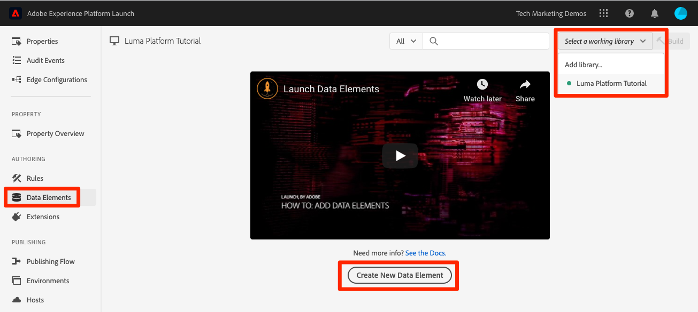   

On the **[!UICONTROL Data Elements]** page:

1. As the **[!UICONTROL Name]**, enter `XDM data`
1. As the **[!UICONTROL Extension]**, select `Adobe Experience Platform Web SDK`
1. As the **[!UICONTROL Data Element Type]**, select `Variable`
1. As the **[!UICONTROL Sandbox]**, select your `Luma Tutorial` sandbox
1. As the **[!UICONTROL Schema]**, select your `Luma Web Events Schema`
1. Make sure that `Luma Platform Tutorial` is selected as the working library
1. Select **[!UICONTROL Save to Library]**
       

### Create a data element for page name

1. Create a new data element
1. As the **[!UICONTROL Name]**, enter `Page Name` 
1. As the **[!UICONTROL Data Element Type]**, select `JavaScript Variable`
1. As the **[!UICONTROL JavaScript variable name]**, enter `adobeDataLayer.0.page.name`
1. To help standardize the format of the values, check the boxes for **[!UICONTROL Force lowercase value]** and **[!UICONTROL Clean text]**
1. Select **[!UICONTROL Save to Library]**
    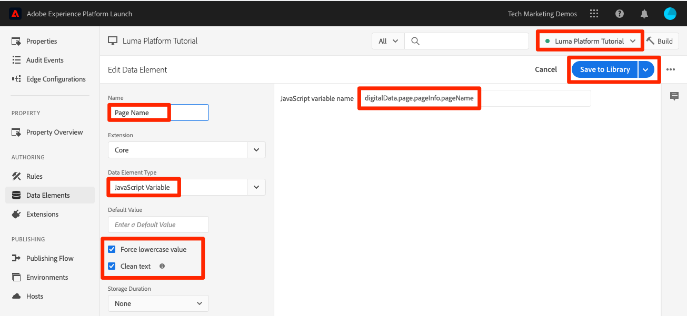 

### Add the XDM data to your Send Event action

Now that you have data mapped to XDM fields, you can include it in your Send Event action:

1. Go to the **[!UICONTROL Rules]** screen
1. Open your `adobeDataLayer event` rule
1. Open the `Adobe Experience Platform Web SDK - Send Event` action
1. As the **[!UICONTROL XDM]**, select the icon to open the data element selection modal and choose your `XDM data` data element
1. Select **[!UICONTROL Keep Changes]** 
    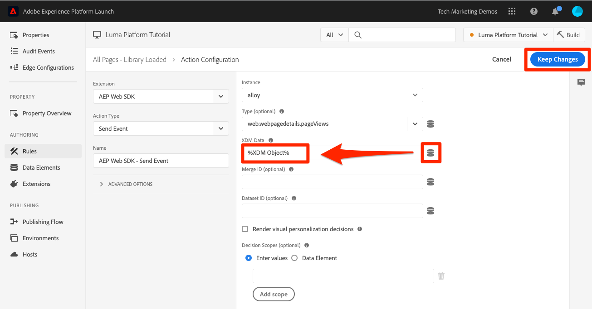

1. Add a new Action to your rule
1. Select the `Adobe Experience Platform Web SDK` **[!UICONTROL Extension]**
1. Select the `Update Variable` **[!UICONTROL Action Type]**
1. Populate your `Page Name` data element as the `web.webPageDetails.name`
1. Select **[!UICONTROL Keep Changes]** 
    

1. Rearrange the [!UICONTROL Actions] so that [!UICONTROL Update variable] fires before [!UICONTROL Send event]
1. Now, since you have had `Luma Platform Tutorial` selected as your working library for the last several exercises, your recent changes have been saving directly to the library. Instead of having to publish our changes via the Publishing Flow screen, you can just open the dropdown and select **[!UICONTROL Save to Library and Build]**
    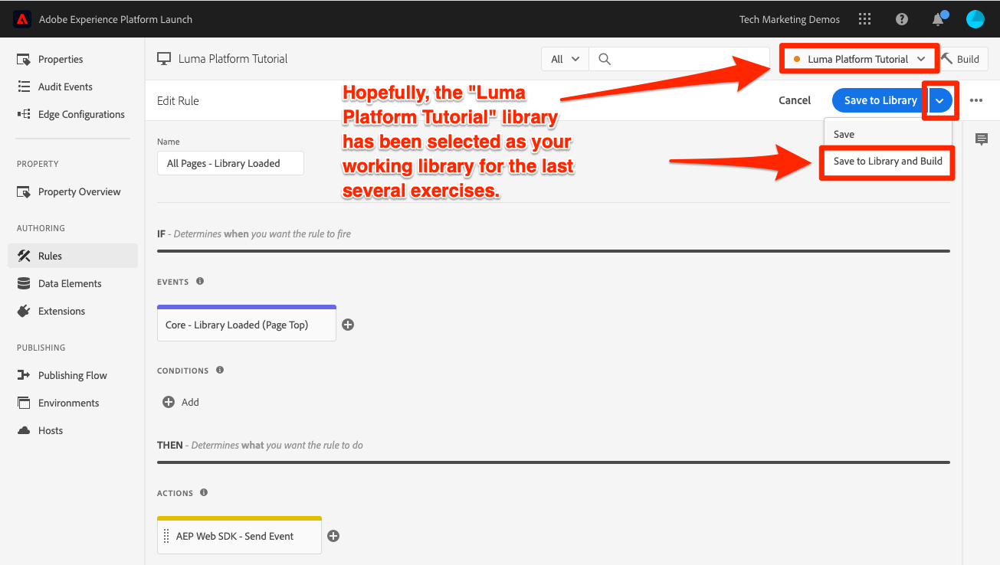

This starts building a new tag library with the three changes you just made.

### Validate the XDM data

You should now be able to reload the Luma homepage, while mapped to your tag property using the Debugger as you learned earlier, and see that the page name field populates in the request!
    

You can also validate the page name data was received in Platform, by previewing the dataset and profile.

## Send additional identities

Your Web SDK implementation is now sending events with the Experience Cloud ID (ECID) as the primary identifier. The ECID is generated automatically by the Web SDK and is unique per device and browser. A single customer can have multiple ECIDs depending on which device and browser they are using. So how can we get a unified view of this customer and link their online activity to our CRM, Loyalty, and Offline Purchase data? We do that by collecting additional identities during their session and allowing the Identity Service to deterministically link them.

If you recall, I mentioned that we would be using the ECID and CRM Id as identities for our web data in the [Map Identities](map-identities.md) lesson. So let's collect the CRM Id with the Web SDK!

### Add Data Element for the CRM Id

First we store the CRM Id in a data element:

1. In the tags interface, add a data element named `CRM Id`
1. As the **[!UICONTROL Data Element Type]**, select **[!UICONTROL JavaScript Variable]**
1. As the **[!UICONTROL JavaScript variable name]**, enter `adobeDataLayer.0.user.id`
1. Select the **[!UICONTROL Save to Library]** button (`Luma Platform Tutorial` should still be your working library)
    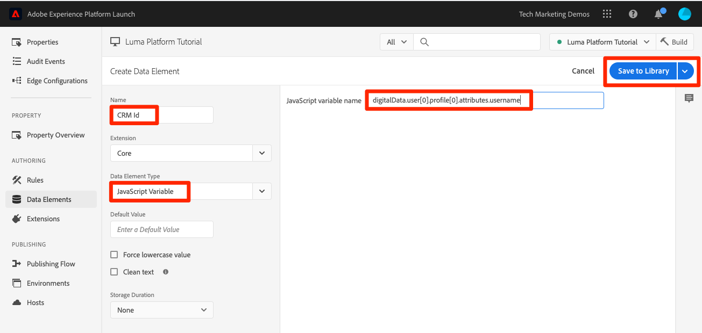

### Add the CRM Id to the Identity Map data element

Now that we have captured the CRM Id value, we must associate it with a special data element type called the [!UICONTROL Identity Map] data element:

1. Add a data element named `Identity Map`
1. As the **[!UICONTROL Extension]**, select **[!UICONTROL Adobe Experience Platform Web SDK]**
1. As the **[!UICONTROL Data Element Type]**, select **[!UICONTROL Identity map]**
1. As the **[!UICONTROL Namespace]**, select or type `Luma CRM Id`, which is the [!UICONTROL namespace] we created in an earlier lesson.

1. As the **[!UICONTROL ID]**, select the icon to open the data element selection modal and choose your `CRM Id` data element
1. As the **[!UICONTROL Authenticated State]**, select **[!UICONTROL Authenticated]**
1. Check **[!UICONTROL Primary]**

    >[!TIP]
    >
    > Adobe recommends sending identities that represent a person, such as `Luma CRM Id`, as the [!UICONTROL primary] identity.
    >
    > If the identity map contains the person identifier (for example, `Luma CRM Id`), then the person identifier becomes the [!UICONTROL primary] identity. Otherwise, `ECID` becomes the [!UICONTROL primary] identity.

1. Select the **[!UICONTROL Save to Library]** button (`Luma Platform Tutorial` should still be your working library)
    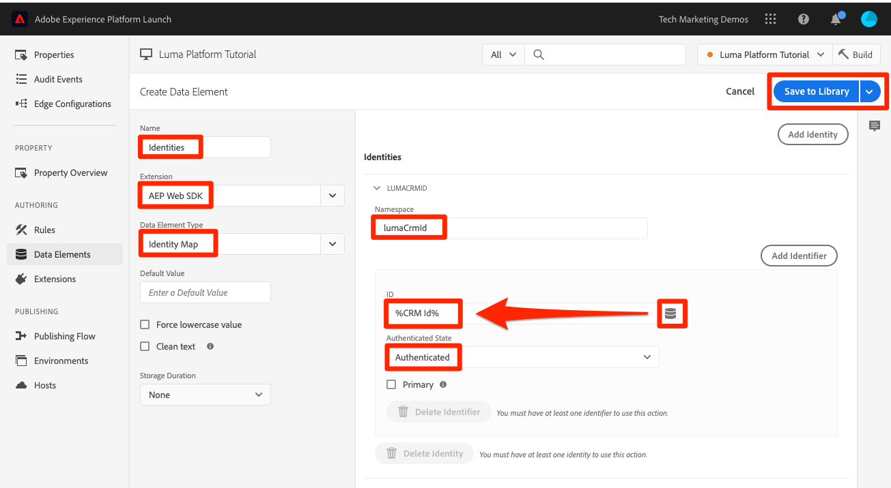

>[!NOTE]
>
>You can pass multiple identifiers using the [!UICONTROL Identity map] data type.

### Add the Identity map data element to the XDM Variable

Now we must update the XDM Variable action in our Rule to include the Identity Map. Don't worry, we're almost done with this lesson!

1. Open your `adobeDataLayer event` rule
1. Open the `Update variable` action
1. Select your `Identity Map` data element to the `identityMap` XDM field.
1. Select **[!UICONTROL Keep Changes]**
    
1. Since you have had `Luma Platform Tutorial` selected as your working library for the last several exercises, select **[!UICONTROL Save to Library and Build]**

    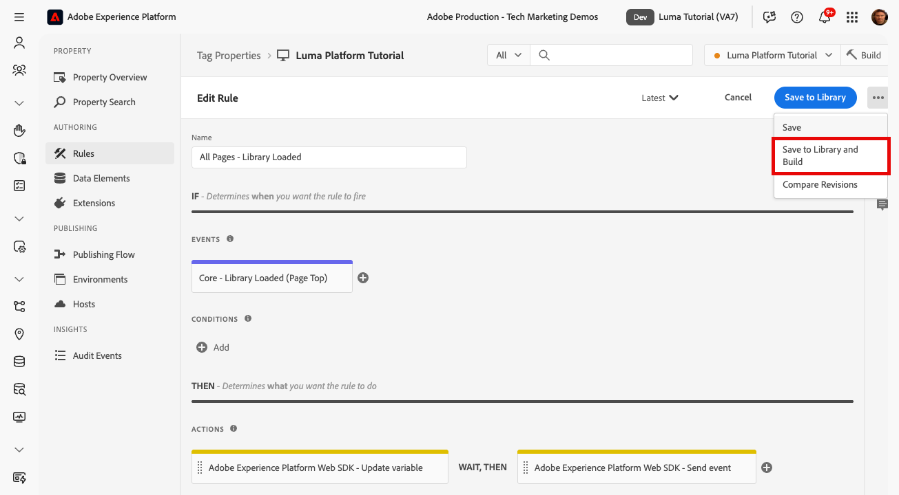

<!--U1770721295408-->

### Validate the identity

To validate that the CRM Id is now being sent by the Web SDK:

1. Open the [Luma website](https://luma.enablementadobe.com/content/luma/us/en.html)
1. Map it to your tag property using the Debugger, as per the earlier instructions
1. Select the **Login** link on the top right of the Luma website
1. Log in using the credentials `test@test.com`/`test`
1. Once authenticated, inspect the Experience Platform Web SDK call in the Debugger (**[!UICONTROL Adobe Experience Platform Web SDK]** > **[!UICONTROL Network Requests]** > **[!UICONTROL events]** of the most recent request) and you should see the `lumaCrmId`:
    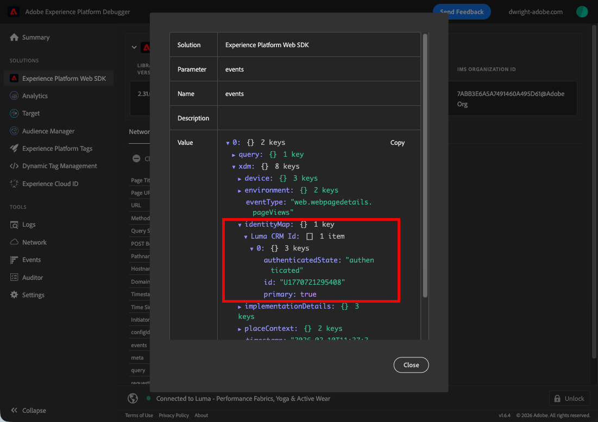
1. Look up the user profile using the ECID namespace and value again. In the profile, you will see the CRM Id and also the Loyalty Id and the profile details like the name and phone number. All identities and data have been stitched together into a single, real-time customer profile!
    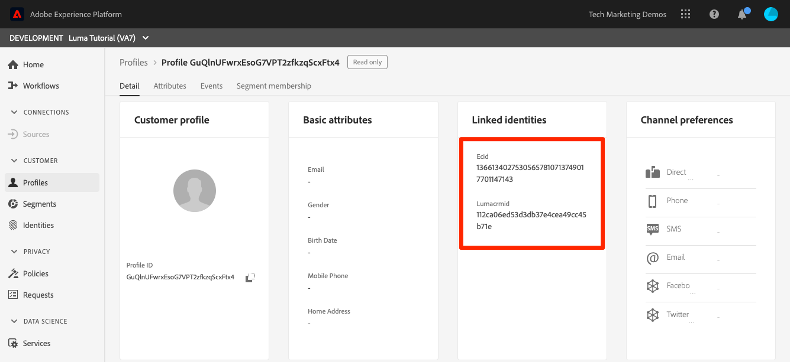
    

## Additional Resources

* [Implement Adobe Experience Cloud with Web SDK](/help/tutorial-web-sdk/overview.md)
* [Streaming Ingestion documentation](https://experienceleague.adobe.com/docs/experience-platform/ingestion/streaming/overview.html)
* [Streaming Ingestion API reference](https://developer.adobe.com/experience-platform-apis/references/streaming-ingestion/)

Great job! That was a lot of information about Web SDK and tags. There is a lot more involved in a full-blown implementation, but those are the basics to help you get started and see the results in Platform.

>[!NOTE]
>
>Now that you are done with the Streaming Ingestion lesson, you can remove the [!UICONTROL Prod] sandbox from your `Luma Tutorial Platform` product profile

Data Engineers, if you like you can skip ahead to the [run queries lesson](run-queries.md).

Data Architects, you can move on to [merge policies](create-merge-policies.md)!
