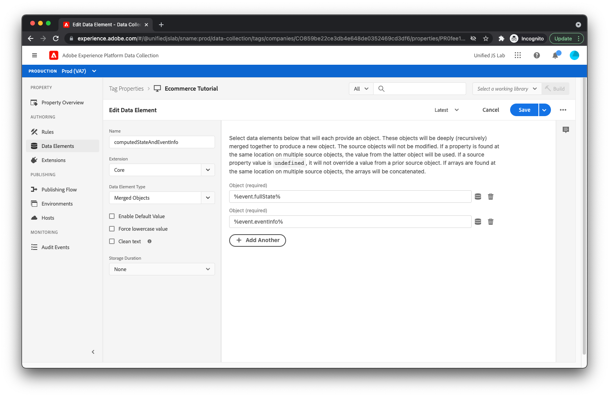
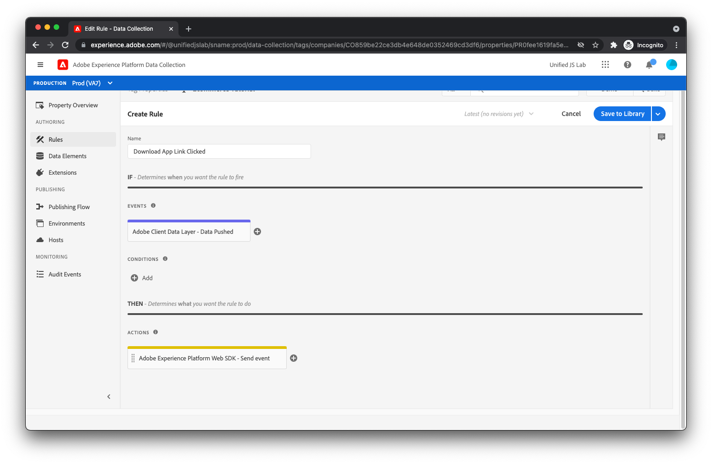

# Create a data element and rule for tracking app downloads

As a reminder, when tracking when a user clicks the [!UICONTROL Download the app] link, you pushed to the data layer as follows:

```js
window.adobeDataLayer.push({
  "event": "downloadAppClicked",
  "eventInfo": {
    "web": {
      "webInteraction": {
        "URL": "https://example.com/download",
        "name": "App Download",
        "type": "download"
      }
    }
  }
});
```

You used the `eventInfo` key, which tells the data layer to communicate this data along with the event, but to _not_ retain the data within the data layer. For a link click, it's not useful to add information about the clicked link to the data layer because it's not applicable to other events that may occur later on the page.

For this implementation, you send an experience event to Adobe Experience Platform containing the merged result of (1) the computed state of the data layer and (2) the contents of `eventInfo`.

To do this, you need to create a data element that merges these two chunks of information.

## Create a data element

To create the appropriate data element:

1. Click [!UICONTROL Data Elements] in the left side menu. 
1. Next, click the [!UICONTROL Create New Data Element] link.
1. Enter the data element name, `computedStateAndEventInfo`. 
1. For the [!UICONTROL Extension] field, select [!UICONTROL Core] if it isn't selected already. 
1. For the [!UICONTROL Data Element Type] field, select **[!UICONTROL Merged Objects]**. This data element allows you to merge multiple objects. The merged result is returned by the data element.
1. Add the first object that you want to include in the merge. Enter `%event.fullState%` in the [!UICONTROL Object(required)] field. When used inside a rule triggered by a [!UICONTROL Data Pushed] rule event, this references the computed state of the Adobe Client Data Layer at the time the rule was triggered.
1. Click the  **[!UICONTROL Add Another]** command.
1. Add the second object. Enter `%event.eventInfo%` in the [!UICONTROL Object(required)] field. When used inside a rule triggered by a [!UICONTROL Data Pushed] rule event, this references the `eventInfo` portion that was pushed to the Adobe Client Data Layer.
1. Save the data element by clicking the [!UICONTROL Save] button.
  

The data element is complete. 

## Create a rule

To create the rule for tracking clicks on the [!UICONTROL Download the app] link:

1. Click **[!UICONTROL Rules]** in the left side menu.
1. Click **[!UICONTROL Add Rule]**.
1. Enter **_Download app link clicked_** in the [!UICONTROL Name] field.

## Add an event

1. Click the **[!UICONTROL Add]** button under [!UICONTROL Events]. You show now be on the event view. 
1. For the [!UICONTROL Extension] field, select **[!UICONTROL Adobe Client Data Layer]**. 
1. For the [!UICONTROL Event Type] field, select **[!UICONTROL Data Pushed]**.
1. Click **[!UICONTROL Keep Changes]**.
  
Because you only want this rule to be triggered when the `downloadAppClicked` event is pushed to the data layer, select the **[!UICONTROL Specific Event]** radio under [!UICONTROL Listen to] and type **_downloadAppClicked_** into the [!UICONTROL Event / Key to register for]  text field that is displayed.

## Add an action

Now that you're back at the rule view:

1. Click the **[!UICONTROL Add]** button under [!UICONTROL Actions]. 
1. You should now be on the action view. For the [!UICONTROL Extension] field, select **[!UICONTROL Adobe Experience Platform Web SDK]**. For the [!UICONTROL Action Type] field, select **[!UICONTROL Send event]**.
1. In the [!UICONTROL Type] field to the right, select `web.webinteraction.linkClicks`.
1. For the [!UICONTROL XDM data] field, click the data element selector button to the right and select **[!UICONTROL computedStateAndEventInfo]**. This is the data element you recently created.
1. For this rule (unlike the other rules you've created), check the **[!UICONTROL Document will unload]** checkbox. 
  
1. Save the action by clicking the **[!UICONTROL Keep Changes]** button.

>[!TIP]
>
>The [!UICONTROL Document will unload feature] tells the SDK that the user navigates away from the page when they click the link. This is important, because it allows the SDK to make the request even if the user navigates away from the page, as the request keeps running in the background and reach the server. If this checkbox is unchecked, the request won't be made in this manner and therefore will likely be canceled when the current document unloads.
>
>You may be asking yourself, "That sounds nice. Why isn't this option always enabled then?"
>
>Well, it's a bit complicated, but when using this feature, the SDK uses a browser method called [`sendBeacon`](https://developer.mozilla.org/en-US/docs/Web/API/Navigator/sendBeacon) to send the request. When sending a request using `sendBeacon`, the browser doesn't allow the SDK (or anything else) to access any data returned from the server. If the SDK were to use this feature for every request, the SDK would never be able to receive any data from the server. For this reason, it's important to check the [!UICONTROL Document will unload] checkbox only when the current document will unload, in which case the response data can be discarded anyway.

## Save the rule

Your rule should now be complete.

1. Click **[!UICONTROL Save]** in the upper right corner.
  

[Next: **Publish the library**](publish-the-library.md)

>[!NOTE]
>
>Thank you for investing your time in learning about Data Collection. If you have questions, want to share general feedback, or have suggestions on future content, please share them on this [Experience League Community discussion post](https://experienceleaguecommunities.adobe.com/t5/adobe-experience-platform-launch/tutorial-discussion-use-adobe-experience-platform-data/m-p/543877)