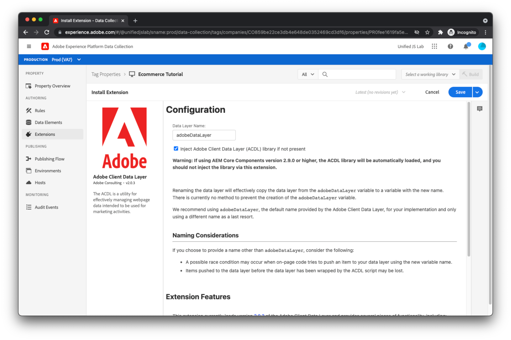
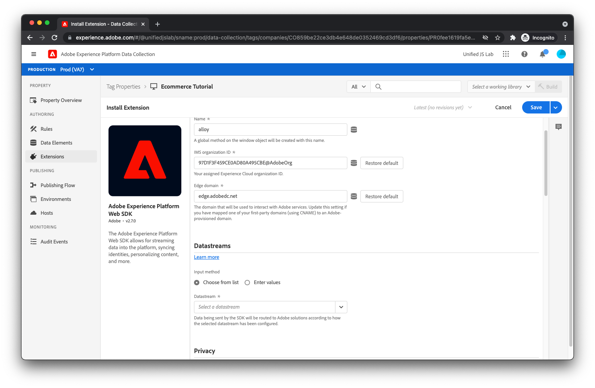
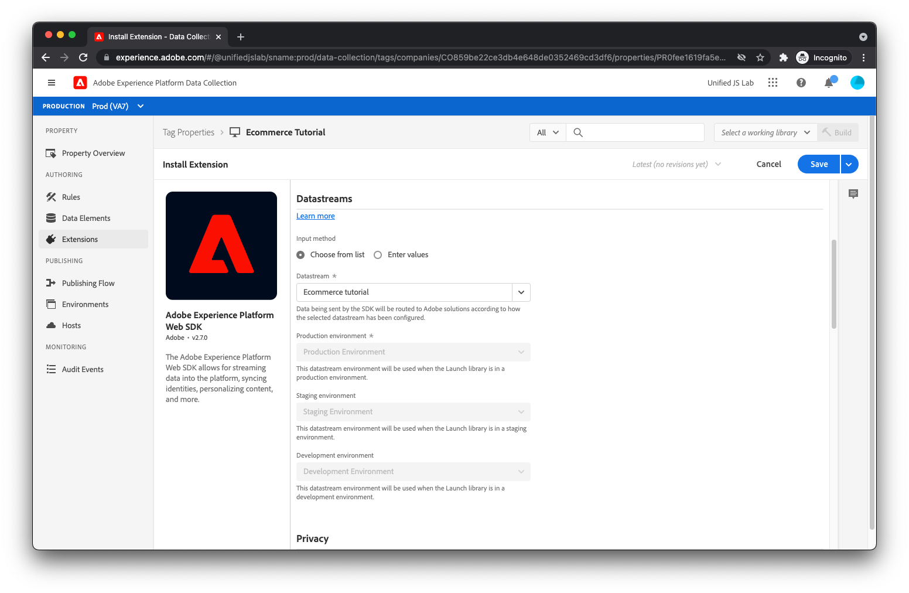

# Create an Adobe Experience Platform [!DNL Tags] property and install extensions

Now that on-page code is pushing data and events into the data layer, it's time for the marketer to read the data from the data layer and send this data to Adobe Experience Platform. This would typically require two JavaScript libraries:

* Adobe Client Data Layer: In previous steps, you created a data layer array and pushed objects into it. To access this data, you must load the Adobe Client Data Layer JavaScript library. This library provides notifications for events and data layer changes, and simple access to the data.
* Adobe Experience Platform Web SDK: This JavaScript library communicates with the [Adobe Experience Platform Edge Network](https://business.adobe.com/products/experience-platform/experience-platform-edge-network.html). The SDK handles identity, consent, data collection, personalization, audiences, and more.

While you could load these individual libraries onto your website and use them directly, we recommend you use [Adobe Experience Platform Tags](https://experienceleague.adobe.com/docs/experience-platform/tags/home.html). With Tags, you can embed a single script into your HTML and use the Tags user interface to deploy both the Adobe Client Data Layer and Adobe Experience Platform Web SDK. Tags also allow you to create rules for sending data, among other things. This tutorial uses Tags for this purpose and assumes you have a basic understanding of how Tags operate.

## Create a property within Tags

1. [Create a property in Tags](https://experienceleague.adobe.com/docs/experience-platform/tags/admin/companies-and-properties.html#create-or-configure-a-property).

## Install the Adobe Client Data Layer extension

Install the Adobe Client Data Layer extension:

1. Select **[!UICONTROL Extensions]** in the left side navigation in the Tag property that you're using for this tutorial.  
1. Select the **[!UICONTROL Catalog]** link at the top, and then search for 'data layer'. 
1. Once the Adobe Client Data Layer displays in the results, click on the **[!UICONTROL Install]** button. You should see a configuration screen. For this tutorial, there's no need to change the default values. 
1. Click **[!UICONTROL Save]**.
    

## Install the Adobe Experience Platform Web SDK extension

Next, install the Adobe Experience Platform Web SDK extension:

1. Search for the extension in the extension catalog and click the respective **[!UICONTROL Install]** button. You should see the configuration screen:
    
1. In the [!UICONTROL Datastream] field, select the datastream you previously created. You're presented with the same datastream environments that you saw in [Create a datastream](../configure-the-server/create-a-datastream.md).
    
1. Further in the configuration screen, find and uncheck **[!UICONTROL Enable click data collection]**. By default, the SDK automatically tracks links for you. In this tutorial, however, we demonstrate how you can track your own link clicks using custom link information. 
1. Click on the **[!UICONTROL Save]** button to finish installing the Adobe Experience Platform Web SDK extension.

>[!TIP]
>
>The dataset environments have a relationship to Tags environments. Assume for a moment that you complete installation of the Adobe Experience Platform Web SDK extension, create a tag library that includes the extension, then publish the library to a Tags development environment. When the tag library is loaded onto your web page and the Adobe Experience Platform Web SDK extension makes a request to Edge Network, the extension includes the [!UICONTROL Development Environment] datastream environment ID. Edge Network, in turn, uses that ID to read the configuration of the [!UICONTROL Development Environment] datastream environment and forward data to the appropriate Adobe products.
>
>At the moment, you only have one development datastream environment, one staging datastream environment, and one production datastream environment. It is possible to create multiple datastream development environments (one for you and one for your co-worker, perhaps) using the datastream user interface. If you had multiple development datastream environments, you would be able to select which one you want to use for this tag property.

The appropriate extensions have been installed. It's time to create rules and data elements.

[Next: **Create rules for tracking page view and commerce events**](create-rules-for-tracking-page-view-and-commerce-events.md)

>[!NOTE]
>
>Thank you for investing your time in learning about Data Collection. If you have questions, want to share general feedback, or have suggestions on future content, please share them on this [Experience League Community discussion post](https://experienceleaguecommunities.adobe.com/t5/adobe-experience-platform-launch/tutorial-discussion-use-adobe-experience-platform-data/m-p/543877)
