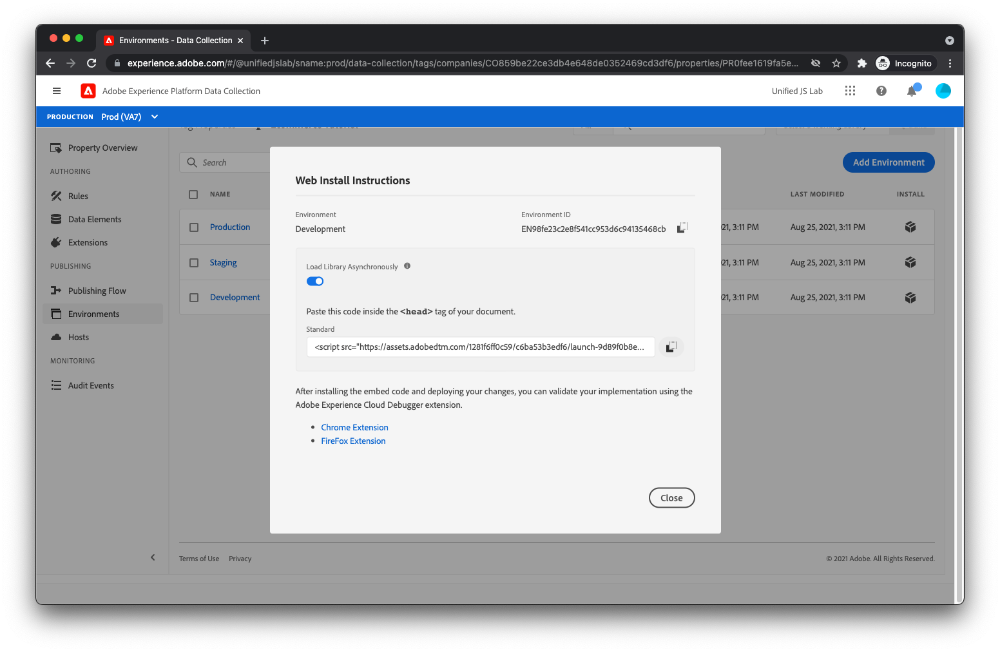

# Publish the library

Now it's time to deploy the tag library onto your website.

## Create a library

First, you must create a library that includes the extensions, rules, and data element you have created. 

1. To create a library, select **[!UICONTROL Publishing Flow]** in the left side menu.
1. Select **[!UICONTROL Add Library]**. You should see the library creation view.
  

1. Give the library a name, like **_Demo_**. 
1. Select **[!UICONTROL Development]** in the [!UICONTROL Environment] dropdown. 
1. Next, click **[!UICONTROL Add All Changed Resources]**.
You should now see all your extensions, rules, and data element listed under [!UICONTROL Resource Changes]. 
1. Click **[!UICONTROL Save & Build to Development]**.

## Add the embed code to your HTML

Now you must add a script tag to your product page HTML that loads the newly built tag library.

1. Start by clicking **[!UICONTROL Environments]** in the left-hand menu. You should see three different environments listed. 
  
1. Click the package icon on the **[!UICONTROL Development]** environment row under the _Install_ column. You should see instructions for installing the Launch library script onto your page.
  
1. Copy the script tag (there's a copy-to-clipboard button for convenience). 
1. Open your product page HTML and insert the script tag before the `</head>` tag. Your final HTML should look as follows:

```html
<!DOCTYPE html>
<html lang="en">
  <head>
    <title>Product Page</title>
    <script>
      window.adobeDataLayer = window.adobeDataLayer || [];
      window.adobeDataLayer.push({
        "event": "pageViewed",
        "web": {
          "webPageDetails": {
            "name": "Foam Roller",
            "siteSection": "Equipment"
          },
        },
        "productListItems": [
          {
            "SKU": "eqfr08",
            "currencyCode": "USD",
            "name": "Foam Roller",
            "priceTotal": 18.95
          }
        ]
      });
      window.adobeDataLayer.push({
        "event": "productViewed"
      });
      window.onAddToCartClick = function() {
        // In a real implementation, you would change this condition to 
        // only pass if a cart doesn't already exist. You would typically 
        // do this by checking a cookie or variable value.
        if (true) {
          window.adobeDataLayer.push({
            "event": "cartOpened",
          });
        }
        window.adobeDataLayer.push({
          "event": "productAddedToCart"
        });
      };
      window.onDownloadAppClick = function() {
        window.adobeDataLayer.push({
          "event": "downloadAppClicked",
          "eventInfo": {
            "web": {
              "webInteraction": {
                "URL": "https://example.com/download",
                "name": "App Download",
                "type": "download"
              }
            }
          }
        });
      };
    </script>
    <!--Swap this script tag with your own-->
    <script src="https://assets.adobedtm.com/xxxxxxxxxxxx/xxxxxxxxxxxx/launch-xxxxxxxxxxxx-development.min.js" async></script>
  </head>
  <body>
    <h1>Foam Roller</h1>
    <p>This foam roller is composed of durable material that holds its shape and delivers deep tissue therapy. Purchase now for only $18.95!</p>
    <button type="button" onclick="onAddToCartClick()">Add to cart</button>
    <a href="https://example.com/download" onclick="onDownloadAppClick()">Download the app</a>
  </body>
</html>
```

Check out the [publishing documentation for Tags](https://experienceleague.adobe.com/docs/experience-platform/tags/publish/overview.html) if you'd like to learn more about the publishing process.

Next, you'll test your new implementation!

[Next: **Test the implementation**](../test-the-implementation.md)

>[!NOTE]
>
>Thank you for investing your time in learning about Data Collection. If you have questions, want to share general feedback, or have suggestions on future content, please share them on this [Experience League Community discussion post](https://experienceleaguecommunities.adobe.com/t5/adobe-experience-platform-launch/tutorial-discussion-use-adobe-experience-platform-data/m-p/543877)
