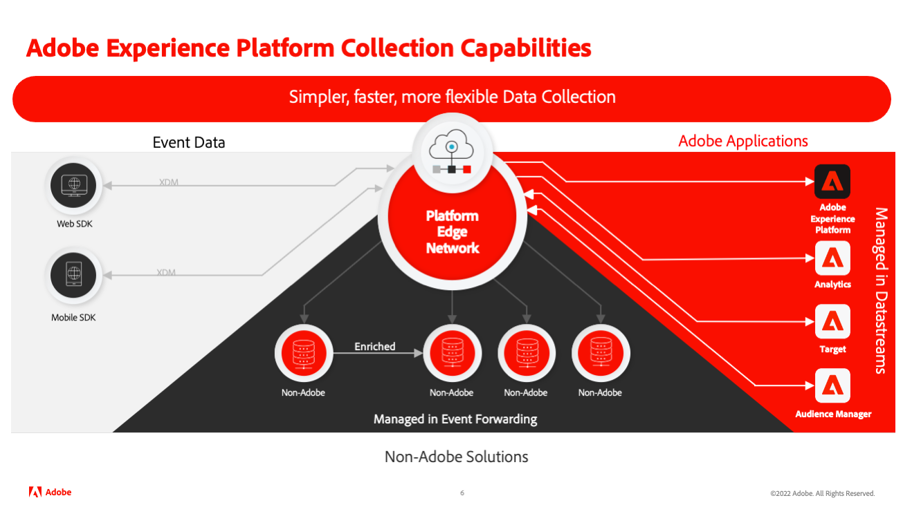
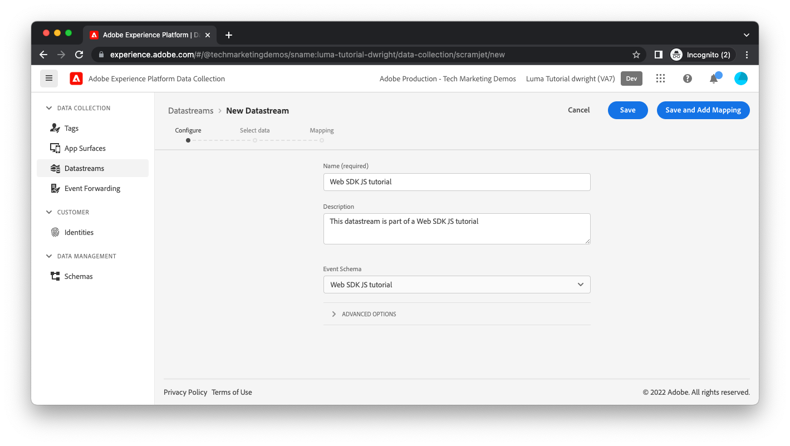
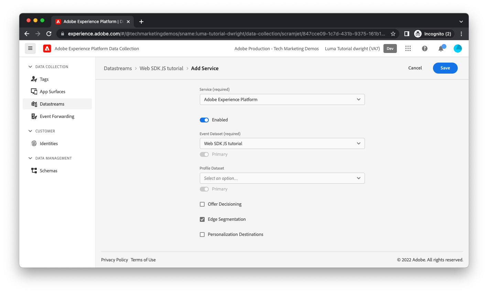

# Create a datastream

The data you send from your website with Platform Web SDK reaches a set of Adobe servers called [Adobe Experience Platform Edge Network](https://business.adobe.com/products/experience-platform/experience-platform-edge-network.html). This network can send your data to the [Adobe Experience Platform dataset you previously created](create-a-schema.md) and other products within Adobe Experience Cloud. These Adobe products may also respond with data to your web page. For example, Edge Network may return personalization content from Adobe Target.

To configure which Adobe products Edge Network shuttles data to and from, you must create a datastream. When Edge Network receives data from your web page, it consults the datastream you have created, read its configuration, then forward data to the appropriate Adobe products.

To create a datastream, first navigate to the **[!UICONTROL Datastreams]** view within the[!UICONTROL Data Collection] interface. Select **[!UICONTROL Create Datastream]** in the top-right corner. Provide a name for the datastream, select [the schema you previously created](create-a-schema.md) as the **[!UICONTROL Event Dataset]**, and select **[!UICONTROL Save]** (mapping is covered later).

The next screen allows you to add which Adobe products and services should receive the data you send from your website. For the purposes of this tutorial, enable only Adobe Experience Platform, select the dataset you previously created and select **[!UICONTROL Save]**.

Your datastream has been created.

## Datastream environments

Companies typically have a promotion path for any website updates. Someone at the company (a marketer or engineer, depending on the changes) typically tests out their changes in a development environment that only that person is using. Once they feel comfortable with the changes, the changes are promoted to a staging environment where they receive further testing. Finally, the changes are published to the production website that users see. Datastreams support this promotion pattern. 

If you are supporting Platform-based applications like Real-time CDP, Journey Optimizer, or Customer Journey Analytics, additional datastreams must be created in the separate Platform sandboxes which correspond to these environments.

If you are not a Platform customer, you can create multiple datastreams in a single sandbox and can use the datastream copy feature to duplicate settings.

The server is now fully configured to receive data from your web page.

[Next: **What's a data layer?**](../configure-the-client/whats-a-data-layer.md)

>[!NOTE]
>
>Thank you for investing your time in learning about Data Collection. If you have questions, want to share general feedback, or have suggestions on future content, please share them on this [Experience League Community discussion post](https://experienceleaguecommunities.adobe.com/t5/adobe-experience-platform-launch/tutorial-discussion-implement-adobe-experience-cloud-with-web/td-p/444996)
