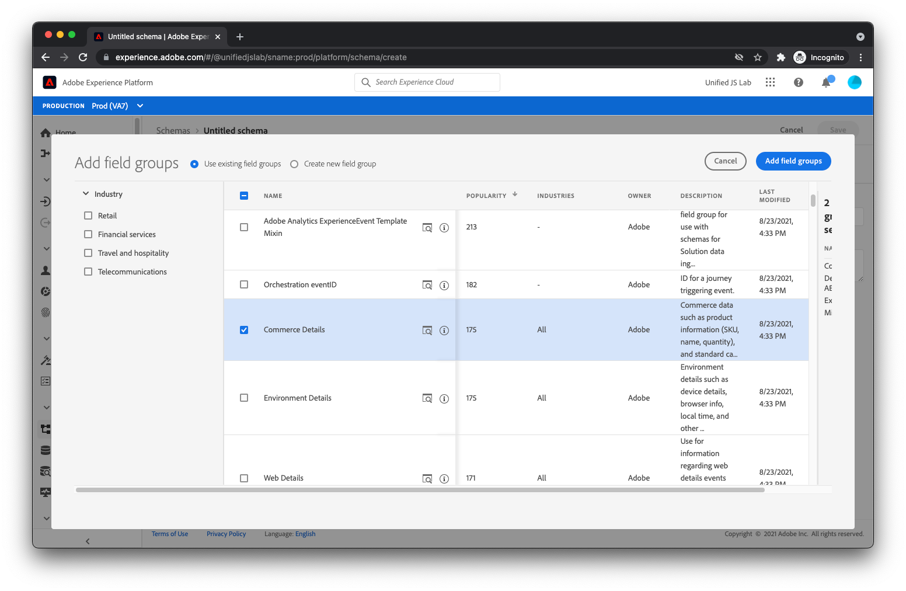
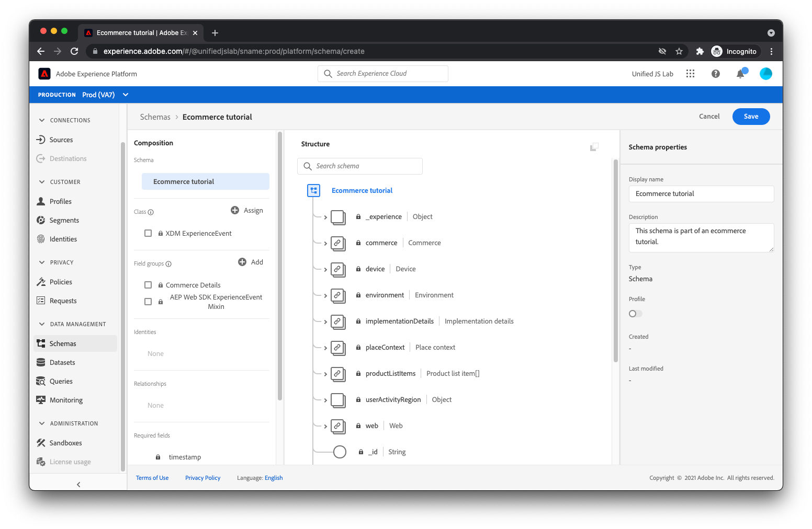

# Create a schema

As discussed in [Structuring your data](../structuring-your-data.md), data sent to Adobe Experience Platform must be in XDM. More specifically, your data must match a _schema_. A schema is basically a description of what the data should look like. It describes the names of the fields and where they should be located within the data. It also describes the type of value each field should have (for example, a boolean, a string with a length of 12 characters, an array of numbers).

Adobe Experience Platform provides some out-of-the-box building blocks known as field groups that are common within the industry. For example, for the financial services industry, there are field groups for balance transfers and loan applications. For the travel and hospitality industry, there are field groups for flight and lodging reservations.

We recommend you use the built-in field groups where possible when creating your schema. We also understand you may need fields that are specific to your own company. For this reason, you can create your own custom field groups to use within the schemas you create.

Let's walk through creating a schema for a typical e-commerce website. 

1. Select **[!UICONTROL Schemas]** under [!UICONTROL Data Management] from the left side menu in the Adobe Experience Platform interface.
1. Select **[!UICONTROL Create schema]** in the top-right corner, and **[!UICONTROL XDM ExperienceEvent]** from the drop down menu.

You are now on the schema builder canvas. 
    

## Add field groups

1. In the **[!UICONTROL Field groups]** section on the left side of the **[!UICONTROL Structure]** area, select the **[!UICONTROL + Add]** link. At this point, a modal will display to choose the field groups to add to your schema. 
1. First, select the field group named **[!UICONTROL AEP Web SDK ExperienceEvent]**. This field group adds a set of fields that accommodates data automatically collected by Adobe Experience Platform Web SDK. 
    
1. Next, because the website for this tutorial is an e-commerce website, select the **[!UICONTROL Commerce Details]** field group. This field group allows you to send typical commerce data like which products are being viewed, added to the cart, and purchased.
1. Select the **[!UICONTROL Add field groups]** button at the top right of the dialog.
    
1.  At this point, you should see the structure of your schema.
    

## Save the schema

1. Last, provide a name and description on the right of the screen, and select **[!UICONTROL Save]**.
    

Your schema has been created. Next, let's learn how to create a dataset to store your data.

For more information about creating schemas, see [Create schemas](/help/platform/schemas/create-schemas.md).

[Next: **Create a dataset**](create-a-dataset.md)

>[!NOTE]
>
>Thank you for investing your time in learning about Data Collection. If you have questions, want to share general feedback, or have suggestions on future content, please share them on this [Experience League Community discussion post](https://experienceleaguecommunities.adobe.com/t5/adobe-experience-platform-launch/tutorial-discussion-use-adobe-experience-platform-data/m-p/543877)
