
>>>>>  gd2md-html alert:  ERRORs: 0; WARNINGs: 0; ALERTS: 42.

<ul style="color: red; font-weight: bold"><li>See top comment block for details on ERRORs and WARNINGs. <li>In the converted Markdown or HTML, search for inline alerts that start with >>>>>  gd2md-html alert:  for specific instances that need correction.</ul>

Links to alert messages:
<a href="#gdcalert1">alert1</a>
<a href="#gdcalert2">alert2</a>
<a href="#gdcalert3">alert3</a>
<a href="#gdcalert4">alert4</a>
<a href="#gdcalert5">alert5</a>
<a href="#gdcalert6">alert6</a>
<a href="#gdcalert7">alert7</a>
<a href="#gdcalert8">alert8</a>
<a href="#gdcalert9">alert9</a>
<a href="#gdcalert10">alert10</a>
<a href="#gdcalert11">alert11</a>
<a href="#gdcalert12">alert12</a>
<a href="#gdcalert13">alert13</a>
<a href="#gdcalert14">alert14</a>
<a href="#gdcalert15">alert15</a>
<a href="#gdcalert16">alert16</a>
<a href="#gdcalert17">alert17</a>
<a href="#gdcalert18">alert18</a>
<a href="#gdcalert19">alert19</a>
<a href="#gdcalert20">alert20</a>
<a href="#gdcalert21">alert21</a>
<a href="#gdcalert22">alert22</a>
<a href="#gdcalert23">alert23</a>
<a href="#gdcalert24">alert24</a>
<a href="#gdcalert25">alert25</a>
<a href="#gdcalert26">alert26</a>
<a href="#gdcalert27">alert27</a>
<a href="#gdcalert28">alert28</a>
<a href="#gdcalert29">alert29</a>
<a href="#gdcalert30">alert30</a>
<a href="#gdcalert31">alert31</a>
<a href="#gdcalert32">alert32</a>
<a href="#gdcalert33">alert33</a>
<a href="#gdcalert34">alert34</a>
<a href="#gdcalert35">alert35</a>
<a href="#gdcalert36">alert36</a>
<a href="#gdcalert37">alert37</a>
<a href="#gdcalert38">alert38</a>
<a href="#gdcalert39">alert39</a>
<a href="#gdcalert40">alert40</a>
<a href="#gdcalert41">alert41</a>
<a href="#gdcalert42">alert42</a>

>>>>> PLEASE check and correct alert issues and delete this message and the inline alerts.

## Adobe Experience Platform: 

## Hands-on Technical Exercise: XDM

V 1.0

Contents

[TOC]

## Experience Data Model (XDM) Criticality

You've likely heard about Adobe's Experience Data Model or XDM. What you may not have heard is just how critical it is to know and understand what XDM is and how it works. One thing (among many) that makes Adobe Experience Platform different from other Experience Cloud applications, solutions, and core services is that you must build the underlying data model. Analytics requires the use of prop, eVars, and events to populate its preconfigured data model. Target and AAM just needed very flexible key/value pairs, but still, they had their underlying data models that were already being utilized. Platform, on the other hand, is different in that you need to first define what the data model even looks like for the data that clients will want to bring in. This is what XDM is for. 

Proper XDM schema building is critical because it forms the basis for everything else later down the road. All of the App Services and the other value-adding features of Platform all rest upon this early step of building a proper XDM schema that meets the needs of the customer use cases. This is not a part of a Platform project where you "build something now and sort it out later". It's important to take the time to understand customer requirements, KPIs, end goals, strategy, and so on so that you can build a strong "platform" on which your client can continue to build and derive value for the foreseeable future. 

## Luma's Goals and Strategies 

Before starting into this exercise, recall that an Adobe Experience Platform Readiness project was executed and delivered. In that readiness project, four sources of data were identified that Luma wants to bring into Platform for this initial deployment:

*   New Loyalty Program Database
*   Customer Relationship Management (CRM) database
*   Live Event/Physical Booth Purchases (when customers self-identify with loyalty ID)
*   Web data from the Luma website

Each of these sources of data have different fields and as well as key identifiers in them that will allow Platform to create a single, unified profile.

Lastly, and as always, setting up the technology is not the point. Luma is trying to make a data-driven decision to see if two new company-wide initiatives significantly increase revenue and improve the overall bottom line, namely:

*   Sponsoring live events (like races, wellness expos, and the like)
*   Having a loyalty program

A correctly built XDM schema will account for these data sources and then allow Platform-enabled application services (like Customer Journey Analytics) to help Luma make that data-driven determination. It will also enable Luma to even further activate that data for other marketing activities made possible by other application services like Real-Time Customer Data Platform (RTCDP) and Customer Journey Orchestration.

## XDM Overview

XDM provides open, standardized, and extensible schemas to represent an organization’s customer data model to achieve an immediate, semantic understanding and actioning of the data as soon as it lands in Adobe Experience Platform. All customer data is transformed into conformant schemas before being written to Experience Platform.

This exercise will introduce you to XDM data modelling structures and terminology such as Schema, Class, Mixin, and Datatype while you create a schema to meet Luma's strategic objectives. This diagram outlines the basic relationship between these structures that will become even more clear as you progress through the exercise:

>>>>>  gd2md-html alert: inline image link here (to images/image1.png). Store image on your image server and adjust path/filename/extension if necessary.  (<a href="#">Back to top</a>)(<a href="#gdcalert2">Next alert</a>) >>>>> 

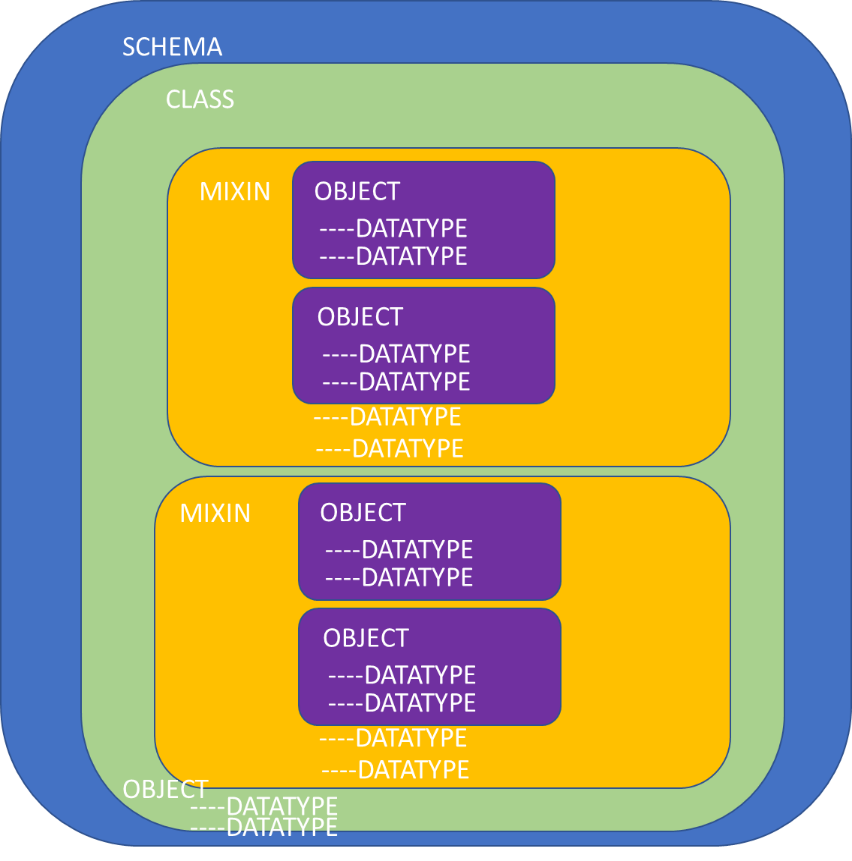

**Note:** The term datatype in this diagram can be confusing. A potentially better term would be field. As with a database field, XDM fields have a data type (string, long, double, date, and so forth). So, while the diagram is technically correct, it also helps to think of these data types as fields that contain data.  

 

### Schema

Experience Platform uses schemas to describe the structure of data across systems in a consistent and reusable way. Before data can be ingested into Platform, a schema must be composed to describe the data's structure and provide constraints to the type of data that can be contained within each field. Schemas consist of a base class and zero or more mixins. As such, you could say:

 

**XDM Schema = Class + Mixin(s)**

### Data Behavior Types and Classes

**Behavior:**

Data intended for use in Experience Platform is grouped into two behavior types:

*   **Record data:** Provides information about the attributes of a subject. A subject could be an organization or an individual. This would be analogous to a noun (person, place, or thing) in the English language.
*   **Time series data:** Provides a snapshot of the system at the time an action was taken either directly or indirectly by a subject. To use language as an analogy, time series data would be a verb, or the action that a noun (your subject) does.

**Class:**

The data behavior of a schema is defined by the schema's class. That class (and associated data behavior) is assigned to a schema when it is created. While there are several different types for classes, for now (and for this exercise), It is a recommended best practice that you stick with the “XDM Individual Profile” and “XDM ExperienceEvent” classes for record and time series data, respectively.

Another type of Class that is typically used is a Custom Class. These are created to support a use case like a lookup table.  [Here](https://docs.adobe.com/content/help/en/experience-platform/xdm/tutorials/relationship-api.html) is an example outside this exercise to read more.

### Mixins

A mixin is a reusable component that defines one or more fields that implement certain functions such as personal details, hotel preferences, address, etc. To continue the language analogy, mixins are your adjectives (what describes your nouns, or Record data) and adverbs (what describes your verbs, or Time series data). 

There are a lot of preconfigured mixins that are ready for use for the most common client use cases. We refer to these preconfigured mixins are standard mixins throughout the rest of this document. Mixins can also be built to client custom specs should there not be a mixin that fits a customer's unique needs.

### XDM APIs

You've likely heard it by now (if not several times by now) that Experience Platform is an API-first system, and XDM Schema creation is no different. While the steps you'll be doing in this exercise are all going to be done in the Platform UI, they could all be done over API as well. 

Since XDM creation is really a one-time event with adjustments being done along the way as needs change, you may be asking yourself why an API in this scenario when there is a functional UI? One answer is testing. Recall that Platform allows for one production sandbox and multiple non-production sandboxes.  Those non-production sandboxes are easily created, reset and deleted. Being able to recreate a production XDM schema quickly in several development sandboxes could be very useful when it comes to testing new functionality. There are other use cases as well, but the most important thing to call out is that yes, if needed, there is an API function for every step you’re about to do in this exercise. 

### Additional Information

As is usually the case, there's a lot more to learn than we have time to cover in this exercise. For more detailed information on XDM schema and its components, see the official [documentation](https://www.adobe.io/apis/experienceplatform/home/xdm/xdmservices.html#!api-specification/markdown/narrative/technical_overview/schema_registry/schema_composition/schema_composition.md) with a special callout to the [API documentation](https://docs.adobe.com/content/help/en/experience-platform/xdm/api/getting-started.html). 

## Exercise Overview	

The XDM schemas you're going to build in this exercise, and then utilize in later exercises, will account for the four sources of Luma data and also set Luma up for success later on. We need to ingest these data sources into Platform and, in a later exercise, build a Unified profile and perform segmentation on it. Based on best practices we will create two profile schemas (CRM & Loyalty) and two Experience Event Schema (Purchase events and website data collection)

**Since proper XDM schema creation is crucial for a client to derive value from a successful Experience Platform project, failure at this point in the project will cause a customer to fail with Platform.** To that end, pay close attention to what you're doing in this exercise. Don't rush through it. Keep in mind the customer goals and you'll see how XDM is built to meet those goals. While it will certainly take more practice than just this one exercise to become an XDM expert, you'll be a lot more familiar with XDM and be able to confidently speak with more clients and experienced Adobe Data and Enterprise Architects. 

## Building Record-Type Schema

In this section you're going to build the XDM Schema that will be used in conjunction with the CRM data source. Since CRM data is similar across many industries (names, emails, addresses, phone numbers, and so forth) we can use several standard mixins to build the needed fields in our XDM.

We'll be starting with the CRM schema because we can build it quickly using a few standard mixins. For Luma, the fields they want to onboard into Platform from their own CRM system are:

*   Id
*   crmId
*   person_first_name
*   person_last_name
*   birthdate
*   gender
*   work_country
*   work_countryCode
*   work_postalCode
*   work_Street
*   work_email
*   home_address_city
*   home_address_country
*   home_address_country_code
*   home_address_country_street
*   home_address_country_label
*   home_address_country_state
*   home_phone
*   mobile_phone
*   personalEmail

   

As you go through these steps, see if you can determine which CRM fields match to which XDM fields.

### Create CRM Schema and Assign Class

1. Log into [https://platform.adobe.com](https://platform.adobe.com) with your Adobe ID and ensure that you are in your assigned Experience Cloud org and in the sandbox you've created.
2. Click on the **Schemas** tab in the left rail followed by a click on **Create Schema** in the upper right.

    

>>>>>  gd2md-html alert: inline image link here (to images/image2.png). Store image on your image server and adjust path/filename/extension if necessary.  (<a href="#">Back to top</a>)(<a href="#gdcalert3">Next alert</a>) >>>>> 

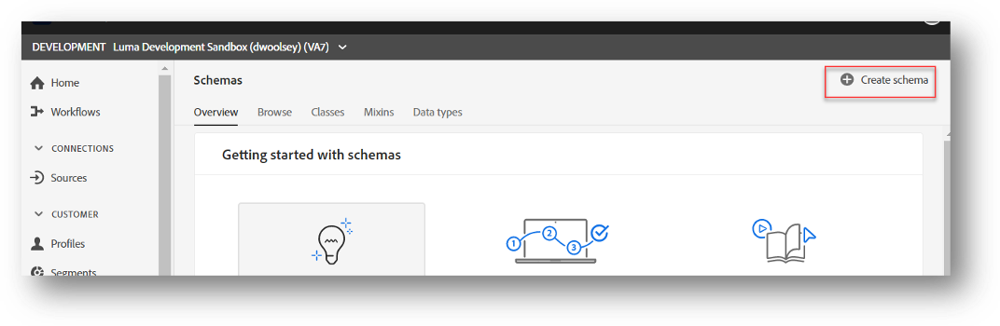

3. On the resulting screen you will see a **Schema Properties** in the right rail. Name your schema** **by entering **CRM Schema **into the **Display name** field.  Give a proper description as well in the **Description** field:

    

>>>>>  gd2md-html alert: inline image link here (to images/image3.png). Store image on your image server and adjust path/filename/extension if necessary.  (<a href="#">Back to top</a>)(<a href="#gdcalert4">Next alert</a>) >>>>> 

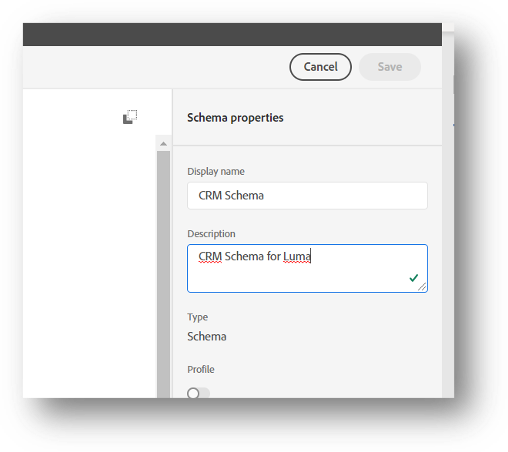

        **Note:** All the schema columns are case sensitive. Please make sure you follow the naming suggestion exactly or you might face errors while ingesting data in next exercise.

4. We now need to assign a class to this schema. Click **Assign **from the **Composition** column

>>>>>  gd2md-html alert: inline image link here (to images/image4.png). Store image on your image server and adjust path/filename/extension if necessary.  (<a href="#">Back to top</a>)(<a href="#gdcalert5">Next alert</a>) >>>>> 

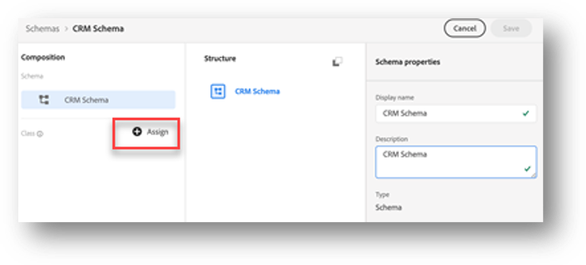

5. On the **Assign class** overlay, select the **XDM Individual Profile** option (the **Use Existing Class** radio button at the top should already be selected) then click **Assign Class**. 

    

>>>>>  gd2md-html alert: inline image link here (to images/image5.png). Store image on your image server and adjust path/filename/extension if necessary.  (<a href="#">Back to top</a>)(<a href="#gdcalert6">Next alert</a>) >>>>> 

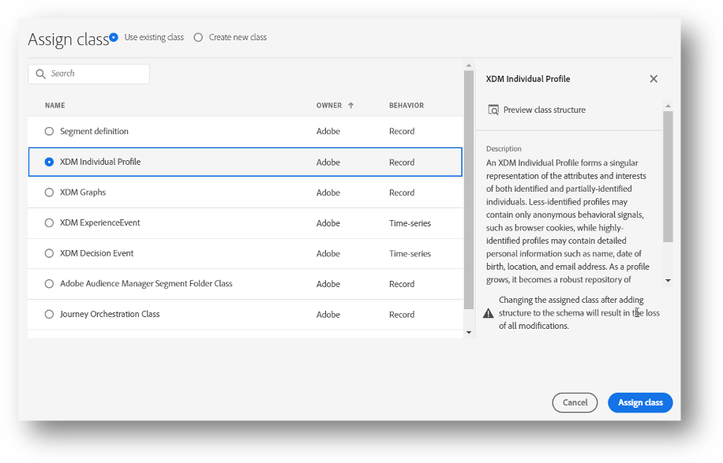

    **Note: **Recall that there are two behavior types (record data and times-series) that are used for Platform data.  Since this schema is going to describe a subject or person, it needs to be the record data behavior type.  As mentioned in the introductory sections of this document, the XDM Individual Profile is the best practice for record data for now.

### Add Mixins

The next step is to identify which mixins contain the XDM fields that map to the fields of data that are going to be onboarded into Platform. It's in this process that you'll determine what standard mixins can be used vs which ones will have to be custom created.

#### **Standard Profile Mixins **

As mentioned at the first of this section, CRM data is pretty generic across Adobe's clients so a few of the standard mixins should give us a good start. 

1. Click on **Add** in the **Mixins** section as shown below:

    

>>>>>  gd2md-html alert: inline image link here (to images/image6.png). Store image on your image server and adjust path/filename/extension if necessary.  (<a href="#">Back to top</a>)(<a href="#gdcalert7">Next alert</a>) >>>>> 

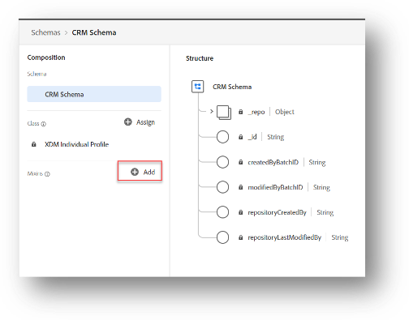

2. On the **Add mixin** overlay, ensure that **Use existing mixin** is selected then locate and select the **Profile work details** mixin (you will likely need to scroll down):

    

>>>>>  gd2md-html alert: inline image link here (to images/image7.png). Store image on your image server and adjust path/filename/extension if necessary.  (<a href="#">Back to top</a>)(<a href="#gdcalert8">Next alert</a>) >>>>> 

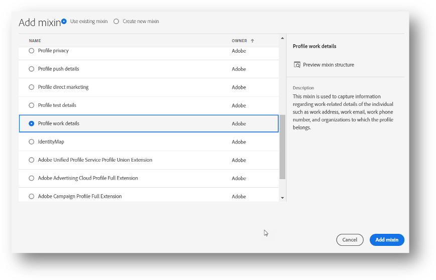

3. Once you’ve selected **Profile work details**, click the **Add mixin** button. You'll see the schema now has the fields of the mixin added:

    

>>>>>  gd2md-html alert: inline image link here (to images/image8.png). Store image on your image server and adjust path/filename/extension if necessary.  (<a href="#">Back to top</a>)(<a href="#gdcalert9">Next alert</a>) >>>>> 

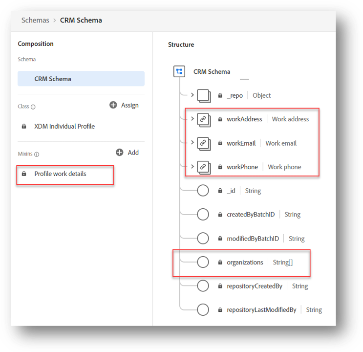

4. Repeat the previous steps to add the **Profile person details** and** Profile personal details** mixins (notice one is person and the other is person**al**). When finished, your schema should look like this:

    

>>>>>  gd2md-html alert: inline image link here (to images/image9.png). Store image on your image server and adjust path/filename/extension if necessary.  (<a href="#">Back to top</a>)(<a href="#gdcalert10">Next alert</a>) >>>>> 

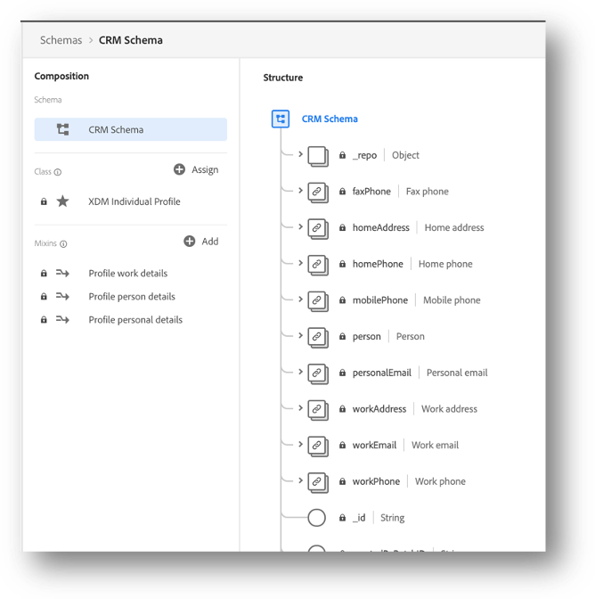
** **

5. Click **Save** in the upper right corner to save your schema with the work done thus far.

#### **Custom Identity Mixin **

The identity mixin you'll create is a custom mixin which will act as a central location and host for most of the customer identifiers across all the data sources and schemas in the organization's instance of Platform. Think of identity fields as fields that you can either link to an identical field in another schema/dataset and as a field we could use in a query to help retrieve a record.  

When it comes to determining what should or shouldn't be an identity field, refrain from thinking about identity fields as a primary key in a database table. Identities do need to identify a person or device, but don't have to be unique to a row of data in a Platform data set. Multiple rows of data in a Platform dataset (that you'll learn about later) can have the same value in the identity field. In this CRM example, the primary identity will, for all practical purposes, act like a standard, database-like primary key because of the nature of the data is of the record behavior type. However, an identity in a times-series, event schema can have multiple rows with the same identity field value (the same person can perform many events). If it's confusing now, that's okay. It'll probably become clearer as you proceed through this and the rest of the exercises. 

There are also a few reasons to create a custom identity mixin. One is so it can be used in other schemas for the other data sources. A mixin, by its very nature, is designed to be re-usable. Since one of the defining traits of an identity field is that the same value can exist in multiple schemas, having a mixin that can be readily used in other schemas is useful. You'll see an example of this when you create additional schemas later in this exercise. However, recent updates to the Platform UI may make creating a separate identity mixin an obsolete practice. For now, you'll create this custom mixin as this is how it's been done for a few Platform customers to date. XDM schema building is an ever-changing and evolving concept. Take in what you're learning now but know that best practices are going to change as the product evolves.

1. Click **Add **to add another mixin
2. On the **Add mixin** overlay, select the **Create new mixin** radio button. Name the mixin** Identities** and give it a proper description:

    

>>>>>  gd2md-html alert: inline image link here (to images/image10.png). Store image on your image server and adjust path/filename/extension if necessary.  (<a href="#">Back to top</a>)(<a href="#gdcalert11">Next alert</a>) >>>>> 

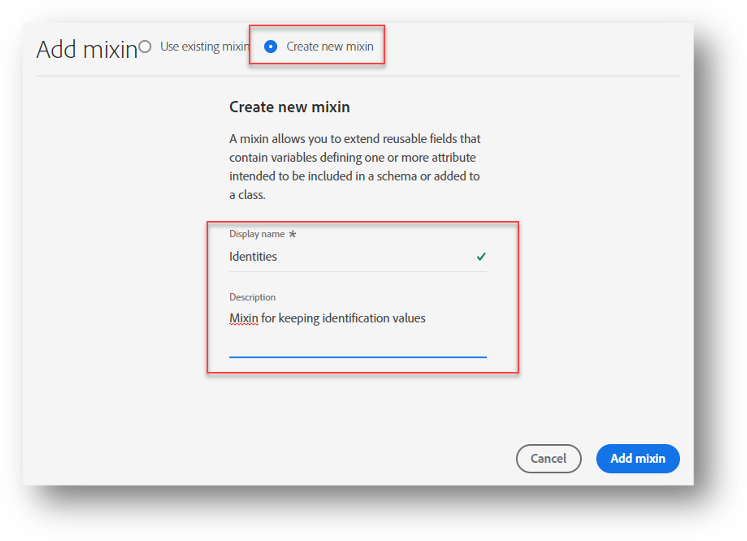
** **

3. Once you've named your new custom mixin, click the **Add Mixin **button and you'll see it added to the schema:

     

>>>>>  gd2md-html alert: inline image link here (to images/image11.png). Store image on your image server and adjust path/filename/extension if necessary.  (<a href="#">Back to top</a>)(<a href="#gdcalert12">Next alert</a>) >>>>> 

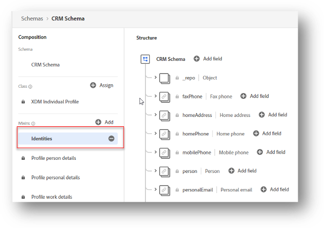

4. Select the newly added **Identities** mixin and you'll see new **Add field** buttons appear. Click the one by the root CRM Schema node and you'll see a **New field** node appear (because the identities mixin was selected, this new field will belong to the identities mixin):

    

>>>>>  gd2md-html alert: inline image link here (to images/image12.png). Store image on your image server and adjust path/filename/extension if necessary.  (<a href="#">Back to top</a>)(<a href="#gdcalert13">Next alert</a>) >>>>> 

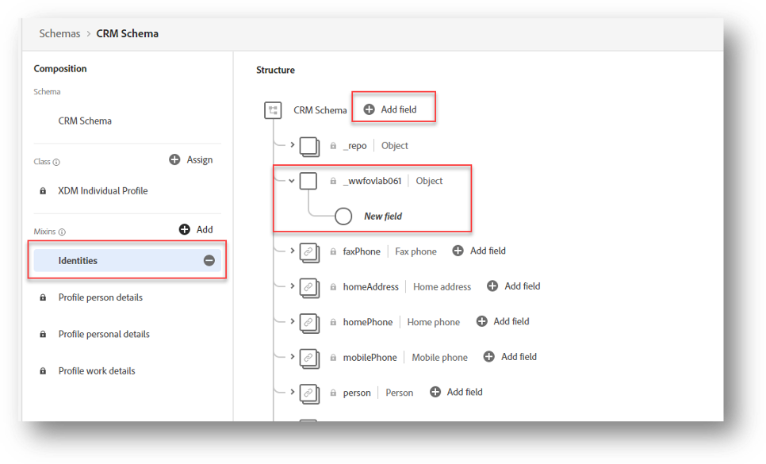

    **Note: **You'll see that the new field is placed under a node that is the tenant for your Experience Cloud Org (wwfovlab###). Any custom fields you create for a custom mixin will all be under this namespace. While this may not seem like a big deal right now, you'll see that this notation makes it challenging in the future to practically and logically keep fields grouped together. For example, if I were to extend an existing mixin (vs creating a new one like we are now), you'll see that same name spacing appear in the middle of the standard mixin. 

    Again, this will make more sense as to why this can be a problem for customers as you progress through the exercises, but for now, it's important to understand that 1) XDM is still new 2) best practices are evolving, and 3) there will be changes and new standards that may come out within months, or even weeks, of this writing. Be flexible with what you're learning now. Take it in but know that things can change quickly on the XDM Schema front. 

5. If not already done, select the **New field** node and the right pane will have the field properties for that node. 
6. In the **Field name** and **Display name** fields, enter the text **identification **and set the **Type** dropdown to **Object:**

    

>>>>>  gd2md-html alert: inline image link here (to images/image13.png). Store image on your image server and adjust path/filename/extension if necessary.  (<a href="#">Back to top</a>)(<a href="#gdcalert14">Next alert</a>) >>>>> 

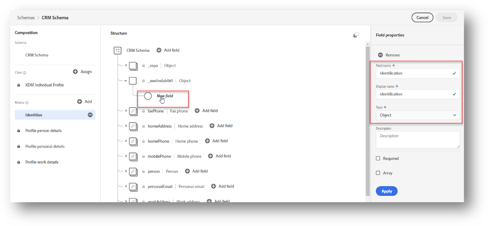

    **Note:** Since we are building a custom mixin that we want to reuse, we create a parent object for identities, with those identity fields grouped under it. 

7. Click **Apply** and you'll see your schema update with the new name and the field is now turned into an object with the Add Field button now visible:

     

>>>>>  gd2md-html alert: inline image link here (to images/image14.png). Store image on your image server and adjust path/filename/extension if necessary.  (<a href="#">Back to top</a>)(<a href="#gdcalert15">Next alert</a>) >>>>> 

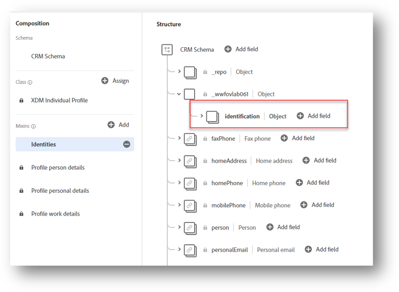

8. Start adding the specific identity fields we want by clicking **Add Field **next to the **identification** object.
9. Like before, a new field node will appear with the properties in the right panel. Name the field **crmid** with a display name of **CRM ID.** Set the type to **String. **Leave all the other fields as their defaults then scroll down to the bottom and click **Apply**. You should then see your new identity field:

     

>>>>>  gd2md-html alert: inline image link here (to images/image15.png). Store image on your image server and adjust path/filename/extension if necessary.  (<a href="#">Back to top</a>)(<a href="#gdcalert16">Next alert</a>) >>>>> 

10. Create three more identity fields as outlined in the table below. 

<table>
  <tr>
   <td>
<strong>Field Name</strong>
   </td>
   <td><strong>Display Name</strong>
   </td>
   <td><strong>Type</strong>
   </td>
  </tr>
  <tr>
   <td>declaredId
   </td>
   <td>Declared Id
   </td>
   <td>String
   </td>
  </tr>
  <tr>
   <td>emailId
   </td>
   <td>Email Id
   </td>
   <td>String
   </td>
  </tr>
  <tr>
   <td>phoneNbr
   </td>
   <td>Phone Number
   </td>
   <td>String
   </td>
  </tr>
</table>

    When finished, your full identity mixin should look like this:

     

>>>>>  gd2md-html alert: inline image link here (to images/image16.png). Store image on your image server and adjust path/filename/extension if necessary.  (<a href="#">Back to top</a>)(<a href="#gdcalert17">Next alert</a>) >>>>> 

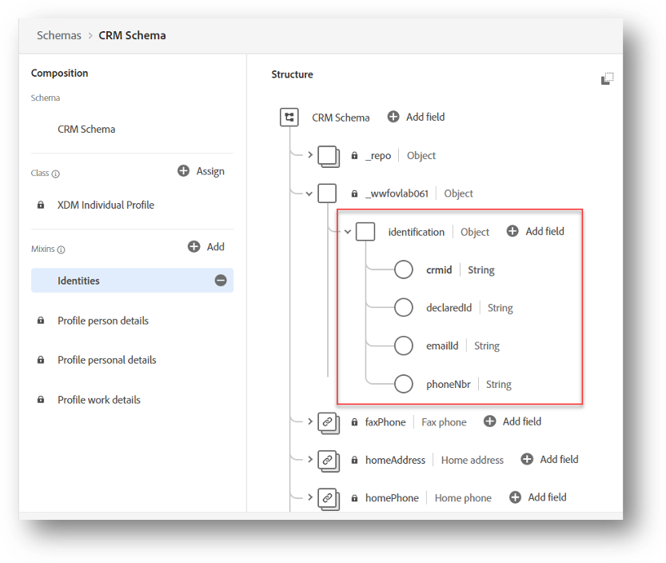

    **Note:** You may have noticed when you created the email and phone number nodes that the type dropdown had other options/formats that may have appeared to be more appropriate than just a string. For a variety of reasons, any fields that are going to be identity fields need to be strings and not any other type.

11. With your custom identity mixin created, you're ready to save your entire schema. Click **Save** in the upper right corner. 
12. Let's take a moment and discuss the advantages and drawback of creating a custom identity mixin like we just did. Expand the **homePhone** node and notice that there is a **number** field that could also work to contain a phone number, yet we added a **phoneNbr** field in the identities mixin.

    

>>>>>  gd2md-html alert: inline image link here (to images/image17.png). Store image on your image server and adjust path/filename/extension if necessary.  (<a href="#">Back to top</a>)(<a href="#gdcalert18">Next alert</a>) >>>>> 

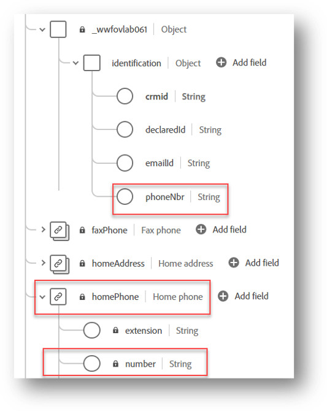

    This is example of what was mentioned in the opening paragraphs of this sub section around whether or not building a custom identity mixin is a good practice. We could simply mark the homePhone > number node as an identity field (we'll be marking fields as identity fields in a later exercise). There is also a mobilePhone > number field. We could mark them both as identity fields. However, having a dedicated identity mixin makes it easy to be reused in other schemas (you'll see that shortly). Additionally, some people don't have a home phone number while others don't have a mobile phone number. As such, having just a primary phone number in an identity schema that can be either a home or mobile phone and yet still ben an identity may still come in handy

    One of the downsides of having a phone number in an identities node is that it's going to seem out of place when there is a duplicate phone number(s) in other nodes. It also duplicates a field and so we have the potential of duplicate data getting out of sync and clients gettings confused as to which field to use and when.  While it's not a technical problem, it is an education and understanding problem that will need to be understood by our clients. 

    This, again, brings to light the point made earlier. There is no perfect, one-way to do XDM. This exercise documents some of the ways XDM has been done successfully for customers. As XDM matures and product enhancements are made, better solutions are bound to surface.

13. Recall from the first part of this section that Luma had a list of fields in their CRM system that they wanted to bring into Platform. Now that you've created the CRM XDM schema, [review that list](#building-record-type-schema-5) and see where each Luma CRM field has its XDM field equivalent. 
14. Click on **Schemas** in the left pane to return to the schema homepage. 
15. Click on the **Browse** tab and you should now see the CRM Schema that you just created:

    

>>>>>  gd2md-html alert: inline image link here (to images/image18.png). Store image on your image server and adjust path/filename/extension if necessary.  (<a href="#">Back to top</a>)(<a href="#gdcalert19">Next alert</a>) >>>>> 

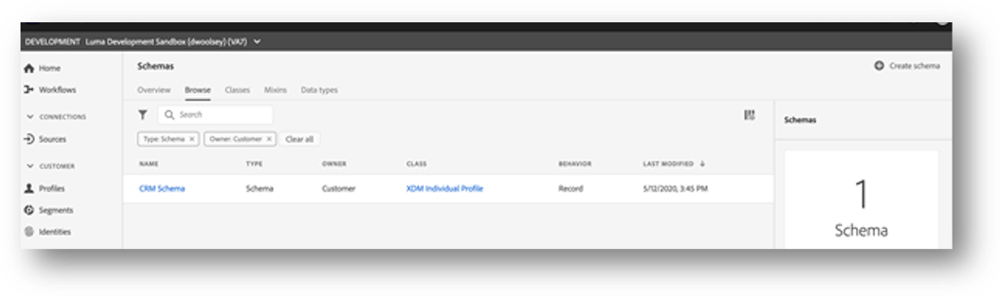

### Mixin JSON for APIs

With Experience Platform being an API-first platform, it's important to call out how the UI provides ways to do common tasks with the API. In this case, you can simply copy the JSON that this schema relates to be clicking on the **Copy JSON** button in the upper right corner of the schema definition:

>>>>>  gd2md-html alert: inline image link here (to images/image19.png). Store image on your image server and adjust path/filename/extension if necessary.  (<a href="#">Back to top</a>)(<a href="#gdcalert20">Next alert</a>) >>>>> 

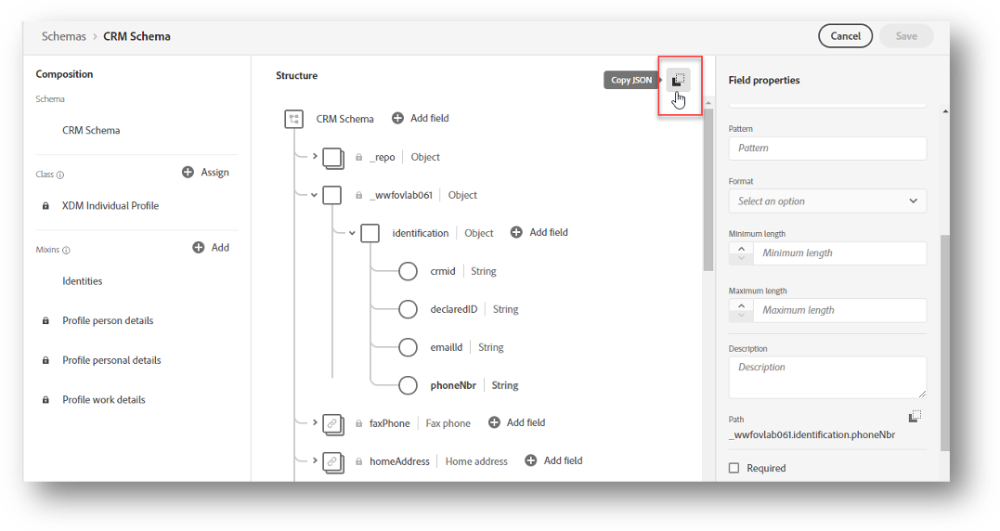

If you were to paste that into a text editor and save has a .json file, you would be able to see all the JSON that could be used to help build API calls to either rebuild this schema in another sandbox or adjust this schema programmatically. We won't be doing that in this exercise, but we call it out, so you know that this feature is there.

## Create Loyalty Schema

Next you're going to build the XDM Schema that will be used in conjunction with the loyalty data source that Luma's loyalty program provider supplies to Platform in a nightly batch upload. It is up to the loyalty program provider to determine how many points a customer has, if they have expired, how purchase returns affect point status, and the like. Platform is simply going to ingest that daily snapshot of customer loyalty data and use it in Luma's marketing efforts. Since this is also a data source that describes attributes of an individual, it will also be a record-type schema. The fields Luma can onboard into Platform from the loyalty program provider are:

*   Id
*   life_time_value
*   loyalty_exp_date
*   loyalty_points
*   loyalty_status
*   CRMID
*   emailId
*   loyaltyId
*   phoneNbr

     

Unfortunately, there aren't a lot of standard mixins for loyalty systems like this, so this will require building custom mixins. However, what do you notice about the last four fields? Do they look familiar? They should, because most of them were in the identity mixin you created in the last exercise with one new addition, loyaltyId. The loyalty system the Luma uses can either take a phone number or an email address, depending on what the end customer is comfortable providing. The CRM ID field is how Luma ties their CRM records to the loyalty database and, as you might imagine, a loyalty id is created as well. This is a prime example of why understanding ALL of client's data sources BEFORE you begin building XDM Schema is important. By planning ahead, you can find ways of reusing any custom mixins throughout the customer data sources. 

### Create Loyalty Schema and Assign Class

This section is going to be very similar to the last section. As such, some of the instructions are going to be more abbreviated with fewer screenshots. 

1. If necessary, login to [https://platform.adobe.com](https://platform.adobe.com) with adobe ID and make sure that you are in your assigned Experience Cloud org and in the sandbox you've created.
2. Click on the **Schemas** tab in the left rail followed by a click on **Create Schema**.
3. On the resulting screen, name your schema** **by entering **Loyalty Schema **into the **Display name** field.  Give a proper description as well in the **Description** field.

    **Note:** All the schema columns are case sensitive. Please make sure you follow the naming suggestion exactly or you might face errors while ingesting data in next exercise.

4. Click **Assign **from the **Composition** column and on the **Assign class** overlay, select the **XDM Individual Profile** option (the **Use Existing Class** radio button at the top should already be selected) then click **Assign Class**. 

### Add Mixins

Now it's time to add the mixins for this schema. We'll use the identity mixin created in the previous section as well as create a net new Loyalty Mixin for the other fields needed.

#### **Identity Mixin**

Now is an example of how good XDM planning pays off as you can reuse the identity mixin created previously.

1. Click on **Add** in the **Mixins** section and on the **Add mixin** overlay, ensure that the **Use Existing mixin **radio button is selected.
2. At the top of the list of available mixins should be the identities mixin you created earlier. Notice how the owner is listed as customer. Select the **identities **mixin then click **Add mixin.**

    

>>>>>  gd2md-html alert: inline image link here (to images/image20.png). Store image on your image server and adjust path/filename/extension if necessary.  (<a href="#">Back to top</a>)(<a href="#gdcalert21">Next alert</a>) >>>>> 

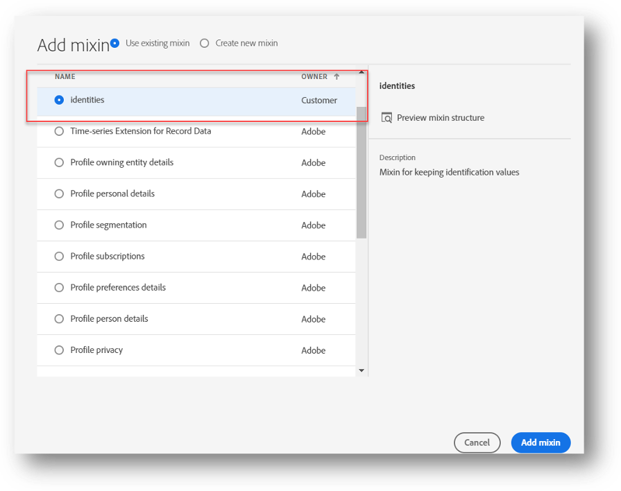

3. Expand the **_wwfovlab### **> **identification** nodes and notice all of the identity fields are now present and the mixin is shown in the Composition panel:

     

>>>>>  gd2md-html alert: inline image link here (to images/image21.png). Store image on your image server and adjust path/filename/extension if necessary.  (<a href="#">Back to top</a>)(<a href="#gdcalert22">Next alert</a>) >>>>> 

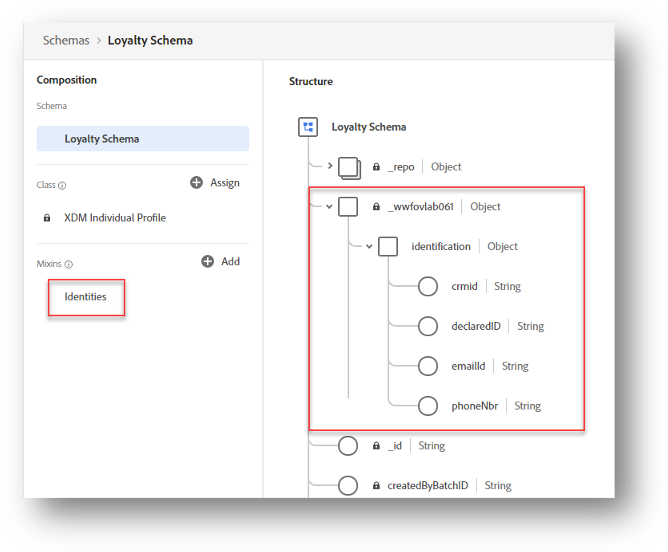

#### **Custom Loyalty Mixin **

Now it's time to add the other custom fields needed to meet Luma's needs.

1. Click **Add **to add another mixin and on the **Add mixin** overly, select the **Create new mixin** radio button. 
2. Name the mixin** Loyalty Mixin**, give it a proper description, then click **Add Mixin.**
3. Once the new mixin is added, we need to add the custom fields. Select the new** Loyalty** **Mixin** in the mixins section and then click the **Add Field** button that is at the root **Loyalty Schema** level: 

>>>>>  gd2md-html alert: inline image link here (to images/image22.png). Store image on your image server and adjust path/filename/extension if necessary.  (<a href="#">Back to top</a>)(<a href="#gdcalert23">Next alert</a>) >>>>> 

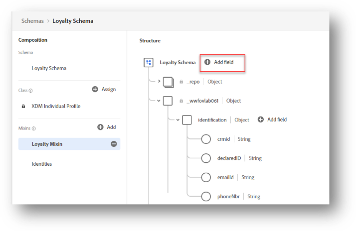

    **Note: **Just like before, you'll see the new field appear under the Experience Cloud Org tenant

4. If not already done, select the **new field** node and the right pane give it a **Field name** of **lifeTimeValue** and a **Display name** of **Lifetime Value of Loyalty Points.** Also set the **Type** dropdown to **Long** then click **Apply**. Your new field should look like this in the schema:

     

>>>>>  gd2md-html alert: inline image link here (to images/image23.png). Store image on your image server and adjust path/filename/extension if necessary.  (<a href="#">Back to top</a>)(<a href="#gdcalert24">Next alert</a>) >>>>> 

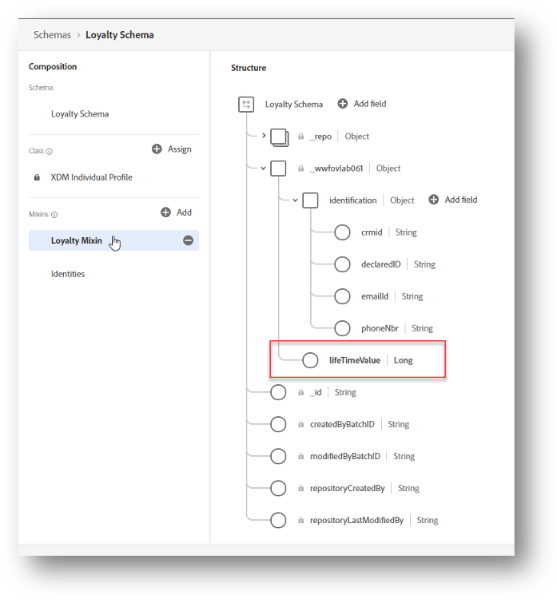

5. Create three more Loyalty Mixin fields as outlined in the table below. 

<table>
  <tr>
   <td>
<strong>Field Name</strong>
   </td>
   <td><strong>Display Name</strong>
   </td>
   <td><strong>Type</strong>
   </td>
  </tr>
  <tr>
   <td>loyaltyExpDate
   </td>
   <td>Exp Date of Loyalty Points
   </td>
   <td>Date
   </td>
  </tr>
  <tr>
   <td>loyaltyPoints
   </td>
   <td>Loyalty Points
   </td>
   <td>Long
   </td>
  </tr>
  <tr>
   <td>loyaltyStatus
   </td>
   <td>Status of Loyalty
   </td>
   <td>String
   </td>
  </tr>
</table>

    When finished, your full Loyalty mixin should look like this:

     

>>>>>  gd2md-html alert: inline image link here (to images/image24.png). Store image on your image server and adjust path/filename/extension if necessary.  (<a href="#">Back to top</a>)(<a href="#gdcalert25">Next alert</a>) >>>>> 

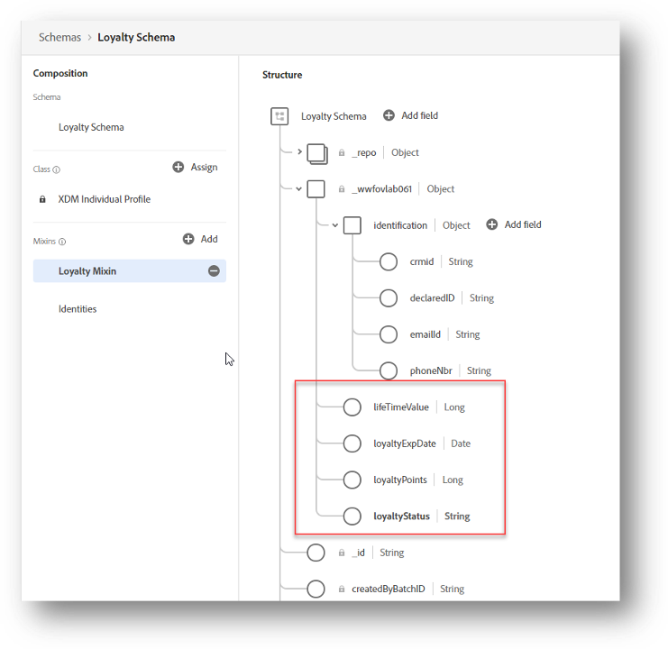

6. The only field we're missing is the loyalty Id field. This will be an identity field for this schema. Thinking back on the best practice of grouping identity fields together, we want to add this to the identities node of the schema, but keep it attached to the Loyalty mixin so that we aren't adding it to the identification mixin. To do that, ensure that the **Loyalty Mixin** is still selected in the **Composition** pane then click **Add Field** next to the **identification **object:

     

>>>>>  gd2md-html alert: inline image link here (to images/image25.png). Store image on your image server and adjust path/filename/extension if necessary.  (<a href="#">Back to top</a>)(<a href="#gdcalert26">Next alert</a>) >>>>> 

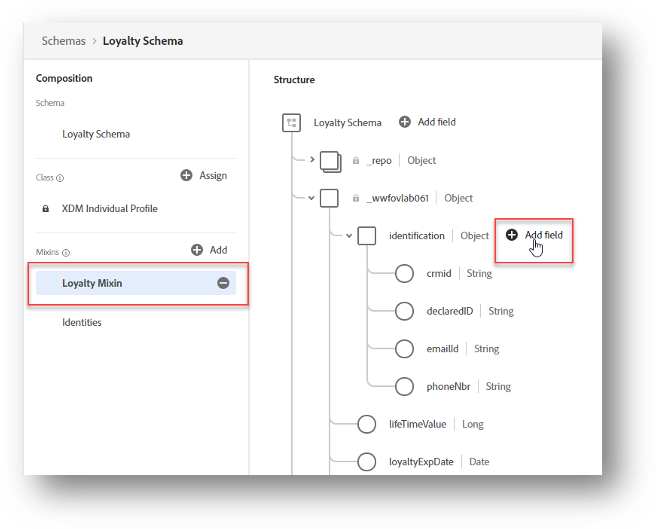

7. Name the new field **loyaltyId** and give it a **Display name** of **Loyalty Id**. This is going to be an identity field, so the **Type** needs to be set as **String**. When finished, your new field should be grouped in with the other identities:

     

>>>>>  gd2md-html alert: inline image link here (to images/image26.png). Store image on your image server and adjust path/filename/extension if necessary.  (<a href="#">Back to top</a>)(<a href="#gdcalert27">Next alert</a>) >>>>> 

8. Click **Save** to save your entire Loyalty Schema and the finished product should look like this:

     

>>>>>  gd2md-html alert: inline image link here (to images/image27.png). Store image on your image server and adjust path/filename/extension if necessary.  (<a href="#">Back to top</a>)(<a href="#gdcalert28">Next alert</a>) >>>>> 

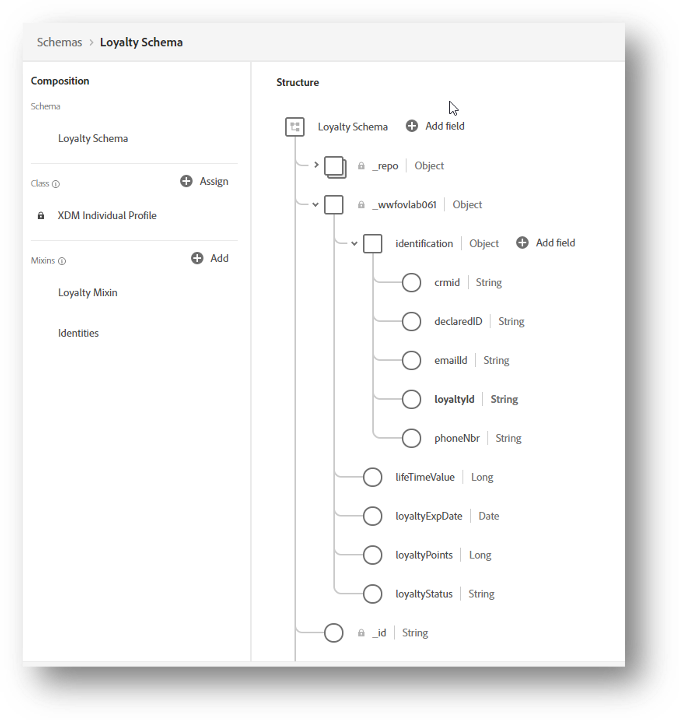

    **Note: **Like the other schema created, you can also use the **Copy JSON** button to retrieve the JSON structure for this new schema if needed.

9. Click on **Schemas** in the left pane to return to the schema homepage and you should now see that you have 2 schemas (the **Browse** tab may already be selected. If not, click on it):

    

>>>>>  gd2md-html alert: inline image link here (to images/image28.png). Store image on your image server and adjust path/filename/extension if necessary.  (<a href="#">Back to top</a>)(<a href="#gdcalert29">Next alert</a>) >>>>> 

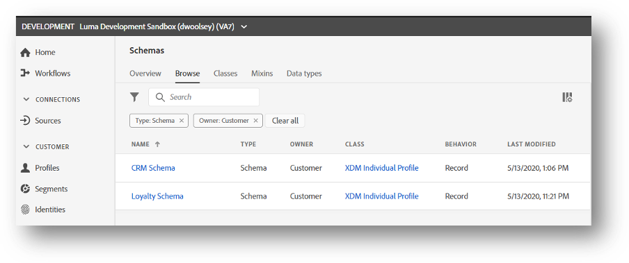

## Building Time Series-Type Schema

In this section you're going to build the XDM Schema that will be used in conjunction with Luma's offline purchases data. Since purchasing things is a common use case across several customers, there are some standard mixins we can use as well as some custom elements we'll want to create for Luma's specific needs. 

Looking at what Luma can send us on this front, we know we'll need XDM fields to match these:

*   SKU
*   Product Name
*   Price
*   Quantity
*   priceTotal
*   currencyCode
*   loyaltyId
*   receipt_nbr
*   Order Date
*   timestamp

Unlike a CRM or record-type schema, this schema needs to be able to handle events as they happen. That's why this schema needs to be a Time Series-type schema. While also applicable in an in-store purchase scenario, this schema in Luma's use case is going to be handling any purchases that are made at their booths that they have at races or other wellness expos. 

As you look through the fields, you may be wondering why there isn't a purchase ID, order ID, or other field that might identify an order. You may also be wondering why there is a loyalty id in this schema as that appears to be the only identity field. The answer to these questions comes back to what Luma's end goals are.

Recall that Luma is trying to increase their customer acquisition rate. To do that, they are trying a loyalty program and sponsoring live events. The only way to know if sponsoring live events is having a positive effect on their bottom line is to tie offline behavior at a live event (like the purchase of something at a physical booth) to online activity (like purchasing something on the website). The only way to make that connection is to have some kind of identifier that can be a link between the offline and online world. There is where the loyalty id comes in.

If a potential customer comes to a booth at a live event and buys something, but chooses not to join the loyalty program, then that purchase is meaningless to Experience Platform. There is no way to tie that sale to an online profile. However, if a potential customer comes a physical booth and chooses to sign up for the loyalty program before making a purchase (or an existing Luma customer provides a phone number or email that is tied to their loyalty account), then that purchase becomes a key piece of data that Platform needs. Therefore Luma, in conjunction with their loyalty program provider, will only send offline purchase event data to Platform IF it can be tied to a loyalty id. It's up to Luma and their loyalty program provider to take an email or phone number provided by a customer at a live event and translate that into a loyalty id before sending that purchase event to Platform. Since Platform is not a system of record for the client and only purchase data tied to a loyalty id will be sent to Platform, the only identity field needed is loyalty id.

This ideology could also be applied to other offline activities as well. Perhaps Luma could offer free loyalty points to: 

*   Customers who simply "check-in" at a booth with their email or phone number
*   New customers who join the loyalty program at the booth. 
*   Race participants who check-in at the booth wearing Luma gear

    While these "check-in" activities would require a new schema, hopefully you see the idea behind why something like a loyalty id would be a critical piece of bringing the online and offline world together and why it's the only identity field needed in this offline purchase event schema.

### Create Offline Purchase Schema and Assign Class

With that background in mind, let's create this new time-series offline purchase event schema. 

1. If necessary, log into [https://platform.adobe.com](https://platform.adobe.com) with your adobe ID and make sure that you are in your assigned Experience Cloud org and in the sandbox you've created.
2. Click on the **Schemas** tab in the left rail and being the process of creating a new schema
3. Name your schema** Offline Purchase Schema **and give it a proper description
4. Click **Assign **to give this schema a class. On the **Assign class** overlay, select the **XDM ExperienceEvent** option (the **Use Existing Class** radio button at the top should already be selected) then click **Assign Class**. 

    

>>>>>  gd2md-html alert: inline image link here (to images/image29.png). Store image on your image server and adjust path/filename/extension if necessary.  (<a href="#">Back to top</a>)(<a href="#gdcalert30">Next alert</a>) >>>>> 

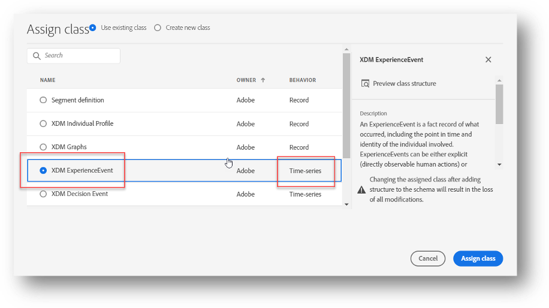

    **Note: **Recall that there are two behavior types (record data and times-series) that are used for Platform data.  Since this is a schema that is going to capture events as they happen by customers, this needs to be a times-series behavior type. As mentioned in the introductory sections of this document, the XDM ExperienceEvent is the best practice for time-series behaviors for now. 

### Add Mixins

The next step is to identify which mixins contain the XDM fields that map to the fields of data that are going to be onboarded into Platform. 

#### **Custom Identity Mixin **

At this point you may be wondering why you're going to create a new identities mixin when you just reused a custom identity mixin to create the Loyalty schema. The simplest explanation is that you can't use a mixin created for a record-type schema, which is what loyalty ID is, in a time-series schema. You’ll need to create a new custom identity mixin. 

1. Click on **Add** in the **Mixins** section.
2. On the **Add mixin** overly, select the **Create new mixin** radio button. Name the mixin** Event Identities**, give it a proper description, and click the **Add Mixin **button. 
3. Click on the newly created **Event Identities** mixin in the **Composition **panel then click the only **Add field** button available to you. Like before, you'll see a new tenant node appear:

     

>>>>>  gd2md-html alert: inline image link here (to images/image30.png). Store image on your image server and adjust path/filename/extension if necessary.  (<a href="#">Back to top</a>)(<a href="#gdcalert31">Next alert</a>) >>>>> 

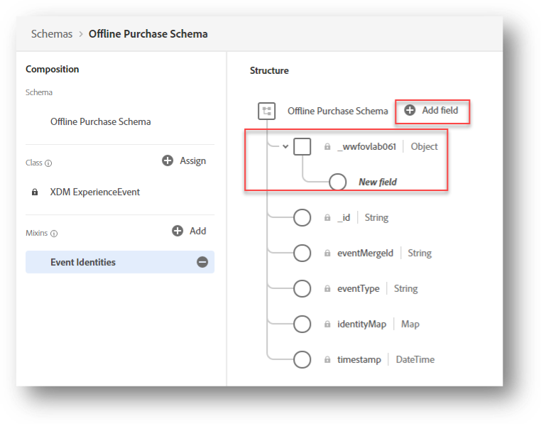
 

4. If not already done, select the **new field** node and in the right pane, name the field and display name **identification. **Then set the **Type** dropdown to **Object.**
5. Click **Apply** and you'll see your schema update with the new name and the field is now turned into an object with the Add Field button now visible:

    

>>>>>  gd2md-html alert: inline image link here (to images/image31.png). Store image on your image server and adjust path/filename/extension if necessary.  (<a href="#">Back to top</a>)(<a href="#gdcalert32">Next alert</a>) >>>>> 

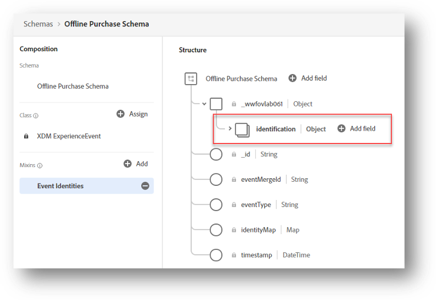

6. Start adding the specific identity fields we want by clicking **Add Field **next to the **identification** object.
7. Like before, a new field node will appear with the properties in the right panel. Name the field **loyaltyId** with a display name of **Loyalty Id.** Set the type to **String** (again, because this is going to be an identity field)**. **

    

>>>>>  gd2md-html alert: inline image link here (to images/image32.png). Store image on your image server and adjust path/filename/extension if necessary.  (<a href="#">Back to top</a>)(<a href="#gdcalert33">Next alert</a>) >>>>> 

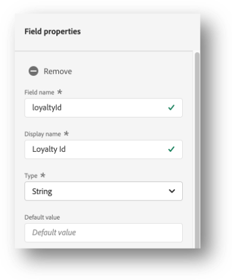

8. Leave all the other fields as their defaults then scroll down to the bottom and click **Apply**. You should then see your new identity field:

     

>>>>>  gd2md-html alert: inline image link here (to images/image33.png). Store image on your image server and adjust path/filename/extension if necessary.  (<a href="#">Back to top</a>)(<a href="#gdcalert34">Next alert</a>) >>>>> 

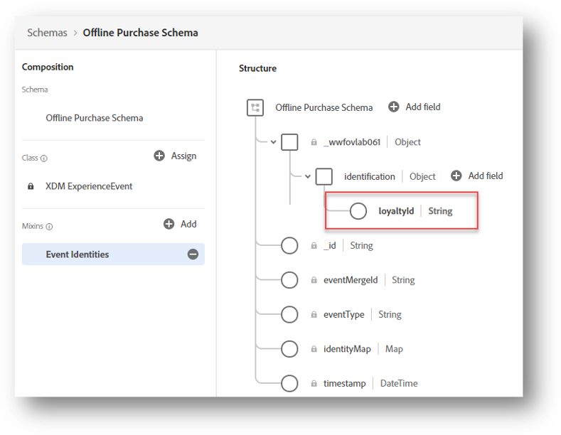

#### **Create Custom Mixin with Standard Data Type Field**

In this subsection, you're going to create a new mixin and add a field to it that utilizes a standard data type.

1. Click **Add **to add another mixin
2. On the **Add mixin** overly, select the **Create new mixin** radio button, name the mixin** Offline Purchase Mixin,** give it a proper description, and click **Add mixin**.
3. Select the newly created **Offline Purchase Mixin **and click the top-most** Add field** button:

>>>>>  gd2md-html alert: inline image link here (to images/image34.png). Store image on your image server and adjust path/filename/extension if necessary.  (<a href="#">Back to top</a>)(<a href="#gdcalert35">Next alert</a>) >>>>> 

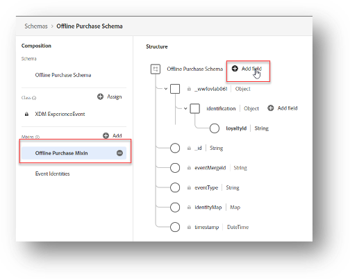
 

4. If not already done, select the **new field** node and the right pane name the field **purchaseEvent** with a **Display name** of **Purchase Event**. Set the type dropdown to **Product list item:**

    

>>>>>  gd2md-html alert: inline image link here (to images/image35.png). Store image on your image server and adjust path/filename/extension if necessary.  (<a href="#">Back to top</a>)(<a href="#gdcalert36">Next alert</a>) >>>>> 

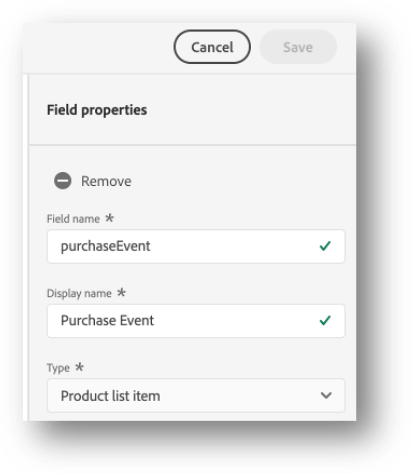

    **Note:** The Product list item type tells the schema to automatically add a series of product-related fields to this node. This also indicates to Platform that it should expect this data to be product data.  

5. Since a single purchase event can have multiple products in it, you also need to check the **Array** box:

    

>>>>>  gd2md-html alert: inline image link here (to images/image36.png). Store image on your image server and adjust path/filename/extension if necessary.  (<a href="#">Back to top</a>)(<a href="#gdcalert37">Next alert</a>) >>>>> 

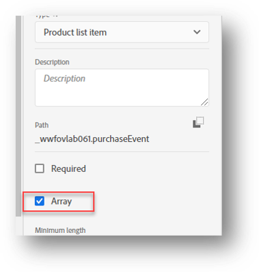

6. Click **Apply**. You'll see your schema update with the new name and the field and several more product-related nodes:

    

>>>>>  gd2md-html alert: inline image link here (to images/image37.png). Store image on your image server and adjust path/filename/extension if necessary.  (<a href="#">Back to top</a>)(<a href="#gdcalert38">Next alert</a>) >>>>> 

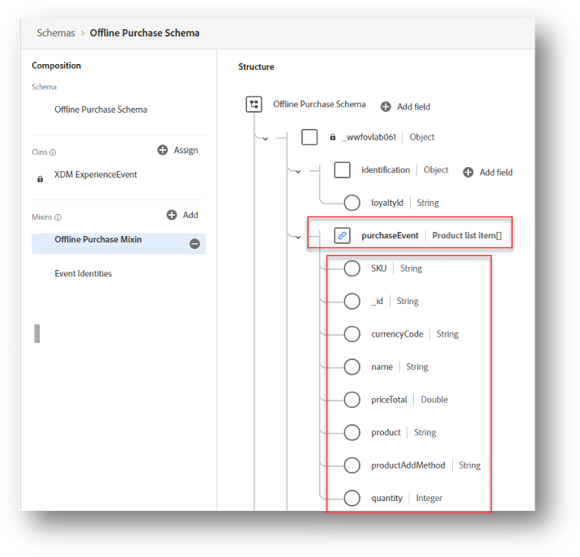

7. We need to add two more fields to this mixin. Using the what you've learned earlier in this document, add these two fields to the **Offline Purchase Mixin** mixin: 

<table>
  <tr>
   <td>
<strong>Field Name</strong>
   </td>
   <td><strong>Display Name</strong>
   </td>
   <td><strong>Type</strong>
   </td>
  </tr>
  <tr>
   <td>receiptNbr
   </td>
   <td>Receipt Number
   </td>
   <td>String
   </td>
  </tr>
  <tr>
   <td>receiptTotal
   </td>
   <td>Receipt Total
   </td>
   <td>Double
   </td>
  </tr>
</table>

    When finished, your full **Offline Purchase Mixin** should look like this:

    

>>>>>  gd2md-html alert: inline image link here (to images/image38.png). Store image on your image server and adjust path/filename/extension if necessary.  (<a href="#">Back to top</a>)(<a href="#gdcalert39">Next alert</a>) >>>>> 

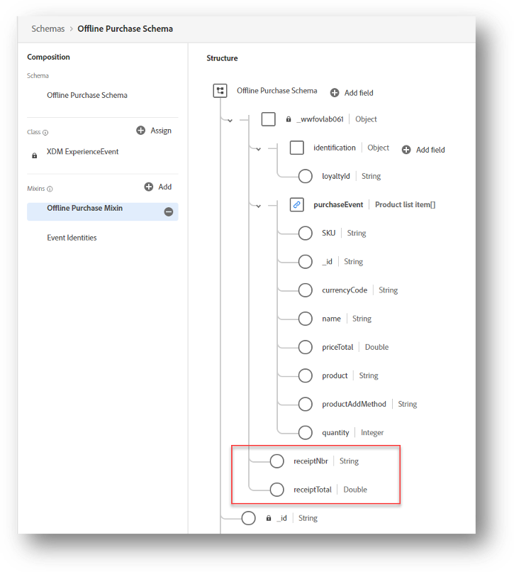

8. Click **Save** in the upper right corner. 
9. Click on **Schemas** in the left pane to return to the schema homepage. You should now see that you have 3 schemas (the **Browse** tab may already be selected. If not, click on it):

    

>>>>>  gd2md-html alert: inline image link here (to images/image39.png). Store image on your image server and adjust path/filename/extension if necessary.  (<a href="#">Back to top</a>)(<a href="#gdcalert40">Next alert</a>) >>>>> 

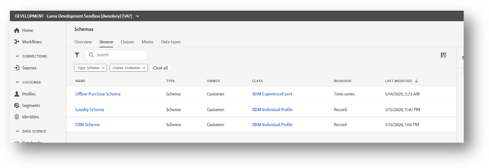

## Create Adobe Experience Platform Web SDK Schema

This last schema you're going to create is for capturing data collected from the Luma website using Adobe's newest data collection JavaScript library: Adobe Experience Platform Web SDK (codenamed Alloy.js). There will be much more on this library in a later exercise, but for now, you're going to set up the basic schema.

Like the CRM Schema, there'll be some standard mixins to use as well as a custom one to create as well. The instructions are similar to the schemas you already created.

1. Create a new schema called **Luma Website**. Add a description.
2. Since this is going to be live, behavioral data collected in real time, assign the schema the **XDM ExperienceEvent** class (time-series data) 
3. Once the class is assigned, add the **AEP Web SDK ExperienceEvent Mixin** mixin. At this point, your schema should look like this:

    

>>>>>  gd2md-html alert: inline image link here (to images/image40.png). Store image on your image server and adjust path/filename/extension if necessary.  (<a href="#">Back to top</a>)(<a href="#gdcalert41">Next alert</a>) >>>>> 

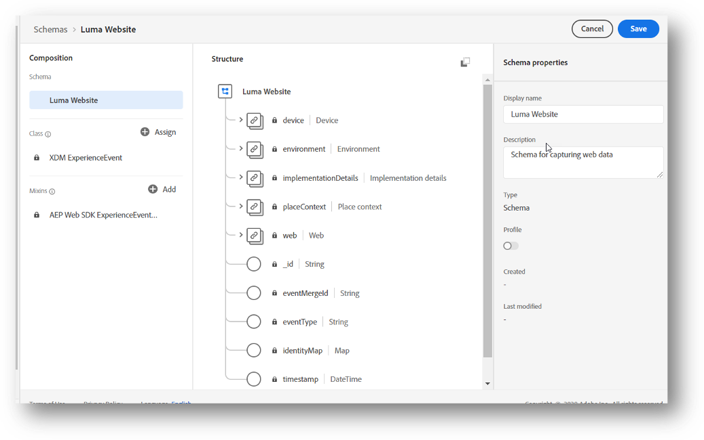

4. The nodes that you see in this mixin describe a lot of the same default things that current JavaScript libraries (like at.js, AppMeasurement, or DIL) do. You'll see these things categorically grouped by the nodes above. Take a moment to explore the **device, environment, place context, **and** web** nodes to see what they contain. 
5. While the AEP SDK captures a lot of valuable information, it's not very vertical specific. Since Luma is retailer and has a shopping cart, we will need to add XDM schema to account for that. To do that, add the **ExperienceEvent commerce details** mixin. 

    **Note: **Once the ExperienceEvent commerce details mixin is added, you'll see the new **commerce** and **productListItems **nodes. Does anything about the **productListItems** node seem familiar? It should, because in the Offline Purchase Schema, you created a custom mixin and set one of the fields in that mixin to be of the productListItems type. This is yet another example of how the same datatype can be utilized across different mixins in different schemas.

6. At this point, your schema should look like this:

    

>>>>>  gd2md-html alert: inline image link here (to images/image41.png). Store image on your image server and adjust path/filename/extension if necessary.  (<a href="#">Back to top</a>)(<a href="#gdcalert42">Next alert</a>) >>>>> 

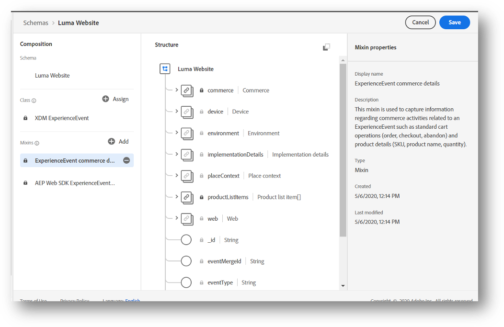

7. If everything looks good, go ahead and save the schema. 

    **Note:** You may be wondering why there weren't any identity mixins added. The answer is that the Experience Cloud ID (ECID) is going to be the identity field for this schema, but since Adobe supplies that, we don't need to add it to the schema. You'll also see in a later exercise how this web data is going to be tied to the offline data collected as part of the Loyalty, CRM, and Offline Purchase data.

    **Note**: It was mentioned earlier in this document that XDM design and standards are still new and evolving. That is especially true for XDM used for collecting data from the AEP Web SDK. At the time of this writing, there are no other vertical-specific XDM (like the commerce one you just added). Best practices are still being created by a joint team of consultants and product managers, and the mixins you've just added may be out of date in just a few weeks. Again, take in what you’re learning from this exercise, but expect that best practices are going to evolve as customers start to use the web SDK in practice. We will cover more of this in an upcoming exercise on deploying the AEP Web SDK. 

8. Return to the schema homepage and you should now have four schemas:

    

>>>>>  gd2md-html alert: inline image link here (to images/image42.png). Store image on your image server and adjust path/filename/extension if necessary.  (<a href="#">Back to top</a>)(<a href="#gdcalert43">Next alert</a>) >>>>> 

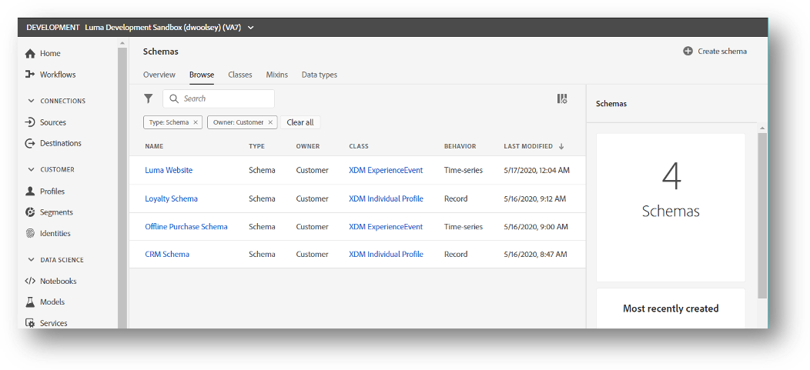

9. Once you have all four schemas, you're ready to move on to the next set of exercises!

**Original Exercise Creators:**

Praveen Sharma and David Woolsey, and the original GABA team

**Exercise Contributors**:

Shruti Jagtap and Danny Miller

**Change Log**

<table>
  <tr>
   <td>Ver.
   </td>
   <td>Issue Reporter
   </td>
   <td>Changes
   </td>
   <td>Date
   </td>
  </tr>
  <tr>
   <td>1.0
   </td>
   <td>
   </td>
   <td>Original Launch
   </td>
   <td>6/1/2020
   </td>
  </tr>
</table>

