# Adobe Experience Platform: Hands-On Technical Exercise: Identity Namespaces, Datasets, and DULE

## Overview

Now that you've created the XDM schema that's going to meet Luma's business goals, it's time to create identity namespaces, mark identity fields, create datasets, and establish proper data privacy controls via Data Usage Labeling and Enforcement (DULE) settings. 

Having a way for all of the data from the different sources to be tied together is one of the key value propositions of Platform and in this exercise, you'll see how to mark identity fields (in the XDM schema that you created in the previous exercise) and map them to identity namespaces. This will enable the creation of a unified profile that you'll see in the next set of exercises where the topic of Real-time Customer Profile will be introduced. 

Next, you'll learn how to create what Platform describes as datasets from the XDM Schema. An XDM schema defines what incoming data should look like while datasets are the acutal buckets of data that Platform uses to house the data. But of course, given today's privacy laws, governance needs to be enforced around how data in datasets can be used. This is where DULE comes into play.

 

Having correct DULE rules in place ensures that Personally Identifiable Information (PII) is only sent to places that Luma's customer privacy policy, as well as Adobe's, says that it can. Before Adobe Experience Platform, very few Adobe solutions such as Campaign and Marketo, were designed to store PII while other solutions like Audience Manager aren't allowed to have any PII data in it at all. There are still others like Analytics or Target where PII is strongly discouraged, but still able to be accepted so long as the client's legal team is okay with it. With Platform, one must now think holistically about the data captured and what types of data is more sensitive than others.  

Lastly, it's again important to call out that for this exercise you'll be using the Platform UI, but everything you're about to do in the UI can also be done via API call as well. 

## Create Identity Namespaces

Identity Namespaces are the mechanism used to inform Platform which identify fields from different XDM schemas house the same ids/data. In basic database terminology, it's how foreign keys are identified and connected between tables. We will need to use five namespaces to fully unify our schemas. Three of them will be default namespaces already in Platform while the remaining two we will be created this section.

Recall from the XDM building exercises that there were five fields that we put we created custom identity mixins for, namely:

* CRM ID
* Declared ID
* Email ID
* Phone Number
* Loyalty ID

CRM ID, Declared ID, and Loyalty ID will need to have identity namespaces created for them. Phone Number and Email ID already have Adobe-owned namespaces that we'll simply reference. 

1. Log into [https://platform.adobe.com](https://platform.adobe.com) with your adobe ID and ensure that you are in your assigned Experience Cloud org and in the sandbox you've created.
2. Click on **[!UICONTROL Identities]** in the left rail

   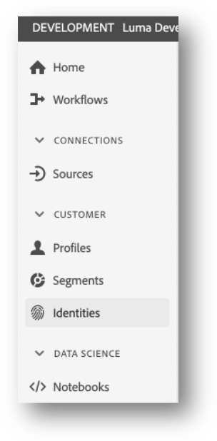

3. We'll start by creating the CRM ID schema. Click on **[!UICONTROL Create identity namespace]** in the upper right corner:

   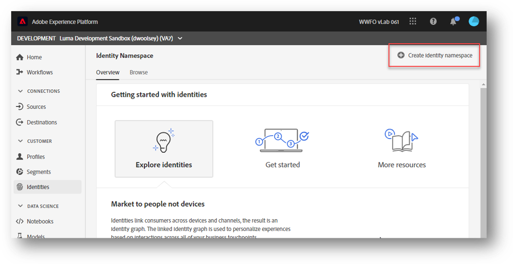

4. In the **[!UICONTROL Create identity namespace]** overlay, give it a display name of `CRM ID` and a symbol of `CRMID`. Also set the **[!UICONTROL Type]** to **[!UICONTROL Cross-Device.]** A description is optional, but is usually a good idea:

   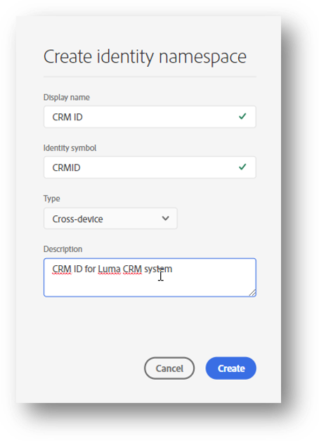

5. Click **[!UICONTROL Create]**. When you’re redirected to the **[!UICONTROL Identity Namspace]** page, click the **[!UICONTROL Browse]** tab to see your newly created identity namespace:

   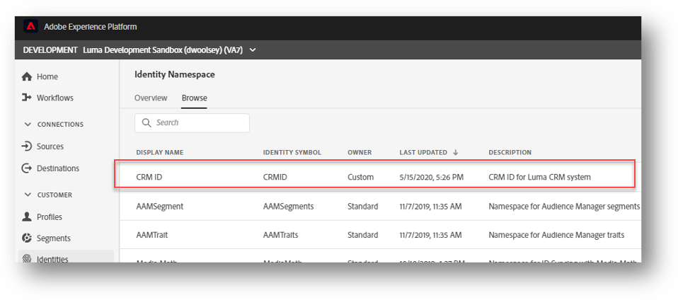

    >[!NOTE] The owner is listed as Custom instead of Standard because it was custom created.

6. Create two more Identity namespaces with the following parameters:

    <table>
    <tr>
    <td>
    <strong>Display Name</strong>
    </td>
    <td><strong>Identity Symbol</strong>
    </td>
    <td><strong>Type</strong>
    </td>
    </tr>
    <tr>
    <td>Loyalty ID
    </td>
    <td>LoyaltyId
    </td>
    <td>Cross-Device
    </td>
    </tr>
    <tr>
    <td>Declared ID
    </td>
    <td>DeclaredId
    </td>
    <td>Cross-Device
    </td>
    </tr>
    </table>

    Add a description for each field if you'd like. When finished, your Identity Namespaces should look like this:

      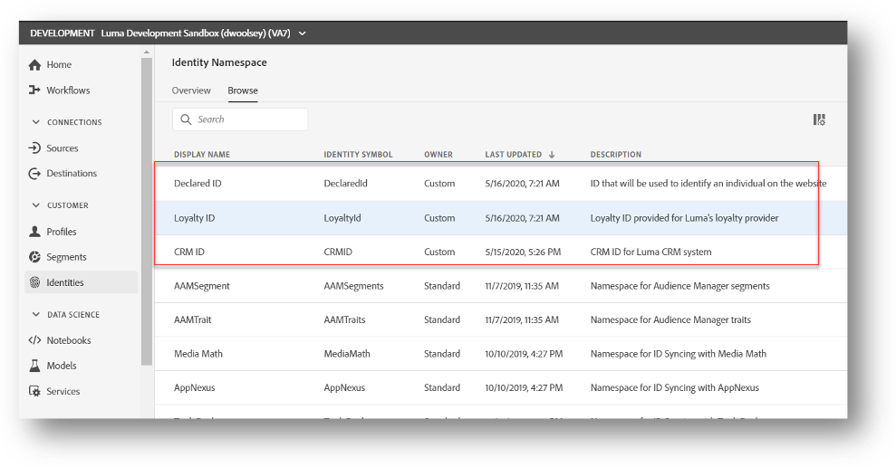

7. Scrolling down the list of standard identity namespaces, you should see the standard ones for phone and email that you'll use in a moment:

   

    >[!NOTE] You'll also see an ECID identity namespace. That will come into play later when you deploy the AEP Web SDK to the site. If you have an Audience Manager background, you'll also notice several familiar names in this list. One can think of identity namespaces like AAM data sources that were only used for id reconciliation with client or 3rd party data. 

## Update Schemas with Identity Namespacing Mapping

Now that you've created the appropriate Identity Namespaces, you're ready to map those namespaces to the XDM Schemas you created earlier. 

1. If necessary, log into platform.adobe.com and ensure you are in your assigned WWFO vLab### organization.
2. Click on **[!UICONTROL Schemas]** in the left rail to view the 4 schemas you created.
3. Click into the `CRM Schema.` Next, expand the `wwofvlab### > Identification` nodes and select the `crmid` field. The right pane should show you the properties for this field:

   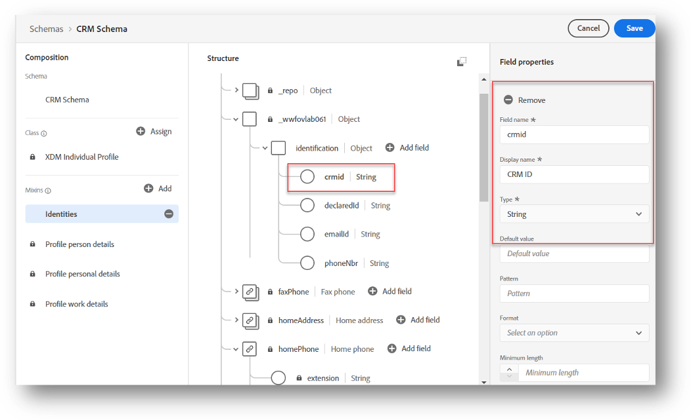

4. Scroll down in the right-hand pane and check the **[!UICONTROL Identity]** checkbox:

   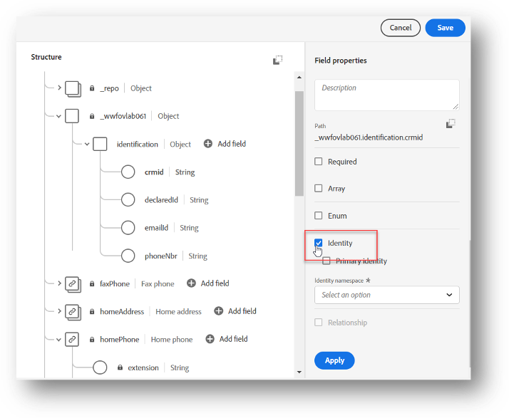

5. In the newly visible **[!UICONTROL Identity namespace]** dropdown, you'll see all of the Identity Namespaces from the previous section, including the custom ones you created. As you may have probably guessed by now, you want to select the `CRM ID` identity namespace:

   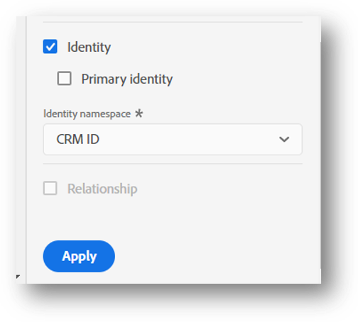

6. This Identity is also going to be the **[!UICONTROL Primary Identity]** for this schema, so you'll want to check the **[!UICONTROL Primary Identity]** checkbox as well:

   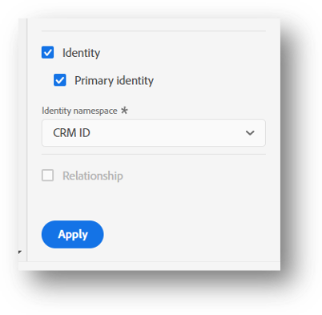

7. Click **[!UICONTROL Apply]** when done and you'll see the schema update with a thumbprint icon next to the crmid field as well as the mixin name update with which field has an identity:

   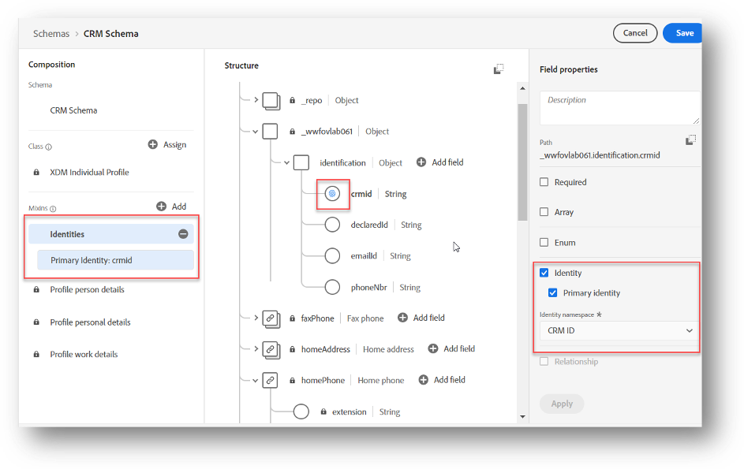

8. Click on the `declaredId` field, enable the **[!UICONTROL Identity]** field, and select the `Declared ID` identity name space. Since you can only have one primary identity per schema, this identity is going to be called a secondary identity. As such, you will NOT check the Primary Identity field:

   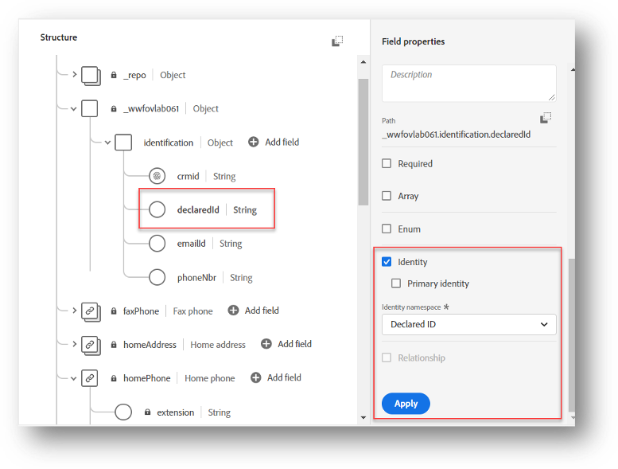

    >[!NOTE] The term 'secondary identity' is not an official term used by Adobe (you won't see it in the documentation anywhere). It's a term coined by those who have worked with customers to deploy Platform to help communicate and distinguish this identity to non-primary identity.

9. Click **[!UICONTROL Apply]**. As with the previous identity, you'll see the declaredId field inherit the thumbnail icon and the additional identity appear in the mixin panel:

   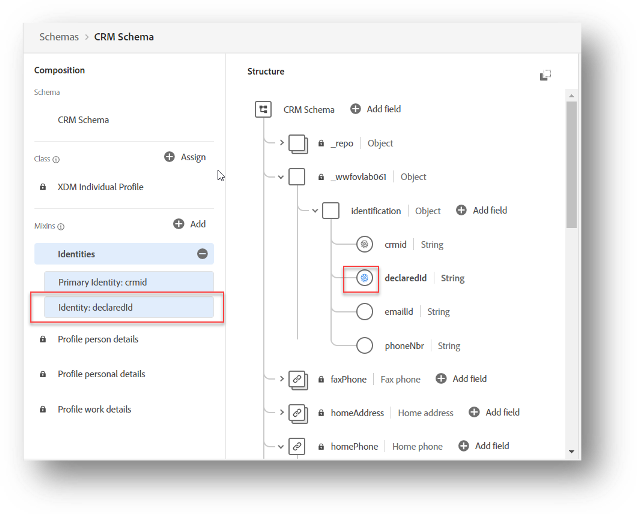

10. Map the remaining two identity fields, `emailId` and `phoneNbr` to the **[!UICONTROL Email]** and **[!UICONTROL Phone]** identity namespaces as secondary identifiers. When finished, your CRM Schema should look like this:

    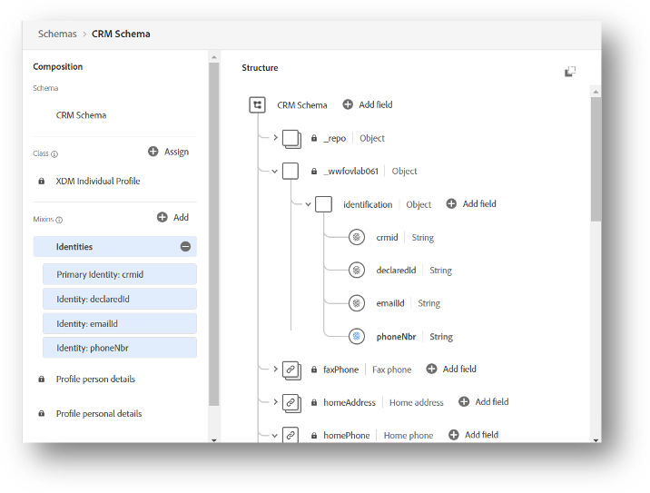

11. Save the `CRM Schema`. Then, return to the schemas homepage (click on **[!UICONTROL Schemas]** in the left rail)
12. Click to expand `Offline Purchase Schema` and mark the only identity field there, `loyaltyId`, as the primary identity mapped to the custom `Loyalty ID` namespace. When finished, your schema should look like this:

    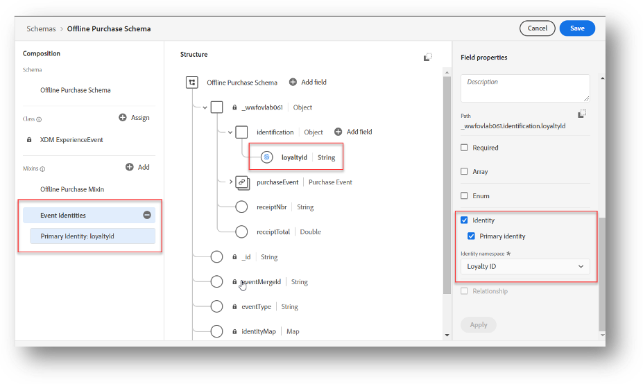

13. Save the `Offline Purchase Schema** then return to the schemas homepage.
14. Click to expand `Loyalty Schema`. Set the `loyaltyId` field as the **[!UICONTROL Primary Identity]** mapped to the `Loyalty ID` identity namespace.
15. Like the CRM Schema, set the `crmId`, `declaredId`, `emailId`, and `phoneNbr` field as a secondary identities mapped to their appropriate identity namespaces. Once finished, your `Loyalty Schema` should look like this:

    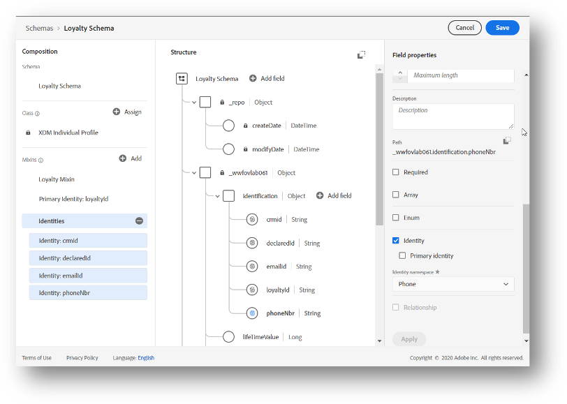

    >[!NOTE] Even though the loyaltyId and cmrid fields appear in the same node, these two fields were created in different mixins (both custom mixins).

16. Save your schema and you're ready to move on to the next section.

    >[!NOTE] You may be wondering why no identities were mapped in the fourth schema related to site data collection. Syncing data collected from the site with an identity map is done in the JavaScript itself. You'll get an opportunity to do that in a later exercise.

## Create Datasets and Apply DULE Settings

With the schemas built and identity fields marked and mapped to identity namespaces, we can now move to creating datasets, that will hold the actual data, from those schemas. However, we must also make sure that the data onboarded into these datasets has the proper data governance. With the advent of new privacy laws in the last few years, Adobe has decided to live by the mantra "Privacy by design". The Data Usage and Label Enforcement (DULE) settings you will apply when creating these datasets is the Platform's realization of that mantra and will help our clients, and Adobe, treat end user's data with the proper privacy. 

1. If necessary, log into platform.adobe.com and ensure you are in your assigned WWFO vLab### organization and sandbox you created earlier
2. Click on **[!UICONTROL Datasets]** in the left rail and you'll be taken to the Datasets homepage. Click **[!UICONTROL Create dataset]** in the upper right corner:

   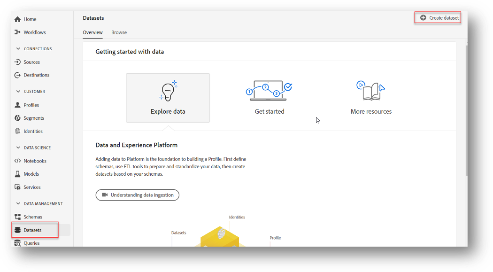

3. On the Create dataset page, you'll see two options, one to create a dataset from a schema and another to create a dataset from a CSV file. Click the **[!UICONTROL Create dataset from schema]** option.
4. We'll start with the CRM dataset. Select the `CRM Schema` option and click **[!UICONTROL Next]**:

   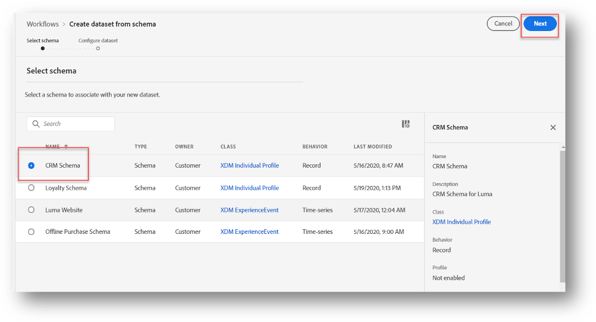
 

5. Name the dataset `CRM Data` then click **[!UICONTROL Finish.]** 
6. You should be taken to your newly created dataset page. Here we can do things like upload data (which you will do in a later exercise), view logs of previously uploaded data, and so forth. For right now, we need to apply the DULE settings needed for this dataset. Click the **[!UICONTROL Data governance]** tab:

   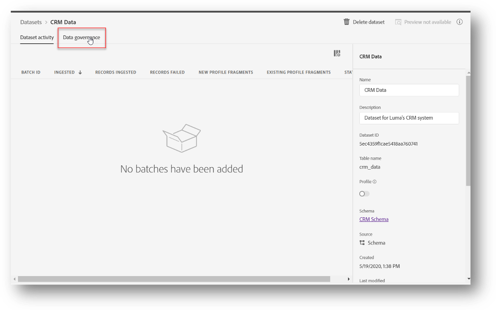

7. Since this is CRM data, it will contain a lot of PII. As such, it'll need the most restrictive DULE settings. Click the **pencil icon** in the upper right to apply DULE settings for the entire dataset:

   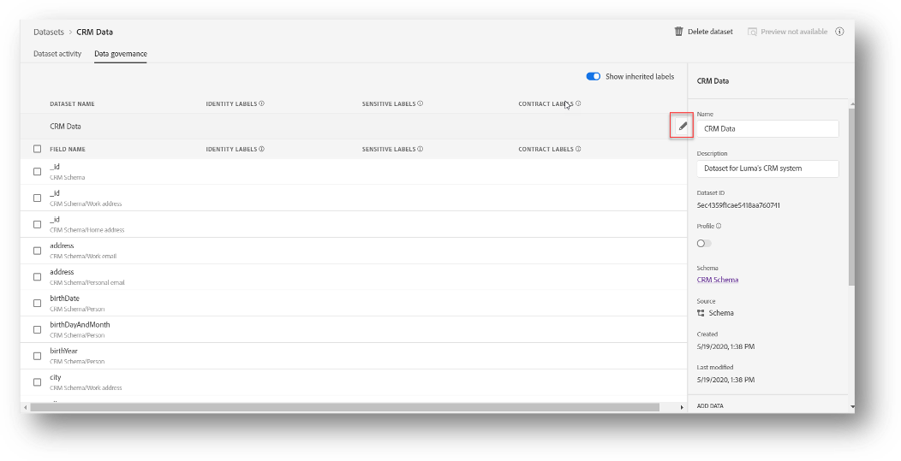

    >[!NOTE] That pencil icon doesn't resize with the rest of the window, so you may need to scroll horizontally or resize your window to find that icon.

8. On the resulting DULE screen, you'll see three groups of governance labels: Identity, Sensitive, and Contract. In the **[!UICONTROL Identity Labels]** section (should be already expanded), check the **[!UICONTROL I2]** option because a lot of this data can identity an individual rather than a device if used in conjunction with other data (more on this in a few steps):

   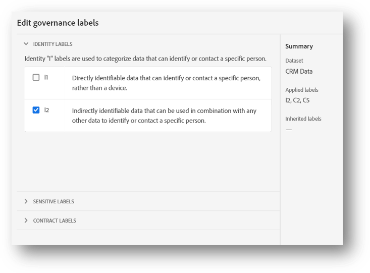

9. Expand the **[!UICONTROL Contract Labels]** area and check the **[!UICONTROL C2]** and **[!UICONTROL C5]** options because most PII can't be sold to 3rd parties or be used for cross-internet advertising:

   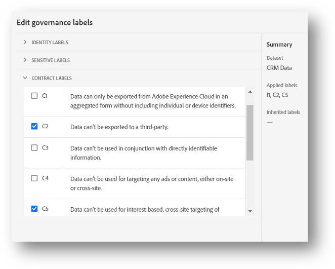

10. Click **[!UICONTROL Save Changes]** to save and close the overlay. You should then see the DULE labels appear next to all of the fields in the dataset:

    

11. Scroll through the list of CRM fields in this dataset. Notice that there are some fields that will need a higher restriction. Check the **[!UICONTROL firstName]**, **[!UICONTROL fullName]**, and **[!UICONTROL lastName]** fields then click the **[!UICONTROL Edit Governance Labels]** to change the DULE settings for just these fields:
 
    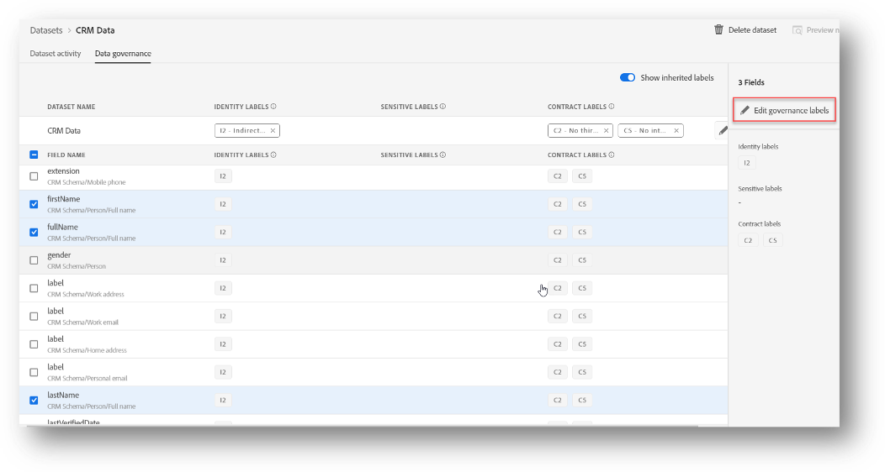

12. Since these fields can absolutely be used to identity someone, they will need the I1 setting since the l2 settings aren't restrictive enough. Check the **[!UICONTROL I1]** box then click **[!UICONTROL Save Changes]**. You'll see that these new fields now show the higher level of restriction:
   
    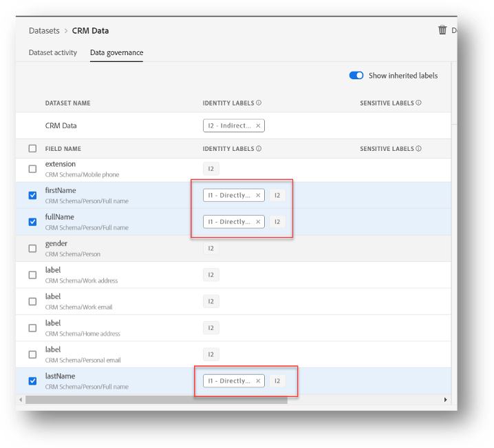

     >[!NOTE] If you scroll through, you'll notice that there are a LOT of fields. If you looked through the governance settings, you'll see a lot of DULE options as well! What you've done is just a small sampling of what could be done for proper data governance. Ultimately, it isn't Adobe's job to determine what DULE settings should be applied to what fields. There are some common ones that make sense that we walked you through here, but ultimately, it's up to the client's legal team to determine what data they capture needs to have what DULE settings applied to it.
     >
     > The point of this exercise was to show you that DULE could be applied on both the dataset and individual field level. However, it's important to note that individual fields can only be more restrictive than the rules for the entire data set. We can't, for example, make the entire dataset I1 and then make something like birth year I2. As such, when marking an entire dataset, you'll want to apply the lowest level settings to the entire data set and then add more restrictive settings to individual fields as needed. 

13. With your DULE settings enabled, you're ready to create datasets for the rest of the schemas. Click on **[!UICONTROL Datasets]** either in the left rail or in the top bread crumb trail (there is no save button to further save the DULE settings)
14. Using what you just learned create a new Dataset for the `Loyalty` Schema name `Loyalty Data` and because the data is not PII, you only need to apply an I2 DULE setting to the `crmid`, `emailId`, and `phoneNbr` fields. When finished, your new DULE settings should look like this:

    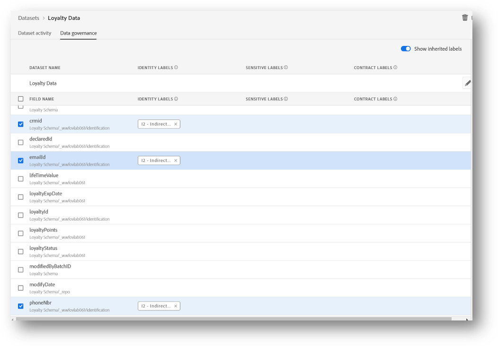

15. Create another dataset for the `Offline Purchase` schema called `Offline Purchase Data`. This data has no PII, but arguments could be made that the loyalty id could, through the loyalty schema, be tied to crm data. This is where the gray areas come into play because Platform does have the ability to merge this data with crm data. Therefore, should it have an I1 or I2 setting? Or no DULE settings at all? It'll depend on the client's legal team, but for our purposes, we won't need to add DULE setting. When finished, navigate back to the datasets homepage where you should see 3 datasets:

    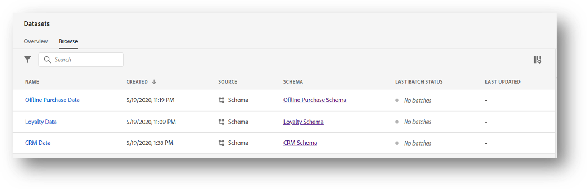

16. Lastly, create one more dataset for the `Luma Website Schema` called `Luma Website Data`. Since this is website data and Luma had a consent management system, any customer that agrees to use the website also agrees to let Adobe collect data and use it for marketing purposes only. As such, there is also no need for DULE settings for our purposes. However, client legal teams could call out that if someone authenticates, then there is the ability to tie anonymous data to PII via Platform. Again, this is a gray area that would be up to the client's legal team to decide what DULE settings should be enforced. But for now, you just need to verify that that you now have 4 datasets:

    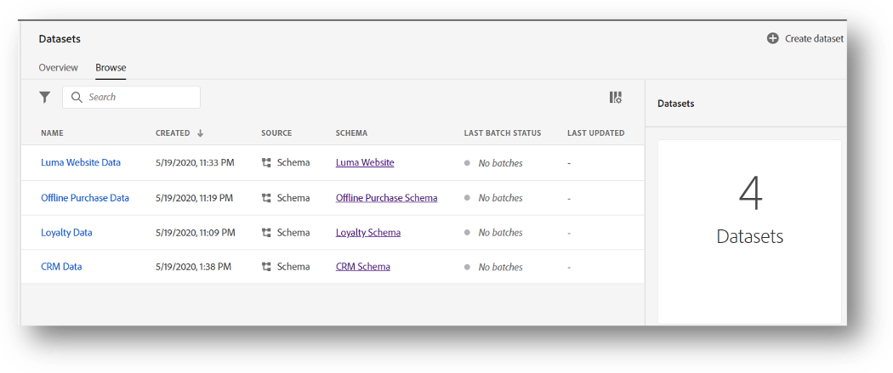

Once you have all 4 datasets, you've completed this exercise. 

**Original Exercise Creators:**

Praveen Sharma and David Woolsey

**Exercise Contributors**:

Shruti Jagtap