
>>>>>  gd2md-html alert:  ERRORs: 0; WARNINGs: 0; ALERTS: 49.

<ul style="color: red; font-weight: bold"><li>See top comment block for details on ERRORs and WARNINGs. <li>In the converted Markdown or HTML, search for inline alerts that start with >>>>>  gd2md-html alert:  for specific instances that need correction.</ul>

Links to alert messages:
<a href="#gdcalert1">alert1</a>
<a href="#gdcalert2">alert2</a>
<a href="#gdcalert3">alert3</a>
<a href="#gdcalert4">alert4</a>
<a href="#gdcalert5">alert5</a>
<a href="#gdcalert6">alert6</a>
<a href="#gdcalert7">alert7</a>
<a href="#gdcalert8">alert8</a>
<a href="#gdcalert9">alert9</a>
<a href="#gdcalert10">alert10</a>
<a href="#gdcalert11">alert11</a>
<a href="#gdcalert12">alert12</a>
<a href="#gdcalert13">alert13</a>
<a href="#gdcalert14">alert14</a>
<a href="#gdcalert15">alert15</a>
<a href="#gdcalert16">alert16</a>
<a href="#gdcalert17">alert17</a>
<a href="#gdcalert18">alert18</a>
<a href="#gdcalert19">alert19</a>
<a href="#gdcalert20">alert20</a>
<a href="#gdcalert21">alert21</a>
<a href="#gdcalert22">alert22</a>
<a href="#gdcalert23">alert23</a>
<a href="#gdcalert24">alert24</a>
<a href="#gdcalert25">alert25</a>
<a href="#gdcalert26">alert26</a>
<a href="#gdcalert27">alert27</a>
<a href="#gdcalert28">alert28</a>
<a href="#gdcalert29">alert29</a>
<a href="#gdcalert30">alert30</a>
<a href="#gdcalert31">alert31</a>
<a href="#gdcalert32">alert32</a>
<a href="#gdcalert33">alert33</a>
<a href="#gdcalert34">alert34</a>
<a href="#gdcalert35">alert35</a>
<a href="#gdcalert36">alert36</a>
<a href="#gdcalert37">alert37</a>
<a href="#gdcalert38">alert38</a>
<a href="#gdcalert39">alert39</a>
<a href="#gdcalert40">alert40</a>
<a href="#gdcalert41">alert41</a>
<a href="#gdcalert42">alert42</a>
<a href="#gdcalert43">alert43</a>
<a href="#gdcalert44">alert44</a>
<a href="#gdcalert45">alert45</a>
<a href="#gdcalert46">alert46</a>
<a href="#gdcalert47">alert47</a>
<a href="#gdcalert48">alert48</a>
<a href="#gdcalert49">alert49</a>

>>>>> PLEASE check and correct alert issues and delete this message and the inline alerts.

## Adobe Experience Platform: 

## Hands-on Technical Exercise: Real-Time Customer Profile and Batch Data Ingestion

V 1.0

Contents

[TOC]

## Overview

Now that you've created the XDM schema that's going to meet Luma's business goals, marked the identity fields, set up the datasets, and put the proper governance in place, it's time to unify that schema and ingest some batch data for use in the Real-time Customer Profile (formerly known as Unified Profile).   

## Enable Schemas and Datasets for Real-Time Customer Profile

In a fully developed Adobe Experience Platform deployment for a customer, you'd likely have a LOT of data being brought in and stored. However, not all of that data will need to be (or should be) used for Real-Time Customer Profile (or just Profile, for short). For example, non-user level data around Marketing Campaigns may be brought into the data lake for analysis purposes but wouldn't need to be tied to specific profiles. As such, you have to select which schemas and datasets should be enabled for Profile, which is what you'll do in this section. Because we only have 4 datasets and schemas (and our sample data is small), we'll be enabling all of them for Profile. 

1. If necessary, log into platform.adobe.com and ensure you are in your assigned WWFO vLab### organization and sandbox.
2. Validate the current state of Uunion schema. To do that, click onclick **Profiles **in the left rail followed by the **Union Schema** tab. Initially, Union schema will have nothing as there are is no schemas or datasets have been enabled for Profile thus far (you'll just get a spinning wheel): 

>>>>>  gd2md-html alert: inline image link here (to images/image1.png). Store image on your image server and adjust path/filename/extension if necessary.  (<a href="#">Back to top</a>)(<a href="#gdcalert2">Next alert</a>) >>>>> 

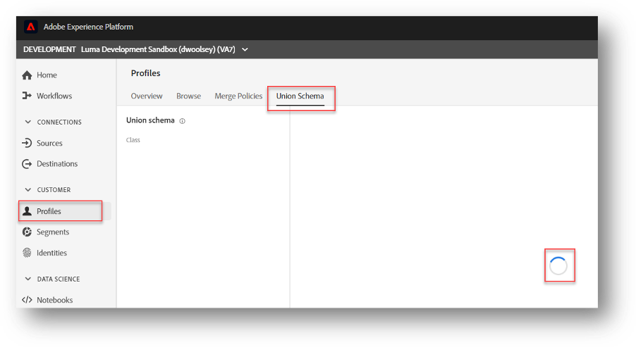

3. To start adding the CRM data into Profile, go to **Schema**s and then click into the **CRM Schema**. In the Schema properties box on the right, toggle the **Profile** switch to on:

>>>>>  gd2md-html alert: inline image link here (to images/image2.png). Store image on your image server and adjust path/filename/extension if necessary.  (<a href="#">Back to top</a>)(<a href="#gdcalert3">Next alert</a>) >>>>> 

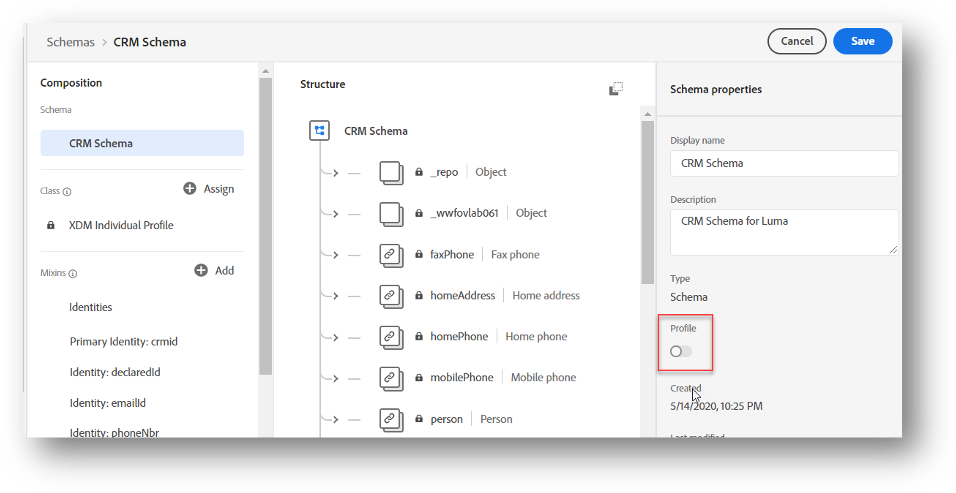

    When presented with the overlay asking if you want to enable this schema, read the message and click **Enable.**

>>>>>  gd2md-html alert: inline image link here (to images/image3.png). Store image on your image server and adjust path/filename/extension if necessary.  (<a href="#">Back to top</a>)(<a href="#gdcalert4">Next alert</a>) >>>>> 

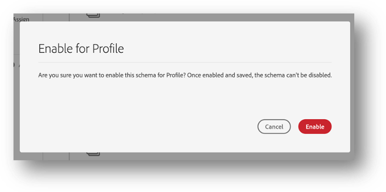

    **Note:** Once it’s enabled for profile, you can no longer disable the schema as the overlay calls out., Hhowever, you can still add the XDM schema later on with additional information. While one does need to be careful about what should or shouldn't be added to Profile, adding a schema to profile does not mean you’re stuck with the schema in its current state moving forward.

4. Save your CRM Schema now that you've enabled it for Profile.
5. Click onClick **Profiles** again in the left rail and the **Union Schema **tab should already be selected. Notice now that your only schema enabled for Profile is now in the unified schema:

>>>>>  gd2md-html alert: inline image link here (to images/image4.png). Store image on your image server and adjust path/filename/extension if necessary.  (<a href="#">Back to top</a>)(<a href="#gdcalert5">Next alert</a>) >>>>> 

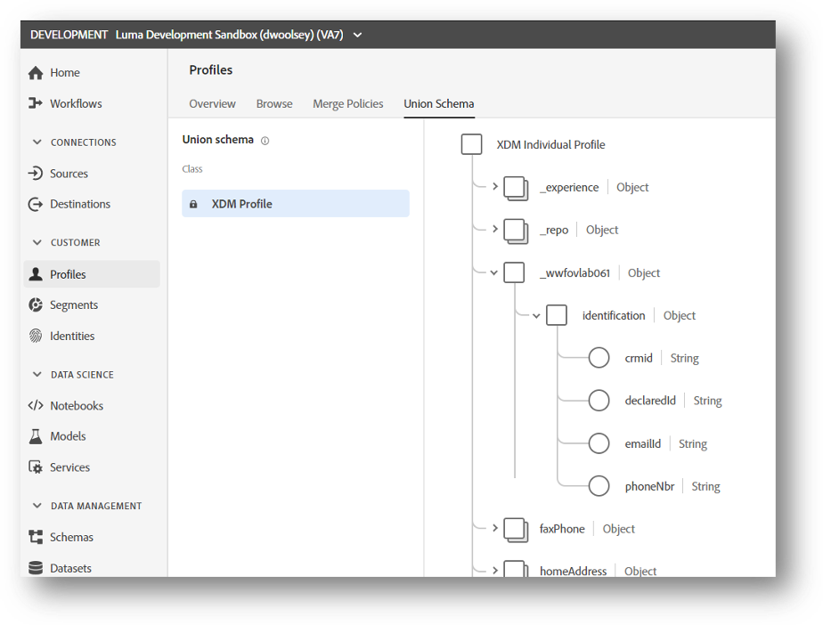

6. Using what you just learned, click back into the **Schemas** section and enable the **Loyalty **and **Offline Purchase Schemas **for Profile and save them as well. Do NOT enable the Luma Website schema for Profile just yet (you will in a moment). Return to the unified schema and you should now see that the Loyalty Schema is now included in the unified schema:

    

>>>>>  gd2md-html alert: inline image link here (to images/image5.png). Store image on your image server and adjust path/filename/extension if necessary.  (<a href="#">Back to top</a>)(<a href="#gdcalert6">Next alert</a>) >>>>> 

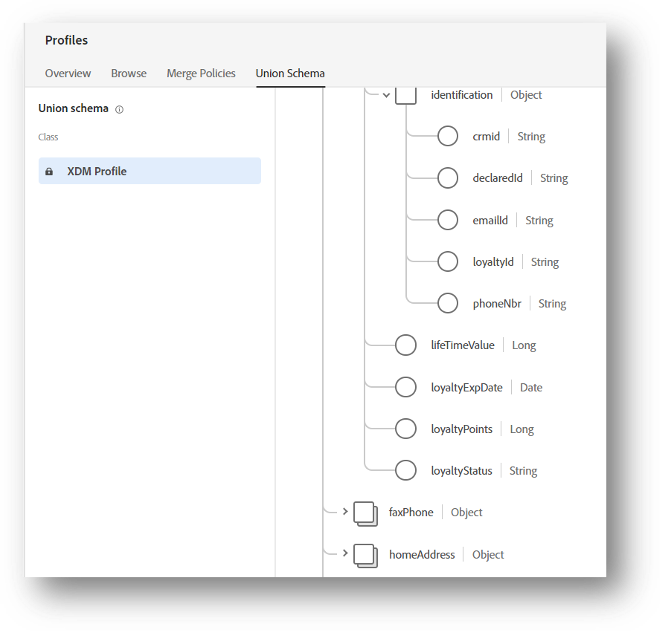

    **Note:** Why isn't the Offline Purchases Schema represented in this view? It actually is in this Union view. If you scroll down, you'll see a **timeSeriesEvents** node. Expand that out and you'll see your offline Purchase schema:

    

>>>>>  gd2md-html alert: inline image link here (to images/image6.png). Store image on your image server and adjust path/filename/extension if necessary.  (<a href="#">Back to top</a>)(<a href="#gdcalert7">Next alert</a>) >>>>> 

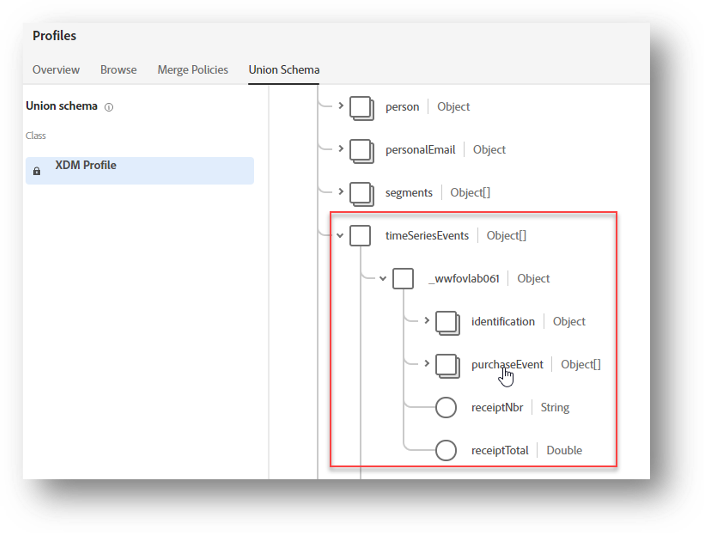

7. Click back into **Schemas** and click into the **Luma Website **schema. Enable it for Profile like you did the other schemas, but notice the different error message now:

    

>>>>>  gd2md-html alert: inline image link here (to images/image7.png). Store image on your image server and adjust path/filename/extension if necessary.  (<a href="#">Back to top</a>)(<a href="#gdcalert8">Next alert</a>) >>>>> 

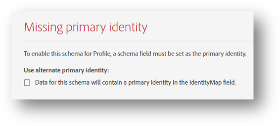

    Recall that when you were setting up this schema you didn't add the custom identities mixin (or any kind of identity mixin), nor did you mark any of these fields as identities when you were marking identity name spaces. However, every schema needs a primary identity if it's going to be added to Profile, or else Platform wouldn't know which profile to store it against. Fortunately, this schema is going to get its data from the Adobe-owned, AEP Web SDK JavaScript library and the primary IDid is going to be added in the identity map field (as will a secondary identity). There will be mMuch more on this concept when you deploy the AEP Web SDK in a later exercise. 

8. Check the **Data for this schema will contain a primary identity in the identityMap field** box, click **Enable**, then save the **Luma Website** schema. Optionally, you can return to the union schema and see that your Luma Web schema is there now as well.
9. With Platform, it's also possible to have multiple datasets based off of a single schema (just like you can could have multiple "buckets" based off of a single "bucket template"). As such, you also have to enable the datasets for Profile as well. Again, we're dealing with a simpleistic implementation, so all of our datasets will need to be enabled for profile. To start that process, click onclick **Datasets** then click into the **CRM Data **dataset.
10. Once there, you'll see that there is no data. That's because we haven't added any data to this dataset yet (but you will shortly). Similar to the schemas, enable this dataset for Profile by enabling the **Profile** toggle in the right rail and click **Enable **on the confirmation dialogue box:

    

>>>>>  gd2md-html alert: inline image link here (to images/image8.png). Store image on your image server and adjust path/filename/extension if necessary.  (<a href="#">Back to top</a>)(<a href="#gdcalert9">Next alert</a>) >>>>> 

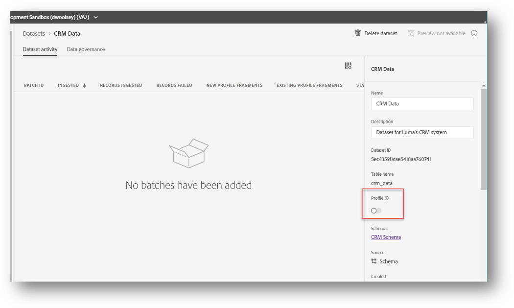

11. There is no "save" option for datasets, so you can simply navigate back to **Datasets** and enable the remaining three data sets for **Profile.** 

    **Note:** If looking at the Unified Schema screen a few steps back, you may have noticed an "add dataset to Profile" option in the upper right corner. Going through that link does the same thing as enabling the datasets in the same manner you did it here. It's just a different way of doing it. 

    **Note:** One other important note is that oOnly data that is onboarded/captured _after_ a dataset is enabled for Profile is included in the combined profile. As such, we are onboarding data after enabling Profile.

## Add Luma User to Sample Dataset

In order to see how both online and offline data can work together in Platform, you will need both an online profile and offline data pertaining to it. You have a few online profiles that you created on your AEM-hosted Luma website when you deployed and integrated all of the individual Adobe Experience Cloud products. In this section, you'll choose one of those profiles and add it to the sample datasets that you'll be ingesting into Platform.

1. Choose a Luma profile/account that you've already created on your Luma website. It doesn't matter which one you use, so long as you have one you're going to use for the remaining exercises. You'll need the hashed ID you've been using thus far as the declared ID (MD5 hash of the email address), so now may be a good time to start your publish+dispatcher AEM instance in mPaaS so you can get that value in a moment.
2. Download the following three files from the [materials repository for this bootcamp:](https://adobe.sharepoint.com/sites/DMAAcademyBootcamp2020)

<table>
  <tr>
   <td>
1
   </td>
   <td>CRM dDataATA
   </td>
   <td>CRM_Data.csv
   </td>
  </tr>
  <tr>
   <td>2
   </td>
   <td>Loyalty data
   </td>
   <td>Loyalty_data.csv
   </td>
  </tr>
  <tr>
   <td>3
   </td>
   <td>Offline purchase data
   </td>
   <td>Offline_purchase_events.json
   </td>
  </tr>
</table>

    **Note:** You'll only need to update CRM DATA and Loyalty data for this section, but you'll be using Offline Purchase events later.

3. Open the **CRM_data.csv** file and notice all the fields of information. The key ones to call out are **crmid**, which is the primary identity for this dataset as well as the **declaredId**, which is a secondary identity that will be used to tie the offline data you're uploading here to the online data you'll be sending in from the website later.
4. At the bottom of the file, create a record for the Luma user/profile you're going to use using the following guidelines and tips:
    1. Excel can format things incorrectly. In some cases, since this is just a CSV file, another text editor program might be easier than Excel.
    2. It might be easier to copy the top row (column names) into a separate file and build out your row of data and then simply paste your new row into the bottom of the full file.
    3. For the **id field**, simply use the next sequential number (should be **1001).**
    4. For the **crmid field**, copy another crmid from another record and simply change a few random digits.
        1. Ensure sure it is the same length as the other crmids. 
        2. Note down your crmid as you'll need it later.
    5. For the **birthdate** field, just copy a value from some other record and paste it in. (There's no need to spend time getting the right number combination for an actual birthdate you may want to use).
    6. For the **declaredId field**, enter the hashed email Id from the datalayer on the Luma website. If you don't recall how to retrieve that, take the following steps:
        3. Log into your Luma website with the profile you want to use.
        4. View the page source on the page and scroll down until you find the data layer.
        5. The **user.profile.attributes.username** node has the hash ID that you need:

            

>>>>>  gd2md-html alert: inline image link here (to images/image9.png). Store image on your image server and adjust path/filename/extension if necessary.  (<a href="#">Back to top</a>)(<a href="#gdcalert10">Next alert</a>) >>>>> 

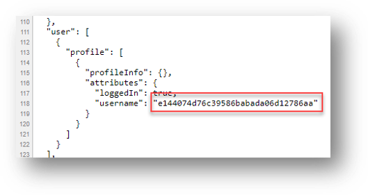

        6. Copy that value and put it in the declared id column of your file (without the quotes). 

            **Note:** The other declared IDds will be in all caps. Do NOT change yours to all caps. Leave it in the mixed casing it is from the website. 

When finished, your new row of data should look similar to this:

>>>>>  gd2md-html alert: inline image link here (to images/image10.png). Store image on your image server and adjust path/filename/extension if necessary.  (<a href="#">Back to top</a>)(<a href="#gdcalert11">Next alert</a>) >>>>> 

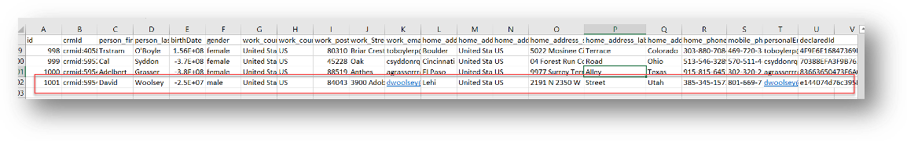

5. Save your **CRM_DATA.csv** file and open the **Loyalty_data.csv** file.
6. You now need to update the Loyalty_data.csv file with a record corresponding to the crm record that you just created with the following guidelines:
    7. For the **id field**, simply use the next sequential number (should be **1001).**
    8. For the **crmid** field, enter the **crmid** that you created for your record in the CRM_DATA.csv file.
    9. In the **loyaltyId **field, copy and paste the value from another record and change a few random digits. 
    10. Fill in the remaining fields with any values of your choosing. Feel free to simply copy them from another row.

    When finished, your updated Loyalty_data.csv file should look similar to this:

    

>>>>>  gd2md-html alert: inline image link here (to images/image11.png). Store image on your image server and adjust path/filename/extension if necessary.  (<a href="#">Back to top</a>)(<a href="#gdcalert12">Next alert</a>) >>>>> 

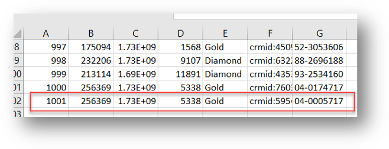

7. Save and close your **Loyalty_data.csv** file. If your CRM_DATA.csv file ist open, close it as well. 

## Ingest Batch CRM Data

With Profile enabled on the datasets and schemas and your user profile added to the fake data, it's time to onboard or ingest this batch data. As you proceed through this section, keep in mind that the process you're going through is how one would onboard a sample of data to ensure that the data onboards correctly and looks right. This is NOT the exact process that one would follow to do daily onboarding of files for a customer, though the steps would be similar.   There are mMore details to come at the end of this section, but for now, perform the following steps to ingest the Loyalty and CRM data.

First , we will ingest CRM Data. We already have “CRM Schema” created and it has already been enabled for “Profile”. We also have “CRM Dataset” created and also enabled it for “Profile”.   Now: 

1. If necessary, log into platform.adobe.com and ensure you are in your assigned WWFO vLab### organization and sandbox.
2. Click onClick **Workflows** in the left navigation, select **Map CSV to XDM Schema **in the Data ingestion list, then click onclick **Launch** button to start the ingestion.

>>>>>  gd2md-html alert: inline image link here (to images/image12.png). Store image on your image server and adjust path/filename/extension if necessary.  (<a href="#">Back to top</a>)(<a href="#gdcalert13">Next alert</a>) >>>>> 

3. Drag and drop your **CRM_DATA.csv** into the upload area, and once file is uploaded, you can preview the CRM data in table below:

    

>>>>>  gd2md-html alert: inline image link here (to images/image13.png). Store image on your image server and adjust path/filename/extension if necessary.  (<a href="#">Back to top</a>)(<a href="#gdcalert14">Next alert</a>) >>>>> 

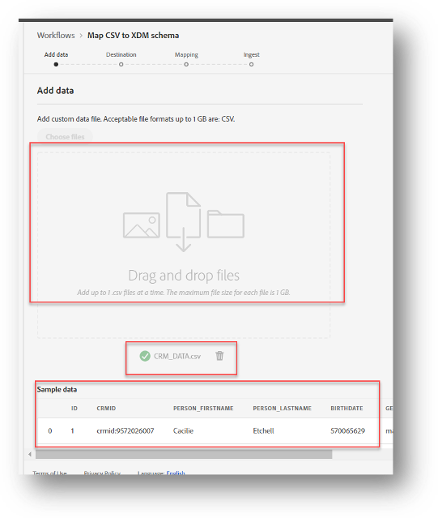

    **Note:** Also notice above the drag and drop area it lists a 1 GB limit on data uploads. This limit only applies to the UI method. Again, the UI approach is really just a way to ensure ing things work before loading much larger files using other methods.

4. Click **Next, **and after a moment or two of processing, you'll be asked which dataset this data should be sent to. Select the **CRM** **Data** dataset (the **Use existing dataset** option should already be selected) and click **Next:**

    

>>>>>  gd2md-html alert: inline image link here (to images/image14.png). Store image on your image server and adjust path/filename/extension if necessary.  (<a href="#">Back to top</a>)(<a href="#gdcalert15">Next alert</a>) >>>>> 

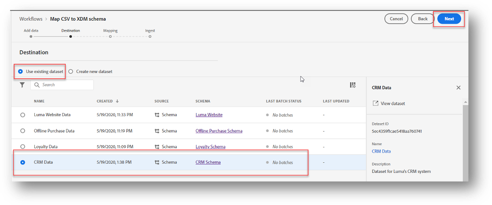

5. The next step is to map the CSV input file’s fields with the selected dataset’s XDM fields. The Platform UI will try to map the fields;: however, it cannot guarantee a correct mapping and you'll see that several fields on the right are lined red because Platform couldn't find an automatic match. 

    Scroll down through the list, noting that the fields on the left are the column headers in the file (source fields) with the column on the right being the destination/XDM fields they should map too (target fields). Also notice the thumbprint icon in the middle indicates potential identity field matches:

>>>>>  gd2md-html alert: inline image link here (to images/image15.png). Store image on your image server and adjust path/filename/extension if necessary.  (<a href="#">Back to top</a>)(<a href="#gdcalert16">Next alert</a>) >>>>> 

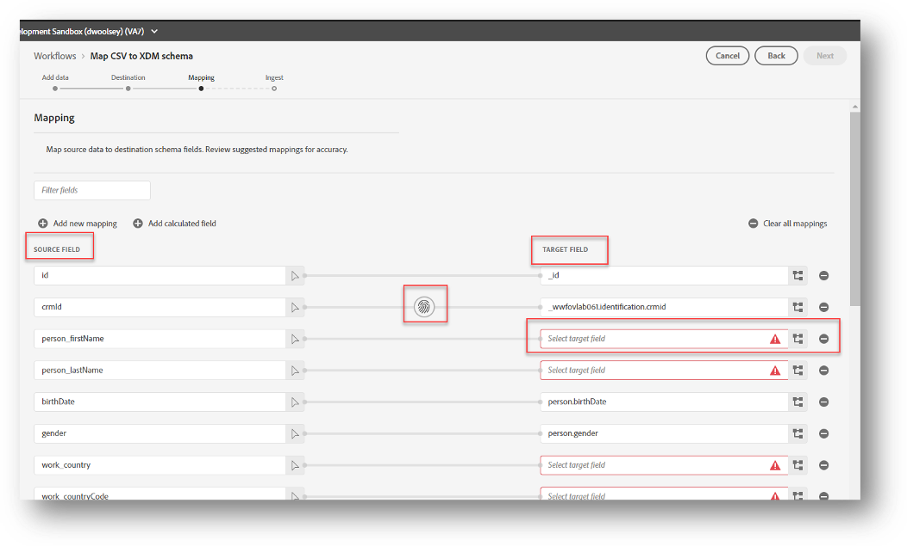

6. The first field that doesn't have a matching destination XDM field is person_firstName. Click the **Schema icon** next to the empty destination field to bring up the CRM Schema:

>>>>>  gd2md-html alert: inline image link here (to images/image16.png). Store image on your image server and adjust path/filename/extension if necessary.  (<a href="#">Back to top</a>)(<a href="#gdcalert17">Next alert</a>) >>>>> 

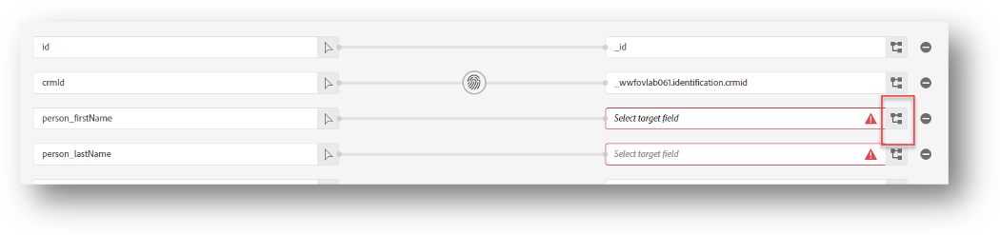

7. Navigate to the **person > name> firstName** node, select it, then click **Select. **(Tip: click onclick the **underscore** to expand the field, not the arrow):

    

>>>>>  gd2md-html alert: inline image link here (to images/image17.png). Store image on your image server and adjust path/filename/extension if necessary.  (<a href="#">Back to top</a>)(<a href="#gdcalert18">Next alert</a>) >>>>> 

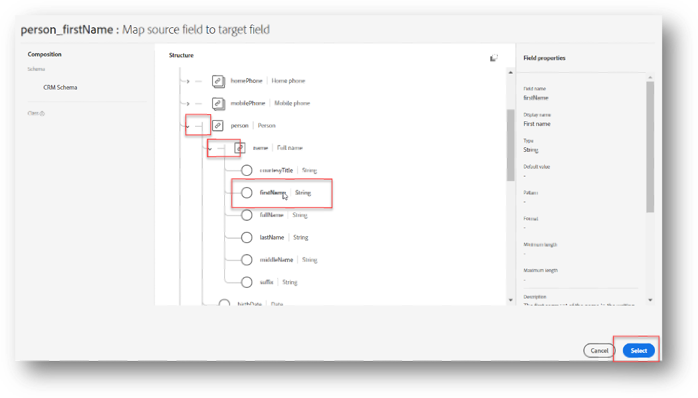

8. It should be pretty easy to find the corresponding XDM fields for the next 6 fields that don't have a matching target field. For easy reference, map them as follows:

<table>
  <tr>
   <td>
<strong>Source Field</strong>
   </td>
   <td><strong>XDM Field</strong>
   </td>
  </tr>
  <tr>
   <td>person_lastName
   </td>
   <td>person > name> firstName
   </td>
  </tr>
  <tr>
   <td>work_country
   </td>
   <td>person > name> lastName
   </td>
  </tr>
  <tr>
   <td>work_country code
   </td>
   <td>workAddress > country
   </td>
  </tr>
  <tr>
   <td>work_postalCode
   </td>
   <td>workAddress > countryCode
   </td>
  </tr>
  <tr>
   <td>work_street
   </td>
   <td>workAddress > street1
   </td>
  </tr>
  <tr>
   <td>work_email
   </td>
   <td>workEmail > address
   </td>
  </tr>
</table>

    When finished, the top half of the mappings should look like this:

>>>>>  gd2md-html alert: inline image link here (to images/image18.png). Store image on your image server and adjust path/filename/extension if necessary.  (<a href="#">Back to top</a>)(<a href="#gdcalert19">Next alert</a>) >>>>> 

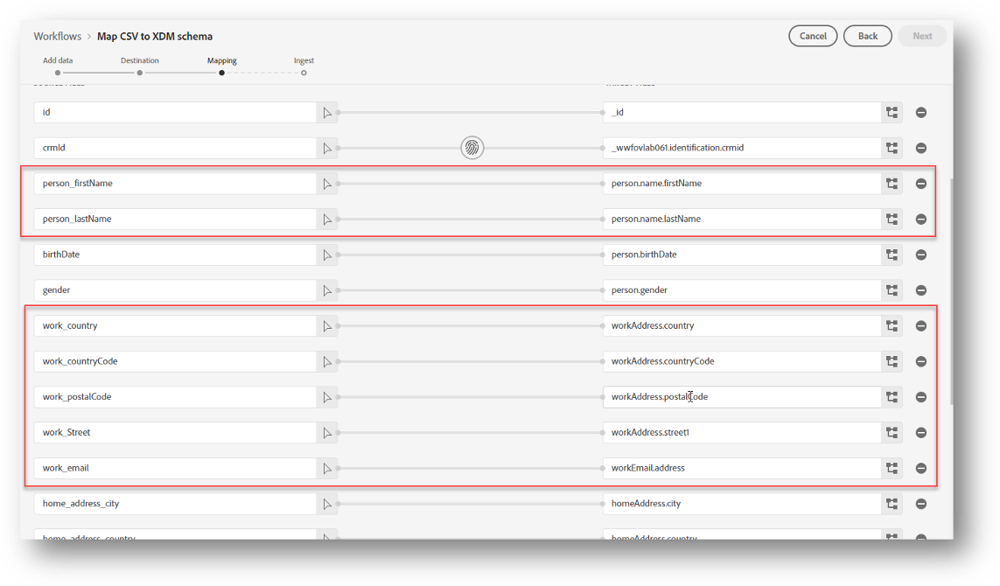

9. Scroll to the bottom and notice that there are two identity fields, email ID and phoneNbr, that don't have a corresponding source field from the file:

>>>>>  gd2md-html alert: inline image link here (to images/image19.png). Store image on your image server and adjust path/filename/extension if necessary.  (<a href="#">Back to top</a>)(<a href="#gdcalert20">Next alert</a>) >>>>> 

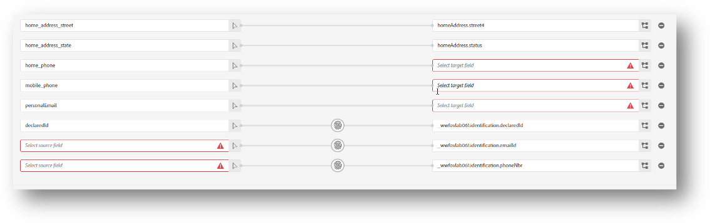

    Also notice how the home street and state were automatically mapped to XDM fields that don't make sense and that the home phone, mobile phone, and personal email weren't automatically mapped to anything. Map (and re-map) the 'home' fields to these XDM fields:

<table>
  <tr>
   <td><strong>Source Field</strong>
   </td>
   <td><strong>XDM Field</strong>
   </td>
  </tr>
  <tr>
   <td>home_address_street
   </td>
   <td>homeAddress > street1
   </td>
  </tr>
  <tr>
   <td>home_address_state
   </td>
   <td>homeAddress > stateProvince
   </td>
  </tr>
  <tr>
   <td>home_phone
   </td>
   <td>homePhone > number
   </td>
  </tr>
</table>

10. Map **mobile_phone** field to the **_wwfovlab###.identification.phoneNbr** XDM field and **personalEmail** mapping to the **_wwfovlab###.identification.emailId** XDM field. Notice that they now have the thumbnail icon, but also that they are outlined in red. That's because you have the same XDM field in two different mappings.

>>>>>  gd2md-html alert: inline image link here (to images/image20.png). Store image on your image server and adjust path/filename/extension if necessary.  (<a href="#">Back to top</a>)(<a href="#gdcalert21">Next alert</a>) >>>>> 

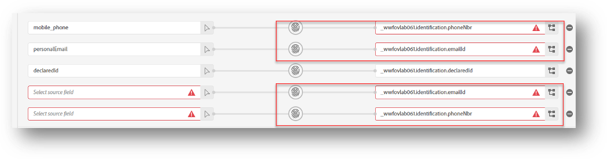

11. Click the **minus** icon on the last two fields to remove them:

>>>>>  gd2md-html alert: inline image link here (to images/image21.png). Store image on your image server and adjust path/filename/extension if necessary.  (<a href="#">Back to top</a>)(<a href="#gdcalert22">Next alert</a>) >>>>> 

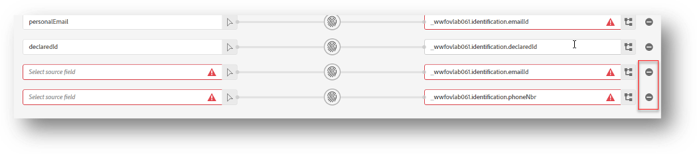

   	Tand the red outlines should disappear, and the bottom half of your schema should look like this:

>>>>>  gd2md-html alert: inline image link here (to images/image22.png). Store image on your image server and adjust path/filename/extension if necessary.  (<a href="#">Back to top</a>)(<a href="#gdcalert23">Next alert</a>) >>>>> 

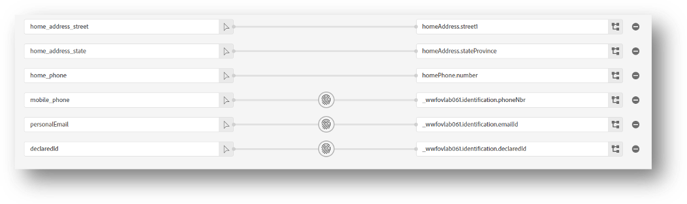

    **Note:** Keep in mind that this dataset is pretty simple and that we're making a few assumptions. This is also where using something like a phone and email as an identifier can get tricky. We have a very controlled set of data where every row has a personal email and mobile phone, and as such, we can assume those will be used as an identifier. That won't be the case in many real custom scenarios, so an upload may need to have something like a preferred email and/or phone number field. For our purposes, this will work. 

12. With your fields mapped properly, the **Next** button will turn blue. Click it to begin the data ingestion process.
13. You'll have one final chance to review any details. Assuming you have the correct field mappings, click **Ingest:**

    

>>>>>  gd2md-html alert: inline image link here (to images/image23.png). Store image on your image server and adjust path/filename/extension if necessary.  (<a href="#">Back to top</a>)(<a href="#gdcalert24">Next alert</a>) >>>>> 

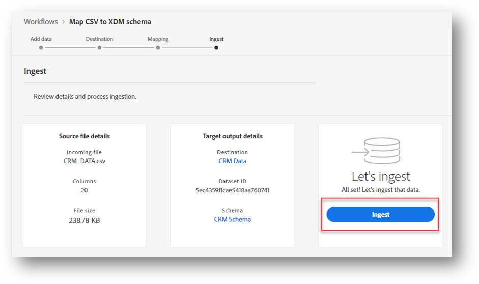

It will take a few moments to ingest the data and you'll see the progress on this screen:

>>>>>  gd2md-html alert: inline image link here (to images/image24.png). Store image on your image server and adjust path/filename/extension if necessary.  (<a href="#">Back to top</a>)(<a href="#gdcalert25">Next alert</a>) >>>>> 

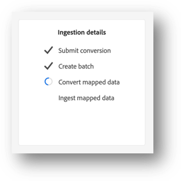

14. Once the data has finished ingesting, you'll see a success message:

    

>>>>>  gd2md-html alert: inline image link here (to images/image25.png). Store image on your image server and adjust path/filename/extension if necessary.  (<a href="#">Back to top</a>)(<a href="#gdcalert26">Next alert</a>) >>>>> 

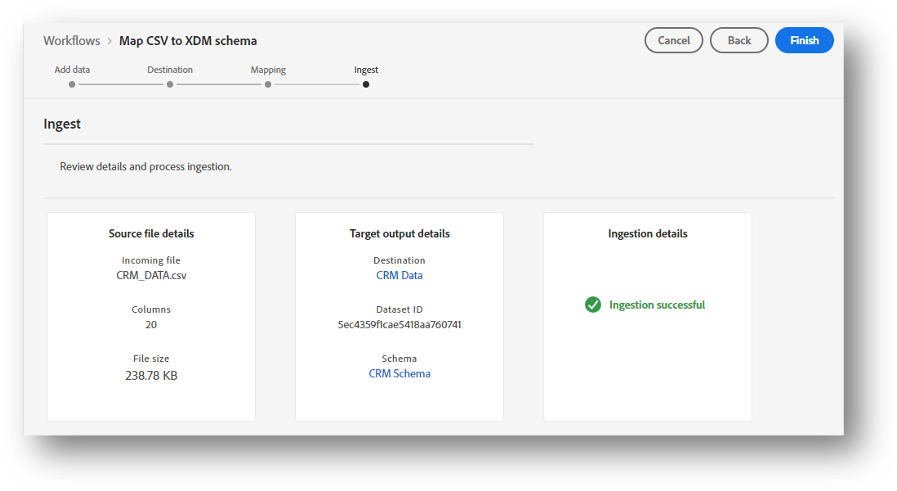

    Click **Finish **and you'll be taken to the CRM Data dataset, where you'll see information about the data just ingested. If necessary, scroll down and notice that there is a table below the graphs:

    

>>>>>  gd2md-html alert: inline image link here (to images/image26.png). Store image on your image server and adjust path/filename/extension if necessary.  (<a href="#">Back to top</a>)(<a href="#gdcalert27">Next alert</a>) >>>>> 

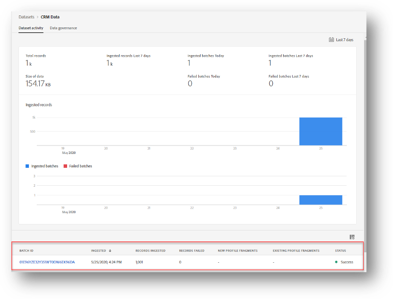

    **Note:** If there had been an error such as the data being uploaded not matching the datatype of the field in the schema, they would appear on this screen.

15. Click on the **Preview dataset** to see the preview of last loaded batch.

    

>>>>>  gd2md-html alert: inline image link here (to images/image27.png). Store image on your image server and adjust path/filename/extension if necessary.  (<a href="#">Back to top</a>)(<a href="#gdcalert28">Next alert</a>) >>>>> 

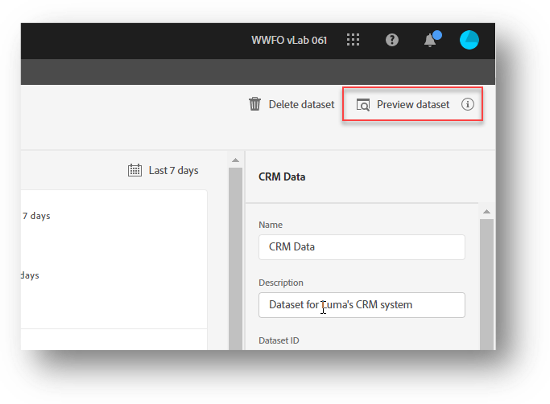

    Scroll through the preview and click **Close** when finished

16. To monitor the data ingestion process and the progress of getting into Profile, click **Monitoring** in the bottom of the left rail. Depending on the time it took to get to this page, you may see an "In-progress" in a few of the fields:

>>>>>  gd2md-html alert: inline image link here (to images/image28.png). Store image on your image server and adjust path/filename/extension if necessary.  (<a href="#">Back to top</a>)(<a href="#gdcalert29">Next alert</a>) >>>>> 

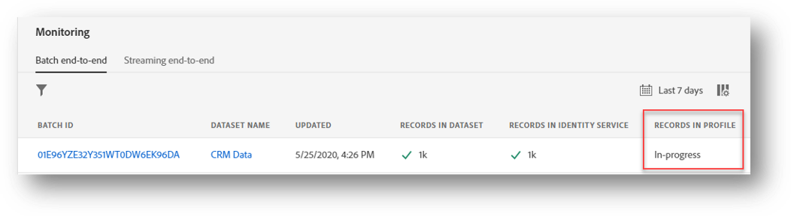
 

    Wait a few minutes for the job to complete and once you when you seehave a green check, it means your data is loaded into profile (sometimes a page refresh helps):

>>>>>  gd2md-html alert: inline image link here (to images/image29.png). Store image on your image server and adjust path/filename/extension if necessary.  (<a href="#">Back to top</a>)(<a href="#gdcalert30">Next alert</a>) >>>>> 

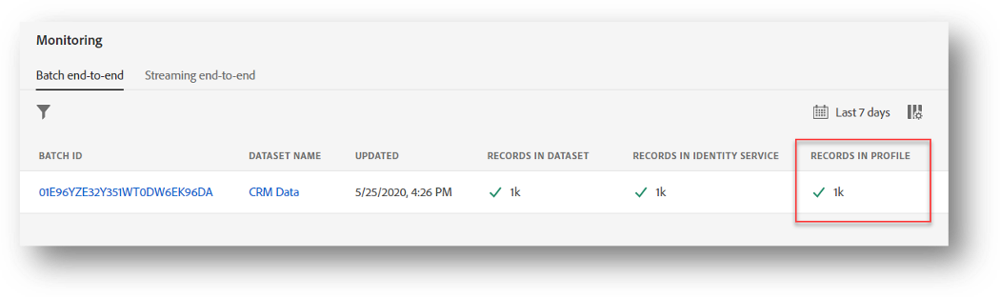

    **Note: **You are on the **Batch end-to-end** monitoring tab. You'll be using the **Streaming end-to-end** tab in later exercises when data starts to be streamed in.

17. The steps you just performed are a great way to upload some sample data and understand which fields in a client-created file maps to the XDM schema. However, uploading a daily file can't take that kind of manual workflow and field mapping. As such, how would Luma upload their loyalty and CRM data automatically? To get a glimpse of how that would be done, click onclick **Sources **in the left rail. Notice that it is in the **Connections** section:

    

>>>>>  gd2md-html alert: inline image link here (to images/image30.png). Store image on your image server and adjust path/filename/extension if necessary.  (<a href="#">Back to top</a>)(<a href="#gdcalert31">Next alert</a>) >>>>> 

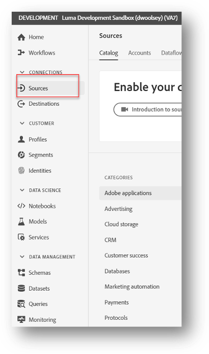

18. On the **Sources** main page you'll see all the options for one can bring data into Platform. Let's start with a basic example, Amazon S3. Click on the **Cloud Storage** option followed by clicking on the **Connect **Source text of the **Amazon** **S3 **tile**:**

    

>>>>>  gd2md-html alert: inline image link here (to images/image31.png). Store image on your image server and adjust path/filename/extension if necessary.  (<a href="#">Back to top</a>)(<a href="#gdcalert32">Next alert</a>) >>>>> 

19. This isn't a training on how to connect to an Amazon S3 account, but notice what you see across the top of the Amazon S3 account. It's a workflow similar to the one you just went through, including a mapping step:

    

>>>>>  gd2md-html alert: inline image link here (to images/image32.png). Store image on your image server and adjust path/filename/extension if necessary.  (<a href="#">Back to top</a>)(<a href="#gdcalert33">Next alert</a>) >>>>> 

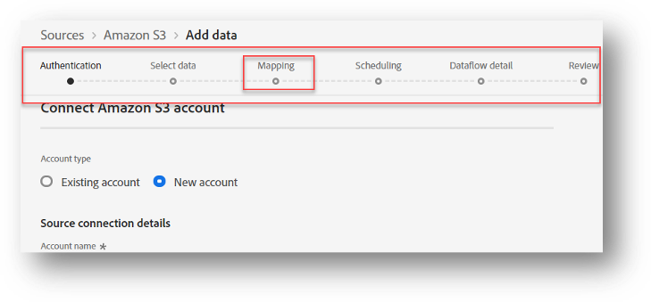

    So in a similar manner to the steps you just did, you would go through and determine which dataset to bring the data into, map fields, and then do whatever additional steps, like  (such as scheduling, in this case), to tell Platform when and how to connect to the S3 bucket and import the data. 

20. Click **Cancel** in the upper right corner to leave the setup wizard. 
21. Once back on the **Sources** page and **Catalog **tab, scroll through all the different options and ways of bringing in data into Platform. that They range from standard FTP to bringing in data from Adobe's solutions such as Analytics and Audience mManager, and even integrations with other data providers such as Oracle, Microsoft, and other popular databases. Each of these tiles have their own wizards and different ways of bringing in data. This will hopefully give you an idea of how Adobe Experience Platform is working to make data ingestions as easy as possible regardless of where client data is stored, and that we're not stuck with just standard CSV files. 
22. LastlyFinally, look across the page tabs of the **Sources** screen and you can also get a sense for how and where one would manage these different accounts with different data providers and how Platform would visualize these data flows:

    

>>>>>  gd2md-html alert: inline image link here (to images/image33.png). Store image on your image server and adjust path/filename/extension if necessary.  (<a href="#">Back to top</a>)(<a href="#gdcalert34">Next alert</a>) >>>>> 

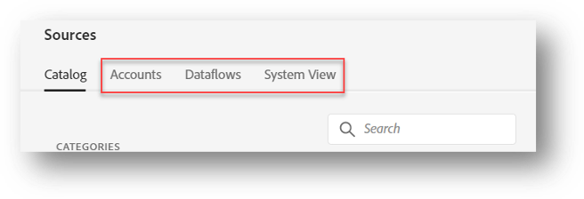

## View Profile in Real-time Customer Profile

Now that some data has been uploaded, albeit just one dataset, you're going to see in this section how the data looks in the Profiles UI.

1. Click onClick **Profiles** in the left trail followed by the **Browse** tab. On this page you can pick which identity namespace to use to look up a profile. Recall that the identity namespace is where you mapped which XDM schema fields could be used as a lookup. This is the first application of why those identity namespaces are important.
2. On this page you can pick which identity namespace to use to look up a profile. Recall that the identity namespace is where you mapped which XDM schema fields could be used as a lookup. This is the first application of why those identity namespaces are important. Since the only dataset you've updated is the CRM data, click the **Database icon** next to the **Identity namespace **field:

 

>>>>>  gd2md-html alert: inline image link here (to images/image34.png). Store image on your image server and adjust path/filename/extension if necessary.  (<a href="#">Back to top</a>)(<a href="#gdcalert35">Next alert</a>) >>>>> 

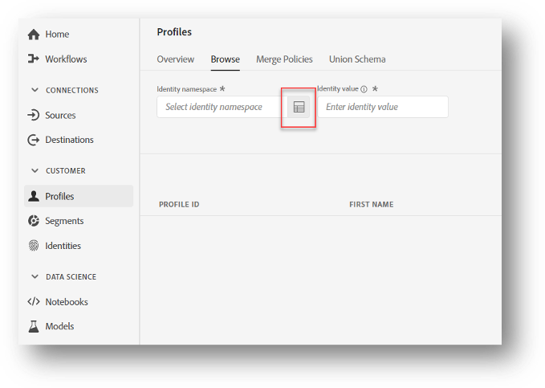
\

3. Select the Customer ID Namespace (**CRMID**) and click **Select.**
4. For the **Identity value** field, pick one of the CRM ID values from the CRM_DATA.csv which that you updated (you can even choose the one for your record) and click **Show Profile:**

    

>>>>>  gd2md-html alert: inline image link here (to images/image35.png). Store image on your image server and adjust path/filename/extension if necessary.  (<a href="#">Back to top</a>)(<a href="#gdcalert36">Next alert</a>) >>>>> 

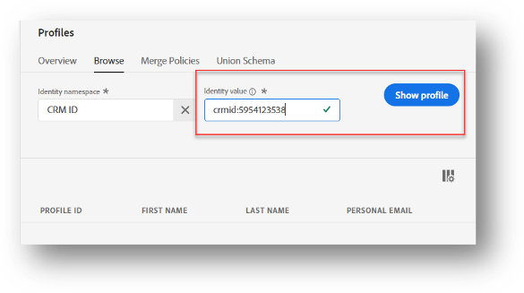

5. The results should bring up a single profile. Click onClick the Profile ID field:

    

>>>>>  gd2md-html alert: inline image link here (to images/image36.png). Store image on your image server and adjust path/filename/extension if necessary.  (<a href="#">Back to top</a>)(<a href="#gdcalert37">Next alert</a>) >>>>> 

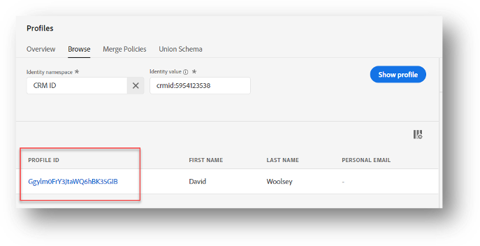

6. The resulting page should be the profile you looked up:

    

>>>>>  gd2md-html alert: inline image link here (to images/image37.png). Store image on your image server and adjust path/filename/extension if necessary.  (<a href="#">Back to top</a>)(<a href="#gdcalert38">Next alert</a>) >>>>> 

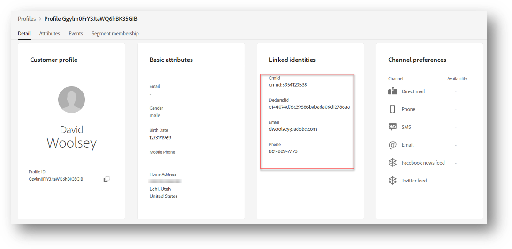

	

    One important call out is that the phone number, email, and declared ID are in the **Linked identities** tile because they are identity namespaces that can be used to link data together across data sets. Notice, though, the There’s a tradeoff, though—the  is that the email and phone number are not in the basic traits tile. Is that bad? Not necessarily. If one is going to use email and phone as identities, then there may might be some things like this view that may will seem like an error at first glance.

7. Click on the **Attributes** tab and notice the JSON that could be used in conjunction with potential API calls to both retrieve and update this data if needed.
8. Clicking on the **Events** and **Segment membership** tabs will result in no data, because we've only updated record-type data and we haven't built any segments. You'll see both in upcoming exercises. For now, you're ready to move on to the next section.

## Update Profile with Additional Data via Batch Ingestion 

Now that you've uploaded some batch data and browsed around the Profile file, it's time to upload the other two sample data sets and see how Profile stitches them together. 

### Loyalty Data via CSV File

1. Applying the steps you learned in the [Ingest Batch CRM Data](#ingest-batch-crm-data-9) section, start the process for onboarding the data from the modified **Loyalty_data.csv** file (with your additions) into the **Loyalty Data** dataset and stop at the mapping step before moving to the next step.
2. Once you're ready to map your fields, you'll notice that the emailId, phoneNbr, and declaredID fields don't have a matching source field:

    

>>>>>  gd2md-html alert: inline image link here (to images/image38.png). Store image on your image server and adjust path/filename/extension if necessary.  (<a href="#">Back to top</a>)(<a href="#gdcalert39">Next alert</a>) >>>>> 

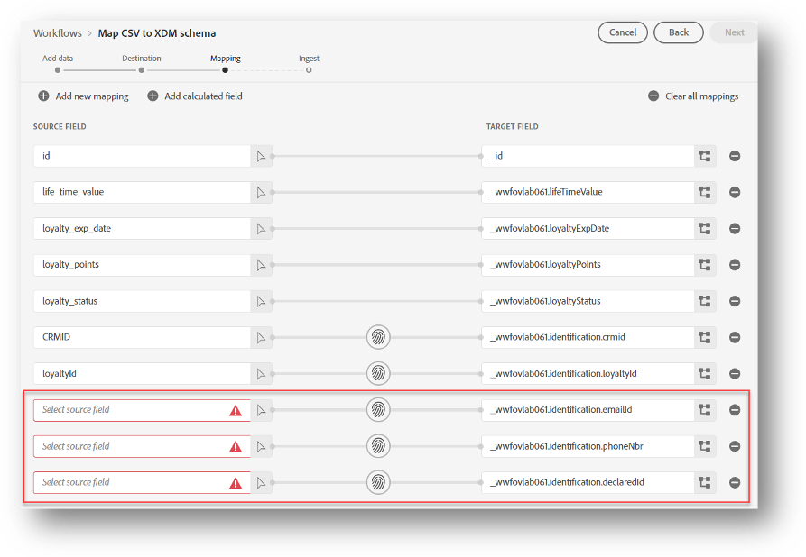

    Recall that in the XDM Schema for loyalty, that we re-used the identity mixin that had these additional fields and then labeled them as identity fields. That is why Platform is asking for the source. However, since the primary identity is loyaltyId, that is the only id ID that we must haveneed, **Delete** **the three unnecessary identity fields**. Your mapping should look like this:

    

>>>>>  gd2md-html alert: inline image link here (to images/image39.png). Store image on your image server and adjust path/filename/extension if necessary.  (<a href="#">Back to top</a>)(<a href="#gdcalert40">Next alert</a>) >>>>> 

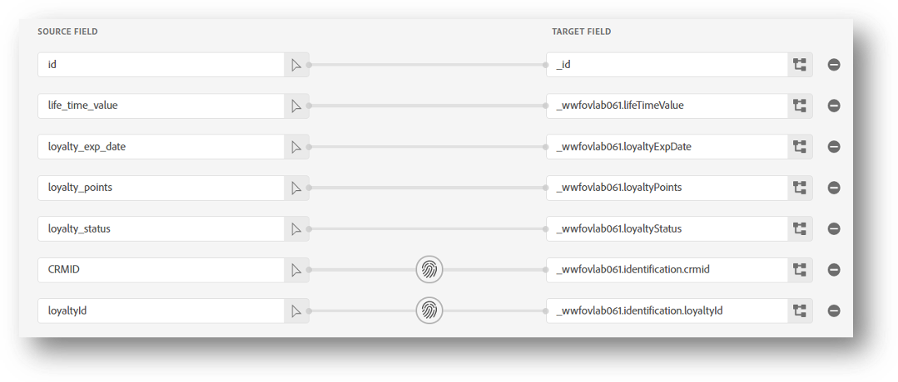

	Adjust any mappings that may not be correct then move to the next step.

3. Proceed through the rest of the data ingestion process and click **Finish** when done. The resulting ingestion log should look something like this:

    

>>>>>  gd2md-html alert: inline image link here (to images/image40.png). Store image on your image server and adjust path/filename/extension if necessary.  (<a href="#">Back to top</a>)(<a href="#gdcalert41">Next alert</a>) >>>>> 

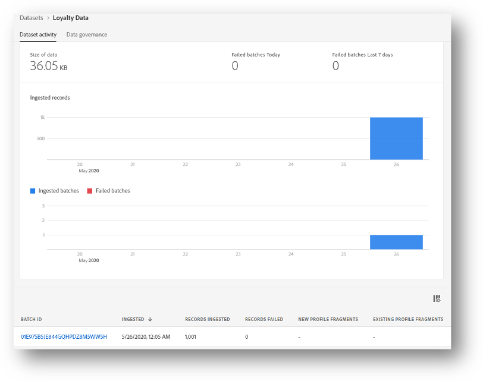

### Offline Purchase Data via JSON

For the CRM and Loyalty datasets, you onboarded a CSV file. For the last dataset, Offline Purchase data, you're going to use the UI to onboard a file, but you're going to use a file containing properly formatteding JSON. 

Recall that when you set up the Offline Purchase schema, you marked the purchaseEvent field as an array of Product list items, because there can be multiple products in a single purchase.   CSV files are great for record data but can might struggle be inefficient when it comes to uploading array-type data. As such, we will be using a JSON file.

1. Open the **offline_purchase_events.json **in a text editor and notice how the fields in the JSON (except for one that we'll adjust in a moment) look just like the structure of the Offline Purchase Schema. That's because when you onboard via JSON the data has to match the schema exactly as is, including data types (the same is true for data sent in via API, which you'll see in later exercises). 
2. With the **offline_purchase_events.json** file open, do **find and replace** in your text editor replacing all **ags999 **text with **wwfovlab###** where ### is the 3-digit id of the WWFO vLab Org that you were assigned.

        

>>>>>  gd2md-html alert: inline image link here (to images/image41.png). Store image on your image server and adjust path/filename/extension if necessary.  (<a href="#">Back to top</a>)(<a href="#gdcalert42">Next alert</a>) >>>>> 

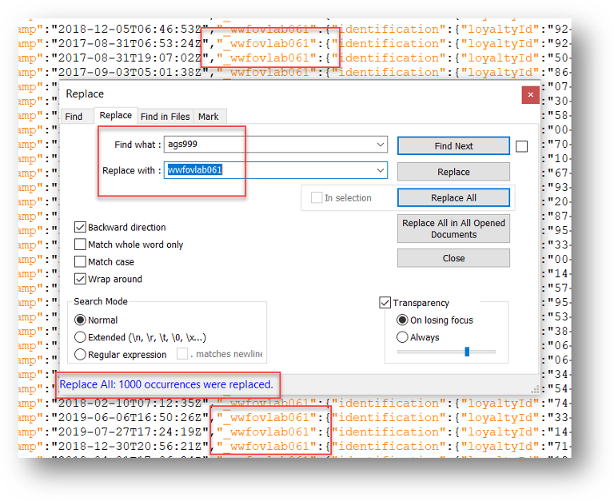

        **Note: **There are 1,000 records in this file and there is only 1 replacement per file, so you should have exactly 1,000 occurrences replaced. \

3. Because this is perfectly formatted JSON with no fields to map, you don't need to run a workflow like you did for the other two datasets. Instead, return to the **Datasets** page in your Platform sandbox and click into your **Offline Purchase Data **dataset. 
4. In the right pane, drag and drop your updated **offline_purchase_events.json **file into the **file upload** area:

        

>>>>>  gd2md-html alert: inline image link here (to images/image42.png). Store image on your image server and adjust path/filename/extension if necessary.  (<a href="#">Back to top</a>)(<a href="#gdcalert43">Next alert</a>) >>>>> 

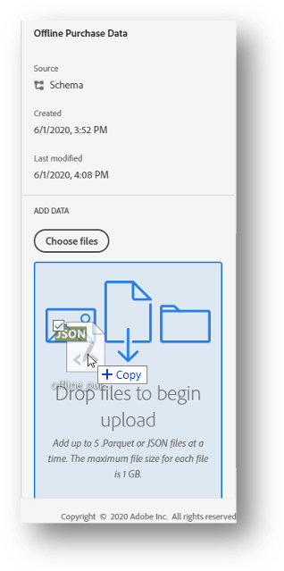

5. After the file uploads, you'll see the center screen indicate that it is processing the upload (you'll see the status column change a few times, from loading, to processing):

    

>>>>>  gd2md-html alert: inline image link here (to images/image43.png). Store image on your image server and adjust path/filename/extension if necessary.  (<a href="#">Back to top</a>)(<a href="#gdcalert44">Next alert</a>) >>>>> 

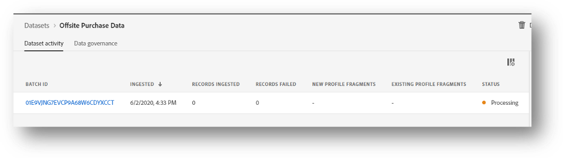

6. After a few moments, click onclick **Monitoring** in the left rail and, like the other uploads, you'll see the data progress through the stages of onboarding. 

    

>>>>>  gd2md-html alert: inline image link here (to images/image44.png). Store image on your image server and adjust path/filename/extension if necessary.  (<a href="#">Back to top</a>)(<a href="#gdcalert45">Next alert</a>) >>>>> 

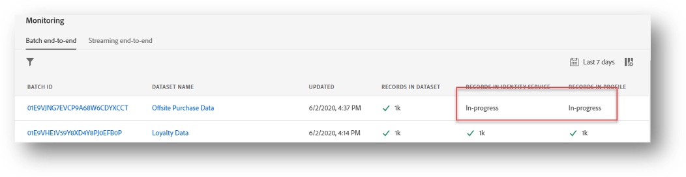

7. Once you see that all the records have been onboarded into Profile, you're ready to move on to the last section.

    

>>>>>  gd2md-html alert: inline image link here (to images/image45.png). Store image on your image server and adjust path/filename/extension if necessary.  (<a href="#">Back to top</a>)(<a href="#gdcalert46">Next alert</a>) >>>>> 

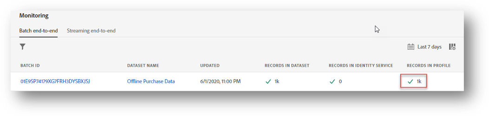

### Updated Event dData in Profile

1. Now it's time to see how these updates affected Profile data. Click onClick **Profiles** to return to the Profiles UI.
2. Because we now have a different identity namespace we can use, set the **Identity **namespace field to the **Loyalty ID **identity name space and the **Identity **value field to the **loyaltyId** of one of the loyalty IDs from the file that you just ingested (or put in your loyalty ID). When ready, click **Show profile**. 
3. Click into the only result you should have and notice how the Loyalty Id is now populated since the data is now linked via Profile:

    

>>>>>  gd2md-html alert: inline image link here (to images/image46.png). Store image on your image server and adjust path/filename/extension if necessary.  (<a href="#">Back to top</a>)(<a href="#gdcalert47">Next alert</a>) >>>>> 

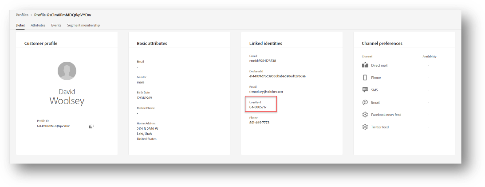

4. Click onClick the **Attributes** tab and scroll through the JSON to find that the loyalty information is now added to the JSON:

    

>>>>>  gd2md-html alert: inline image link here (to images/image47.png). Store image on your image server and adjust path/filename/extension if necessary.  (<a href="#">Back to top</a>)(<a href="#gdcalert48">Next alert</a>) >>>>> 

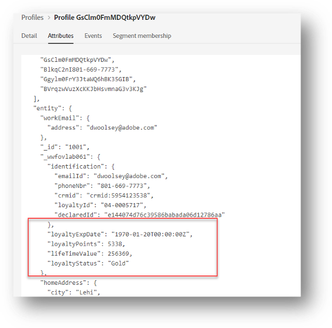

5. Open the **offsite_purchase_events.json** file again and use one of the loyalty IDids in that file to look up a profile:

    

>>>>>  gd2md-html alert: inline image link here (to images/image48.png). Store image on your image server and adjust path/filename/extension if necessary.  (<a href="#">Back to top</a>)(<a href="#gdcalert49">Next alert</a>) >>>>> 

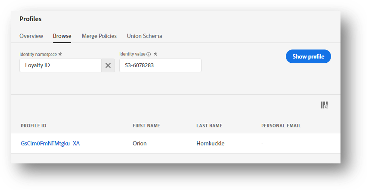

6. In the Profile window, click onclick the **Events** tab. This will give us all the events associated to the given profile. and sSince the offline purchases you onboarded are events that could have happened multiple times, you should have one or more events:

    

>>>>>  gd2md-html alert: inline image link here (to images/image49.png). Store image on your image server and adjust path/filename/extension if necessary.  (<a href="#">Back to top</a>)(<a href="#gdcalert50">Next alert</a>) >>>>> 

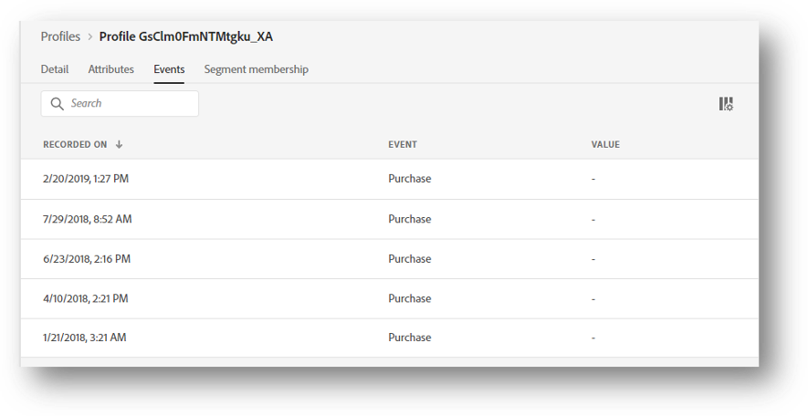

7. Assuming you can see the offline purchase events, you've finished this exercise! 

**	**

**Original Exercise Creators:**

Praveen Sharma and David Woolsey

**Exercise Contributors**:

Shruti Jagtap and Danny Miller

**Change Log**

<table>
  <tr>
   <td>Ver.
   </td>
   <td>Issue Reporter
   </td>
   <td>Changes
   </td>
   <td>Date
   </td>
  </tr>
  <tr>
   <td>1.0
   </td>
   <td>
   </td>
   <td>Original Launch
   </td>
   <td>6/8/2020
   </td>
  </tr>
</table>

