
>>>>>  gd2md-html alert:  ERRORs: 0; WARNINGs: 0; ALERTS: 21.

<ul style="color: red; font-weight: bold"><li>See top comment block for details on ERRORs and WARNINGs. <li>In the converted Markdown or HTML, search for inline alerts that start with >>>>>  gd2md-html alert:  for specific instances that need correction.</ul>

Links to alert messages:
<a href="#gdcalert1">alert1</a>
<a href="#gdcalert2">alert2</a>
<a href="#gdcalert3">alert3</a>
<a href="#gdcalert4">alert4</a>
<a href="#gdcalert5">alert5</a>
<a href="#gdcalert6">alert6</a>
<a href="#gdcalert7">alert7</a>
<a href="#gdcalert8">alert8</a>
<a href="#gdcalert9">alert9</a>
<a href="#gdcalert10">alert10</a>
<a href="#gdcalert11">alert11</a>
<a href="#gdcalert12">alert12</a>
<a href="#gdcalert13">alert13</a>
<a href="#gdcalert14">alert14</a>
<a href="#gdcalert15">alert15</a>
<a href="#gdcalert16">alert16</a>
<a href="#gdcalert17">alert17</a>
<a href="#gdcalert18">alert18</a>
<a href="#gdcalert19">alert19</a>
<a href="#gdcalert20">alert20</a>
<a href="#gdcalert21">alert21</a>

>>>>> PLEASE check and correct alert issues and delete this message and the inline alerts.

AEP: Hands-on Technical Exercises: Real-Time Server-to-Server Data Ingestion

V 1.0

[TOC]

## Overview

In this exercise, we are going to setup the scenario where a customer comes to a live event, provide their phone number, which the loyalty system translated into a loyalty id), and then this offline purchase event data is sent to the Platform with Loyalty id as the primary key. This would be a server to server integration with the backend loyalty system and the Platform, using the APIs. 

We will mimic this scenario using Postman, to send the API request to Platform after following the step-by-step instructions below. 

## Create Streaming Ingestion Inlet

In this section, we will create a new Streaming Ingestion Connection in the Experience Platform. A streaming connection is required to start streaming data into AEP from client or server side. 

Please follow the steps below to create a Streaming Connection.

 

1. Log into https://platform.adobe.com with your adobe ID and ensure that you are in your assigned Experience Cloud org and in the sandbox you've created.

     

2. Click on **Sources **in the left rail then select **Streaming **as the category.

     

3. Click on **Connect **Source text of the **HTTP API **tile (the only option you should have):

    

>>>>>  gd2md-html alert: inline image link here (to images/image1.png). Store image on your image server and adjust path/filename/extension if necessary.  (<a href="#">Back to top</a>)(<a href="#gdcalert2">Next alert</a>) >>>>> 

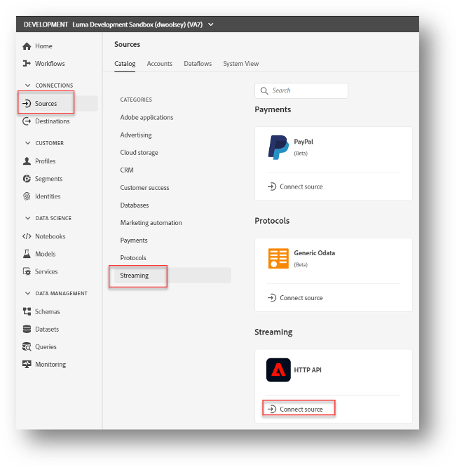

4. Ensure that the **New Account** radio button is selected**.**

     

5. Provide a name and description (example: **Luma Offline Purchase Streaming**)._ _A completed configuration should look like this:_ _

    

>>>>>  gd2md-html alert: inline image link here (to images/image2.png). Store image on your image server and adjust path/filename/extension if necessary.  (<a href="#">Back to top</a>)(<a href="#gdcalert3">Next alert</a>) >>>>> 

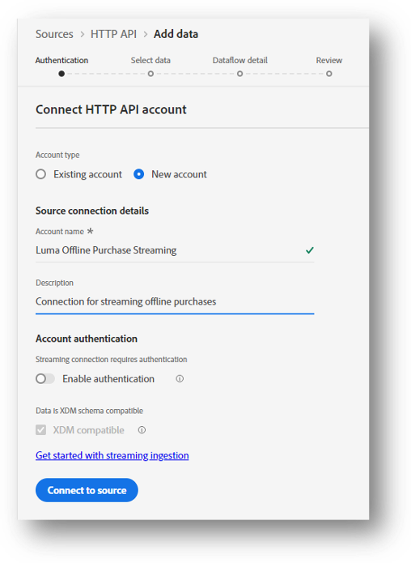

6. **Note:** In the **Account authentication **section, you should leave the **Enable Authentication **option as disabled because we are not streaming any PII data in the offline purchase streaming.
7. In the scenario where your data contains PII, you would want to enable authentication so that data from only trusted sources is ingested.

     

8. Click the **Connect to source **after a moment, you should see that it is connected:

    

>>>>>  gd2md-html alert: inline image link here (to images/image3.png). Store image on your image server and adjust path/filename/extension if necessary.  (<a href="#">Back to top</a>)(<a href="#gdcalert4">Next alert</a>) >>>>> 

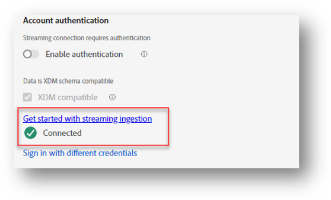

9. Proceed to click the **Next **button. 
10. On the next screen, we will create a new **Dataset **and select the **Schema. **Select the **New dataset **option and provide the name and description as **Luma Offline Purchase Streaming Dataset_._**

     

11. In the **Schema **dropdown, select **Offline Purchase Schema. **A completed configuration will look like this:

    

>>>>>  gd2md-html alert: inline image link here (to images/image4.png). Store image on your image server and adjust path/filename/extension if necessary.  (<a href="#">Back to top</a>)(<a href="#gdcalert5">Next alert</a>) >>>>> 

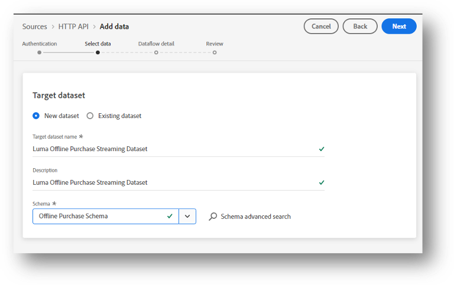

12. Click **Next **and on the resulting screen, provide a **Dataflow Name **and **Description.** You may want to add a meaningful ex:** Streaming dataflow for Offline Purchase Dataset **

    

>>>>>  gd2md-html alert: inline image link here (to images/image5.png). Store image on your image server and adjust path/filename/extension if necessary.  (<a href="#">Back to top</a>)(<a href="#gdcalert6">Next alert</a>) >>>>> 

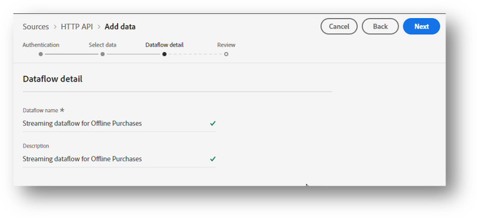

13. Click **Next **to proceed and on the resulting screen, In the next screen you should see the Connection and Dataset created for the connection. 

    

>>>>>  gd2md-html alert: inline image link here (to images/image6.png). Store image on your image server and adjust path/filename/extension if necessary.  (<a href="#">Back to top</a>)(<a href="#gdcalert7">Next alert</a>) >>>>> 

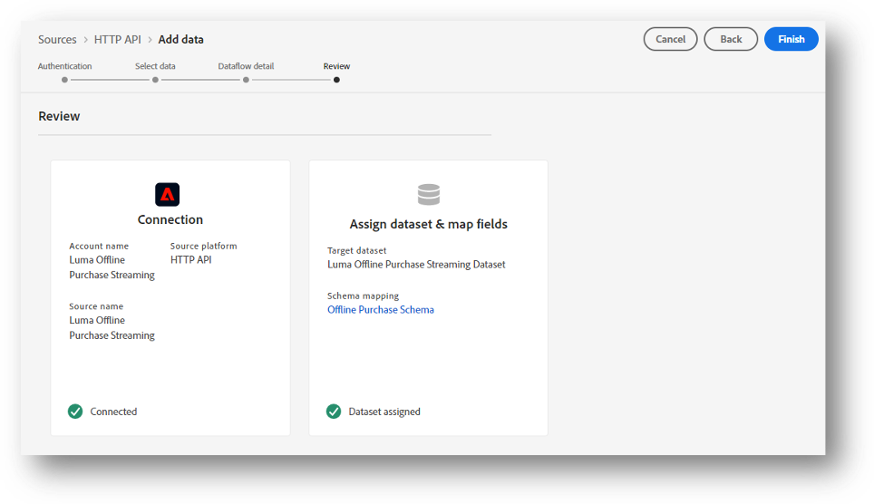

14. Click **Finish**, and you will see the Connection. Copy the value of the **Luma Offline Purchase Streaming ID **and **Streaming Endpoint **(only the ID part coming after the URL [https://dcs.adobedc.net/collection/](https://dcs.adobedc.net/collection/)) from the screen below as you will need it to configure the Postman environment in next section of this exercise. 

    

>>>>>  gd2md-html alert: inline image link here (to images/image7.png). Store image on your image server and adjust path/filename/extension if necessary.  (<a href="#">Back to top</a>)(<a href="#gdcalert8">Next alert</a>) >>>>> 

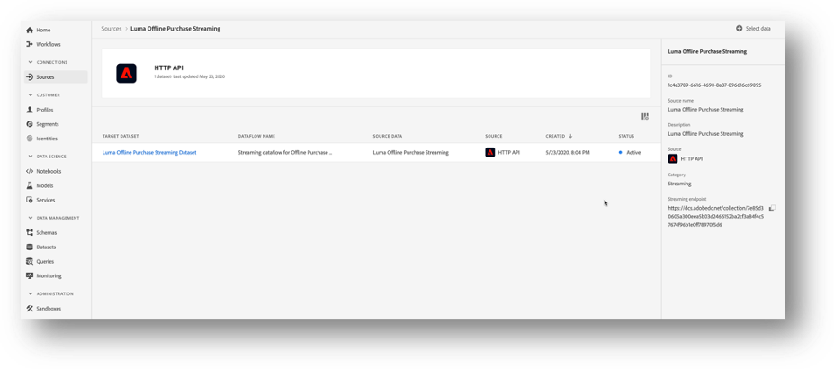

     

15. Your Dataset must be enabled for **Unified Profile. **In order to do so, go to **Datasets** and click on the **Luma Offline Purchase Dataset. **Enable the **Profile** toggle switch: 

>>>>>  gd2md-html alert: inline image link here (to images/image8.png). Store image on your image server and adjust path/filename/extension if necessary.  (<a href="#">Back to top</a>)(<a href="#gdcalert9">Next alert</a>) >>>>> 

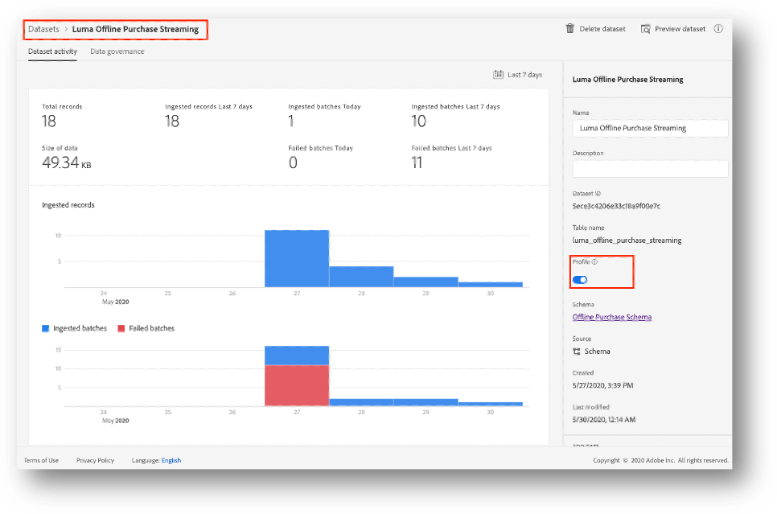

    **Note: **You could also select an existing dataset as well for the same schema. 

## Authenticate & Access AEP APIs using adobe.io

Now that we have setup the Streaming Inlet and Dataflow in the Platform, we will now configure access to the Adobe Experience Platform account to be able to stream data to the Streaming Inlet Connection configured in the previous steps.

Any request to Adobe I/O APIs needs to be authenticated and authorized first. This is required to maintain the security of the applications as well as data. There are different standards available for authentication and authorization, example OAuth, JSON Web Tokens (JWT). 

In this section of the document, we will cover the steps to configure authentication through creation of an access token. 

As a prework to these exercises, you already have your own sandbox on your Platform instance, with administrative access. In order to generate the access credentials, please follow the following steps:

 

1. Login to Adobe Developer Console: console.adobe.io. Make sure you select you DMA Instance from the top right dropdown. 
2. Click the **Create new project **button. On the next screen, click **Add API. **
3. In the next screen, select **Adobe Experience Platform **solution, and then select **Experience Platform API **box, as shows in the screenshot below. Then click **Next. **

    

>>>>>  gd2md-html alert: inline image link here (to images/image9.png). Store image on your image server and adjust path/filename/extension if necessary.  (<a href="#">Back to top</a>)(<a href="#gdcalert10">Next alert</a>) >>>>> 

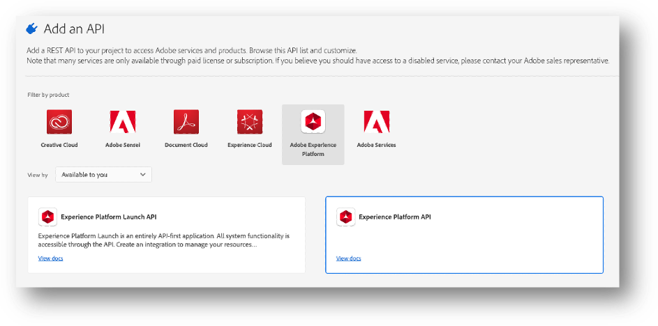

4. In the next screen, we need to create a new JWT Service Account. A service account integration lets your application call Adobe services on its own behalf, or on the behalf of an enterprise organization. For this type of integration, you’ll create a JSON Web Token (JWT) that includes your credentials. You’ll begin each session by exchanging the JWT for an access token.
5. In order to do this, you need to generate a Public/Private key pair and upload the same. There are 2 ways to do this: 
*   Generate the Public/Private key using **Option 1** available in the current screen
*   Generate the key on your own, following the documentation available [here](https://www.adobe.io/authentication/auth-methods.html#!AdobeDocs/adobeio-auth/master/JWT/JWTCertificate.md), and then upload the key (**Option 2** on the screen). 
6. For this exercise, we will use **Option 1**, and click **Generate Keypair **as highlighted in the screenshot below: 

    

>>>>>  gd2md-html alert: inline image link here (to images/image10.png). Store image on your image server and adjust path/filename/extension if necessary.  (<a href="#">Back to top</a>)(<a href="#gdcalert11">Next alert</a>) >>>>> 

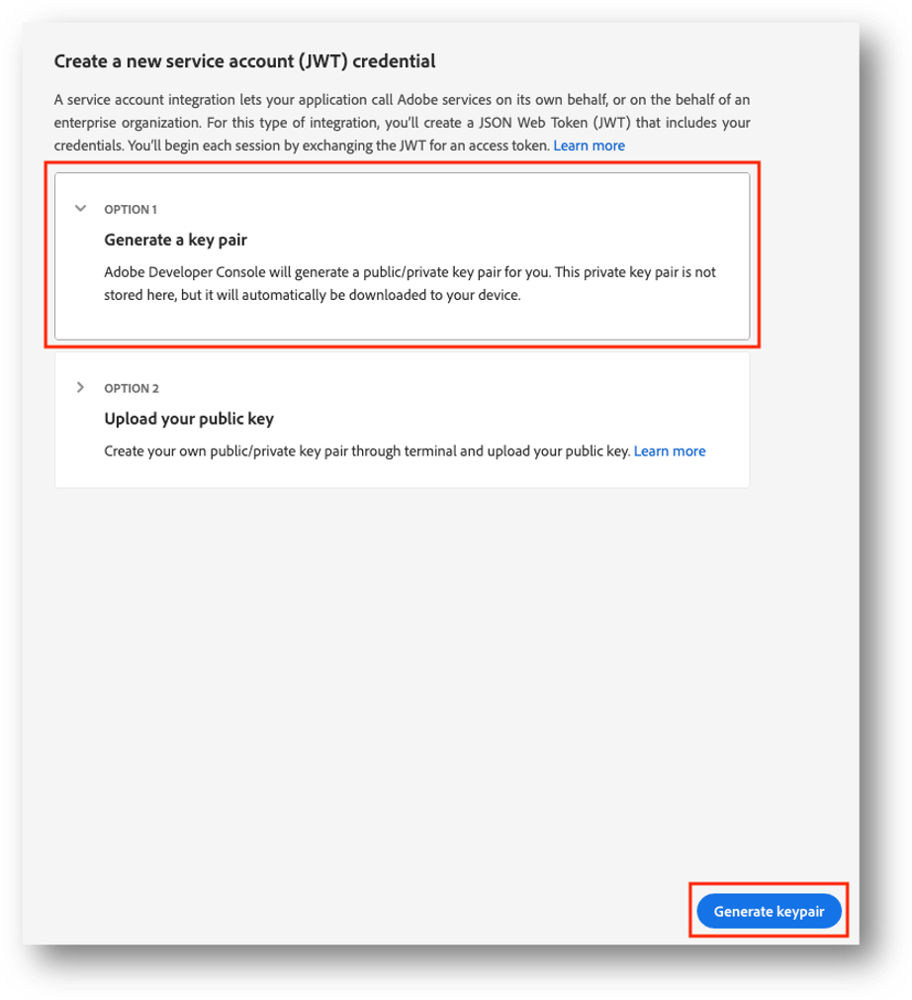

    **Note:** You may be wondering in the ACS integration exercise, you didn’t use the key that Adobe I/O gives you and instead created your own key using OpenSSL, but used it in this integration. The reason is that the Private key generated by Adobe I/O can be used as-is in Postman for AEP API Integration, and there is no need to convert it into a p12 keystore. So in this is not just easier to use the key which Adobe I/O provides you – it automatically uploads the Public key, and downloads both Public and the Private key which you can then use in Postman. 

7. Once you click **Generate Keypair**, it will create a public/private key pair, download it to your machine (config.zip in your default downloads folder), and automatically upload the public key. See the screenshot below for details. 

    

>>>>>  gd2md-html alert: inline image link here (to images/image11.png). Store image on your image server and adjust path/filename/extension if necessary.  (<a href="#">Back to top</a>)(<a href="#gdcalert12">Next alert</a>) >>>>> 

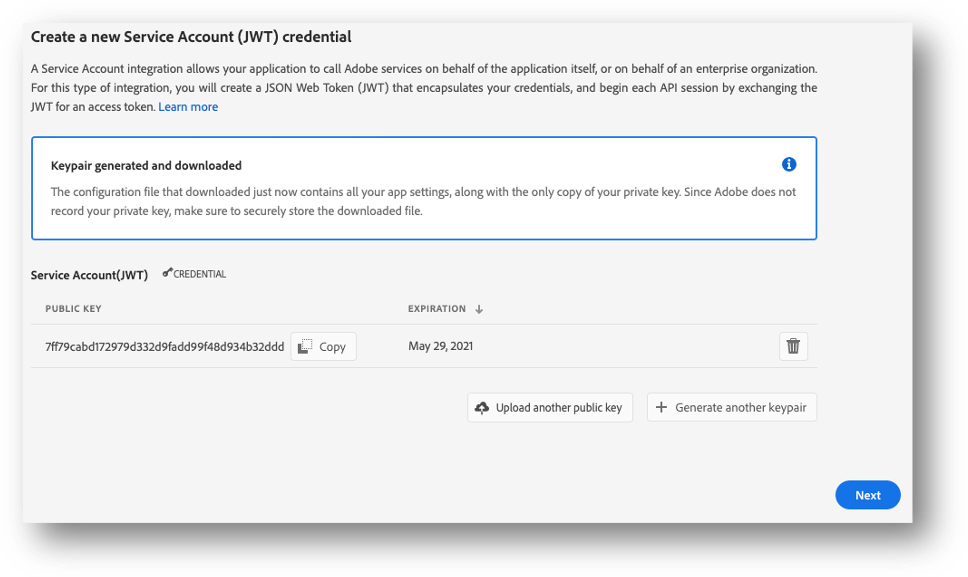

8. Extract and save the Public/Private key downloaded (config.zip) on your machine. As a good practice, you may want to rename the folders appropriately where you have keys created for a specific purpose. Example, you could rename the extracted folder as **DMA BootCamp 2020 AEP API Keys. **You will require the private key in the Postman Environment configuration (next section).  
9. Click Next to continue. 
10. In the next screen, please select your Sandbox environment which you created for yourself.  Once selected, please click the button **Save Configured API. **It will take a few seconds to create the integration, and generate the Client Id, Client Secret, and other details.

    

>>>>>  gd2md-html alert: inline image link here (to images/image12.png). Store image on your image server and adjust path/filename/extension if necessary.  (<a href="#">Back to top</a>)(<a href="#gdcalert13">Next alert</a>) >>>>> 

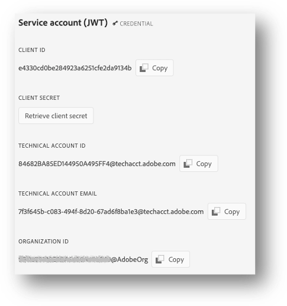

11. These details (Client ID, Organization ID, Client Secret etc.) will be required in the next section to configure Postman, keep these handy.  
12. **IMPORTANT: **Once the integration project is created, rename the project and add your ldap id to differentiate it with the rest of your group. To do so, click **Project overview -> Edit Project **
13. Add a meaningful name to the project followed by your ldap, example **_ldap_ AEP API Integration, **and click the **Save button. **

    

>>>>>  gd2md-html alert: inline image link here (to images/image13.png). Store image on your image server and adjust path/filename/extension if necessary.  (<a href="#">Back to top</a>)(<a href="#gdcalert14">Next alert</a>) >>>>> 

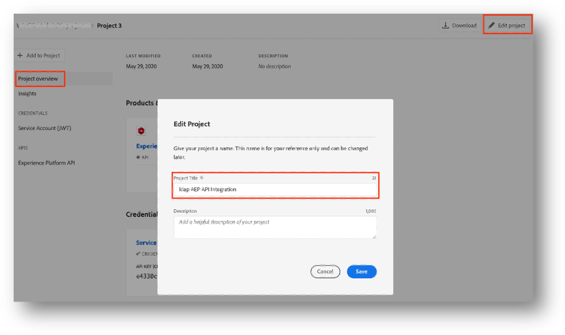

## Configuring Postman

For the purpose of ease, we have already created a Postman environment configuration JSON file for you, which you could directly import into Postman, and configure the Client ID, IMS Org, Client Secret and other values.

Follow these steps to setup Postman. 

1. You should have Postman installed from your previous sessions. If it’s not, you can install from the official [website](https://www.getpostman.com/)
2. Download the following files from the [Sharepoint Location](https://adobe.sharepoint.com/sites/FieldEnablement/GlobalPrograms/DmaAcademy/Shared%20Documents/Forms/AllItems.aspx?csf=1&web=1&e=3FfmHo&FolderCTID=0x012000047B93BBDC9E7744A9B8F08A51209513&viewid=c20c9b30%2Db9ee%2D4276%2D8954%2Dab9866722c94&id=%2Fsites%2FFieldEnablement%2FGlobalPrograms%2FDmaAcademy%2FShared%20Documents%2F2020%2FTechnical%20Track%2FDesktop%2F5%20AEP%2F5%20Real%2Dtime%20S2S%20Data%20Ingestion%2FPostman%20Collections) and save it on your system. 

     

<table>
  <tr>
   <td>
    File Name
   </td>
   <td>
    Description
   </td>
  </tr>
  <tr>
   <td>
    00. AEP_agsxxx.postman_environment.json
   </td>
   <td>
    Postman Environment Template
   </td>
  </tr>
  <tr>
   <td>
    01. Authentication.postman_collection.json
   </td>
   <td>
    Collection to generate access token
   </td>
  </tr>
  <tr>
   <td>
    02. Test Connection.postman_collection.json
   </td>
   <td>
    Collection to Test Authentication and Integration
   </td>
  </tr>
  <tr>
   <td>
    03. Luma Streaming Purchase Data.postman_collection.json
   </td>
   <td>
    Collection to Stream offline purchase data  
   </td>
  </tr>
</table>

     

3. Next step is to import these files in Postman. Launch Postman, click **Import** > **Upload Files **and select all these 3 files downloaded in previous step. After selecting the files, click **Import. **You will have the following 3 collections, and Environment Template added to Postman.

    

>>>>>  gd2md-html alert: inline image link here (to images/image14.png). Store image on your image server and adjust path/filename/extension if necessary.  (<a href="#">Back to top</a>)(<a href="#gdcalert15">Next alert</a>) >>>>> 

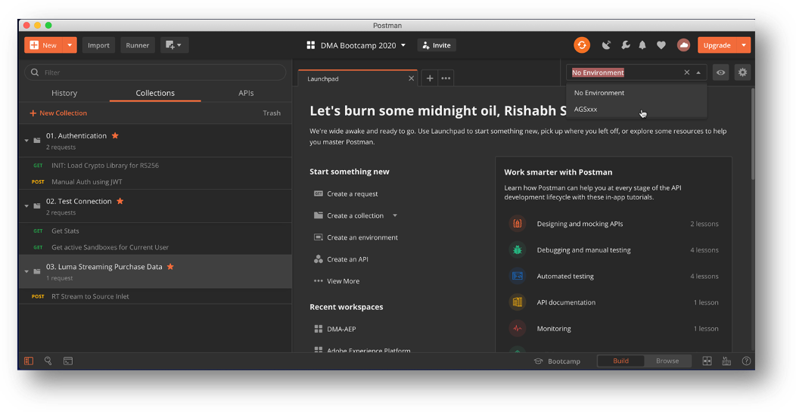

4. Select the Environment AGSxxx and click the Gear icon. Then click on AGSxxx link to open the environment variables screen. Here you need to update the values from the Adobe I/O Integration created in the previous step. 

    Follow the details provided in the table below to update the environment variables. Please update the **Current Value** field in Postman. 

<table>
  <tr>
   <td>
    Environment Variable
   </td>
   <td>
    Value to be updated – (Current Value)
   </td>
  </tr>
  <tr>
   <td>
    ims_host
   </td>
   <td>
    Pre-configured as ims-na1.adobelogin.com. No change is required. 
   </td>
  </tr>
  <tr>
   <td>
    io_host
   </td>
   <td>
    Pre-configured as platform.adobe.io. No change is required. 
   </td>
  </tr>
  <tr>
   <td>
    meta_scopes
   </td>
   <td>
Pre-configured as ent_dataservices_sdk. No change is required. 
   </td>
  </tr>
  <tr>
   <td>
    client_id
   </td>
   <td>
    Use the <strong>CLIENT ID </strong>value from the Service Integration created in previous step.
   </td>
  </tr>
  <tr>
   <td>
    client_secret
   </td>
   <td>
    Use the <strong>CLIENT SECRET </strong>value from the Service Integration created in previous step.
   </td>
  </tr>
  <tr>
   <td>
    org_id
   </td>
   <td>
    Use the <strong>ORGANIZATION ID </strong>value from the Service Integration created in previous step.
   </td>
  </tr>
  <tr>
   <td>
    tech_id
   </td>
   <td>
    Use the <strong>TECHNICAL ACCOUNT ID </strong>value from the Service Integration created in previous step. 
   </td>
  </tr>
  <tr>
   <td>
    pkey
   </td>
   <td>
    Open the <strong>private.key </strong>file (extracted form config.zip downloaded from the previous step) in a text editor, and copy the entire content and paste in this variable Initial value. 
   </td>
  </tr>
  <tr>
   <td>
    jwt_token
   </td>
   <td>
    Leave it blank. This will be populated in the next step. 
   </td>
  </tr>
  <tr>
   <td>
    access_token
   </td>
   <td>
    Leave it blank. This will be populated in the next step.
   </td>
  </tr>
  <tr>
   <td>
    ldap
   </td>
   <td>
    Provide your LDAP id in this field (ex. rishabsh)
   </td>
  </tr>
  <tr>
   <td>
    schema_namespace_id
   </td>
   <td>
    Use your instance id in field (example agsxxx)
   </td>
  </tr>
  <tr>
   <td>
    sandbox_name
   </td>
   <td>
    Provide your sandbox name in this field. You can get this value from Platform -> Sandboxes -> Browse -> Select your sandbox and copy the name from the right panel. 

    

>>>>>  gd2md-html alert: inline image link here (to images/image15.png). Store image on your image server and adjust path/filename/extension if necessary.  (<a href="#">Back to top</a>)(<a href="#gdcalert16">Next alert</a>) >>>>> 

   </td>
  </tr>
  <tr>
   <td>
    streaming_endpoint_id
   </td>
   <td>
    Use the value of the Streaming Endpoint ID (from the Streaming endpoint URL) created in the earlier section: Create Streaming Ingestion Inlet. 
   </td>
  </tr>
  <tr>
   <td>
    inlet_source_id
   </td>
   <td>
    Use the value of the <strong>Luma Offline Purchase Streaming ID </strong>created in the earlier section: Create Streaming Ingestion Inlet.
   </td>
  </tr>
  <tr>
   <td>
    schema_id
   </td>
   <td>
    Use the id of the <strong>Offline Purchase Schema</strong> created during the XDM Schema exercise.

    The easiest way to get the id is to browse the specific object, and get the ID via the URL. 
   </td>
  </tr>
  <tr>
   <td>
    dataset_id
   </td>
   <td>
    Use the value of the <strong>Luma Offline Purchase Streaming Dataset</strong> created in the earlier section: Create Streaming Ingestion Inlet.

    You could either get this value from browsing the Dataset in Platform, or execute the Get Stats request in the next section, which returns ids of all schemas and objects available in the sandbox.
   </td>
  </tr>
</table>

After updating the environment variables, click the **Update **button.

 

5. Now let’s test the APIs. In Postman, click on the collection **01. Authentication**, and select the request **Init: Load Crypto Library for RS256**. The preconfigured call with appear. Click **Send**.

    This will load the JavaScript Crypto Library and store it in a global variable **jsrsasign-rs **for future use. When you shut down Postman and start it up again, the script does not have to be run again, as this global variable will persist the value.

6. Executing JWT authentication. With the Crypto JavaScript Library in place, you can now execute the JWT authentication flow. Make sure your environment is selected in the top right of the screen.

    Click on **Auth using JWT **request in the collection **01. Authentication**. This will generate the authentication code using the Crypto Library and call the Adobe Identity Server (IMS) to authenticate. A bearer token will be generated along with JWT, and stored in the environment variables {{access_token}} and {{jwt_token}} respectively.

    The API will have a response similar to:

    

>>>>>  gd2md-html alert: inline image link here (to images/image16.png). Store image on your image server and adjust path/filename/extension if necessary.  (<a href="#">Back to top</a>)(<a href="#gdcalert17">Next alert</a>) >>>>> 

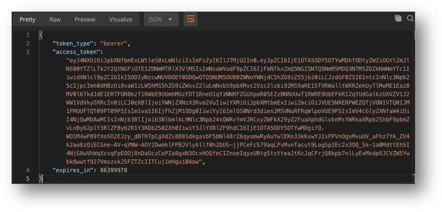

     

7. In order the test the connection, click on the collection **02. Test Connection** and select the **Get Stats **request. Click **Send. **You should see a response containing list of recently created and updated Schemas, Mixins, Classes for your sandbox. If you do not see a response, please ensure that all environment variables are set correctly, and you have a Json Web Token and Access Token configured in the Postman after the authentication step.

## Send Offline Purchase with Postman

In this section we will use Postman to simulate the scenario of offline purchase data getting streamed to Platform, and real-time update of the Profile. As and when there is an offline event, that data could be streamed to Platform to update the user profile. 

As a pre-requisite, please ensure that all the environment variables are configured and verified. 

Open Postman, and click the collection **03. Luma Streaming Purchase Data**, and click on the request **RT Stream to Source Inlet. **Click the **Body **of this request. 

Before you click **Send, **please ensure the following: 

1. Update the **loyaltyId** value in the JSON to something which you have sent to Platform already. Refer the CSV files for Purchase schema and use one of the Loyalty IDs available in that file. Also update the **timestamp** value in the body. 

    Also, before sending subsequent data, please ensure that the xdmEntity:_id is unique. You may want to change update the _id value before each request. In the real world scenario, this will represent a transaction or an event and will be always unique.

    Please see the screenshot below: 

    

>>>>>  gd2md-html alert: inline image link here (to images/image17.png). Store image on your image server and adjust path/filename/extension if necessary.  (<a href="#">Back to top</a>)(<a href="#gdcalert18">Next alert</a>) >>>>> 

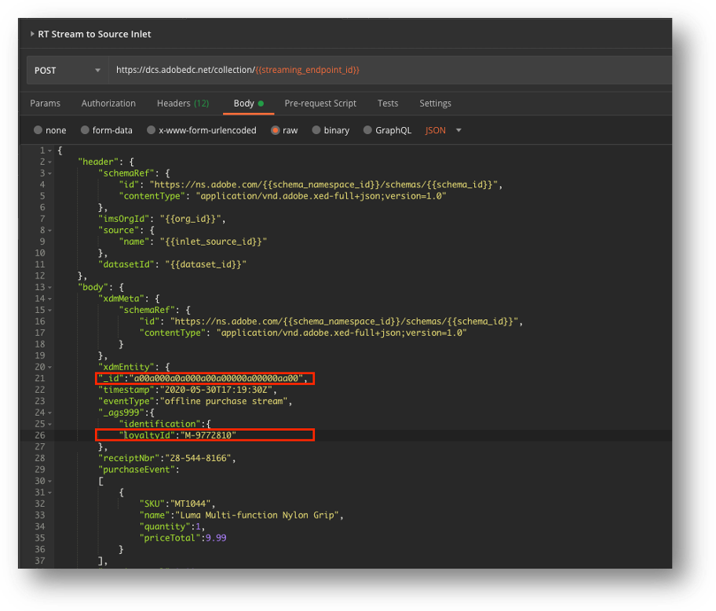

    **Pro Tip: **You could also add a pre-request script to generate a random number, and populate an environment variable for _ id. This will allow you to send repeated requests without changing the _id everytime. ** **

2. Click **Send**, and you should see a successful response like: 

    	

>>>>>  gd2md-html alert: inline image link here (to images/image18.png). Store image on your image server and adjust path/filename/extension if necessary.  (<a href="#">Back to top</a>)(<a href="#gdcalert19">Next alert</a>) >>>>> 

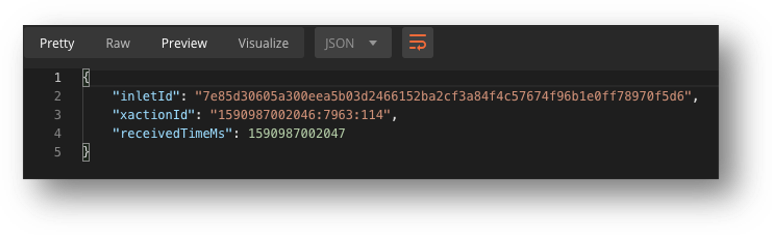

3. In the next step we will verify if this data got updated in the profile. Launch Platform and click **Profiles**.

## View updated record in Unified Profile

1. In the Identity Namespace, select Loyalty Id value. In the Identity Value property, type the **Loyalty ID** value which you used in the Postman request**. **Then click **Show profile **and click on the Profile ID: 

    

>>>>>  gd2md-html alert: inline image link here (to images/image19.png). Store image on your image server and adjust path/filename/extension if necessary.  (<a href="#">Back to top</a>)(<a href="#gdcalert20">Next alert</a>) >>>>> 

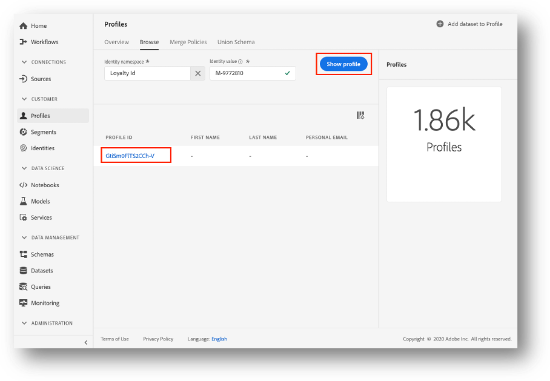

    Note: if you do not get a profile ID after clicking **Show profile**, try using another Loyalty Id in the postman request to stream data. 

2. In the next screen, click **Events** tab. This will list down all the events for which the profile was updated. Select the event from the list which matches the timestamp and click **View JSON.**

    ** **

    

>>>>>  gd2md-html alert: inline image link here (to images/image20.png). Store image on your image server and adjust path/filename/extension if necessary.  (<a href="#">Back to top</a>)(<a href="#gdcalert21">Next alert</a>) >>>>> 

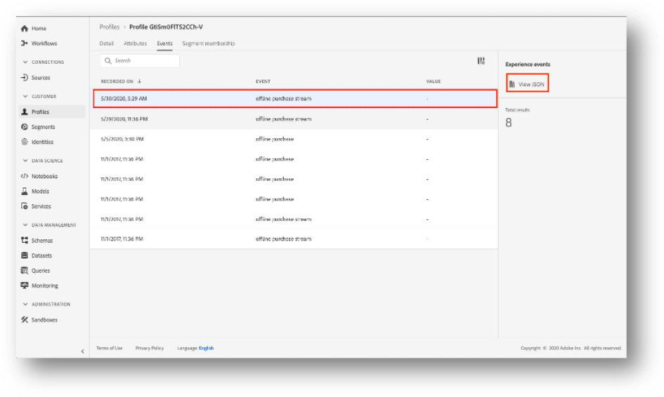

3. You will see the data which you posted through Postman. You could match it with the _id, timestamp and details of the purchase (purchaseEvent[]). It might take few seconds for the profile to be updated. 

    

>>>>>  gd2md-html alert: inline image link here (to images/image21.png). Store image on your image server and adjust path/filename/extension if necessary.  (<a href="#">Back to top</a>)(<a href="#gdcalert22">Next alert</a>) >>>>> 

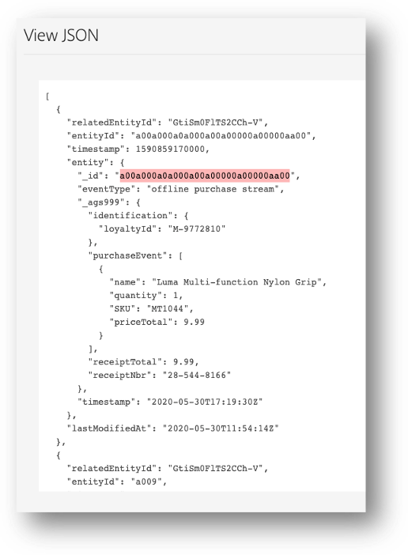

	

Click **Close. ** 

    **Troubleshooting: **If you do not see your data in the profile, you may want to review the status of the batch you submitted. In Platform, go to **Datasets, **select **Luma Offline Purchase Streaming **dataset, and find your batch. You can click your batch to see if it failed, and what was the reason for failure. You could also preview the data you sent in the batch by clicking the **Preview Dataset **button on top. Typical reasons for failures are wrong format of data not according to the schema, mismatch in field values, example wrong timestamp format, etc. 

    Alternatively, you could also go to **Monitoring -> Streaming end-to-end**, and check the status of your batch. Please note that it could take ~15 minutes for the batch to show up In the list, as it is not real-time. The profile however gets updated in real-time. 

    **Notes: **

    You must be wondering, why the Loyalty ID need to exist in this exercise, and if can I create a profile in Platform, and then stream the purchase data? The answer is of course you could do that. 

    For this exercise, we have used the **Offline Purchase Data **schema for streaming the offline purchase data into the platform. However, you can use any Schema to stream the data. For example, you could use the **CRM Schema** and **Loyalty Schema** to submit the details of the customer who visited the offline store and got registered first time into the system and applied for a Loyalty ID through the call center. So, you could send the profile data to Platform in such scenario to the CRM or Loyalty Schema. In order to do so, you would add the datasets for these schemas in the Source Inlet created in the first section of this exercise and while sending the data to these datasets in the Source Inlet.

    

**Original Exercise Creator:**

Rishabh Sharma

**Exercise Contributors**:

David Woolsey, Praveen Sharma

**Change Log**

<table>
  <tr>
   <td>Ver.
   </td>
   <td>Issue Reporter
   </td>
   <td>Changes
   </td>
   <td>Date
   </td>
  </tr>
  <tr>
   <td>1.0
   </td>
   <td>
   </td>
   <td>Original Launch
   </td>
   <td>
   </td>
  </tr>
</table>

