
>>>>>  gd2md-html alert:  ERRORs: 0; WARNINGs: 1; ALERTS: 50.

<ul style="color: red; font-weight: bold"><li>See top comment block for details on ERRORs and WARNINGs. <li>In the converted Markdown or HTML, search for inline alerts that start with >>>>>  gd2md-html alert:  for specific instances that need correction.</ul>

Links to alert messages:
<a href="#gdcalert1">alert1</a>
<a href="#gdcalert2">alert2</a>
<a href="#gdcalert3">alert3</a>
<a href="#gdcalert4">alert4</a>
<a href="#gdcalert5">alert5</a>
<a href="#gdcalert6">alert6</a>
<a href="#gdcalert7">alert7</a>
<a href="#gdcalert8">alert8</a>
<a href="#gdcalert9">alert9</a>
<a href="#gdcalert10">alert10</a>
<a href="#gdcalert11">alert11</a>
<a href="#gdcalert12">alert12</a>
<a href="#gdcalert13">alert13</a>
<a href="#gdcalert14">alert14</a>
<a href="#gdcalert15">alert15</a>
<a href="#gdcalert16">alert16</a>
<a href="#gdcalert17">alert17</a>
<a href="#gdcalert18">alert18</a>
<a href="#gdcalert19">alert19</a>
<a href="#gdcalert20">alert20</a>
<a href="#gdcalert21">alert21</a>
<a href="#gdcalert22">alert22</a>
<a href="#gdcalert23">alert23</a>
<a href="#gdcalert24">alert24</a>
<a href="#gdcalert25">alert25</a>
<a href="#gdcalert26">alert26</a>
<a href="#gdcalert27">alert27</a>
<a href="#gdcalert28">alert28</a>
<a href="#gdcalert29">alert29</a>
<a href="#gdcalert30">alert30</a>
<a href="#gdcalert31">alert31</a>
<a href="#gdcalert32">alert32</a>
<a href="#gdcalert33">alert33</a>
<a href="#gdcalert34">alert34</a>
<a href="#gdcalert35">alert35</a>
<a href="#gdcalert36">alert36</a>
<a href="#gdcalert37">alert37</a>
<a href="#gdcalert38">alert38</a>
<a href="#gdcalert39">alert39</a>
<a href="#gdcalert40">alert40</a>
<a href="#gdcalert41">alert41</a>
<a href="#gdcalert42">alert42</a>
<a href="#gdcalert43">alert43</a>
<a href="#gdcalert44">alert44</a>
<a href="#gdcalert45">alert45</a>
<a href="#gdcalert46">alert46</a>
<a href="#gdcalert47">alert47</a>
<a href="#gdcalert48">alert48</a>
<a href="#gdcalert49">alert49</a>
<a href="#gdcalert50">alert50</a>

>>>>> PLEASE check and correct alert issues and delete this message and the inline alerts.

## Adobe Launch: 

## Hands-on Technical Exercise: Adobe Experience Platform Web SDK

V 1.1

Contents

[TOC]

## Overview

In this exercise you're going to get hands-on experience in, creating, publishing and deploying a Launch property that uses the Adobe Experience Platform Web SDK extension. You'll also learn how to setup an Experience Edge configuration that allows you to both stream data to Adobe Experience Platform and bring XDM schemas into Launch. While the Web SDK can be used to send data to the Experience Cloud SaaS solutions (Analytics, AAM, and Target), we will not be covering those scenarios in this document. This is purely Platform data collection from a website. 

## AEP Web SDK Use Cases

Before beginning this exercise it's important to call out that the Web SDK (also known as alloy.js) was released in early May, 2020. Its important to think of this version of the alloy as a minimally viable product (MVP) rather a fully-fledged and mature JavaScript library. While the foundations are in place and features and functionality will be added rapidly over the coming months, you will see small workarounds in this document that account for some of the newness. Fortunately, this SDK was designed with Platform in mind first, so we will be using it for its core purpose. Using it to replace current Analytics AppMeasurement.js, Target at.js, AAM DIL, and ECID Service is also one of its main purposes, but the supporting systems around alloy, and alloy itself, will need a little more development before customers should start migrating off of their current libraries.

Lastly, if you had worked with Platform before, you may recall a Launch extension with the title Adobe Experience Platform. This is not the AEP Web SDK. It is the forerunner and you may have heard it referred to as "ricochet". This extension is now deprecated and should not be used (you'll also see a "- DEMO ONLY" text appended to the end. Please use the AEP Web SDK for customers moving forward.

## Create a Streaming Inlet

Whether it be an API call from a 3rd party point-of-sale system or our own JavaScript library, streaming data is still just streaming data. As such, you need to create a streaming inlet for the AEP Web SDK similar to how you did for the Offline Purchase calls from the previous exercise.

1. Log into https://platform.adobe.com with your adobe ID and ensure that you are in your assigned Experience Cloud org and in the sandbox you've created. 
2. Click on **Sources **in the left rail, select **Streaming **as the category and you should see that the **HTTP API **tile shows that you already have an active account. 
3. Mouse over the top right corner of the tile and click on the **Plus **icon to add a new streaming inlet:

    

>>>>>  gd2md-html alert: inline image link here (to images/image1.png). Store image on your image server and adjust path/filename/extension if necessary.  (<a href="#">Back to top</a>)(<a href="#gdcalert2">Next alert</a>) >>>>> 

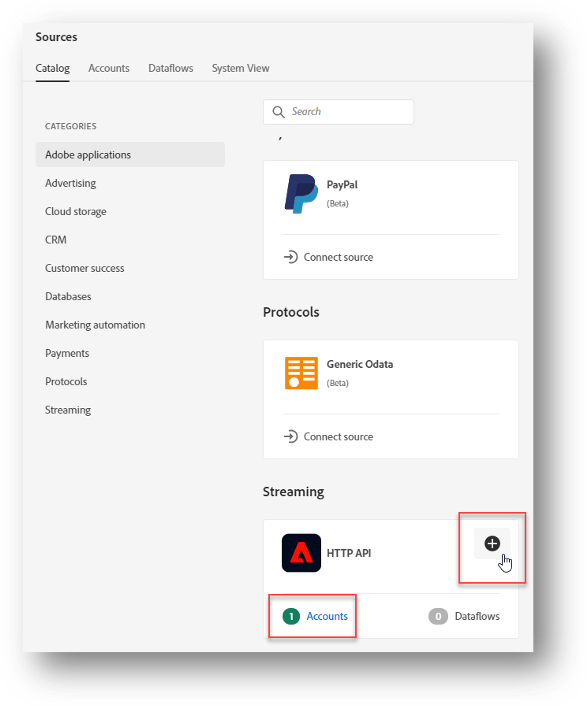

4. Proceed through the wizard and do the following for each step of the wizard:
    1. **Authentication**
        1. Name: **Luma Website Web SDK**
        2. Description: **Site data from Luma Website**
        3. No Authentication required
        4. Click **Connect to Source** and wait for successful conection
    2. **Select Data**
        5. Select:** Existing Dataset**
        6. Select: **Luma Website Data**
        7. Click: **Next**
    3. **Dataflow Detail**
        8. Dataflow Name: **Luma Website Web SDK**
        9. Description: **Site data from Luma Website**
        10. Click: **Next**
    4. **Review**
        11. Ensure settings are correct
        12. Click: **Finish**
5. Once completed, click **Sources** followed by the **Accounts** tab and you should now have to stream inlet accounts:

    

>>>>>  gd2md-html alert: inline image link here (to images/image2.png). Store image on your image server and adjust path/filename/extension if necessary.  (<a href="#">Back to top</a>)(<a href="#gdcalert3">Next alert</a>) >>>>> 

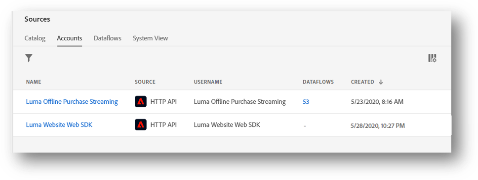

## Build Edge Configuration

**Note:** When building an edge, create the dev, and then update the stage and prod (which we aren't going to do). 

## Create a Launch Property

In this section, you're going to create a Desktop Launch property with the default configurations for the adobevlab.com domain. 

1. Log in to your Experience Cloud org, open the solution switcher, and click on **Launch. **You can also go there directly by navigating to launch.adobe.com (if you choose this option, ensure you are also in the correct Experience Cloud Org). 
2. Click the blue **Go to Launch** button.
3. Click the blue **New Property** button on the top right.
4. Give it any name you wish, use **adobevlab.com** as the domain (since it is the domain of the AEM instance we will be implementing on), and click **Save.**

        

>>>>>  gd2md-html alert: inline image link here (to images/image3.png). Store image on your image server and adjust path/filename/extension if necessary.  (<a href="#">Back to top</a>)(<a href="#gdcalert4">Next alert</a>) >>>>> 

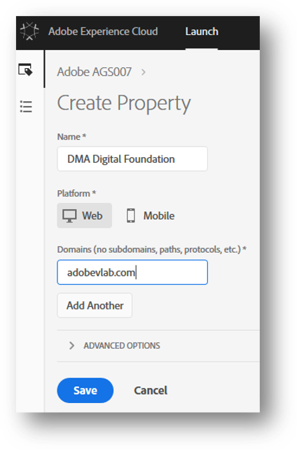

        Your new property should appear on the list of properties. 

5. Click into your newly created property and click on the **Hosts **tab. Notice how there is a **Managed by Adobe** host already created for you. This host is what we'll be using for this exercise. 

        **Note:** A customer may create another host that also uses Akamai hosting (managed by Adobe) or they can create their own SFTP host which is where code changes will go after they are published. 

6. Click on the **Environments** tab and note that the three common environments were also auto-created for you:

    

>>>>>  gd2md-html alert: inline image link here (to images/image4.png). Store image on your image server and adjust path/filename/extension if necessary.  (<a href="#">Back to top</a>)(<a href="#gdcalert5">Next alert</a>) >>>>> 

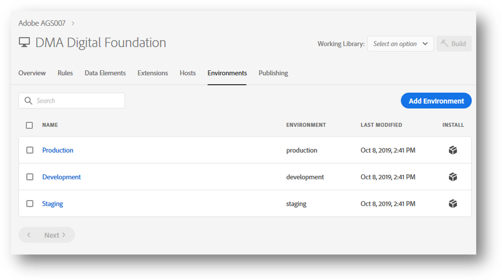
 

        For an actual customer, you may have additional development environments (you would add them by clicking the blue **Add Environment** button at the top). The thing to note here, however, is that Launch allows for only one staging and one production environment. If a customer wanted, they could also delete these auto-created environments and build new environments with their own naming convention. We're just going to go with the default values to save time. 

7. Click into the Staging environment and notice the **Select Host** dropdown. If the customer created more hosts (SFTP or Adobe-managed), they could assign each of these environments to a different host. 

## Publish the Core Extension

In this section, you're going to publish the Core Extension so you have some code that will return and validate that the deployment worked. 

1. Click **Extensions** in the main nav and notice how the Core Extension has already been pre-installed.
2. Click **Publishing **in the main nav followed by the **Add New Library** button in the Development section.
3. Give the new library a name (something like **core extension**), select your development environment from the **Environment** dropdown, and then click the **+ Add All Changed Resources** link at the bottom.

    

>>>>>  gd2md-html alert: inline image link here (to images/image5.png). Store image on your image server and adjust path/filename/extension if necessary.  (<a href="#">Back to top</a>)(<a href="#gdcalert6">Next alert</a>) >>>>> 

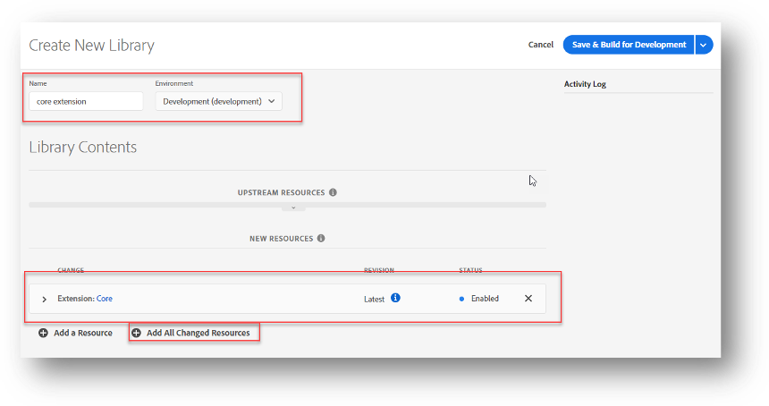

4. Click the blue **Save & Build for Development** button and give it a moment to process You'll know the environment is ready when you see your library in the **Development** area with a green dot next to it.

    

>>>>>  gd2md-html alert: inline image link here (to images/image6.png). Store image on your image server and adjust path/filename/extension if necessary.  (<a href="#">Back to top</a>)(<a href="#gdcalert7">Next alert</a>) >>>>> 

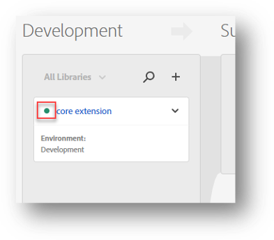

5. Select the down arrow next to the library name and select **Submit for Approval **to move your library to the staging environment then click the **Submit** button on the confirmation dialogue box. 

    

>>>>>  gd2md-html alert: inline image link here (to images/image7.png). Store image on your image server and adjust path/filename/extension if necessary.  (<a href="#">Back to top</a>)(<a href="#gdcalert8">Next alert</a>) >>>>> 

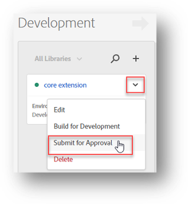

6. Once the library moves to the staging/submitted area, select that same dropdown and select **Build for Staging.**
7. Once the dot is green, use that same dropdown to select **Approve for Publishing** and select **Approve** in the resulting dialog box.
8. Once it moves into the Approve area, use that same dropdown to select **Build and Publish to Production **and click **Publish** on the resulting dialog box.
9. Once the dot turns green, your library is live with only the Core Extension.

>>>>>  gd2md-html alert: inline image link here (to images/image8.png). Store image on your image server and adjust path/filename/extension if necessary.  (<a href="#">Back to top</a>)(<a href="#gdcalert9">Next alert</a>) >>>>> 

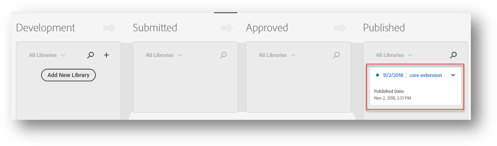

## Deploy Launch Asynchronously on the Site

In this section you're going to place your Production Launch tags in the indicated location of the apps/datalayer/datalayer.html file of your AEM Author instance. You'll then replicate that file to your Publish instance and verify that your Production Launch tags are present on the homepage. 

 

1. If necessary, start your AEM Author and Publish instances in mPaaS and sign into your AEM Author instance once it is started.
2. Return to the Launch property you've been working in and click the **Environments** nav element.
3. Click the **Install **icon for the **Production** environment to trigger the **Web Install Instructions** dialog box:

    

>>>>>  gd2md-html alert: inline image link here (to images/image9.png). Store image on your image server and adjust path/filename/extension if necessary.  (<a href="#">Back to top</a>)(<a href="#gdcalert10">Next alert</a>) >>>>> 

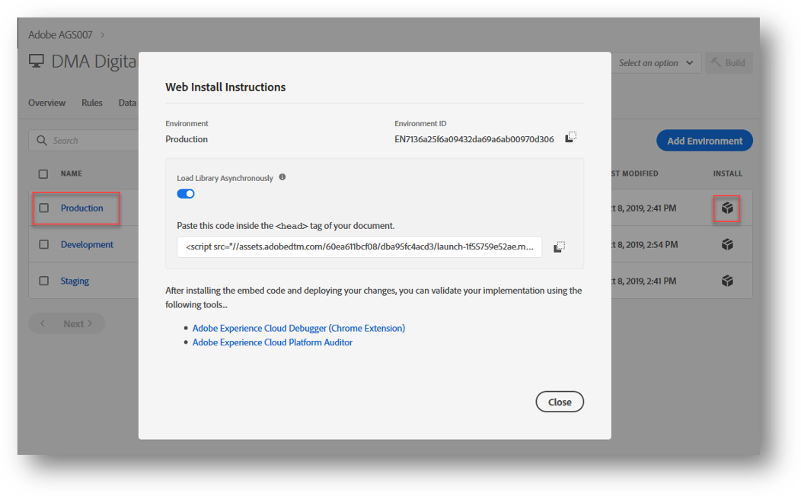

    **Note**: Your production and staging environment may appear in a different order.

1. Click the **Copy **icon to copy the embed code to the clipboard:

    

>>>>>  gd2md-html alert: inline image link here (to images/image10.png). Store image on your image server and adjust path/filename/extension if necessary.  (<a href="#">Back to top</a>)(<a href="#gdcalert11">Next alert</a>) >>>>> 

1. In Chrome, navigate to your AEM Author instance and navigate to the CRXDE Lite interface (**AEM Logo > Hammer> CRXDE Lite Card**).
2. Add the Launch header code to the datalayer.html code by taking the following steps: 
    1. In folder structure on the left, browse to **/apps/datalayer** and double-click on the ** datalayer.html** node. The datalayer.html file will open in the main editing area:

        

>>>>>  gd2md-html alert: inline image link here (to images/image11.png). Store image on your image server and adjust path/filename/extension if necessary.  (<a href="#">Back to top</a>)(<a href="#gdcalert12">Next alert</a>) >>>>> 

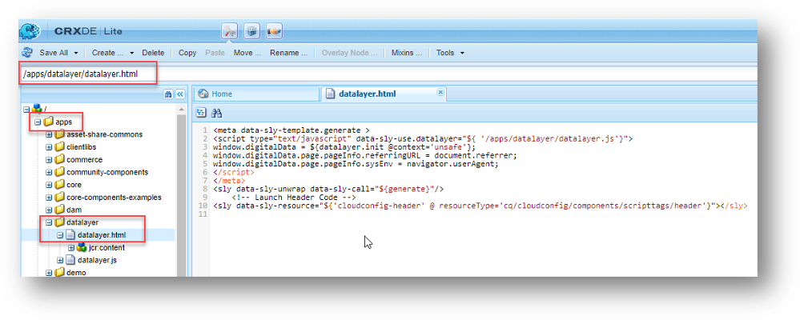

    2. Place the Launch embed code that you just copied below the **&lt;!-- Launch Head Code -->** tags.  Adding some custom white space before and after your Launch embed code will make it easier to read. When finished, your datalayer.html file should look like this:

        

>>>>>  gd2md-html alert: inline image link here (to images/image12.png). Store image on your image server and adjust path/filename/extension if necessary.  (<a href="#">Back to top</a>)(<a href="#gdcalert13">Next alert</a>) >>>>> 

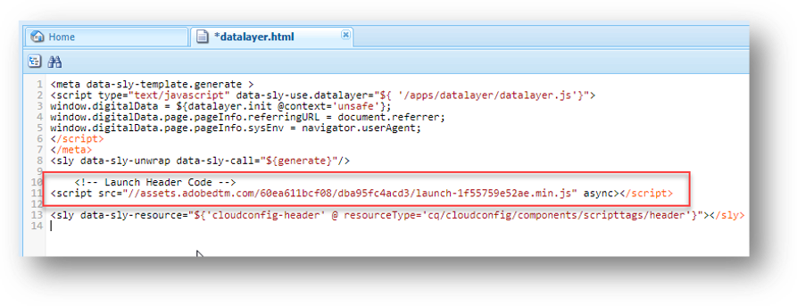

    3. Perform a CTRL+S (or command +s) to save your changes (there is also a **Save All** button in the top left corner if needed). 

        **Note**: Notice how the Launch embed code goes below the data layer definitions. Because Launch is going to need the values in the data layer, it must be defined before the Launch tags are fired.

        Additionally, this datalayer.html file is used through out the site and is loaded within the &lt;head> tags of the page. Because of that, we can put the Launch tag here. For a customer, the Launch tags would simply need to go to a common file that spans the site, is within the &lt;head> tags, and comes after a data layer (or at least the beginnings of one) is defined. 

10. Replicate your changes to the Publish instance by clicking on the **Replication **tab followed by the **Replicate **button in the bottom right window. You'll know it's been replicated to the publish instance when you see a time stamp in the **lastPublished** field.

    

>>>>>  gd2md-html alert: inline image link here (to images/image13.png). Store image on your image server and adjust path/filename/extension if necessary.  (<a href="#">Back to top</a>)(<a href="#gdcalert14">Next alert</a>) >>>>> 

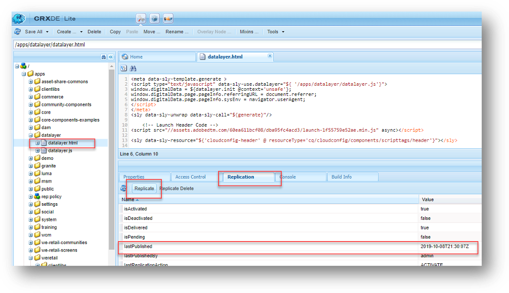

11. To see your changes, browse to your publish instance in an incognito browser so you get an uncached version of the homepage. View the page source and you will see that your Launch tags are above the &lt;/head> tag and below the data layer:

    

>>>>>  gd2md-html alert: inline image link here (to images/image14.png). Store image on your image server and adjust path/filename/extension if necessary.  (<a href="#">Back to top</a>)(<a href="#gdcalert15">Next alert</a>) >>>>> 

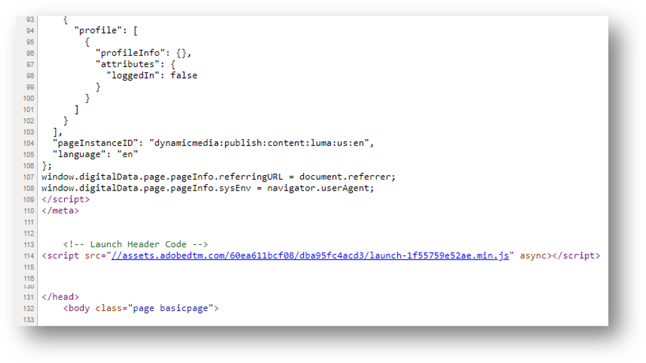

    With your Launch library deployed, you're ready to move on to the next section.

## Set up a Working Library in Launch

This section covers a feature of Launch that makes using it easier and more efficient. Consider the publishing process that you went through earlier in this document. You made a change (added the Core Extension), added that change to a new dev library, built that new library, then published that change. It probably took you at least 20 clicks, a few different screens, and at least 5 minutes to do all that. Can you imagine having to do all those steps in order to test even the smallest change? To that end, the product team introduced the Working Library feature. The Working Library is a session-level setting that allows you to create a library that you can save your work to without having to go to the publishing page and add each change manually. 

To set up your first working library, take the following steps:

1. Return to your Launch property and click on the **Publishing** tab.
2. Select the **Working Library** drop-down menu in the upper right corner, and then select **Add library.**
3. Name the library something like **CustID DE and Page Load Rule** (you'll see why in the next few sections)** **and set the **Environment** drop down to **Development**:

    

>>>>>  gd2md-html alert: inline image link here (to images/image15.png). Store image on your image server and adjust path/filename/extension if necessary.  (<a href="#">Back to top</a>)(<a href="#gdcalert16">Next alert</a>) >>>>> 

    Click the blue **Save & Build for Development** button and you'll be taken to the Publishing section where you'll see the library being built, even though it doesn't have any new changes in it. 

    **Note**: A library is a collection of related changes that will be in a single release. For a customer, a library name might correspond to a release number or describe what changes are in the library. 

4. Click on the **Working Library** drop-down in the upper right corner and notice that the library you just created is now available for selection. Select it.
5. Click on any other main nav element and notice how the working library stays the same value in the upper right corner. It will stay there until you either publish the library or log out of Launch.

    Because Working Library is a session-specific setting, when you log back into Launch after a break, you may need to select that library from that drop-down menu again. It is available in the upper right corner of the majority of the Launch UI, so if you ever see the **Save** button instead of **Save and Build for Development **when working with data elements, rules, or extensions, simply set your working library again.

## Capture Customer ID in a Data Element

In this section, you're going to build a data element called **hashed_email **that stores the value of the user name from the data layer. You will also add that data element to the working library you created in the previous section. If you're already familiar with data elements in Launch and know how to do that, perform those steps now and move to the next section. If you're new to the concept of data elements and/or need specific instructions on how to create this data element and add it to the working library, continue working in this section.

A staple among tag management systems is the concept of what Launch calls data elements. Data elements are usually populated by what is in the data layer. We can then use those data elements in multiple places throughout Launch. This allows the same data element to be referenced by multiple rules and extensions. If the data layer updates, so too does the data element and everything in Launch that references that data element. Data elements are really the bridge between what a customer development team puts on the page and what the customer marketing or consulting teams use in the Launch interface.

Data elements can also come from other pieces of information on the page like a cookie, query string parameter, DOM element, and others (you'll see all the options momentarily). However, getting the information from a well-designed data layer is the fastest, most stable, and scalable option. 

To create the data element we'll use to house the customer ID:

1. Click on the **Data Elements** tab followed by the **Create New Data Element** button.
2. Name the data element **hashed_email.**
3. Leave the Extension dropdown set to **Core** and change the **Data Element Type** dropdown to **Custom Code.**
4. Click the newly visible **&lt;/> Open Editor** button and paste in the following code:

>>>>>  gd2md-html alert: inline drawings not supported directly from Docs. You may want to copy the inline drawing to a standalone drawing and export by reference. See <a href="https://github.com/evbacher/gd2md-html/wiki/Google-Drawings-by-reference">Google Drawings by reference</a> for details. The img URL below is a placeholder.  (<a href="#">Back to top</a>)(<a href="#gdcalert17">Next alert</a>) >>>>> 

5. Click the **Save** button to close the editor.

    **Note**: Yes, we just used a custom code data element type instead of a JavaScript object from the data layer. The reason for that is because the user profile node in the data layer is an array instead of a single value. Unfortunately, you can't use the JavaScript Data Element Type when you need to reference a value in an array.

6. Note that the Save button says **Save to Library **instead of just Save.

    

>>>>>  gd2md-html alert: inline image link here (to images/image16.png). Store image on your image server and adjust path/filename/extension if necessary.  (<a href="#">Back to top</a>)(<a href="#gdcalert18">Next alert</a>) >>>>> 

    This is because you now have a working library from the previous section. Instead of going through the "add to a library" process, this will automatically save to the library in your development environment. 

7. Click **Save to Library **and after a moment, you'll be returned to the Date Elements tab. You'll see your newly created data element, but the working library in the upper corner now has an orange circle next to it instead of green one. This is because the change has been added to library, but the library has not been built yet:

    

>>>>>  gd2md-html alert: inline image link here (to images/image17.png). Store image on your image server and adjust path/filename/extension if necessary.  (<a href="#">Back to top</a>)(<a href="#gdcalert19">Next alert</a>) >>>>> 

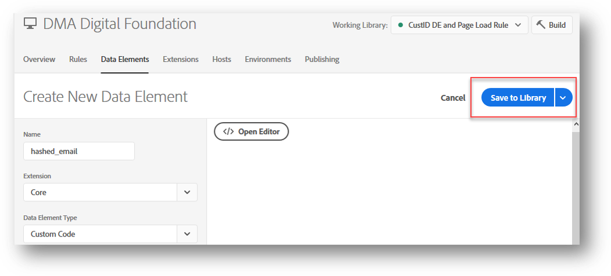

## Add a Rule to Fire the Page View Beacon

In this section, you're going to create a Launch rule that will fire a JavaScript alert message containing the value in the hashed_email data element. If you are already familiar with Launch rules and how to use data elements with them, you can skip this section and move to the next. If you are new to Launch and need an overview of how rules and data elements work together, please continue in this section.

With the data element created, you can set up a rule to use that data element. With no Adobe solutions or any other third-party extensions added, we're going to simply set up a rule that will fire some JavaScript code and display the value retrieved from the data layer via the data element.

1. Click the **Rules** tab, and click the **Create New Rule** button.
2. Name the rule **Username Alert.**
3. Under the **Events** area, click **+Add (**events are what Launch listens for so it knows when to fire the rule).
4. Leave **Core** as the Extension to use and select** Window Loaded** as the **Event Type**. Leave the default Order assignment of **50** and click **Keep Changes**.

        **Note**: The Window Loaded event is listening for the standard window loaded browser event. Additionally, the Order field indicates the order with which this rule will fire in relation to other rules that are fired with the same event (Window Loaded in this case). The lower the order number, the sooner it fires. For example, if we needed another rule to fire at Window Loaded, but before this rule fires, we would set the Order field of that rule to any value lower than 50.  

5. Under **ACTIONS**, click **+Add.**
6. Leave **Core** as the **Extension, **set **Custom Code** as the **Action Type, **and click** &lt;/>Open Editor.**
7. Paste in this code:

        

>>>>>  gd2md-html alert: inline drawings not supported directly from Docs. You may want to copy the inline drawing to a standalone drawing and export by reference. See <a href="https://github.com/evbacher/gd2md-html/wiki/Google-Drawings-by-reference">Google Drawings by reference</a> for details. The img URL below is a placeholder.  (<a href="#">Back to top</a>)(<a href="#gdcalert20">Next alert</a>) >>>>> 

8. Click **Save** when done.

        **Note: **This code will simply put a JavaScript alert on the page with the text 'user id: ' concatenated with the value in the hashed_email data element. The _satellite.getVar function call is how you can reference data elements in Launch custom code blocks. The only parameter it accepts is the name of the data element as string.

9. Click **Keep Changes** and you'll be taken back to the full rule overview:
10. Since this is the last change we're going to make to this library, we can also build the library. To do that, you have two options: 1) Click **Save to Library **and then click the **Build** button next to the working library dropdown, or 2) click the **dropdown arrow** next to **Save to Library **and select **Save to Library and Build**. Regardless of which you method you use, you'll know when it is finished building when you see the circle in the working library dropdown turn green.

## Testing Launch Changes

When it comes to testing your changes in Launch, you have a few options. The most obvious option is to simply publish your changes and then see if they work on the website. That option comes with the obvious drawback of not being able to test your code before everyone else sees it. Since this is just an internal website, you could also just put your dev Launch tags on the site instead of your production ones. However, since the point of this exercise is to teach you how Launch works for a customer, going that route is efficient, but not how you'd ever test changes for a customer.

As such, the better option is to test on the live site with your dev library in a way that lets only you see the changes. Two ways to do that are with the Adobe Launch tools within the Adobe Experience Platform Debugger (AEPD) or the Charles Proxy remote mapping capability. If you already know how to test Launch changes, use your preferred method of choice to ensure that the username data element is populating correctly. Once validated, you can also mark this exercise as complete, as everything else in this doc is related to testing and validating changes as well as deleting rules from Launch.

### Using the Adobe Experience Platform Debugger Launch Tools

Follow the steps in this section to use the Launch tools in the AEPD to replace the production Launch tags on your site pages with the development tags, so you can test the changes you made in Launch during this exercise. If you'd rather use the Map Remote feature of Charles Proxy, that is fine as well. The AEPD version is simply a little more user friendly and doesn't require the use of a proxy.

1. First, you need the code snippet corresponding to your Development Library. In Launch, browse to the **Environments** tab.
2. Find your Development Environment, then click the **Install** icon on the right.

    

>>>>>  gd2md-html alert: inline image link here (to images/image18.png). Store image on your image server and adjust path/filename/extension if necessary.  (<a href="#">Back to top</a>)(<a href="#gdcalert21">Next alert</a>) >>>>> 

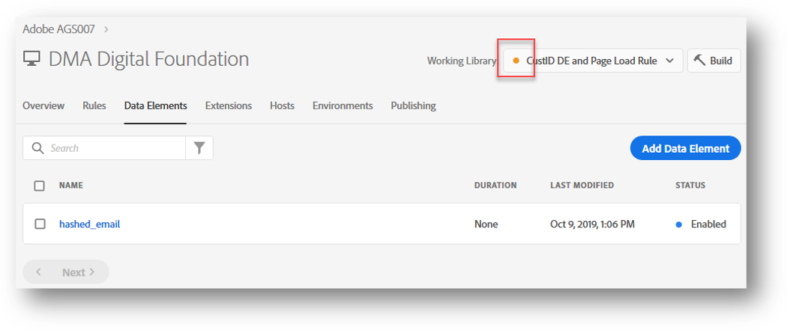

3. On the overlay, check whether the Launch Production Library on the site has been deployed synchronously or asynchronously. In our case since we deployed asynchronously, the slider is already enabled, and we have the right value. (If a customer were deployed synchronously, you would want to toggle that slider off.)

    

>>>>>  gd2md-html alert: inline image link here (to images/image19.png). Store image on your image server and adjust path/filename/extension if necessary.  (<a href="#">Back to top</a>)(<a href="#gdcalert22">Next alert</a>) >>>>> 

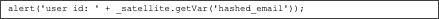

    **Note:** This slider does not change the code that Launch generates. It only changes the snippet that you include into the page! It is safe to toggle this.

4. Click the **copy** icon on the right-hand side of the overlay. Launch will acknowledge the copy action:

    

>>>>>  gd2md-html alert: inline image link here (to images/image20.png). Store image on your image server and adjust path/filename/extension if necessary.  (<a href="#">Back to top</a>)(<a href="#gdcalert23">Next alert</a>) >>>>> 

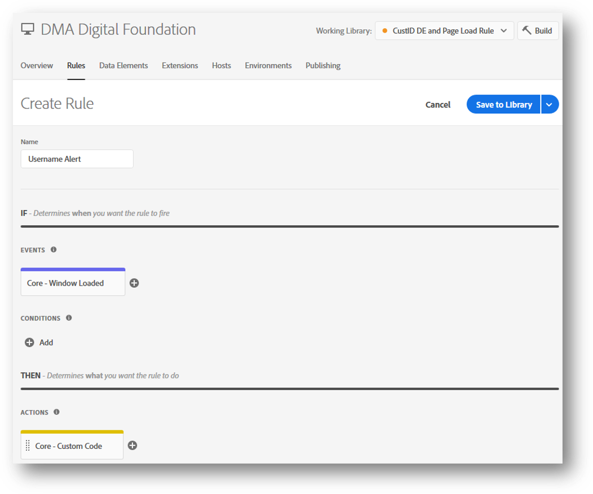

5. Browse to your publish instance and activate the Adobe Experience Platform Debugger. Notice how on the **Summary** tab the **Adobe Launch** box reports that the production library is being returned. Note, too that the only extension that has been published is the Core extension.

    

>>>>>  gd2md-html alert: inline image link here (to images/image21.png). Store image on your image server and adjust path/filename/extension if necessary.  (<a href="#">Back to top</a>)(<a href="#gdcalert24">Next alert</a>) >>>>> 

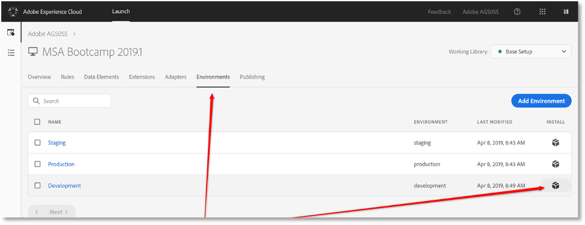

6. Click on **Launch**, then click on Configuration, and check the** Console Logging** checkbox.

    

>>>>>  gd2md-html alert: inline image link here (to images/image22.png). Store image on your image server and adjust path/filename/extension if necessary.  (<a href="#">Back to top</a>)(<a href="#gdcalert25">Next alert</a>) >>>>> 

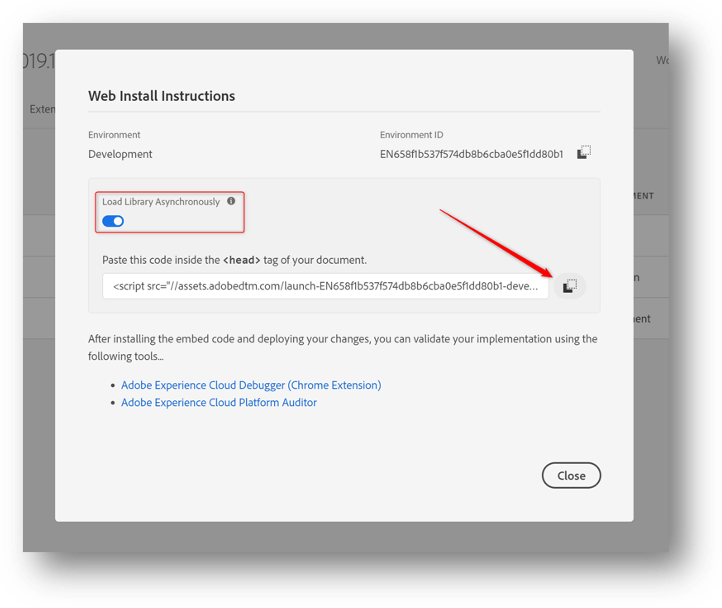

7. Click on the **Actions** button in the **Page Embed Codes **section and select **Replace**. Paste the embed code snippet you just copied into the **Enter new embed code** field, and then click **Apply**. When finished your configuration screen should reflect as follows:

    

>>>>>  gd2md-html alert: inline image link here (to images/image23.png). Store image on your image server and adjust path/filename/extension if necessary.  (<a href="#">Back to top</a>)(<a href="#gdcalert26">Next alert</a>) >>>>> 

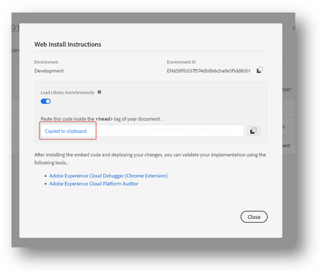

    The Adobe Experience Platform Debugger will now remove any existing Launch embed code snippet from the site and inject the code you pasted in its place.

    **Note:** It's important to note that this setting will stay enabled until you disable it, even if you've close the AEPD. As such, when working with your customers, be sure to disable this tool when you've finished testing. Also, you will have noticed a Protip which would allow you to sign in to automatically pull in embed codes from your provisioned Launch instances. This is outside of the scope of this training but would be very useful for you and your clients.

 

8. The page will have reloaded behind the AEPD. Click on the **Summary** tab of the AEPD and notice how the **Adobe Launch** area now reports that the development environment is being returned:

    

>>>>>  gd2md-html alert: inline image link here (to images/image24.png). Store image on your image server and adjust path/filename/extension if necessary.  (<a href="#">Back to top</a>)(<a href="#gdcalert27">Next alert</a>) >>>>> 

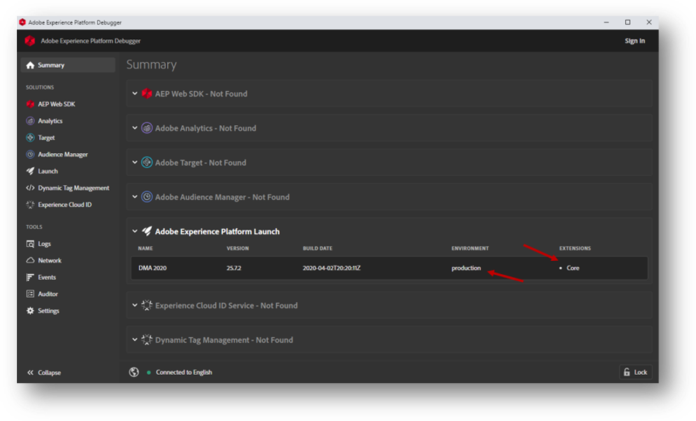

    Once the AEPD reports that the development environment is being returned, you should also see the custom code fire from the rule you configured and a JS alert box appear, however, since you're likely not logged in, it won't have the data element (hashed email ID) populated:

    

>>>>>  gd2md-html alert: inline image link here (to images/image25.png). Store image on your image server and adjust path/filename/extension if necessary.  (<a href="#">Back to top</a>)(<a href="#gdcalert28">Next alert</a>) >>>>> 

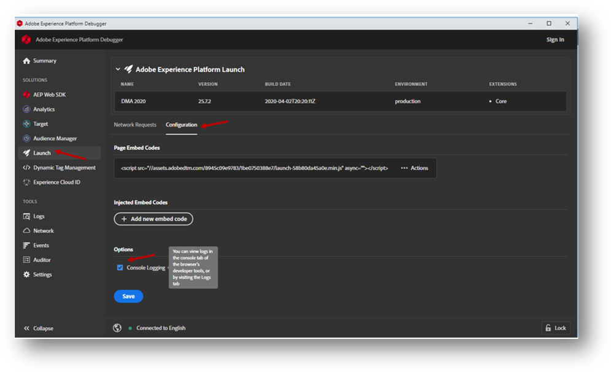

    Click **OK** to dismiss the alert box

    **Note:** Yes, we could have used a condition in the Launch rule to have the rule only fire when the hashed_email data element was populated, but we chose not to for the sake of demonstration purposes.

9. Open the Chrome Developer console and click on the **Console** tab. Refresh the page and notice how the console reports that the rule was fired:

    

>>>>>  gd2md-html alert: inline image link here (to images/image26.png). Store image on your image server and adjust path/filename/extension if necessary.  (<a href="#">Back to top</a>)(<a href="#gdcalert29">Next alert</a>) >>>>> 

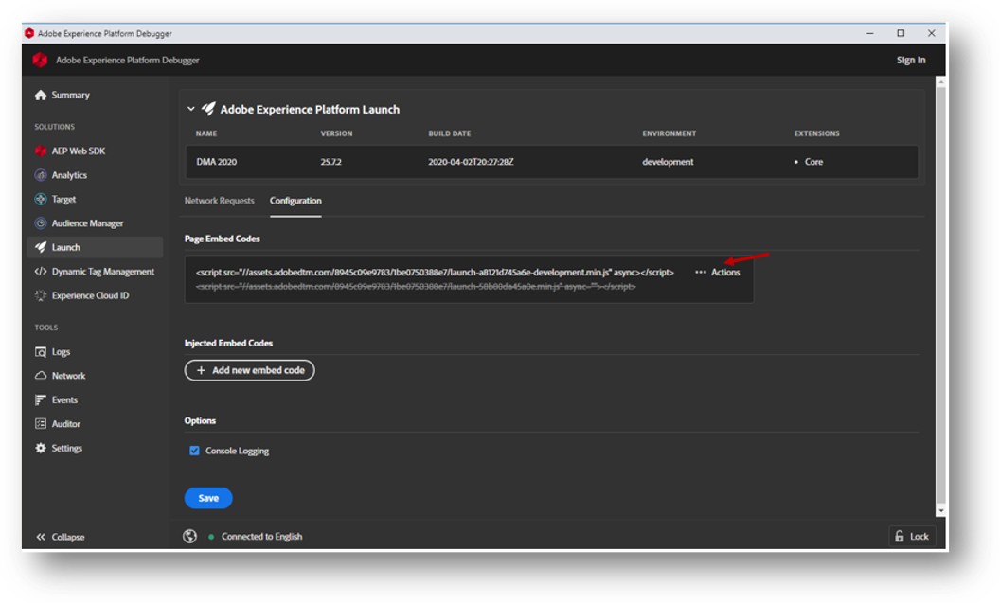

    Because you enabled the Launch Console Logging slider, the developer console will log Launch messages such as which rules are fired (and in some cases, not fired) on a given page. 

10. Log into the site using the login credentials you created in an earlier exercise, dismissing the alert boxes as needed. On the first page load after login, you should see the alert box fire; the text of the box is now populated with the hashed_email data element:

    

>>>>>  gd2md-html alert: inline image link here (to images/image27.png). Store image on your image server and adjust path/filename/extension if necessary.  (<a href="#">Back to top</a>)(<a href="#gdcalert30">Next alert</a>) >>>>> 

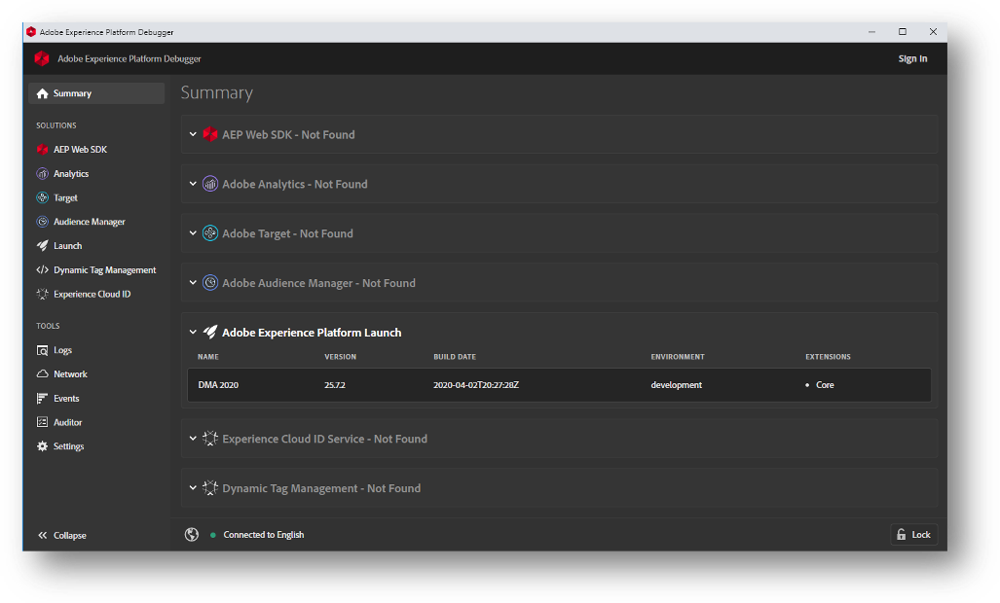

    You can also view the source on the page and see that value in the data layer:

    

>>>>>  gd2md-html alert: inline image link here (to images/image28.png). Store image on your image server and adjust path/filename/extension if necessary.  (<a href="#">Back to top</a>)(<a href="#gdcalert31">Next alert</a>) >>>>> 

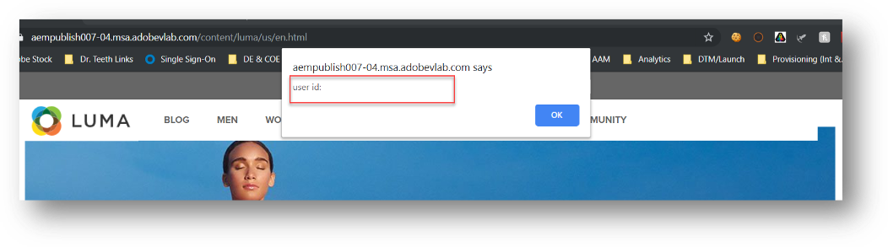

11. Assuming your data element and rule work as expected, return to the **Tools** tab in the AEPD debugger and click **Remove** in the **Replace Launch Embed Code** area. Refresh the page again and you should no longer see the alert box.

### Using the Charles Map Remote Feature (Optional)

The concept behind the Charles map remote feature is simple. Charles Proxy intercepts all traffic between your browser and the Internet. This means that Charles Proxy can not only see what your browser sends to the Internet but can also intercept and change what is returned. When you use the Charles Map Remote feature, you're telling Charles to replace what the Internet returns in a network response with another resource somewhere else. In our case, you're going to tell Charles to respond to your browser's request for the production Launch libraries with the development libraries.

While the AEPD option you just did was easier, the Charles Map Remote option works across browsers—not just Chrome—and gives you more detail around what network calls are being made on the page. It's also a little harder to set up and get right. You'll be able to use the AEPD for the validation of most of these exercises, but the steps for using Charles are placed here as well should you want to try them too. 

To use the Charles Map Remote feature to swap out your production tags for your development ones, please take the following steps:

1. Return to the property you're using for these exercises and click the **Environments** tab.
2. Just like you did for the AEPD debugger, click on the **Install** on the **Development** environment line and click the **copy icon** to copy the deployment URL to the clipboard. Paste it into a text editor, as you'll need it in a few steps.
3. Open Charles Proxy, return to the Luma homepage on your publish instance, and refresh the page.
4. Locate the call out to **assets.adobedtm.com.** It should be something similar to:

    

>>>>>  gd2md-html alert: inline image link here (to images/image29.png). Store image on your image server and adjust path/filename/extension if necessary.  (<a href="#">Back to top</a>)(<a href="#gdcalert32">Next alert</a>) >>>>> 

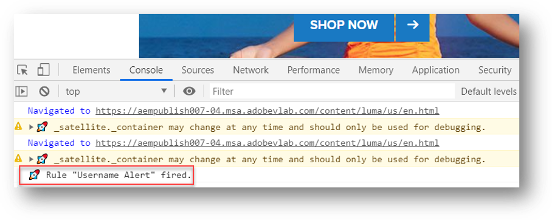

5. Once you find it, right-click on it and select **Map Remote.** 
6. A new dialog box will appear that has the URL call already populated. This is identifying which network response you want Charles Proxy to replace (the **Map From** section). In the **Map To** section, give the first three fields the following values:
    *   Protocol: **https**
    *   Host: **assets.adobedtm.com**
    *   Port: **443**
7. Locate the URL you retrieved from Launch back in Step 2. Copy everything from the '/' after .com through the '.js' value (include the leading /, but do not include the quotes). It should be the path to your development library. 

    

>>>>>  gd2md-html alert: inline image link here (to images/image30.png). Store image on your image server and adjust path/filename/extension if necessary.  (<a href="#">Back to top</a>)(<a href="#gdcalert33">Next alert</a>) >>>>> 

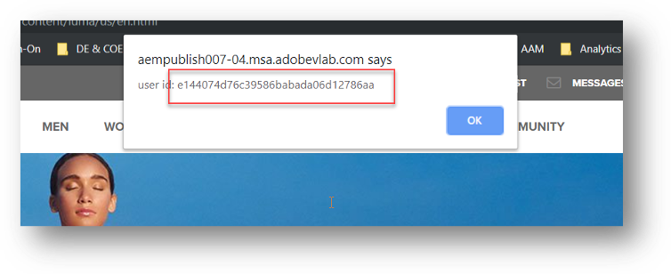

    Place the copied URL path into the **Path** field:

    

>>>>>  gd2md-html alert: inline image link here (to images/image31.png). Store image on your image server and adjust path/filename/extension if necessary.  (<a href="#">Back to top</a>)(<a href="#gdcalert34">Next alert</a>) >>>>> 

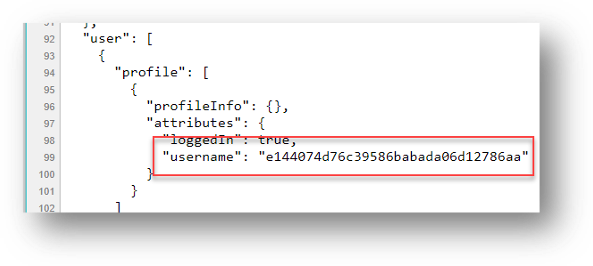

8. Click **OK** at the bottom to close the dialog box.
9. Clear out your Charles Proxy session (broom icon), browse to the Luma homepage again, and refresh the page. You should see a call out to **assets.adobedtm.com** for the development Launch environment instead of the call to the production Launch environment:

    

>>>>>  gd2md-html alert: inline image link here (to images/image32.png). Store image on your image server and adjust path/filename/extension if necessary.  (<a href="#">Back to top</a>)(<a href="#gdcalert35">Next alert</a>) >>>>> 

 

    You should also see the JS alert box again.

    **Pro Tip:** It's a good idea to disable **Map Remote** instead of (or just before) shutting down Charles Proxy. It's easy to forget that **Map Remote** is enabled, and you may be setting yourself up for_ _frustration later when you're troubleshooting something and can't figure out why you aren't getting your Launch production library.

    To disable Map remote:

    1. Click **Tools** in the program navigation followed by **Map Remote** (it should have a checkbox next to it).
    2. Uncheck the **Enable Map Remote** checkbox and click **OK**. The map remote entry you just created is saved, so next time you need to do some testing, you can simply restart Charles Proxy and re-enable **Map Remote**.

## Reverting Changes in Launch

As is the case in a lot of documentation, we've covered how to add things to Launch, but this section is also going to teach you how to revert or remove changes that you made in Launch. Adding things in Launch is fairly straight forward, however, removing them is not always intuitive.

1. Following steps from earlier in this exercise, publish your data element and rule changes all the way through to the publish environment so that neither the AEPD or Charles are needed to get the alert box to fire.
2. With your changes live, begin the process of removing the rule by clicking on the **Rules** tab
3. Select your only rule and click the **Delete** button. Click **Yes, Delete them** and notice the error you receive:

    

>>>>>  gd2md-html alert: inline image link here (to images/image33.png). Store image on your image server and adjust path/filename/extension if necessary.  (<a href="#">Back to top</a>)(<a href="#gdcalert36">Next alert</a>) >>>>> 

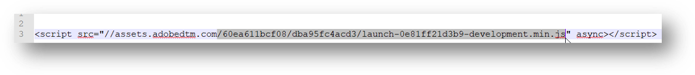

    Because the rule is in use "upstream" in the production environment, you must remove the rule from the production environment before you can delete it. To do that, continue with this section.

4. Click **OK** to Close the error message if it is still open, then select your rule again and click the **Disable** button to disable the rule. The message you receive will indicate that you must publish this change before the rule is disabled in production. Click **OK** to dismiss the message.
5. With the rule we want to removed disabled, click on the **Publishing **tab followed by **Add New Library **in your Development environment.
6. Name the library **Remove User Alert** and select the **Development** library from the adjacent dropdown.
7. Click **Add All Changed Resources** and you should see that the disabling of the rule is the only available change. 
8. Click **Save & Build for Development**.
9. Once the library as finished building, push the change all the way to the Published environment.

    **Note:** Yes, in most cases you would test this change using something like the AEPD or Charles before pushing it live, but because we are fully aware of the change and this is just your own sandbox, you can just push this library to production to save time.

10. At this point, you should have 3 published libraries, one for the Core Extension that was initially published, one that adds the hashed_email data element and user alert rule, and a third that disables that rule:

    

>>>>>  gd2md-html alert: inline image link here (to images/image34.png). Store image on your image server and adjust path/filename/extension if necessary.  (<a href="#">Back to top</a>)(<a href="#gdcalert37">Next alert</a>) >>>>> 

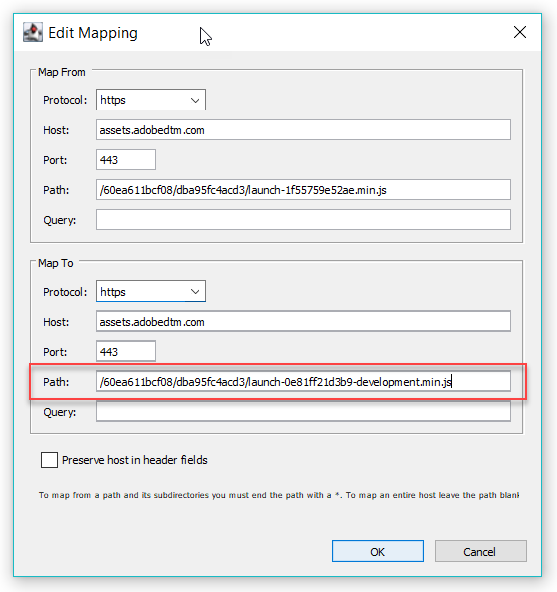

11. Do a hard refresh of the Luma page and ensure that the alert no longer fires.
12. With the rule disabled in production, you can now delete it from Launch by clicking on **Rules**, selecting the rule, then clicking the **Delete** button. Confirm the action when prompted and the rule will be deleted without issue; the rules page will show that you have no rules.

    At this point, you might be tempted to think that you'll need to create a new library that contains the deleted rule and then publish that rule. Fortunately, you don't need to do that. Since that rule is disabled "upstream" in production, it's the same as being deleted from the end user perspective. While you will see that disabled rule if you were to view the upstream resources, that rule will be fully deleted with the next library publish.

## Adobe Launch: Hands-on Technical Exercises Fast-track Instructions 

## Create a Launch Property

You're going to create a Desktop Launch property with the default configurations for the adobevlab.com domain. 

1. Go to Launch Tag Management system (TMS) > Click on **New Property** button.
2. Give it any name you wish, use **adobevlab.com** as the domain, and click **Save.**
3. **Cl**ick into your newly created property and click on the **Hosts **tab. You should see **Managed by Adobe** host already created for you. 
4. Click on the **Environments** tab and you should see three environments (Development, Staging, and Production) that were auto-created.

    **Note:** Launch allows for only one staging and one production environment but unlimited development environments.

5. Click into the Staging environment and notice the **Select Host** dropdown. If the customer created more hosts (SFTP or Adobe managed), they could assign each of these environments to a different host. 

## Publish the Core Extension

If you already know how to do that, perform the appropriate steps and move to the next section. If you need instructions on how to do that, please take the following steps:

1. Click **Extensions** (Core Extension should have been pre-installed).
2. Click **Publishing **> **Add New Library** button in the Development section.
3. Give the new library a name (something like **core extension**), select your development environment from the **Environment** dropdown, and then click the **+ Add All Changed Resources** link at the bottom.

    

>>>>>  gd2md-html alert: inline image link here (to images/image35.png). Store image on your image server and adjust path/filename/extension if necessary.  (<a href="#">Back to top</a>)(<a href="#gdcalert38">Next alert</a>) >>>>> 

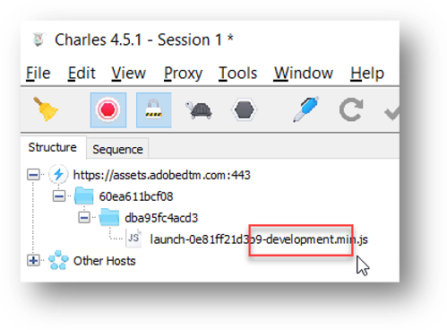

4. Click the **Save & Build for Development** button and wait till you see **Development** area with a green dot next to it.
5. Select **Submit for Approval **then click the **Submit** button on the confirmation dialogue box. 
6. Select **Build for Staging **once the library moves to staging area, then select **Approve for Publishing** and select **Approve** in the resulting dialog box.
7. Select **Build and Publish to Production **and click **Publish** on the resulting dialog box. Your library is live with only the Core Extension.

>>>>>  gd2md-html alert: inline image link here (to images/image36.png). Store image on your image server and adjust path/filename/extension if necessary.  (<a href="#">Back to top</a>)(<a href="#gdcalert39">Next alert</a>) >>>>> 

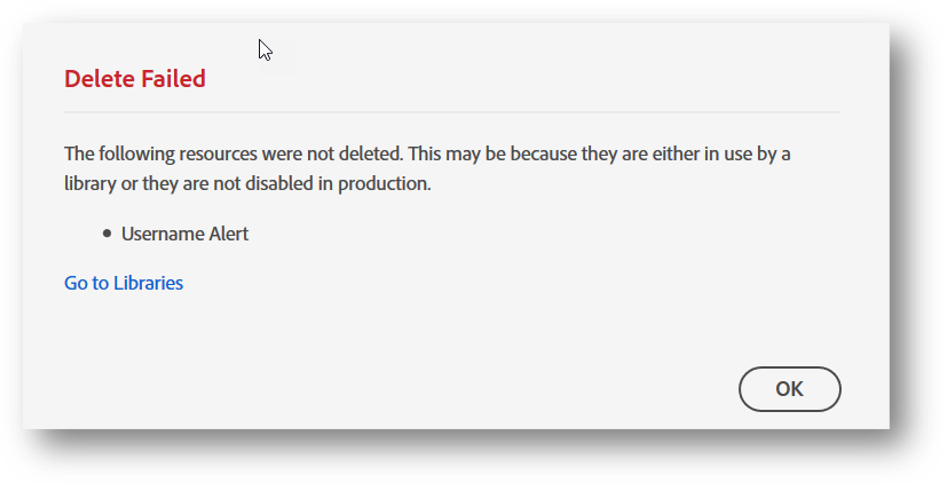

## Deploy Launch Asynchronously on the Site

Learn to place Production Launch tags in apps/datalayer/datalayer.html file of you AEM Author instance and replicate that file to your Publish instance. 

 

1. In the Launch property click the **Environments** nav element. Click the **Install **icon for the **Production** environment to get embed code.
2. Click the **Copy **icon to copy the embed code to the clipboard.
3. Browse to your AEM author instance and navigate to the CRXDE Lite interface (**AEM Logo > Hammer> CRXDE Lite Card**):
    1. In the folder structure, browse to **/apps/datalayer** and double-click on the **datalayer.html** node to edit it.
4. Place the Launch embed code that you just copied below the **&lt;!-- Launch Head Code -->** tags.  

>>>>>  gd2md-html alert: inline image link here (to images/image37.png). Store image on your image server and adjust path/filename/extension if necessary.  (<a href="#">Back to top</a>)(<a href="#gdcalert40">Next alert</a>) >>>>> 

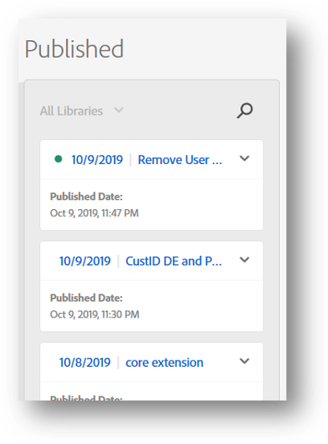

    2. Perform a CTRL+S (or command +s) to save your changes. 
5. Replicate your changes to the Publish instance.
6. Browse to your publish instance in an incognito browser and view the page source to confirm your Launch tags above the &lt;/head> tag and below the data layer.

## Set up a Working Library in Launch

If you already know how to use a Working Library, create a new library that will be used for adding a data element and page load rule, set it as your working library, then move to the next section. If you're new to Launch or unsure how to do that, please keep reading in this section.

The Working Library is a session-level setting that allows you to create a library that you can save your work to without having to go to the publishing page and add each change manually. 

To set up your first working library, take the following steps:

1. Return to your Launch property and click on the **Publishing** tab.
2. Select the **Working Library** drop-down menu and select **Add library.**
3. Name the library something like **CustID DE and Page Load Rule** and set the **Environment** drop- down to **Development**. Click **Save & Build for Development** button.

    

>>>>>  gd2md-html alert: inline image link here (to images/image38.png). Store image on your image server and adjust path/filename/extension if necessary.  (<a href="#">Back to top</a>)(<a href="#gdcalert41">Next alert</a>) >>>>> 

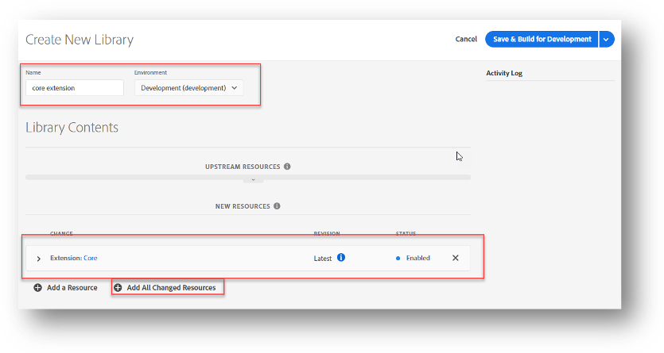

4. Click on the **Working Library** drop-down Select the new library you just created. Make sure the right library is selected for build.

## Capture Customer ID in a Data Element

In this section, you're going to build a data element called **hashed_email **that stores the value of the user name from the data layer. You will also add that data element to the working library created in the previous section.

To create a data element that stores customer ID:

1. Click on the **Data Elements** tab > **Create New Data Element** button
2. Name the data element **hashed_email**
3. Extension dropdown set to **Core** and **Data Element Type** dropdown to **Custom Code**
4. Click the newly visible **&lt;/> Open Editor** button, paste in the code below…

>>>>>  gd2md-html alert: inline drawings not supported directly from Docs. You may want to copy the inline drawing to a standalone drawing and export by reference. See <a href="https://github.com/evbacher/gd2md-html/wiki/Google-Drawings-by-reference">Google Drawings by reference</a> for details. The img URL below is a placeholder.  (<a href="#">Back to top</a>)(<a href="#gdcalert42">Next alert</a>) >>>>> 

    …and click the **Save** button to close the editor.

    **Note**: we used custom code data element type because the user profile node is an array.

5. Then click **Save to Library**. Make sure the working library you see is correct. The orange dot next to the library indicates that the changes has been added to library, but the library has not been built yet:

    

>>>>>  gd2md-html alert: inline image link here (to images/image39.png). Store image on your image server and adjust path/filename/extension if necessary.  (<a href="#">Back to top</a>)(<a href="#gdcalert43">Next alert</a>) >>>>> 

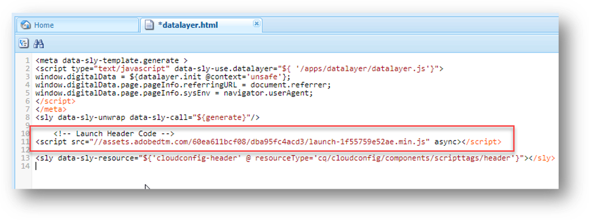

## Add a Rule to Fire the Page View Beacon

In this section, you're going to create a Launch rule that will fire a JS alert message containing the value in the hashed_email data element. 

With the data element created, you can set up a rule to use that data element.

1. Click the **Rules** tab and click the **Create New Rule** button. Name the rule **Username Alert.**
2. Under the **Events** area, click **+Add.**
3. Leave **Core** as the Extension to use and select** Window Loaded** as the **Event Type**. Leave the default Order assignment of **50** and click **Keep Changes**.
4. Under **ACTIONS**, click **+Add.**
5. Leave **Core** as the **Extension, **set **Custom Code** as the **Action Type, **and click** &lt;/>Open Editor.**
6. Paste in this code:

        

>>>>>  gd2md-html alert: inline drawings not supported directly from Docs. You may want to copy the inline drawing to a standalone drawing and export by reference. See <a href="https://github.com/evbacher/gd2md-html/wiki/Google-Drawings-by-reference">Google Drawings by reference</a> for details. The img URL below is a placeholder.  (<a href="#">Back to top</a>)(<a href="#gdcalert44">Next alert</a>) >>>>> 

7. Click **Save** when done.
8. Click **Keep Changes** and you'll be taken back to the full rule overview.
9. We can now build the library by either 1) clicking **Save to Library **and then click the **Build** button next to the working library dropdown or 2) click the **dropdown arrow** next to **Save to Library **and select **Save to Library and Build**. Once it’s complete, you should see a green dot.

## Testing Launch Changes

We will test on the live site with your dev library either with the Adobe Launch tools within the Adobe Experience Platform Debugger (AEPD), or the Charles Proxy remote mapping capability. Test to ensure that the username data element is populating correctly. 

### Using the Adobe Experience Platform Debugger Launch Tools

Follow the steps to use Launch tools in the AEPD to replace the production Launch tags on your site pages with the development tags.

1. Grab the Development Library embed code by browsing to the **Environments** tab.
2. Find your Development Environment, then click the **Install** icon.
3. Check to make sure the async flag toggle is turned on for our testing purposes.
4. Copy the embed code.
5. Browse to your publish instance and activate the Adobe Experience Platform Debugger.
6. Click on **Launch**, then click on Configuration, and check the** Console Logging** checkbox.
7. Click on the **Actions** button in the **Page Embed Codes **section and select **Replace**. Paste the embed code snippet you just copied into the **Enter new embed code** field, and then click **Apply**. When finished your configuration screen should reflect as follows:

    

>>>>>  gd2md-html alert: inline image link here (to images/image40.png). Store image on your image server and adjust path/filename/extension if necessary.  (<a href="#">Back to top</a>)(<a href="#gdcalert45">Next alert</a>) >>>>> 

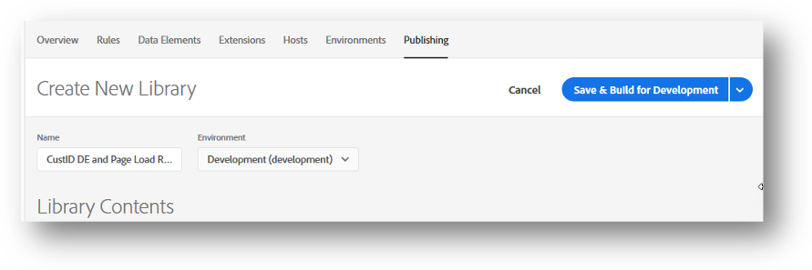

    **Note:** It's important to know that this setting will stay enabled until you disable it.

 

8. The page will have reloaded behind the AEPD. Click on the **Summary** tab of the AEPD and notice that the development environment is being returned.
9. You should now see the JS alert box appear, however, since you're likely not logged in, it won't have the data element (hashed email ID) populated:

    

>>>>>  gd2md-html alert: inline image link here (to images/image41.png). Store image on your image server and adjust path/filename/extension if necessary.  (<a href="#">Back to top</a>)(<a href="#gdcalert46">Next alert</a>) >>>>> 

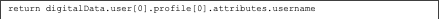

10. Click **OK** to dismiss the alert box.
11. Open the Chrome Developer console (Ctrl+shift+I) > **Console** tab. Refresh the page to see the rule was fired:

    

>>>>>  gd2md-html alert: inline image link here (to images/image42.png). Store image on your image server and adjust path/filename/extension if necessary.  (<a href="#">Back to top</a>)(<a href="#gdcalert47">Next alert</a>) >>>>> 

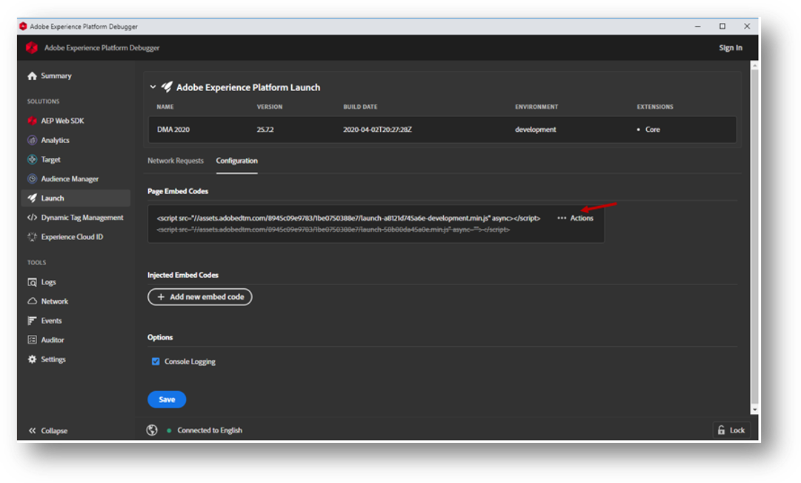

12. Log in to the site using the login credentials you created. On the first page load after login, you should see the alert box fire with the hashed_email data element populated:

    

>>>>>  gd2md-html alert: inline image link here (to images/image43.png). Store image on your image server and adjust path/filename/extension if necessary.  (<a href="#">Back to top</a>)(<a href="#gdcalert48">Next alert</a>) >>>>> 

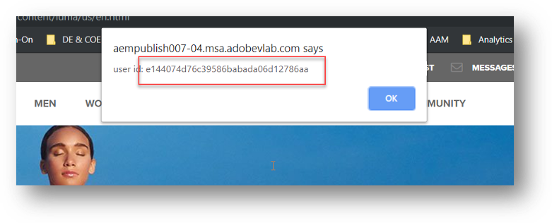

13. Return to the **Tools** tab in the AEPD debugger and click **Remove** in the **Replace Launch Embed Code** area. Refresh the page again and you should no longer see the alert box.

### Using the Charles Map Remote Feature (Optional)

While the AEPD option you just did was easier, the Charles Map Remote option works across browsers, not just Chrome. To use the Charles Map Remote feature to swap out your production tags for your development ones, please take the following steps:

1. Copy the development environment embed code, following the same steps as before.
2. Open Charles Proxy, return to the Luma homepage on your publish instance, and refresh the page.
3. Locate the call out to **assets.adobedtm.com.**
4. Once you find it, right-click on it and select **Map Remote.** 
5. A new dialog box will appear that has the URL call already populated for map from. In the **Map To** section, give the first three fields the following values:
    *   Protocol: **https**
    *   Host: **assets.adobedtm.com**
    *   Port: **443**
6. Locate the URL you retrieved from Launch back in Step 1. Copy everything from the '/' after .com through the '.js' value (include the leading /, but do not include the quotes). It should be the path to your development library. 

    

>>>>>  gd2md-html alert: inline image link here (to images/image44.png). Store image on your image server and adjust path/filename/extension if necessary.  (<a href="#">Back to top</a>)(<a href="#gdcalert49">Next alert</a>) >>>>> 

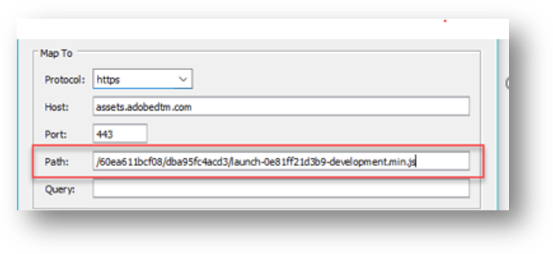

    Place the copied URL path into the **Path** field:

    	

>>>>>  gd2md-html alert: inline image link here (to images/image45.png). Store image on your image server and adjust path/filename/extension if necessary.  (<a href="#">Back to top</a>)(<a href="#gdcalert50">Next alert</a>) >>>>> 

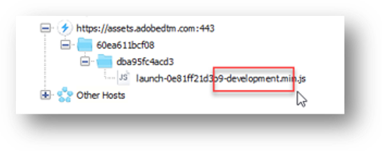

7. Click **OK** at the bottom to close the dialog box.
8. Clear out your Charles Proxy session (broom icon), browse to the Luma homepage again, and refresh the page. You should see a call out to **assets.adobedtm.com** for the development Launch environment:

    

>>>>>  gd2md-html alert: inline image link here (to images/image46.png). Store image on your image server and adjust path/filename/extension if necessary.  (<a href="#">Back to top</a>)(<a href="#gdcalert51">Next alert</a>) >>>>> 

 

    You should also see the JS alert box again.

    **Pro Tip:** It's a good idea to disable **Map Remote** instead of (or just before) shutting down Charles Proxy. 

9. To disable Map remote:
1. Click **Tools** > **Map Remote** (it should have a checkbox next to it).
2. Uncheck the **Enable Map Remote** checkbox and click **OK**. 

## Reverting Changes in Launch

This section is going to teach you how to revert or remove changes that you made in Launch.

1. Following steps from earlier in this exercise, publish your data element and rule changes all the way through to the publish environment. 
2. With your changes live, begin the process of removing the rule by clicking on the **Rules** tab.
3. Since the rule is in production, selecting your only rule and clicking the **Delete** button will result in an error message. Instead, select your rule and click the **Disable** button to disable the rule. Click **OK** to dismiss the message.
4. With the rule we want to remove disabled, click on the **Publishing **tab followed by **Add New Library **in your Development environment.
5. Name the library **Remove User Alert** and select the **Development** library from the adjacent dropdown.
6. Click **Add All Changed Resources** and you should see that the disabling of the rule is the only available change. 
7. Click **Save & Build for Development.** 
8. Once the library has finished building, push the change all the way to the Published environment.
9. Do a hard refresh of the Luma page and ensure that the alert no longer fires.
10. With the rule disabled in production, you can now delete if from Launch by clicking on **Rules**, selecting the rule, then clicking the **Delete** button. Confirm the action when prompted and the rule will be deleted without issue; the rules page will show that you have no rules.

**Original Exercise Creator:**

David Woolsey

**Exercise Contributors**:

Jan Exner, Siri Manukonda, Tim Carr

**Change Log**

<table>
  <tr>
   <td>Ver.
   </td>
   <td>Issue Reporter
   </td>
   <td>Changes
   </td>
   <td>Date
   </td>
  </tr>
  <tr>
   <td>1.0
   </td>
   <td>
   </td>
   <td>Original Launch
   </td>
   <td>1/21/2020
   </td>
  </tr>
  <tr>
   <td>1.1
   </td>
   <td>Tim Carr
   </td>
   <td>Updated to use AEPD instead of AECD
   </td>
   <td>4/10/2020
   </td>
  </tr>
</table>

